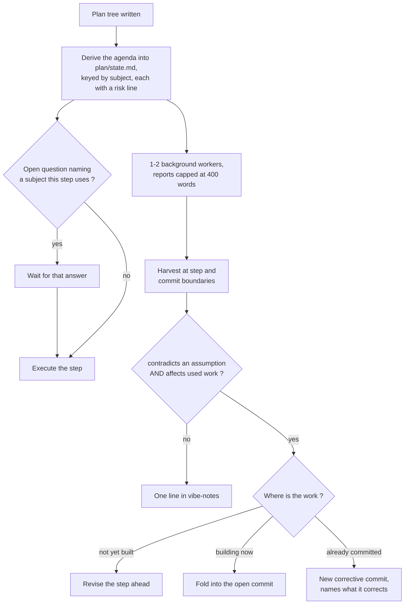

<!-- Load this file before planning or implementing any change beyond a single-file mechanical edit. Run the Protocol (section 1). -->

# Vibe-Coding Planner

Rules for taking a design document to a finished, tested implementation with every commit reviewed in a fresh context and every behavior change pinned by a test. Load this file for any change to code beyond a single-file mechanical edit, and it governs the run once loaded. Sections run in execution order; consult one at a time.


## The Prime Directive

Ensure the model completes creating the result the user asked for. This is the tiebreaker whenever two rules in this file conflict, and it rewrites every stop condition below.

Two boundaries, because completion-first otherwise reads as ship-anything.

**It does not govern verification.** Verification wins on evidence and yields on advice. The build, the test suite, and the parent-commit replay stay hard: a step does not close while one of them fails, because a result that does not run is not a completed result. Open review findings are advisory - at the review cycle cap, record the survivors in `vibe-notes.md` and proceed. Nothing in the warning model of section 4 reaches these three.

**It does not govern an action the repository's history cannot undo.** This file assumes version-controlled work before publication, where any commit is recoverable, and every judgement call in it is safe only because of that. An action outside that assumption gets explicit confirmation from the user before it runs, whatever the model's confidence: running a migration against real data, publishing a package, pushing to a shared branch, deleting anything outside the working tree, or calling an external API that mutates state. This is a confirmation, not a stop; the run continues once the user answers.

## Terms

Terms hold one sense throughout. The **design document** is the input written before any code, immutable once execution begins; it is the `design-{slug}.md` that `tools/architect.md` produces. A **`vibe-notes.md`** is an append-only log written during implementation; the design document and `vibe-notes.md` are different files with different lifetimes. A **check** is one review criterion inside a criteria block; a **test** is executable code in the repository. A **criteria block** is a tag-delimited block dispatched to a subagent by name. The **main context** is the session holding the plan, and it is the actor everywhere this file says a decision gets made; it has no second name. A **work subagent** edits files; a **review subagent** reads and reports. The **fast tier** is a cheaper, quicker model than the one running the main context. A commit is **published** once it is pushed to a branch another person or process reads; amending is safe before that and unsafe after.

The **grain conditions** are the five questions of section 3, each of which activates its own machinery when it answers yes. The **research lane** is the continuous background search of section 8, and the **agenda** is its list of questions, held inside `plan/state.md` and keyed by subject. A finding is **load-bearing** when its `affects` and its `contradicts` fields are both non-empty: it names work the run actually used, and it goes against an assumption that work rests on. A decision is **expensive to reverse** when a later step depends on it, or when undoing it once the work is finished would mean changing an on-disk format that holds data, a wire format another component speaks, or a public interface other code is written against. A step is **blocked** when it needs an external fact neither the design document nor the agenda holds, which the research lane resolves. A step has **no progress** when no option exists to complete it at all, which is the only condition that stops the run.

**Constants in this file.** Any number here that References does not source is a convention chosen for this design rather than a measured threshold, and changing it is safe.

## 1. Protocol

Execute these steps in order:

1. Read the design document when one exists, run the sanity check of section 4, surface it to the user, and proceed.
2. Answer the five grain questions of section 3 and record the machinery they activate in `plan/state.md`.
3. Write `plan/L1.md` (section 5).
4. Write one L2 plan per L1 step (section 6), when the grain test turned the hierarchy on.
5. Run the plan-audit gate (section 7), when the grain test turned it on.
6. Derive the research agenda (section 8), when the grain test turned it on.
7. Execute one step at a time (section 9), closing each with code, tests, and a checkpoint (section 10).
8. Run the commit cycle after every commit (section 11).
9. Append to the decision log as decisions arise (section 12).
10. Run the Checklist (section 15) before reporting the work complete.

## 2. Three standing rules

These three bind every phase. Every other rule in this file is phase-local and binds only inside its own section. They are restated at the end.

**The Prime Directive.** Complete the result the user asked for. It decides every stop condition in this file and yields only to verification and to an action history cannot undo.

**Subagent discipline.** The main context holds the plan, dispatches work, and records outcomes. It does not read source files and it does not write code. Reason: context accumulation degrades every model, and the plan is the artifact that has to survive the whole run. Dispatch in parallel when no dispatch in the batch reads a file another writes; otherwise dispatch in order. If the same step fails dispatch twice, dispatch a bounded query for the construct the failure names, then re-dispatch on the answer. If that re-dispatch also fails, narrow the dispatch to the smallest edit that would advance the step, and if that fails too, judge whether the step proceeds without it and record the judgement.

**The commit cycle.** Author the commit, review it in fresh-context subagents, verify the findings, fix the survivors, confirm the suite dispatch returns pass, amend the commit. One commit per step, with the fix folded in rather than following behind. Reason for reviewing in a separate context: a model reviewing its own work in the context that produced it does worse than not reviewing at all, and models favor their own output when they can see it. Reason for amending rather than adding: rewriting is safe before publishing and unsafe after, and folds one concern per commit. The amend choice rests on convention, not measurement; no study has compared it.

### What the main context may run

**The test: bounded output.** Run a command in the main context only when the command bounds its own output independent of the state it reads. Dispatch everything whose output size depends on whether something went wrong. Reason: tool output cannot be unread, so a command returning two lines on success and four hundred on failure has already spent the attention budget by the time the caller learns which case it got. Classification happens before the command runs.

The two lists below are examples, not an exhaustive enumeration.

Permitted, examples: read and write the plan files and both `vibe-notes.md` files; dispatch subagents; `git add`, `git commit`, `git commit --amend`; the fixed-size query forms `git rev-parse`, `git branch --show-current`, and `git log --oneline -n <k>`; record findings that subagents return.

Dispatched, examples: the build and the test suite, because a red run is unbounded; the parent-commit replay of section 10; `git diff` and every command that emits the diff, since the diff is the review subagents' input and reading it in the main context defeats the cycle it feeds; `git checkout` and `git status`, whose output scales with conflicts and working-tree state; reading any source file; writing any code; searching the codebase; web research.

Classify a command on neither list by the test, not by resemblance to a listed one. When its bound is genuinely unknown, dispatch it: a needless dispatch costs one subagent, a wrong guess costs the run.

**Inspection without loading.** Where the main context needs a fact about something large, dispatch a query for the fact rather than the thing: the count of failing tests rather than the suite output, the paths a diff touches rather than the diff, whether a symbol exists rather than the file defining it. Reason: almost any question about a large artifact has a bounded form, and this is what keeps the bounded-output test from becoming a wall.

**What enters the main context**: the plan files, both `vibe-notes.md` files, the review findings schema, the verifier's two lists, and the research report of section 8. **What never enters it**: source files, diffs, build and suite output, raw web pages, and the contents of a research findings file. Where that detail is what the work needs, dispatch a subagent and pass it the path.

**When a permitted command overruns anyway.** Finish the current step, write `plan/state.md`, and start a fresh main context that reads that record cold. Move the offending command to the dispatched list for the rest of the run and record the reclassification in the root `vibe-notes.md`, creating that file if it does not exist yet. Reason: the context is already polluted and cannot be cleaned, so the remedy is recovery rather than a rule that pretends otherwise.

### Artifact paths

Use these paths. Reason: a path the agent has to search for is a path it will not find, and a name that states its purpose costs nothing.

- `plan/L1.md` - the ordered step list.
- `plan/L2-<NN>-<slug>.md` - one per L1 step, numbered so the order is visible in a directory listing.
- `plan/state.md` - progress, decisions taken, problems open, the working set of file paths, the research agenda of section 8, the grain machinery currently active, and the current review cycle cap. The sole run-state record.
- `vibe-notes.md` at each package root, and at the repository root for cross-package decisions.

No other file joins this list. The agenda in particular is run-state, so it is a section inside `plan/state.md` rather than a file of its own.

### Compaction

Compact the main context at 70% of the window. Write `plan/state.md` first, then restart from it.

What survives: the decisions taken, the problems still open, the current step, the active grain machinery and cycle cap, and the working set of file paths. What does not: tool results already acted on, superseded findings, and the text of any file still on disk. Clear consumed tool results before anything else, because a tool result already acted on is the cheapest thing to drop. Where recall and brevity conflict in a compaction, recall wins; dropped context is unrecoverable while superfluous content only costs tokens.

### Technique choice

This design runs on notes plus subagents. The work has clear milestones, one commit per step, so state belongs in files at the paths above; exploration parallelizes, so it belongs in subagents. Compaction is the fallback for a main context that grows anyway, not the primary mechanism. Name the choice, because the three techniques combine and leaving it unstated invites all three at once.

Pre-load the rules and retrieve the data. The three standing rules and the current step stay in context and are re-injected on the interval in section 9. Source files, diffs, and research arrive through a dispatch at the moment of use. Reason: an agent that loads instructions on demand can act before it has read the rule governing the step.

### How task text travels

A task travels by reference when any one of these holds:

- The task text runs over 10 lines.
- The task carries a quantified constraint, an enumerated list, or an output schema.
- The task is dispatched more than once per run.

A task meeting none of the three inlines in the prompt. Travel by reference takes one of two routes, and the prompt carries only the pointer:

- Fixed text goes in a criteria block in this file, and the prompt carries this file's path plus the tag name.
- Run-specific text goes in the plan on disk, and the prompt carries the plan path plus the step number.

Reason: a large inline prompt gets compressed under context pressure, dropping the quantified constraints and ordered steps that carry its value; a prompt with no block in it cannot be.

### The subagent contract

Every dispatch supplies all six elements, because what a task omits the subagent invents.

- **Objective** - one sentence.
- **Output format** - the findings schema below for review dispatches; a named artifact path for work dispatches.
- **Sources and tools** - this file's path and the tag name, plus the diff or the files in scope.
- **Boundaries** - review dispatches read and report, editing nothing; work dispatches edit only the files their step names.
- **Effort budget** - the number named in the prompt, or stated in the dispatching section or the criteria block. Where none names one, apply one pass.
- **Return cap** - 1,000 to 2,000 tokens of distilled result, however many the subagent consumed internally. When the result does not compress that far, return the summary plus a path to the full text.

Every check and every dispatch defines its behavior on the empty, missing, and malformed case. Where a section below does not name one, decide it on the judgement heuristic of section 9, record the decision, and proceed rather than stopping on the assumption.

A dispatched prompt takes this form:

```
Read tools-public/how-to/how-to-vibe-code.md, grep it for
<defect-review>, and apply every check in that block to the diff of
HEAD. Intent of this change: <one line from the step>. Research field
of this step: <the step's research field>. Read and report only,
editing nothing. Return the findings schema.
```

Review dispatches return this schema, evidence before verdict so the verdict is not written first and justified after:

```
- check: <block name>/<check number>
  evidence: <file>:<line range> and the quoted construct
  verdict: fail
  fix: <the one change that clears the check>
```

Three filled examples, one per evidence shape the review blocks produce:

```
- check: defect-review/2
  evidence: src/store.rs:88-91, `Err(_) => Ok(Default::default())`
  verdict: fail
  fix: return the error to the caller; the default masks a missing key
       and a corrupt value identically

- check: semantic-review/1
  evidence: src/parse.rs:12-40 `split_fields` duplicates
    src/lex.rs:88-120 `tokenize_row`; searched split, field, tokenize
  verdict: fail
  fix: call tokenize_row and delete split_fields

- check: test-review/3
  evidence: tests/store.rs:31, expected value is `store.encode(k)`,
    the same call the assertion is testing
  verdict: fail
  fix: assert the literal wire bytes the format requires
```

Findings return in the response, not as a file, so the main context holds them for the fix dispatch and no extra artifact drifts out of sync with the commit. Identifiers travel and payloads do not: a finding carries `file:line` and one quoted construct, never the surrounding function.

## 3. Grain: each condition activates its own machinery

Ask five questions of the change. The baseline, when all five answer no, is a flat ordered step list, no audit gate, no research agenda, all four review blocks at a cycle cap of one, and research on demand only when a step is blocked. Each yes turns on its own machinery, because a change that fails one condition should not pay for the other four:

- **Touches more than one package** turns on the L1 and L2 hierarchy.
- **Changes a public interface** turns on the plan-audit gate and raises the review cycle cap to three.
- **Adds an external dependency** turns on the research agenda.
- **Touches an authorization or concurrency path** raises the review cycle cap to three.
- **Changes an on-disk or wire format** turns on the plan-audit gate and the research agenda, and raises the review cycle cap to three.

All five yes costs what the heaviest change costs; all five no costs almost nothing; everything between costs what it needs. When an answer is unclear, treat it as yes.

**Review breadth never varies.** All four review blocks run at every setting, because choosing which to run means predicting the defect class before reading the diff, which is the reviewer's job. The gradient scales only the review cycle cap, which costs nothing on a clean commit because the progress test of section 11 ends the loop as soon as a cycle finds nothing.

**Tests and the parent-commit replay bind at every setting.** They are the evidence the result works, and no condition switches them off.

**The review pass checks all five answers against the diff.** Each answer was a prediction made before the code existed, so a fresh context holding the finished diff is the cheapest place to test it. `<semantic-review>` carries this, since it already reads beyond the diff. Any condition that turns out to hold activates its machinery for the remaining work, and the change with its trigger goes in `vibe-notes.md`.

**Record the active machinery and the current cycle cap** in `plan/state.md`, so a compaction or a fresh context recovers the setting rather than re-deriving it.

## 4. The design document

A design document holds every decision the implementer would otherwise invent, which is what makes implementation execution rather than design. Write one whenever any grain condition of section 3 answers yes, because those are the changes that carry decisions worth settling before code. Its absence never stops a run.

**The document is not a gate.** Read it when one exists, run the sanity check below, warn about what it leaves open, and proceed to planning regardless. Nothing about the document's state stops the run, and its absence does not either. Reason: a document complete enough to gate on is rarer than the work is, and a run halted at admission produces nothing, while a run that proceeds on a warned assumption produces something reviewable.

The sanity check reports and never blocks. In at most 10 lines, name:

- Decisions the document leaves open that are expensive to reverse, each with the assumption execution will make instead.
- Contradictions between two things the document requires.

**Surface the sanity check to the user at the moment it runs**, in the run's own output and not only into a file. A warning the user first reads after the code exists cannot change the assumption it warned about, and proceeding on warned assumptions is the whole trade this section makes. Then continue.

Elements a design document usually carries, in rough order of how often they earn their place. This is guidance about what a good document holds, not a list anything is measured against:

- The problem and its context, and one section per design decision.
- Consequences and trade-offs, either as their own section or attached to each decision.
- An executive summary closing on a recommendation and a confidence level.
- An architecture section with a diagram, stating what each layer owns and what it does not.
- Worked examples, each with four parts: the artifact itself, the signatures it calls, the expected execution trace, and the tests.
- A primitives list, where every mechanism named later in the document is a composition of the listed primitives. Name any mechanism that is not.
- Explicit non-goals.
- A build path naming the riskiest assumption and the fastest way to retire it.
- A confidence level per area, with speculation marked as speculation rather than rated alongside measurement.
- References, and status with authorship.

A decision section takes this shape:

```
The decision, stated as already made. The evidence, with specific
numbers and a citation. The tension the choice creates, named rather
than hidden.
```

An open choice in the document is a gap. Execution fills it on the heuristic of section 9 and logs it; it does not stop for it.

## 5. The L1 plan

One file, `plan/L1.md`. One ordered step per package or independently checkpointable subsystem.

Order steps by dependency and name the dependency that forces each position, so the ordering is auditable rather than asserted: crate B before crate A when A depends on B. Each step declares the functionality that exists at its checkpoint and the path of its L2 plan.

```
# L1

## 1. store - no dependencies
Checkpoint: a keyed value round-trips through the on-disk format.
L2: plan/L2-01-store.md

## 2. index - depends on store for the key type
Checkpoint: a query returns matching keys from a populated store.
L2: plan/L2-02-index.md
```

When the grain test left the hierarchy off, `plan/L1.md` holds one flat ordered step list and no L2 files exist. Its steps carry the step fields of section 6, and every rule below naming an L2 step applies to them.

## 6. L2 plans

One file per L1 step. Decompose until each step is the smallest unit of functionality that produces something testable.

**Stop condition.** A step is small enough when you can name the one test that goes red before it and green after. A step that still fails the stop condition gets an L3 plan. Cap the depth at L3: if an L3 step still fails the stop condition, split its L1 step in two and re-plan rather than adding an L4, because unbounded recursion is the failure mode here.

Each step carries five named fields. The intent field is quoted verbatim into every review dispatch, so write it as one line a reviewer can test against. The research field names the external package, API, protocol, or format the step uses, which is the subject the lane of section 8 matches against, or `none` with the reason none applies. The implements field names, by name, the design decision the step realizes, or `none` with the reason nothing in the design calls for it.

```
## 3. Encode the key prefix

intent: a key encodes to its length-prefixed bytes and decodes back
        to the same key.
files: src/key.rs, tests/key.rs
test: tests/key.rs::roundtrip_prefix
implements: "Keys are length-prefixed on disk" in the format decision
research: none - the format is fixed in the design document
```

## 7. The plan-audit gate

Active when the grain test turned it on. Dispatch to a review subagent given the plan files and the design document and no conversation history. Reason for a separate context: an audit run in the context that wrote the plan defends the plan.

Effort budget: one pass over the plan tree, no web access. Return cap: 2,000 tokens.

Fix in the plan files what the findings name, and re-run the audit. Where a finding resists a fix, decide it on the heuristic of section 9, record the decision, and proceed; the tree is not held hostage to an open finding. Stop on no progress: an audit returning no findings, or failing to reduce the open count, ends the loop. Hard cap of three audits, then record the survivors in `vibe-notes.md` and proceed.

Reason: a subpar plan hurts success more than no plan does, so an unaudited plan on a change large enough to need one is worse than none.

**Re-trace design coverage on every shape change, and once more before the run reports complete.** Re-run check 5 alone rather than the whole audit; it is cheap, and it is the only thing that notices a design decision the revised plan no longer covers. Report any decision left uncovered.

<plan-audit>
Objective: audit a plan tree for defects that would surface during execution. You have the plan files and the design document and nothing else. Read and report only.

Apply all 8 checks and report every failure.

1. Data flow. For every artifact a step names as an input, does some earlier step create it by an explicit instruction? Report any artifact referenced but never commanded into existence.
2. Ordering. Does any step depend on something a later step builds?
3. Grain. Does any step do two jobs? Does any step resist naming the one test that goes red before it and green after?
4. Combining and parallelism. Can any two adjacent steps merge into one? Which steps touch disjoint file sets and can run in parallel?
5. Design coverage. Is every decision in the design document traced into some step? Report decisions with no step.
6. Faithfulness. Is each step's intent a faithful reading of the decision its `implements:` field cites? Quote both and report any misreading.
7. Undeclared dependency. Does any step's files or intent imply an external package, API, protocol, or format its `research:` field does not name?
8. Ambiguity. Is any step open to two readings? Quote both.

Output format, one entry per failure:

- check: plan-audit/<number>
  evidence: <plan file>:<step number> and the quoted text
  verdict: fail
  fix: <the one edit that clears the check>

Report "no findings" when all 8 pass. Return at most 2,000 tokens.
</plan-audit>

## 8. The research lane

Active when the grain test turned it on. One continuous background lane, not a search on every step.

- **Agenda.** After the plan exists, derive the agenda from the design document and the plan: every external package, API, protocol, and format the work touches, plus the riskiest assumptions. Every question carries a `risk:` line naming the assumption the work is making about that subject for as long as it stays open or claimed, because that line is what lets a worker answer whether its finding contradicts anything. Write it into `plan/state.md` under a `## Research agenda` heading. Execution appends questions as it surfaces them. The main context is the agenda's only writer: it marks a question claimed when it dispatches and answered when it harvests, so no worker writes a plan file and there is no concurrent writer.
- **Tag by subject, never by step number.** Every question names the external subject it is about. A step declares the same subjects in its `research:` field. A step does not start while an open question names a subject that step also names; every other question stays in the background. Reason: a step number is invalidated by any insert, split, or reorder, while a subject name survives every deviation.
- **Match on meaning, not on characters.** A question about `serde_json` bears on a step whose `research:` field says JSON serialization. Decide the match by whether the step uses that subject, never by string equality, because a literal comparison silently never matches and the lane then blocks nothing while appearing to work.
- **Workers.** Run 1 or 2 background subagents at any time, never three. Each claims the highest-priority open question, budgets 2 to 3 searches, writes its full findings as **research**, and returns the schema below. The fast tier is the default. Prioritize questions whose subject the next unstarted steps name; everything else follows.
- **Harvest.** Collect completed reports at step boundaries and commit boundaries, never mid-edit. The report enters the main context; raw pages and the findings file's contents stay out of it.
- **Refill.** Dispatch the next open question whenever a worker returns. When the agenda holds no open question, the lane idles.
- **On-demand dispatch.** When a step is blocked, dispatch one bounded research subagent immediately rather than waiting for the lane, on the same budget of 2 to 3 searches.
- **A question that returns nothing usable** moves to answered with `contradicts: nothing` and is not retried, so the lane cannot loop on an unanswerable question.
- **Report the lane's hit rate** in the run's final report: how many answered questions contradicted an assumption, out of how many ran. This is the largest mechanism this file adds and nothing else tests whether it earns its cost, so a run reporting one contradiction in forty says the machinery is too big and a run reporting ten says it is not.

Give the agenda section this shape, keyed by subject:

```
## Research agenda

open:
1. serde_json - does it preserve object key order on round-trip?
   risk: the wire format in the design assumes it does
2. ort 2.0.0-rc.12 - is the API stable against the 2.0 release?
   risk: the design pins rc.12 and assumes 2.0 is drop-in

claimed:
3. axum 0.8 - does extractor order affect rejection behavior?
   risk: the handler signatures assume order does not matter
   dispatched

answered:
4. tokio - channel capacity semantics - findings at <path> - contradicts: nothing
```

The workers' findings files carry the intent word **research** and no directory: this file states the intent and the filing system resolves the path, which is how a findings file lands correctly in a managed workspace and in a bare repository alike. The agenda records whatever path came back.

<research-task>
Objective: answer one agenda question about one external subject, and return the evidence that answers it.

Read the question and its `risk:` line from the agenda in `plan/state.md`. Search and report only, editing no source file. Write your full findings as **research** and return the path.

Effort budget: 2 to 3 searches. Follow a lead when it bears on your question; stop when it does not.

Return this schema and nothing else, evidence before verdict:

- subject: <the package, API, protocol, or format>
  question: <the agenda question, quoted>
  answer: <2 to 4 sentences, with versions and dates>
  source: <url>
  affects: <the subject, step, or commit this bears on, or "nothing">
  contradicts: <the assumption from the question's risk line that the
                evidence contradicts, or "nothing">
  findings_path: <path>

Return cap: 400 words. Return no page content.
</research-task>

**Two fields, no opinion in either.** `affects` names the work the finding touches, which the main context resolves against the plan and history; `contradicts` names the `risk:` assumption the evidence goes against, which the worker answers from what it found. Load-bearing requires both non-empty (Terms).

**Handling a load-bearing finding, by where the affected work sits:**

1. Not yet built: revise the affected step before reaching it, and log the revision.
2. Being built now: fold it into the open commit before amending.
3. Already committed: write a new corrective commit that names the commit it corrects and carries its own test. Do not rewrite published history and do not revert the whole step.

A finding that contradicts nothing gets one line in `vibe-notes.md` and no work, whatever it affects.

**When 400 words are not enough to act on**, dispatch the work to a subagent and pass it the findings path, so the detail reaches a worker that can read it and never reaches the main context.

**A finding arriving after the last commit** takes case 3 when it is load-bearing and no action when it is not. The run does not stay open waiting for the lane: when the work is complete and the agenda still holds open questions, record them as open in `vibe-notes.md` and finish.

Give the corrective commit this subject shape:

```
Corrects <short sha> - <what the research changed>
```



## 9. Execution

Execute one step at a time, in order, dispatching per section 2.

**Shape versus content.** The plan's **shape** changes when steps are added, removed, or reordered, or when a dependency between steps changes. A step's **content** changes when its files, intent, or test change. Execution revises content inline and logs it. A shape change re-enters the plan-audit gate of section 7 and triggers the coverage re-trace there.

**Read the affected package's `vibe-notes.md` before executing a step**, and carry the decisions bearing on that step's subjects into the work dispatch, since the work subagent does the editing and must see the mechanism decisions earlier steps made.

**Re-inject the plan every 5 steps.** Restate the current step and the three standing rules into the working context at least once every five steps. Reason: a long run drifts off the plan without periodic re-injection, which is the one intervention measured to reduce plan violations and improve success across every model tested, over 16,991 coding-agent trajectories.

**This ordering is a bet, not a settled result.** No coding benchmark has compared plan-then-execute against mid-execution replanning, and where the comparison has been run elsewhere replanning wins, by 10.31 points on one web-navigation benchmark and 8 points on one planning benchmark. Against that, 81.28% of tasks in one corpus were solvable by fully static plans with none requiring runtime replanning, so task shape may drive the gap. The case for pre-committed control flow is integrity rather than accuracy, bought at roughly 7 points of utility in the one system that measured the trade.

**The corrective commit's place in the accounting.** A corrective commit is attributed to the step it corrects, does not advance the step counter, and carries its own red-to-green test like any other behavior change. One step may therefore own more than one commit. Amending the current unpublished commit stays correct; a correction to an earlier commit arrives as a new commit.

### Judgement fills gaps

**The heuristic.** When the design document leaves a gap, or an unexpected issue surfaces mid-run, fill it and keep going. Where you can name the evidence the decision rests on and the alternative you rejected, decide it. Where you cannot, pick the simplest option and record it as a guess. Either way, log it and continue.

**Route by whether the answer is knowable.** An externally knowable fact goes to the research lane of section 8: a version number, an API shape, a format detail. A choice nobody can look up goes to judgement: a retry budget, a boundary's name, which of two equivalent structures to use. Without this split the lane and the heuristic compete for the same trigger.

**Make a wrong judgement cheap to discover rather than trying to filter it.** Self-assessed confidence cannot be made to filter reliably, because a fluent justification is cheap and comes apart from correctness. Three mechanisms replace the filter this heuristic cannot be:

- **Name the falsifier.** Every logged decision states in one line what would show it was wrong.
- **Pin it with a test** wherever the decision is expressible in code. A retry budget of 3 becomes an assertion that three attempts happen, so a later contradiction fails a test instead of sitting silent.
- **List the low-confidence decisions in the final report**, separately from the rest, so the reader spends attention on the few risky calls rather than on all of them.

Record every filled gap in `vibe-notes.md` in the format of section 12.

**The only stop is no progress.** Stop when the step cannot be completed by any option you can name: a required external thing does not exist or cannot be reached, a dependency cannot be resolved, the build fails for a reason outside the step's scope, or two requirements are strictly contradictory so that every implementation violates one. A hard choice is not a stop; an unavailable choice is. On stopping, write `plan/state.md`, then name the step, what blocked it, and what would unblock it.

This heuristic governs missing information only. It reaches neither verification nor the irreversible actions the Prime Directive carves out.

## 10. Code, tests, checkpoint

Every commit that changes behavior carries tests for that change.

**The parent-commit replay.** One dispatch that checks out the parent, applies only the test files, runs them, and returns how the new test failed. Reason for making it blocking: across 86,156 agent-authored test patches from 33,596 pull requests spanning five coding agents, 80.2% carried weak or no explicit oracle signal.

**The gate is an assertion failure, not any failure.** A test counts as failing on any thrown error, including a syntax error, so "it fails against the parent" is trivially satisfied: one measurement found 55.4% of attempts reaching any-failure against 10.1% reaching a genuine red-to-green. The discriminator is the failure class. A test failing on the parent with an assertion failure is testing behavior and is a valid test 50.4% of the time; one failing with an import, module, or type error is testing nothing yet, valid 9.1% of the time; one that passes on the parent is testing nothing at all, valid 0%. An error-class failure does not satisfy the gate.

What the gate buys: a test failing on the parent by assertion actually exercises the lines the fix changes, reaching 0.91 to 0.96 change coverage of the fix's own lines, indistinguishable from developer-written tests at 0.93 to 0.99, while tests failing it reached 0.49 to 0.59. It stays necessary, not sufficient, which is why `<test-review>` also checks what the assertion says.

Three edge cases:

- The test does not compile against the parent because it calls a new API. Stub the new symbols in the parent working tree, confirm the assertion still fails, and record that the replay used stubs. Reason: an uncompilable test is an error-class failure, and stubbing is what converts it into an assertion-class one.
- The commit changes no behavior, meaning formatting, comments, or a pure rename. Record "no behavior change" in the commit body and skip the replay. The suite still has to pass.
- The replay contradicts expectation, passing where it should fail or failing where it should pass. Re-run it once before treating the result as authoritative. Reason: one harness marked a known-correct patch incorrect on 30 of 300 instances, a 10% non-deterministic rate erring in both directions.

**Checkpoint.** The commit itself, once the build dispatch and the suite dispatch both return pass and the test named in the step's test field passes. The step named one test; that test is the checkpoint's evidence.

## 11. The commit cycle

Four stages: review, verify, fix, amend.

**Review.** Dispatch four review subagents in parallel, one per tag: `<redundancy-review>`, `<defect-review>`, `<test-review>`, `<semantic-review>`. Each receives the diff, the step's intent field, this file's path, and its tag name. `<defect-review>` also receives the step's `research:` field, and `<semantic-review>` also receives the affected package's `vibe-notes.md` path, because a check whose evidence never reaches the reviewer reports a pass it never tested. None receives the authoring transcript, which is the mechanism the cycle depends on. Effort budget: one pass per block.

Every review check reports and edits nothing, so two of them leave the main context an action. On `<defect-review>` check 12, append the undeclared subject to the research agenda of section 8, so later steps get the blocking this one missed. On the grain re-check `<semantic-review>` returns, activate the machinery of any condition that turned out to hold.

**Verify.** Dispatch one verifier against `<finding-verification>`. It receives the collected findings and the diff, and nothing else. Effort budget: one pass. Reason: validating every finding against the source before synthesis cut false positives 40% and raised line-number accuracy from 67% to 92%, catching the wrong line numbers the fix stage would otherwise act on.

**Fix.** Dispatch one work subagent per file the surviving findings touch, in parallel when no two findings touch the same file. Effort budget: one pass per finding, editing only the files that finding names. Then review the fix stage's own diff with `<defect-review>` and `<test-review>` before the amend. Reason: refinement is not monotonic - a fix cycle can introduce findings the previous state did not have - and the Prime Directive permits proceeding with surviving findings, which together would otherwise let a commit ship whose last edit no reviewer ever saw. The amended commit's predecessor stays recoverable from the reflog, so a regressive cycle can be dropped rather than built on.

**Amend.** Confirm the suite dispatch and the parent-commit replay both still pass, then amend.

**Loop control.** Re-run the cycle on the amended commit. Stop on no progress: a cycle producing no surviving findings, or failing to reduce the count of open findings, ends the loop. The hard cap is the review cycle cap recorded in `plan/state.md` - one at the baseline of section 3, three where a grain condition raised it. At the cap, record the surviving findings in `vibe-notes.md` and proceed. Reason for a progress test rather than a recurrence test: gain per round collapses fast unless each round carries new execution facts, so track progress, not round count.

### The review blocks

Every check is a question with a pass or fail answer.

**Breadth means blocks, not checks.** The invariant in section 3 that review breadth never varies fixes the four blocks that always run, not the count of checks inside them; overlapping checks are consolidated whenever one subsumes another, so the check total can fall while the blocks that run stay fixed.

**Why review is enumerated while design is not.** Review is a recall problem over a known set of defect classes where the failure mode is forgetting to look, while design is a generation problem over an open set where a fixed list would bound the search rather than aid it.

Three blocks hold checks decidable from the diff alone with no project configuration. One block holds checks needing evidence from outside the diff, capped at 5 and dispatched on its own. Reason for splitting by what a check must read rather than by count: judge agreement is governed far more by a criterion's evidence type than by how the criteria are batched, and a batch of binary items costs nothing while evidence-heavy items over a long trajectory cost real accuracy.

**Routing rule for a new check.** Decide by what the check must read to answer, in this order: if it needs evidence from outside the diff, `<semantic-review>`; if it is about a test file, `<test-review>`; if a failing answer means the code is wrong, `<defect-review>`; otherwise `<redundancy-review>`. Reason: subject overlaps across blocks, but what a check must read does not.

**One assumption to hold loosely.** Splitting review across parallel specialists is supported in general, with overlap measured lower than expected at a median pairwise Jaccard of about 0.37 and 56.5% of confirmed defects found by exactly one reviewer; but no study splits a fixed criteria list into disjoint blocks the way this design does, so this is an inference, and splitting work is also what makes the verify stage necessary.

**Considered and not taken:** collapsing the three diff-only blocks into one dispatch, declined to preserve reviewer decorrelation; a later pass can take it.

<redundancy-review>
Objective: find work this diff duplicates or does not need. Read and report only. Apply all 8 checks to the diff and report every failure.

1. Does the diff add the same schema, field, route, or error-code name in two or more places without one referencing the other?
2. Does the diff implement a hash, checksum, encoding, serialization format, comparison ordering, validation rule, or ID scheme that is already implemented elsewhere in the repository?
3. Does the diff add a function, variable, parameter, field, import, or type with zero references, or a statement that cannot be reached?
4. Does the diff add a comment whose content is commented-out code, or a comment consisting only of words already present in the adjacent identifiers and the statement itself?
5. Does the diff add an interface, abstract class, factory, wrapper, middleware, adapter, or generic parameter having exactly one implementation and one call site, or a method whose entire body forwards its own parameters to another object with no transformation, validation, or added logic?
6. Does the diff add a boolean or enum parameter whose only purpose is selecting which caller's behavior runs, or a configuration knob, feature flag, or environment variable with no second value it could take today?
7. Does the diff extract a shared helper on its first or second occurrence, or leave a third occurrence unextracted?
8. Does any identifier the diff adds consist solely of a type name, a single letter outside a loop index, or a filler word (data, info, manager, helper, util, handler, process, temp, obj, val, result), or does the diff introduce a second name for a concept that already has one in this scope or reuse an existing name for a different concept?

Return the findings schema. Report "no findings" when all 8 pass. Return at most 2,000 tokens.
</redundancy-review>

<defect-review>
Objective: find what is wrong in this diff. Read and report only. Apply all 12 checks and report every failure. Your dispatch carries the step's `research:` field; check 12 needs it.

1. Does every package the diff adds to a manifest or lockfile resolve to a name that exists in its registry, at the pinned version?
2. Does every error branch the diff adds either handle the error, wrap and return it, log it with context, or carry a comment stating why ignoring it is safe? Count catch, except, rescue, an error return check, an unwrap, an expect, and an ignored return code.
3. Does every value crossing a trust boundary get checked at runtime, rather than only carrying a declared type or a cast?
4. Does every authorization check the diff adds deny by default and verify ownership of the specific object, rather than only that the caller is authenticated?
5. At every sink the diff touches, is output encoded, are queries parameterized, is logged input sanitized, and is no broken cryptographic algorithm used?
6. Is the diff free of credentials, API keys, tokens, and private keys?
7. Does the diff add a sleep, delay, or fixed timeout used to sequence two operations rather than to rate-limit or back off?
8. Does the diff add a mutable global, singleton, or module-level variable written from more than one module, or a public method reading a field that only another public method assigns, with no state check or type-level guard forcing the order?
9. Does the diff reference a name that is private, internal, underscore-prefixed, or unexported, from outside the module declaring it?
10. Does any function the diff adds read the clock, a random source, an environment variable, the filesystem, the network, or mutable global state without receiving it as a parameter?
11. Does every non-obvious construct carry a comment stating its reason? Require one for a tuned constant, a swallowed handler, a sleep or retry, a workaround for an external bug, a deliberate departure from a nearby idiom, an ordering requirement, and a performance-motivated construction.
12. Does the diff use an external package, API, protocol, or format the step's `research:` field does not name?

For check 1, hallucinated package references run 4.62% to 6.10% across five frontier models, with 127 names invented identically, so a package that does not exist is a live risk rather than a hypothetical.

Return the findings schema. Report "no findings" when all 12 pass. Return at most 2,000 tokens.
</defect-review>

<test-review>
Objective: determine whether these tests could fail if the code were wrong. Read and report only. Apply all 8 checks and report every failure.

1. Does the new test fail against the parent commit with an assertion failure, rather than passing or failing with an import, module, type, or syntax error?
2. Does every test the diff adds assert on an observable output or side effect, comparing a value rather than only checking non-nullness, truthiness, or type?
3. Is every expected value a literal or a constant derived independently, rather than something computed by calling the code under test?
4. Do the assertions verify something beyond the mocks the test itself configured?
5. Is each test body free of conditionals, loops, and try-catch that could route execution around its assertions?
6. Is each test free of wall-clock sleeps and timing dependence, and does it pass both when run alone and under randomized order?
7. Where a snapshot or golden file backs an assertion, was it written from the specification rather than regenerated from the current output?
8. Does every conditional branch and error path the diff adds execute under at least one test?

For check 3, the operative question is whether the test would still pass if the implementation were wrong in a self-consistent way. If it would, it fails.

Return the findings schema. Report "no findings" when all 8 pass. Return at most 2,000 tokens.
</test-review>

<semantic-review>
Objective: answer questions that require reading beyond the diff. Read and report only. Apply all 5 checks and report every failure. Search the repository to answer them, budgeting 3 to 6 searches per check; when a budget runs out, report the check as unresolved with the terms you tried rather than reporting it as passing.

Every finding names the search terms used, because a search obligation is only checkable when the searcher says what it searched.

1. Does every function this diff adds do something no existing function already does? Search the repository by the function's purpose, not its name. Name the terms searched and the closest existing function found.
2. Is every behavioral claim in the step's intent covered by a test that would fail if that claim were violated? Name each claim and the test covering it, and report any claim with none.
3. Is every behavior change in this diff either required by the step's intent or called out in it? Report any change the intent does not account for.
4. Where this diff supersedes existing code, is the old path removed or consolidated rather than left live beside the new one?
5. Where this diff touches a cross-cutting concern - a wire format, an encoding, an ordering, an error model, an ID scheme - does its mechanism agree with the decision already recorded for that concern in the `vibe-notes.md` you were given? Report any disagreement, quoting both. This is distinct from check 1: a diff can implement a different and incompatible scheme without duplicating anything.

Also report, outside the numbered findings, the five grain conditions of section 3 checked against this finished diff: does the diff touch more than one package, change a public interface, add an external dependency, touch an authorization or concurrency path, or change an on-disk or wire format? Answer each yes or no with the evidence. Report only; the main context decides what that activates.

Check 1 carries the most weight: most redundancy models produce is semantically equivalent code that no text-matching tool detects, measured at 1.87 times the human rate in agent-authored changes, so reading is the only method.

Return the findings schema. Report "no findings" when all 5 pass. Return at most 2,000 tokens.
</semantic-review>

<finding-verification>
Objective: separate findings whose evidence holds from findings whose evidence does not. You have the collected findings and the diff, and nothing else. Read and report only. Do not add findings of your own.

Apply all five checks to each finding.

1. Does the cited file exist in the diff, and does the cited line range fall inside it?
2. Does the quoted construct appear at that location, character for character?
3. Is the finding about code the diff changed, rather than code it only sits near?
4. Does the named check exist in its block, and does the evidence answer that check rather than a different one?
5. Do two or more findings name the same construct? Merge them, keeping the most specific fix.

Output format, two lists, both in the findings schema:

surviving:
  <every finding passing all five checks, merges applied>

dropped:
  <every finding failing one or more, each with one line naming which check it failed and why>

Report an empty surviving list when that is the answer. Return at most 2,000 tokens.
</finding-verification>

## 12. The decision log

Two artifacts with different lifetimes. The design document stays immutable. A `vibe-notes.md` is append-only.

Create them: on the first step that touches a package, create `vibe-notes.md` at that package's root; on the first cross-package decision, create `vibe-notes.md` at the repository root. Routing rule: a decision touching more than one package goes to the root file, otherwise to the package's own.

Log a decision the implementation forced that the design document did not settle. Do not restate the design document. Record any departure from the design document here with its reason, and leave the design document itself unedited, because it is the record of what was decided up front and editing it destroys the comparison.

```
## Retry budget on the store client

Decision: 3 attempts, 100ms base, full jitter.
Alternatives: no retry, which drops writes on a single blip;
unbounded retry, which masks a dead backend as latency.
Why: the design document requires at-least-once delivery but sets no
budget; 3 attempts covers the observed single-node restart window.
Confidence: medium - the restart window is observed, the jitter is a
convention.
Falsifier: a restart taking longer than three backed-off attempts.
Constrains: callers must be idempotent, so the write path stays keyed.
```

**When the log is read.** Before executing a step in that package (section 9), read the decisions bearing on that step; before authoring a corrective commit for that package; and summarized in full in the run's final report.

### The final report

The run reports complete with six things and no fewer:

- The work completed.
- Every decision, summarized from every `vibe-notes.md`.
- The low-confidence decisions as their own list.
- The research lane's hit rate: contradicting answers out of answers that ran.
- Any design decision the coverage re-trace of section 7 found uncovered.
- Any surviving review findings recorded at a cycle cap.

## 13. Comments

Comment the surprising only. Two tests, both operational:

- Remove the comment. Does the reader lose a rationale, a constraint, a unit, a range, a precondition, or an external reference? If nothing is lost, delete it.
- Check the trigger list for a missing reason: a tuned constant, a swallowed handler, a sleep or retry, a workaround for an external bug, a deliberate departure from a nearby idiom, an ordering requirement, a performance-motivated construction. Each one earns a comment stating why.

Reason: a comment that restates the code goes stale and then lies, while a comment carrying a reason stays true as long as the reason holds.

WRONG, a comment that restates the statement above it:

```
// increment by one
x = x + 1;
```

RIGHT, the same line with nothing to say, and a nearby line that does:

```
x = x + 1;

// The server rejects a batch of 501 or more, undocumented, found by
// bisecting. Keep this at 500 even though the client allows more.
const BATCH: usize = 500;
```

## 14. What this rulebook does not test

A criterion whose violation is unobservable is decoration an agent can always claim to satisfy. These are left out deliberately.

**Untestable as stated:**

- Single-responsibility - "one reason to change" is not enumerable.
- Open-closed - unevaluable without knowing which changes arrive, and its usual proxy contradicts check 5 of `<redundancy-review>`.
- Liskov substitution - the syntactic half is the compiler's job, the behavioral half undecidable.
- Dependency inversion - "depend on abstractions" has no mechanical form.
- The CUPID properties - directions to move, not gates.
- Don't-repeat-yourself in full - the violation is a counterfactual about a future change.
- The Law of Demeter in its object form - undecidable as stated.
- "Functions should be two to four lines" - no stated justification.

**Needs per-language calibration:** cyclomatic and cognitive complexity, function length, file length, class cohesion, class size - published limits disagree by more than an order of magnitude, so a project wanting them sets one number per language and applies it identically to every diff.

**Undecidable by tooling, covered by a reading agent instead:** semantically equivalent code, which `<semantic-review>` check 1 handles; and mutation score as a gate, which the largest deployment abandoned as neither concrete nor actionable, surfacing survivors at review time instead.

**Not tested about itself:** the judgement heuristic of section 9 rests on self-assessed confidence, which the falsifier and pinning test mitigate but do not remove; and nothing prevents building on an incomplete design document, since section 4 warns and proceeds.

## Emission Discipline

Every plan, `vibe-notes.md`, and source file this rulebook emits passes these constraints before it is written. The generated file never refers to any source document for these rules; they appear only by substance.

- Subagent-only exploration. The main context holds the plan, the state, and the outcomes; every search, read, and edit is dispatched.
- Bounded state. `plan/state.md` is the sole run-state write.
- No emitted plan, note, or source file cites a study, a benchmark, or a paper. This governs what the tool emits; the reference list below is this file's own.
- Every check a question with a pass or fail answer, every quantity a number or a range, every loop capped with a progress test.
- Every hard rule carries one defined action for when its precondition fails.
- Every subagent task carries all six contract elements, and its return is capped.

## 15. Checklist

Run these on the finished work. Each answers yes or no; each no returns to its section.

- The design-document sanity check ran and was surfaced to the user before planning began. (4)
- The grain answers, the machinery they activated, and the current review cycle cap are recorded in `plan/state.md`. (3)
- Every L1 step names the dependency that forces its position. (5)
- Every step names one test that went red before it and green after. (6)
- Every step names the design decision it implements, or `none` with the reason. (6)
- The plan-audit gate ran to no findings or to its cap of three, with any survivors recorded. (7)
- Design coverage was re-traced after the last shape change and again before this report. (7)
- Every agenda question is keyed by subject and carries a risk line. (8)
- Every step naming a subject with an open question waited for that answer, and every other question stayed in the background. (8)
- Reports were harvested at step and commit boundaries only, and every load-bearing finding about committed work became a corrective commit naming what it corrects. (8)
- Every filled gap carries a confidence and a falsifier, pinned by a test wherever it is expressible in code. (9, 12)
- No claim in this run rests on a threshold that has no source and no label as a bet. (7, 10)
- Every behavior-changing commit carries a test that failed on the parent with an assertion failure. (10)
- Every commit ran the four review blocks, the verifier, and the fixes before being amended. (11)
- The fix stage's own diff was reviewed before the amend. (11)
- Every review loop and audit loop ended on no progress or at its cap. (7, 11)
- Every decision the design document did not settle is logged in a `vibe-notes.md`. (12)
- The final report carries the decision-log summary, the low-confidence list, and the lane's hit rate. (12)
- Every comment states a reason the code cannot state itself. (13)
- Every quantity in the emitted plans is a number or a range. (2)
- Every hard rule in the emitted plans has one defined action for when its precondition fails. (2)
- Every subagent dispatch carried all six contract elements and a return cap. (2)
- Every command run in the main context bounds its own output. (2)
- `plan/state.md` is current, and every compaction wrote it first. (2)
- Every emitted file states its rules as substance, names no source document for them, and cites no study. (Emission Discipline)

Restated: complete the result the user asked for, and stop only when no option exists to proceed; both yield to the build, the suite, the parent-commit replay, and any action history cannot undo. The main context holds the plan, dispatches work, and records outcomes, reading no source and writing no code. Every commit is reviewed in a fresh context, verified, fixed, and amended before the next step begins.

## References

- Intrinsic self-correction degrading accuracy without an external signal: Huang et al., "Large Language Models Cannot Self-Correct Reasoning Yet", ICLR 2024.
- Verification in a context that cannot see the draft outperforming verification that can: Dhuliawala et al., "Chain-of-Verification Reduces Hallucination in Large Language Models", 2023.
- Judges favoring their own output: Zheng et al., NeurIPS 2023; Panickssery et al., NeurIPS 2024.
- Accuracy declining with context length independent of retrieval: Chroma Research, "Context Rot", 2025.
- Weak oracle signals in agent-authored tests: Banik et al., "All Smoke, No Alarm: Oracle Signals in Agent-Authored Test Code", 2026.
- Any-failure against genuine red-to-green: Mündler et al., "SWT-Bench", 2024. Failure-class validity rates: "Execution-Feedback Driven Test Generation", 2025. Change coverage of fail-to-pass tests: "TDD-Bench Verified", 2024.
- Non-deterministic harness results: ScalingIntelligence, SWE-bench Lite evaluation notes.
- Plan re-injection, and a subpar plan harming more than no plan: "Evaluating Plan Compliance in Autonomous Programming Agents", 2026.
- Replanning ablations: Lee et al., "Plan-and-Act", ICML 2025; "TAPE", 2026. Static-plan sufficiency: "Web Agents Should Adopt the Plan-Then-Execute Paradigm", 2026.
- Repair-loop convergence by iteration: "Is Three the Magic Number?", 2026; Zhong et al., "LDB", 2024; Madaan et al., "Self-Refine", 2023.
- Criterion type outweighing batching: "RuVerBench", 2026; "CheckEval", EMNLP 2025.
- Specialized reviewer splits and the verification pass: "CodeGenie", 2026; "Agentic Code Review", 2026. Reviewer complementarity: "A Single LLM Is an Incomplete Code Reviewer", 2026. Coordination failures: "Why Do Multi-Agent LLM Systems Fail?", NeurIPS 2025.
- Semantic redundancy in agent-authored changes: "More Code, Less Reuse", 2026.
- Package hallucination rates: Spracklen et al., USENIX Security 2025; "The Range Shrinks, the Threat Remains", 2026.
- Mutation score rejected as a gate: Petrović and Ivanković, "Practical Mutation Testing at Scale: A View from Google", TSE 2021.
- Commit hygiene before publishing: `gitworkflows(7)`. Change decomposition in review: Di Biase et al., PeerJ CS 2019.

*2026-07-26 - Claude Opus 5 (Cursor agent)*
