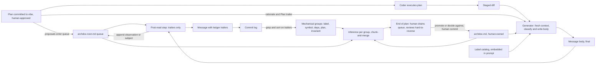

# The Design Ledger: Commit Messages That Record Design Facts So the Log Can Reveal Debt

## Executive Summary

A design ledger is a commit log in which every message ends with fixed trailers that record the design facts the commit establishes, each labeled from a 40-label catalog and checked against a short human-owned architecture document, the archdoc. Repository owners should adopt one. Hard-to-reverse debt then shows when a tool groups those trailers across the whole log and reasons over each group, a pattern that stays hidden in any single diff. (high confidence: the three claims the system rests on each have direct empirical support, listed below)

The system has three parts. The first is the generator, a commit-message agent that runs in a fresh context separate from the session that wrote the code. It reads the staged diff, labels every added or changed unit with a catalog label, checks the diff against the invariants in `vibe/archdoc.md`, and writes a message whose top is free prose and whose bottom is a fixed grammar of `Design:`, `Violates:`, `Pending:`, `Deferred:`, and `Plan:` trailers. The second is a `vibe/` directory holding the archdoc, a queue file `archdoc-next.md` to which the generator appends observations, and every plan, each committed before the coding agent runs so that each commit can name it. The third is the whole-log pass, which groups the trailers mechanically with `git log`, `grep`, and `sort`, then runs inference over each group to find patterns beyond the reach of any single diff.

The system depends on one rule: only a human writes `archdoc.md`. Every field study of architecture conformance located for this report ends the same way. When code and reference disagree, the humans change the reference. In [Buckley et al.'s multi-case study](https://bura.brunel.ac.uk/bitstream/2438/14955/1/FullText.pdf) all but two architects changed the model rather than the code, and in the IBM case they cite, violations hidden in the model then grew. In [Feilkas et al.](https://teamscale.com/hubfs/26978363/Publications/2009-the-loss-of-architectural-knowledge-during-system-evolution-an-industrial-case-study.pdf), 72% to 90% of documentation-to-code differences were resolved as documentation flaws. An agent with edit rights on the reference would ratify its own violations faster than any architect. The generator therefore writes only to a queue, `archdoc-next.md`, and it reads that queue only after the message body is final, which keeps the queue out of the classification. The repository owner drains the queue at the end of every plan.

The system also includes one correction to the idea that started it. The original idea was to load all 604 commit messages of one repository into one context and let the model find the patterns. The log fits; the counting fails. [Oolong](https://arxiv.org/abs/2511.02817) measures aggregation over thousands of short labeled records and finds GPT-5 falling from 85.6 at 8K tokens to 46.4 at 128K, with gold labels in context helping by under 11 points. The bottleneck lies in identifying and aggregating records, while classification holds up. The remedy in that literature is a canonical identity per record plus chunk-and-merge, aggregating per chunk and merging the results, and the trailers supply that identity at commit time. The pass therefore groups first, by `grep` and `sort` over the trailers, and reasons second, one group per call.

Two more findings shape the design. Description survives where judgment fails: in the [hallucination study of code-change-to-text tasks](https://arxiv.org/html/2508.08661), about 20% of generated commit messages hallucinated against about 50% of generated review comments, and the [self-attribution study](https://doi.org/10.48550/arxiv.2603.04582) shows a model rating its own on-policy output loses discrimination on its worse outputs. The generator therefore stops at describing and labeling, and it runs as a fresh context; "separate classifier" here means that fresh context. History-based detection is the right primary source: co-change hotspots mined from revision history reached 44.1% precision at predicting bug-prone files where Designite, SonarQube, and DV8 reached 5.1% to 11.6% in the [Active Hotspot study](https://par.nsf.gov/servlets/purl/10194568). Sorting debt by reversal cost is absent from every published framework; the [technical debt prioritization review](https://arxiv.org/pdf/1904.12538v1) found only 4 of 44 studies measure refactoring cost at all. Reversal-cost ordering is therefore this report's own proposal, grounded in fan-in and exposure evidence rather than established practice. (medium confidence on the ordering axis: indirect evidence only)

The cost is one `vibe/` directory containing `archdoc.md` (about 1,500 tokens, human-written), an empty `archdoc-next.md`, and the plans the repo already writes; one prompt of about 4,400 tokens installed in whatever agent harness the repo uses; and, for a repo with history, one rerun of the generator over that history. For PromptForge, the first adopter, that is one rerun over 604 commits.

This is an analytical report with a recommendation, followed by a specification. The first live run is still ahead. The convergent prior art, the [Lore protocol](https://arxiv.org/abs/2603.15566), is in the same position: it proposes design-fact trailers including a reversibility field and rests on proposal alone, without empirical data. The report is written so a reader can build the tool, the directory layout, and the whole-log pass from it alone; the specification in section 9 and the prompt in section 11 are the deliverables that make that possible.

## Contents

1. [Executive Summary](#executive-summary)
2. [The problem: debt shows across commits, and review falls behind agent output](#the-problem-debt-shows-across-commits-and-review-falls-behind-agent-output)
3. [Criteria: five tests a solution must pass](#criteria-five-tests-a-solution-must-pass)
4. [Options: do nothing, index the tree, or keep a ledger](#options-do-nothing-index-the-tree-or-keep-a-ledger)
5. [Findings: nineteen results that fix the design](#findings-nineteen-results-that-fix-the-design)
6. [Recommendation: adopt the ledger, one repository at a time](#recommendation-adopt-the-ledger-one-repository-at-a-time)
7. [The proposal: how the parts fit together](#the-proposal-how-the-parts-fit-together)
8. [Limitations: the first live run is still ahead, and the thresholds are guesses](#limitations-the-first-live-run-is-still-ahead-and-the-thresholds-are-guesses)
9. [Specification](#specification)
10. [References](#references)
11. [The prompt](#the-prompt)

## The problem: debt shows across commits, and review falls behind agent output

Agents produce debt faster than humans can review it, and two terms name the two halves of that problem. Debtslop is the technical debt that LLM coding agents produce as a by-product of writing code fast: duplicated helpers, free functions that share a parameter tuple, state placed wherever it was convenient, exceptions swallowed to make a test pass. Vibescale is the rate at which an agent produces it: hundreds of commits a month from one developer, each a plausible diff. The originating observation comes from Vinnie Falco's chat messages of 2026-09-04 ("Debtslop, vibescale, and commit messages as a design ledger"). "Debtslop can only be avoided by human judgement," and the usual vehicle for that judgment, pull-request review, "doesn't work at vibescale." The volume of change exceeds what the reviewer can read.

The second observation makes the problem tractable. "You can't detect technical debt from a single diff. You can only detect it as a pattern, over all the commits in the repo." A commit that says "add a function to update the status bar" is meaningless on its own; two such commits signal a duplicate function. The literature measures the same thing. [Feng et al.](https://par.nsf.gov/servlets/purl/10194568) mined co-revision clusters from revision history alone across 21 projects and reached 44.1% precision at predicting bug-prone files. SonarQube reached 11.6%, DV8 9.3%, and Designite 5.1%, and those tools reached their 60% to 75% recall only by flagging huge numbers of files. On those numbers the history is the better instrument. [Sas et al.](https://doi.org/10.1007/s42979-020-00407-5) found on 14 Java systems that where a co-change and an architectural smell coincide on a file pair, the co-change appeared first 90% of the time. The pattern shows in the history before the smell shows in the tree.

The first attempt at the idea failed, and the failure shows what was missing. Vinnie rewrote the PromptForge commit log from the beginning, 604 commits from 2026-07-28 to 2026-08-28, using a prompt that collected the plan files, read the diffs, and tried to word each message so that design choices became visible. The result reads as high-quality diff summaries. Commit [`6450629`](https://github.com/vinniefalco/promptforge/commit/6450629) ("Create workspace with prompt parser and one-shot executor") explains that `promptforge-core` parses a prompt file into a `Prompt` tree and sends the entry section's prose to a chat endpoint. Commit [`4fceba3`](https://github.com/vinniefalco/promptforge/commit/4fceba3) ("Add promptforge-gateway and route the executor through it") explains that the vendor credential moves out of the executor so the gateway is the only process that talks to a backend. Both are accurate. Both leave out, in every form a second reader or a program could group on, the facts that a credential type with a private field was introduced, that the chat request and response types became a wire contract, and that a config field was parsed and then ignored. The design facts are present as prose and absent as data, so a reader can read the log while a program has nothing to query.

The obvious remedy, "use a structured commit format," fails on its own. A [replication over 50,673 security commits](https://arxiv.org/abs/2604.20461) found Conventional Commits-compliant messages less informative than non-compliant ones (p < 0.05): compliant messages were 19.2 points more often rated poor. An [ICSE 2023 study of commit message quality](https://doi.org/10.1109/icse48619.2023.00076) found about 44% of sampled open-source messages lack either what or why, and that quality declines over time while developers believe it improves. Adoption of the best-known structured format [plateaus near 10% of public commits](https://site.strijbol.be/articles/conventional-commits/), with hook enforcement near 2.1%. The one structured trailer with a measured track record, the Linux kernel's `Fixes:` tag, is mandated and checked by tooling; an [audit of 383 sampled tags](https://arxiv.org/abs/2308.05060) found 81% named the correct causal commit. Structure helped there because something enforced it. In this design, the generator enforces the structure.

Measurements of debtslop's shape also predict which labels will dominate the ledger. [GitClear's 2025 analysis](https://www.gitclear.com/ai_assistant_code_quality_2025_research) of 211 million changed lines found copy-pasted lines rising from 8.3% to 12.3% of changes and moved lines falling from 24.1% to 9.5%, with blocks of five or more duplicated lines up roughly tenfold; duplication is replacing refactoring. [Ox Security's 300-repository analysis](https://www.infoq.com/news/2025/11/ai-code-technical-debt/) found functionality regenerated in place rather than reused in 80% to 90% of AI-generated repositories. [CodeRabbit's 470-PR study](https://www.coderabbit.ai/blog/state-of-ai-vs-human-code-generation-report) found 10.83 issues per AI-co-authored PR against 6.45 for human PRs, with error-handling issues nearly twice as frequent. An [ENIAC 2025 study](https://doi.org/10.5753/eniac.2025.12470) found 60.9% of 64 LLM-generated units have a smell, with Long Method 40% of all occurrences, and an [ICCBDC 2025 study](https://doi.org/10.1109/iccbdc67784.2025.00017) found design smells in LLM output up 64% over reference solutions. Clones, oversized units, swallowed errors, and speculative abstraction are the expected bulk of the ledger, and the catalog in section 9.6 gives those labels numeric criteria.

## Criteria: five tests a solution must pass

A solution passes if it meets all five of these. The next section scores the options against them.

It must detect hard-to-reverse debt, not all debt. Agents can sweep mechanical debt, a duplicated helper or an oversized function, on their own; the human's time goes to debt whose fix is a design decision. The evidence for weighting by reversibility is indirect but consistent. High fan-in files cost 3x to 15x more per line to maintain in [MacCormack and Sturtevant's study](https://www.hbs.edu/ris/Publication%20Files/2016-JSS%20Technical%20Debt_d793c712-5160-4aa9-8761-781b444cc75f.pdf) of two 20,000-file systems. In [AnaConDebt](https://www.mn.uio.no/ifi/english/people/aca/antonima/papers/ICSEpaper.pdf), refactoring cost rose 1.5x to 3x as dependents accrued, and external exposure made items effectively irreversible.

Its cost must be linear in commits. Each commit pays one generator run, and a commit's cost is independent of the size of the history behind it.

The whole history must remain readable in one context. This is a reading requirement; section 5 explains why reading and counting differ. The compressed record of a year of design decisions should be something a human or a model can open and read end to end.

Human judgment must be spent only where the fix is a design decision. The system routes mechanical debt to agents and design debt to a human, on a cadence the human can keep, which the decisions of 2026-09-04 fix at once per full plan execution.

It must resist ratification. The reference the code is checked against must change only by human decision. [Buckley et al.](https://bura.brunel.ac.uk/bitstream/2438/14955/1/FullText.pdf) and [Feilkas et al.](https://teamscale.com/hubfs/26978363/Publications/2009-the-loss-of-architectural-knowledge-during-system-evolution-an-industrial-case-study.pdf) both document the reference changing to match the code as the default outcome even when humans control the reference; a design that gives control of the reference to the agent that wrote the code fails this test outright.

## Options: do nothing, index the tree, or keep a ledger

Only the design ledger passes all five criteria; this section weighs it against two alternatives. The do-nothing option comes first because a recommendation is an assertion until it is weighed against an alternative.

The do-nothing option keeps the current arrangement: the existing `commit.mdc` prompt writes a diff summary for each commit, and a human reviews pull requests when there is time. Its added cost is zero and it produces good messages; the PromptForge rewrite proves the prompt can describe a diff faithfully. It fails the first criterion outright, because a diff summary lacks any labeled design fact a second pass can group, and it fails the fourth, because at vibescale the human either reads everything or reads nothing. It passes the ratification test only for lack of a reference to ratify against, which amounts to skipping the check. Its one real merit is the baseline it sets: about 20% of generated commit descriptions hallucinate in the [code-change-to-text study](https://arxiv.org/html/2508.08661), so whatever the ledger adds must hold that rate or lower it.

The tree-indexing option builds detectors over the current source: clone detection, symbol indexes, dependency graphs, static smell tools. It catches duplication well and it leaves commit writing unchanged. It is blind to emergent structure spread across the tree, such as four free functions in three files that all take the same `(ctx, config, logger)` tuple. It is also blind to the history of a construct, such as a config type that has been a bag of state three times and encapsulated twice. The precision evidence is against it as a primary instrument: in the [Active Hotspot comparison](https://par.nsf.gov/servlets/purl/10194568), static smell tools reached 5.1% to 11.6% precision at predicting bug-prone files where history-derived hotspots reached 44.1%, and smell counts grow with project size while hotspot counts stay flat. It passes the linear-cost criterion only per run, since each run re-indexes the whole tree, and it leaves ratification unaddressed because it works without a reference. It remains the right tool for what it catches, and section 9.6 routes several candidate labels to linters for that reason.

The design-ledger option is the one section 9 specifies. A fresh-context generator labels each commit's design facts, records them in trailers, and checks them against a human-owned archdoc; the pass then groups them mechanically across the whole log before any inference runs. It meets the first criterion because labels name a reversal driver, the mechanism that makes reversal expensive, and the pass sorts on it. It meets the second, since each commit pays one generator run, and the third, since the trailers are a compressed record a reader can open. It meets the fourth, since the pass gives the human only the hard-to-reverse groups and the queue of design observations, once per plan. It meets the fifth, since only a human can write the reference. Its costs are a prompt of about 4,400 tokens per commit, an archdoc the human must write and keep under about 1,500 tokens, and a bootstrapping rerun of the generator over existing history, for repos that have one. Its risk is that its first live run is still ahead. The [Lore protocol](https://arxiv.org/abs/2603.15566) proposes the same mechanism independently, design-fact trailers with a reversibility field bound atomically to the diff, and it also lacks empirical validation; its author proposes a six-month study rather than reporting one. The convergence shows the idea is natural; whether it works is still open.

## Findings: nineteen results that fix the design

Each finding is one paragraph: the point, the evidence with its source, and a confidence tag.

### F1 Debt is a cross-commit phenomenon, and history-derived signals lead static detection

The history-mining literature supports the originating claim that technical debt shows only as a pattern across commits. [Feng et al.](https://par.nsf.gov/servlets/purl/10194568) mined active hotspots from revision history across 21 projects and beat Designite, SonarQube, SonarGraph, Structure101, and DV8 on precision and F1 in every setting (bug-prone files: hotspot precision 44.1% and F1 36.0% against SonarQube 11.6% and 19.5%). [Xiao et al.](https://personal.stevens.edu/~lxiao6/papers/ICSE-16-Debt.pdf) built a history coupling matrix from co-change data on 7 Apache projects and found the top 5 history-derived debts accounted for 20% to 61% of maintenance effort. [Sas et al.](https://doi.org/10.1007/s42979-020-00407-5) found co-change preceded the architectural smell 90% of the time. The log is a legitimate primary source in its own right. (high confidence: three independent studies, consistent direction)

### F2 The log fits in one context for reading, but aggregation over it must be mechanical

The original idea loaded all 604 messages into one context and asked the model for the patterns. Reading works; counting fails. [Oolong](https://arxiv.org/abs/2511.02817) shows aggregation accuracy over labeled records falling monotonically with count (GPT-5 85.6 at 8K to 46.4 at 128K; every frontier model under 50 at 128K), with gold labels in context adding only 0.8 to 10.9 points, so the failure lies in identifying and aggregating records while classification holds. [RULER](https://arxiv.org/abs/2404.06654) shows models near-perfect on single-needle retrieval degrading sharply on frequency aggregation as length grows. The [mergeable aggregation states](https://arxiv.org/abs/2607.26448) paper attributes this to attention's normalized averaging and shows the fix: extract each record to a canonical identity, aggregate per chunk, merge; 92.0% to 99.4% against 28.7% to 43.1% for direct prompting. The `Design:` trailer is that canonical identity, written at commit time. The whole-log pass therefore groups with `grep` and `sort` first and reasons over each group second (section 9.9). This corrects the original one-context idea and strengthens the case for structured trailers over prose. (high confidence: three benchmarks, one mechanism paper)

### F3 Lexical matching fails and semantic matching passes, which is why the labels are a closed set

Two commits reading "add a function to update the status bar" happen to match as strings; two that read "add status-bar refresh helper" and "wire progress text into the footer" differ as strings yet may describe the same duplication. Keyword approaches to detecting debt from message text are weak: the [SATD-from-commits replication](https://link.springer.com/article/10.1007/s11219-020-09520-3) found five hand-picked keywords reach AUC 0.57, and only automated feature selection over bag-of-words reaches 0.74. A model can match the two messages semantically, but F2 shows that ability degrading over hundreds of records at once. A closed label set resolves both problems. The generator does the semantic work once per commit, mapping "status-bar refresh helper" to `pure-function @ ui/footer.rs::refresh_status`, and the pass then matches labels and loci lexically, the locus being the file and symbol after the `@` in that line, which `sort` handles at any scale. (high confidence: follows from F2 and the SATD result)

### F4 Faithful self-description suffices where self-judgment fails, so a separate classifier labels

The generator's task stops at describing and labeling the diff, and it must run outside the session that wrote the code. Three results fix this. In the [code-change-to-text hallucination study](https://arxiv.org/html/2508.08661), about 20% of generated commit messages hallucinated against about 50% of generated review comments on the same inputs; description degrades far less than judgment. The [self-attribution study](https://doi.org/10.48550/arxiv.2603.04582) found models rating code that appeared in their own prior turn fell from AUROC 0.99 to 0.89, with the inflation concentrated on lower-quality actions, and a larger reasoning budget left the effect in place; the effect came from on-policy context rather than from being told the code was theirs. [Articulate but Wrong](https://arxiv.org/abs/2605.21537) found 31.7% of oracle-confirmed semantic drift silently endorsed by the producing model, which in several cases stated the rule it had broken and then declared behavior preserved. [Do LLM Evaluators Prefer Themselves for a Reason?](https://arxiv.org/html/2504.03846v1) adds that harmful self-preference concentrates where the model's own output is wrong. A fresh context that receives the diff as a stranger's removes the measured on-policy effect. A different model family is an optional upgrade against correlated blind spots, which the [specification-as-quality-gate argument](https://www.arxiv.org/pdf/2603.25773) supports from ensemble theory, but the evidence requires only the fresh context. (high confidence: four studies, one direct task match)

### F5 History and state differ, so the op vocabulary needs `removes` and `replaces`

A ledger recording only what each commit adds shows the same five god objects for a repo that kept all five and for a repo that removed four of them. The `Design:` trailer therefore records an op, the verb of the design fact: `new`, `extends`, `replaces`, `removes`, or a transition `<label> -> <label>`. The whole-log pass reads the op sequence per locus (section 9.9, table b), so the current state of any construct is a fold over its history rather than a guess. This is a design consequence of [F1](#f1-debt-is-a-cross-commit-phenomenon-and-history-derived-signals-lead-static-detection) and [F2](#f2-the-log-fits-in-one-context-for-reading-but-aggregation-over-it-must-be-mechanical) rather than an externally sourced finding; the sources are silent on it as such. (high confidence on the need; the vocabulary itself is a design choice)

### F6 Omissions need an explicit field, because a diff shows only what is present

Debt often takes the form of what a commit left undone: a field parsed and then ignored, a module written and left unwired, a path left untested, a plan deliverable that stayed unshipped. Each of these lacks a unit to label. The `Deferred:` trailer records them, with a defined source: absences the diff itself makes visible (TODO or FIXME text, stubs, unwired modules, untested paths, parsed-but-unread fields, definitions with no reference in the touched files, tests with no assertion) plus any deliverable the active plan's matched todo names that is absent from the diff. The generator limits deferrals to that source, because imputation of missing facts made up 75.9% of errors in [ClinDet-Bench](https://aclanthology.org/2026.acl-industry.47.pdf), the largest class by far. The catalog routes four candidate labels (dead-code, dead-stub, assertionless-test, parsed-but-unread) to this trailer rather than to the label set. (high confidence on the need; medium on the source rule, which is a design choice bounded by the imputation evidence)

### F7 A controlled vocabulary makes the log groupable

Every design fact names its pattern from a fixed catalog of 40 labels (section 9.6). F2 and F3 supply the reasons: `sort` can group a fixed token set, and the pass can count it without inference. The catalog is language-agnostic; language-specific labels sit in an extension block. The [Lore protocol's](https://arxiv.org/abs/2603.15566) fields are free text, which is one of the differences section 7 lists; the controlled vocabulary itself is a decision recorded in the discussion of 2026-09-04. (high confidence: follows from F2 and F3)

### F8 Transitions between labels show a signal beyond any single label

A locus that reads `new bag-of-state`, then `extends bag-of-state` twice, then `bag-of-state -> encapsulated-invariant` tells the human more than any single label: it shows the design pressure, the delay, and the resolution. The transition op exists for this. It also explains why neutral labels stay in the catalog at all: `value-object`, `encapsulated-invariant`, and `pure-function` are the targets that smell labels transition to, and a `new` on a neutral label at a locus that already has one is how duplication surfaces. The sources are silent on this as a measured claim; the nearest evidence is that co-change sequences precede smells 90% of the time in [Sas et al.](https://doi.org/10.1007/s42979-020-00407-5), and the pass procedure (section 9.9, table b) makes the transition sequence observable. (medium confidence: reasoned, not measured)

### F9 Reversal cost is the sorting axis, and it is absent from every published framework

The human's attention goes first to debt that is hard to reverse. Free functions that share a parameter tuple are the canonical case: each addition is cheap, and consolidating them into one object gets more expensive with every call site. Published prioritization frameworks sort on other axes. The [technical debt prioritization review](https://arxiv.org/pdf/1904.12538v1) of 44 primary studies found refactoring cost measured in only 4 of them, and irreversibility used as a sorting axis in zero. The nearest analogs support the axis indirectly. [AnaConDebt](https://www.mn.uio.no/ifi/english/people/aca/antonima/papers/ICSEpaper.pdf) found refactoring cost rising 1.5x to 3x as dependents accrued, and items becoming effectively irreversible once exposed to external clients. [MacCormack and Sturtevant](https://www.hbs.edu/ris/Publication%20Files/2016-JSS%20Technical%20Debt_d793c712-5160-4aa9-8761-781b444cc75f.pdf) found high fan-in files cost 3x to 15x more per line to maintain. [Martini and Bosch](https://doi.org/10.1002/smr.1877) describe contagious debt whose interest compounds as dependents inherit the pattern. The [real-options framing](https://avishek.net/assets/papers/software-decisions-real-options.pdf) makes irreversibility the governing variable in theory. The catalog therefore names a driver for every hard-to-reverse label (fan-in, persisted format, external exposure, hidden coupling), and the pass orders findings by driver. This is a proposal grounded in adjacent evidence rather than established practice. (medium confidence: indirect evidence only, no direct precedent)

### F10 An archdoc gives "violation" its meaning

A label says what a unit is; only a reference can say whether it is allowed. Without one, the pass can count god objects but has no basis to rule that the workshop server belongs outside the gateway. The archdoc supplies identity, components with allowed dependency directions, numbered invariants, principles, thresholds, and a decided-against list, in about 1,500 tokens (section 9.2). LLMs check explicit, code-inferable decisions well: the [ADR violation study](https://arxiv.org/pdf/2602.07609) reports over 90% accuracy on those, so the archdoc keeps every invariant to one clause the diff can show or fail to show. Vinnie decided to keep it small, with few invariants, "to avoid suffocating the model." (high confidence on the need; the size is a stated design choice)

### F11 Ratification is the documented default, so only a human writes the archdoc

Every field study on the question shows the reference changing to match the code. In [Buckley et al.](https://bura.brunel.ac.uk/bitstream/2438/14955/1/FullText.pdf), professional architects at four firms used reflexion modelling to find violations. Months later the most any of them had removed was half, two had removed zero, and "all bar two" changed the model rather than the code. In the IBM case they cite, the architects changed the model to hide trivial violations, and the hidden violations then grew. In [Feilkas et al.](https://teamscale.com/hubfs/26978363/Publications/2009-the-loss-of-architectural-knowledge-during-system-evolution-an-industrial-case-study.pdf), 72% to 90% of documentation-to-code differences were attributed to documentation flaws and corrected toward the code. [Rosik et al.](https://doi.org/10.1002/spe.999) found reflexion modelling "served to conceal some of the inconsistencies" and that detection alone left the inconsistencies in place. [ArchUnit's freeze rule](https://loiane.com/2026/07/architecture-testing-java-archunit/) is the mechanism-level version: the baseline of accepted violations is where violations get ratified. `archdoc.md` therefore changes only by human hand, in a human commit at the end of a plan. The generator writes observations to `archdoc-next.md`, reads that file only after the message body is final, and leaves proposals to the plan-commit step; proposals enter the queue only when a plan is committed (F15). This is the control the rest of the design depends on. (high confidence: four field studies, one mechanism)

### F12 The commit pins the archdoc revision, which makes a version trailer redundant

Each commit is a tree, and the tree contains `vibe/archdoc.md`; `git show <hash>:vibe/archdoc.md` recovers the reference that governed. A hash or version trailer would duplicate this and could disagree with it. The one convention this requires is that each invariant number is assigned once and kept for life, so `Violates: A3` in a 2026 commit and in a 2027 commit refer to the same invariant even after A2 is retired. A retired invariant stays in the file as a one-line tombstone. The whole-log pass, reading messages alone, then sees one meaning per ID. The sources are silent on this; it is a design decision from the discussion of 2026-09-04. (high confidence: a property of git, not an empirical claim)

### F13 Enforcement rather than format made the kernel trailer work

The evidence from adoption in the wild weighs against structure alone: Conventional Commits-compliant messages were less informative than non-compliant ones in the [security commit replication](https://arxiv.org/abs/2604.20461), quality drifts downward over time in the [ICSE 2023 study](https://doi.org/10.1109/icse48619.2023.00076), and adoption plateaus near [10% with 2.1% enforcement](https://site.strijbol.be/articles/conventional-commits/). The counterexample is the Linux kernel's `Fixes:` trailer, mandated since 2013 and checked by `checkpatch`, which produced [76,046 machine-readable pairs at 81% accuracy](https://arxiv.org/abs/2308.05060) on a 383-tag audit. The difference is that something enforced it. In this design the generator enforces the grammar: every commit's trailers come from the same prompt against the same grammar and are self-checked against the catalog and the archdoc. The 81% figure is also the realistic ceiling to expect from the trailers, and the recommendation says to spot-check labels before trusting aggregates. (high confidence: direct evidence on both sides)

### F14 The queue is incrementally maintained pattern memory, and it partly offsets retrospective detection

History-based detection runs after the fact; [Xiao et al.](https://personal.stevens.edu/~lxiao6/papers/ICSE-16-Debt.pdf) acknowledge their approach finds debt only after penalty has accumulated. `archdoc-next.md` narrows the gap. Because the generator reads it after the body is final, it can match this commit's `Design:` facts against pending observations and proposals and flag `Pending: N4 - compounds`, `Pending: N2 - contradicts`, or `Pending: N7 - implements` at commit time. The flag is a match, not a judgment, so the generator stays inside the description task F4 licenses. A human draining the queue sees the observation together with the commits that have compounded it since. (medium confidence: the mechanism is sound; the offset is unmeasured)

### F15 The plan is committed before the coder runs, and that gives every commit a `Plan:` trailer

The sequence is: plan written, human approves, plan committed to `vibe/YYYY-MM-DD-N-words.md` (the commit's date, a disambiguator, and the plan's name), coder executes, plan ends, human reviews. Every commit the coder makes includes `Plan: YYYY-MM-DD-N-words`. Four things follow. Every commit has a rationale source the generator may quote under the admission rule (section 9.7, step 3), which lets a plan statement in only as the reason for something the diff shows. Proposals to amend the archdoc enter `archdoc-next.md` in the same commit as the plan, written by the plan-commit step (the step that commits the plan file, section 9.4), so authorization stays with the human who approved the plan and proposal writing stays outside the generator. The whole-log pass groups by plan, so the end-of-plan review has its commit set from one `git log --grep` query, and any hand-built plan-to-commit map, such as the one built for PromptForge, becomes a query. The plan is also the unit of human design review, since it is the unit of work; the queue at plan end holds the design pressure that plan generated. The sources are silent on these; they are decisions from the discussion of 2026-09-04. (high confidence: mechanical consequences of committing the plan)

### F16 Abstention must be gated by an evidence criterion

The invariant check has three outcomes: violated, untouched, not determinable. Offering the third as a peer choice is harmful. In the [abstention-as-prompt-artifact study](https://arxiv.org/html/2507.16199v6), adding an "Unknown" option to binary tasks caused 32.9% abstention and a 15.75-point accuracy drop, and synonyms or random words triggered the same rate, so the effect is structural. [ClinDet-Bench](https://aclanthology.org/2026.acl-industry.47.pdf) found 75.9% of errors were imputation of missing facts, and that a "say unable when unsure" instruction only shifted abstention globally. Exemplar pairs showing the determinable and undeterminable cases were the one intervention that fixed both, lifting accuracy to 0.88 to 0.98. The same study found abstention accuracy falling from 0.59 to 0.32 as criterion components multiplied. The prompt therefore states an evidence criterion for abstaining (the diff touches a component or symbol the invariant names while leaving the governed property unshown), gives one exemplar pair, keeps every invariant to one clause, and treats silence as checked-and-untouched. (high confidence: two studies, consistent mechanism)

### F17 Definitions with counts drive accuracy, so criteria include numbers and the generator states the count first

Label names alone classify poorly. In [Attentionsmelling](https://sol.sbc.org.br/index.php/sbes/article/download/37005/36790/), GPT-4o given only smell names scored F1 0.50; adding structured definitions raised it to 0.69, and adding quantitative metrics pushed God Class to F1 1.00. The [label-definition adherence study](https://arxiv.org/pdf/2509.02452) found models follow the definition text over the label token, with MCC swinging 42 to 50 points between correct and incorrect definitions. Every catalog line therefore has a criterion, quantitative where the literature gives a number. God-object takes ATFD > 5 and WMC >= 47 from Lanza and Marinescu via PMD; clone-block takes 100 tokens or 10 lines from PMD CPD; oversized-unit takes 75 lines or cognitive complexity 15 from SonarQube; shared-parameter-cluster takes 3 or more parameters in 2 or more signatures from Fowler's data clumps. The generator states the count or property before it writes the label. The criterion names each project-tunable threshold, and the repository owner sets its value in the archdoc's thresholds section, so the prompt stays project-neutral. The format-restriction evidence, that constrained output helps classification when the reasoning field precedes the answer field ([Let Me Speak Freely](https://ar5iv.labs.arxiv.org/html/2408.02442)), and the reliability evidence for low temperature ([annotation reliability study](https://ar5iv.labs.arxiv.org/html/2304.11085)) set the output order and the decoding recommendation. (high confidence: direct code-smell evidence)

### F18 Real diffs are large and faithfulness fails on fragments, so evidence is quoted per file with callee lookups

The [TSE 2024 review of commit message generation](https://doi.org/10.1109/tse.2024.3364675) re-benchmarked on 828k commits and found a median diff of 632 tokens with 39% over 1,000, where prior datasets capped at 100 to 200; models given raw 4,000-token diffs produced change lists without rationale. The [IJCNLP 2025 hallucination study](https://doi.org/10.18653/v1/2025.ijcnlp-long.137) found 14.2% to 21.6% of generated messages hallucinating, input inconsistency being the largest type, and attributed it to fragmented snippets standing in for full context. [Consider What Humans Consider](https://arxiv.org/html/2503.11960v2) found 67.6% of generated messages missed context humans used, with callee knowledge (24.9%) and types defined outside the diff (15.3%) the top code-level omissions. Anthropic's [guidance on reducing hallucinations](https://platform.claude.com/docs/en/test-and-evaluate/strengthen-guardrails/reduce-hallucinations) is to extract word-for-word quotes first and write only from them, and the [multi-level generation study](https://doi.org/10.1016/j.infsof.2025.107831) shows per-file then overall messages help on large diffs. The generator therefore extracts numbered evidence quotes with file and line, per file when the diff exceeds 6 files or 400 changed lines, and resolves callee signatures with a read when a label depends on them (`shared-parameter-cluster`, `temporal-coupling`, `layer-violation`, `feature-envy`). The threshold is a starting guess. (high confidence on the mechanism; low on the threshold values)

### F19 The measured profile of LLM-generated code predicts which labels will dominate

The catalog gives numeric criteria to the labels the evidence says will be most frequent. Copy-pasted lines rose from 8.3% to 12.3% of changes and five-line-plus clones grew roughly tenfold in [GitClear's 211-million-line study](https://www.gitclear.com/ai_assistant_code_quality_2025_research), so `clone-block` uses the PMD CPD threshold. Long Method was 40% of all smell occurrences in the [ENIAC 2025 study](https://doi.org/10.5753/eniac.2025.12470), so `oversized-unit` uses the SonarQube thresholds. Error-handling issues ran nearly 2x in [CodeRabbit's PR study](https://www.coderabbit.ai/blog/state-of-ai-vs-human-code-generation-report), so `swallowed-exception` names the specific construct. Design smells rose 64% in the [ICCBDC 2025 comparison](https://doi.org/10.1109/iccbdc67784.2025.00017) and by-the-book fixation and over-specification each ran 80% to 90% in [Ox Security's analysis](https://www.infoq.com/news/2025/11/ai-code-technical-debt/), so `speculative-abstraction` is defined by the absence of a second caller. Helper reimplementation ran 80% to 90% in the same analysis, and it is routed to the whole-log pass rather than a label because only the log can show that a helper already exists. (high confidence: five independent measurements, consistent direction)

## Recommendation: adopt the ledger, one repository at a time

Repository owners should adopt the design ledger in any repository where an agent writes most of the commits. Each step below names its owner and applies to any such repository. PromptForge is the first adopter. (high confidence on adopting; medium on the specific thresholds, which are starting guesses)

The repository owner creates a top-level `vibe/` directory and writes `vibe/archdoc.md` by hand, under about 1,500 tokens, following the format in section 9.2 and including the thresholds section that sets the project's values for the catalog's named variables. The owner then creates an empty `vibe/archdoc-next.md` and commits both.

The plan author, human or agent, commits every plan to `vibe/YYYY-MM-DD-N-words.md` before the coding agent starts, after a human approves it. If the plan authorizes a design change, the plan-commit step (section 9.4) writes the corresponding proposal lines into `archdoc-next.md` in the same commit.

The repository owner installs the prompt from section 11 in the harness of choice, following section 9.11, and configures dispatch so the generator runs in a fresh context separate from the session that wrote the code. The owner sets the generator's temperature low.

If the repository has history, the owner runs the bootstrapping procedure in section 9.10: write the first archdoc from the current state, reconstruct plan boundaries and commit them as dated plans, then rerun the generator over history in a fresh context per commit.

The owner runs the first whole-log pass (section 9.9) with an explicit "not determinable" outcome and `archdoc-next.md` as a second input, and spot-checks a sample of at least 30 labels against the code before trusting any aggregate. Expect accuracy near the 81% the kernel's enforced trailer achieved rather than 100%.

At the end of every full plan execution, the repository owner drains the queue: for each entry, promote it to the archdoc in a human commit, record it as decided-against in the archdoc, or leave it open; then read the hard-to-reverse findings the pass produced for that plan. The repository owner runs the pass on the same cadence or less often. This is the only recurring human cost the system adds, and it is bounded by the number of plans rather than the number of commits.

## The proposal: how the parts fit together

This section describes the system as a whole before section 9 specifies each part. Figure 1 shows the data flow; the text that follows it walks the same path.



Figure 1. Data flow of the design ledger. Solid arrows are data; the only writer of `archdoc.md` is the human at the bottom right.

The commit system. When a change is staged, the harness dispatches the generator in a fresh context with the staged diff, the active plan's filename if one is active, and the prompt in section 11. The generator reads the diff and extracts numbered evidence quotes, per file when the diff is large. It reads `vibe/archdoc.md` whole, then the plan's frontmatter and, under the admission rule, the passages that explain something the diff shows happened. The generator then labels each added or changed unit against the catalog embedded in the prompt, stating the count or property the criterion asks for before the label, and checks each invariant as violated, untouched, or not determinable under a stated criterion. It writes the message body to a scratch file: a subject, a symbol-free paragraph, partly structured bullets, and the `Design:`, `Violates:`, `Deferred:`, and `Plan:` trailers. Only then, in the post-read step, does it read `vibe/archdoc-next.md`, append any observation the diff supports, append this commit's subject to any entry it matches, and append `Pending:` trailers to the scratch file. It returns the file verbatim with a short provenance paragraph.

The archdoc. `vibe/archdoc.md` is a flat file a human writes and only a human edits: an identity paragraph, the components and their allowed dependency directions, invariants numbered `A1` onward with numbers fixed for life, principles, a thresholds section for the catalog's named variables, and a decided-against list. It is short because the generator loads it whole on every commit and because the abstention evidence in F16 requires one-clause invariants. It is human-owned because F11 says any other owner ratifies.

The queue and why the read comes last. `vibe/archdoc-next.md` holds two kinds of line: proposals, which only the plan-commit step writes, and observations, which only the generator writes. The generator reads it after the body is final for two reasons. The first is F4: the body must be classified against the ratified reference, and a queue of pending proposals in context while classifying would let an unratified design shape the labels. The second is the step-boundary evidence in section 11's design notes: single-prompt sequential steps degrade from step two, and models over-rely on their own prior output. A file the post-read step may only append to therefore enforces the boundary, in place of an instruction to keep the body unchanged.

The plan's four roles. The plan is a committed repo artifact that every commit points to through its `Plan:` trailer. It is the rationale source for the message, under the admission rule that a plan statement may enter only as the reason for something the diff shows. It is the point where proposals enter the queue, in the same commit as the plan, so every proposal is written before execution begins. It is also the unit of human design review that drains the queue, because the plan is the unit of work and the queue at plan end holds the design pressure that plan generated. Checking a committed plan against the archdoc before execution is prevention rather than detection and is out of scope here.

The whole-log pass. The pass extracts every commit's trailers with `git log`, groups them mechanically by `Design:` label, by locus, by `deps:` tuple (the dependencies a `Design:` line lists), by plan, by `Violates:` id, and by `Pending:` id, and produces count tables as Markdown key-value blocks. It then runs one inference call per group, with the whole archdoc and the relevant queue entries as inputs, asking whether the group shows a hard-to-reverse pattern, under which driver, and bearing on which invariant, with "not determinable" available only under the same criterion gate the generator uses. The pass merges the per-group findings, deduplicates them by locus, orders them by reversal driver, and writes them as the short file the human reads alongside the queue at plan end. The model only reasons over groups already formed; the shell does every count.

Growth and consolidation. The catalog grows only when a project appends a language extension to its copy of the prompt; the core block stays fixed across projects. The archdoc grows only by human commit, and it shrinks the same way. The queue grows during a plan and drains at its end. The log grows without bound; when the trailer record for a repo exceeds a few thousand commits, the mechanical grouping still runs at any size, and only the per-group inference inputs need chunking, which the chunk-and-merge design already provides.

How this differs from Lore and from ADRs. The [Lore protocol](https://arxiv.org/abs/2603.15566) also puts design facts in git trailers and also includes a reversibility field, and it correctly observes that ADR files drift from the code they describe because they stay unbound to any diff. The ledger differs in five ways. Its labels come from a closed catalog rather than free text, so grouping is mechanical. A human-owned reference gives "violation" a meaning. The agent-written queue sits apart from that reference, so only a human can ratify a change to it. Committed plans, with every commit pointing at one, give the pass a unit of review. The pass itself runs group-then-reason, a step Lore leaves unaddressed. Against ADRs, the ledger keeps the reference small and the record per commit; an ADR is a document about a decision, a `Design:` trailer is a fact about a diff.

## Limitations: the first live run is still ahead, and the thresholds are guesses

The system is untested live. Every mechanism in it is grounded in a measured result about a neighboring task, and each still awaits measurement on this task. Lore is in the same position. The first live run is the next piece of evidence, and the recommendation to spot-check labels before trusting aggregates exists because of this gap.

The thresholds are unset or guessed. The catalog's quantitative criteria use literature defaults, and each project overrides them in its archdoc. The large-diff threshold of 6 files or 400 changed lines is a starting guess rather than a measured value. The 1,500-token archdoc budget and the 3,000-token prompt target are design choices sized to leave room for the diff in context; the delivered prompt measures about 4,400 tokens, and section 11 says where the overage went.

Bootstrapping mislabels pre-design commits. Running the generator over history against the first archdoc will report violations of a design written after those commits landed. The specification accepts this and states it; the human reading the pass output filters by plan and date.

The whole-log pass prompt is delivered as a sketch. Section 9.9 gives the grouping commands, the inputs and outputs of the per-group call, the abstention gate, the output schema, and one exemplar pair; writing the full prompt against the prompts rulebook is left to the first adopter after the generator has run.

The pass is group-then-reason, which corrects the original one-context idea. Single-context aggregation over hundreds of records is a documented failure of current models ([Oolong](https://arxiv.org/abs/2511.02817)). The log stays readable in one context while counting over it fails, so the trailers supply the identity that makes counting mechanical.

The context ceiling arrives around several thousand commits. The mechanical grouping runs at any size, but the per-group inference inputs and the human-facing output will need consolidation when a repo passes that scale. The design provides chunking and leaves the consolidation policy to the adopter.

Detection is retrospective. [Xiao et al.](https://personal.stevens.edu/~lxiao6/papers/ICSE-16-Debt.pdf) acknowledge that history-based approaches find debt after the penalty has begun to accrue. The ledger catches debt after the commit lands; prevention stays with the commit-time agent and with checking committed plans against the archdoc before execution, which this report leaves unspecified.

The pass is weakest where the evidence says it will be. The [ADR violation study](https://arxiv.org/pdf/2602.07609) found LLMs least able to separate "no violation" from "code insufficient to answer." The pass emits "not determinable" under a criterion gate and lists those separately, and the human must read silence as unknown rather than clean.

Adopters should expect trailer accuracy likely near 81% rather than 100%. That is a point estimate, the figure the kernel's enforced trailer achieved under audit, and it is the best available estimate for an enforced structured trailer written at scale. Aggregates built on the trailers inherit that error rate.

## Specification

This section gives enough detail to build the tool. Each subsection is complete on its own and repeats what it needs rather than pointing at something "described above". The system is language-, repository-, and harness-agnostic. Where an example is needed, PromptForge, a multi-crate Rust workspace, supplies one instance and is labeled as an instance; section 9.8 gives a second worked example in a different language.

### 9.1 The `vibe/` layout

One top-level directory at the repository root, named `vibe/`, holds every artifact the ledger needs. The directory is flat: three kinds of file plus one one-line marker file, `vibe/ACTIVE`, which holds the name of the plan currently executing and is empty between plans.

`vibe/archdoc.md` is the archdoc, the architecture document a human owns. A human writes and edits it, in a human commit, and only at the end of a plan. The generator, the agent that writes each commit message, reads it whole on every commit; only a human stages it. Its format is section 9.2.

`vibe/archdoc-next.md` is the queue, the file where proposed changes to the archdoc wait for a human decision. The plan-commit step (section 9.4), the commit that records an approved plan, appends proposal lines to it. The generator appends observation lines and commit subjects to it. A human drains it at the end of every plan, deciding each entry. It starts empty. Its format is section 9.3.

`vibe/YYYY-MM-DD-N-words.md` is a plan, the approved description of the work a coding agent is about to do. The filename is the date of the commit that adds the plan, a dash, a disambiguator `N` (an integer starting at 1 and rising by one for each further plan committed on the same date), a dash, and one or more kebab-case words naming the work. The regular expression a filename must match is:

```
^[0-9]{4}-[0-9]{2}-[0-9]{2}-[0-9]+-[a-z0-9]+(-[a-z0-9]+)*\.md$
```

Filenames therefore sort in commit order, and each date-and-disambiguator prefix is issued once. Example: `vibe/2026-09-04-1-route-tts-through-gateway.md`. A human approves a plan, the committer commits it, and only then does the coding agent that executes it run. Its `Plan:` trailer, the last line of every commit message (section 9.5), holds the filename minus the directory and the `.md` extension: `Plan: 2026-09-04-1-route-tts-through-gateway`. The prefix `2026-09-04-1` is the key; `vibe/2026-09-04-1-*.md` resolves it. Later edits to a plan file appear in that file's own git history, and the trailer keeps its value. Its content requirements are section 9.4.

Table 1. Writers and change points for the three `vibe/` file kinds.

| File | Written by | Changes when |
|---|---|---|
| `archdoc.md` | Human only | End of a plan, when the human drains the queue and promotes or retires entries |
| `archdoc-next.md` | Plan-commit step (proposals); generator (observations, matched subjects); human (drain) | Plan commit; every generator run that finds a match or a new observation; end of plan |
| `YYYY-MM-DD-N-words.md` | Plan author (human or agent), committed after human approval | Once, before execution; later edits are corrections visible in the file's history |

The layout needs neither a taxonomy file nor a configuration file. The label catalog is part of the prompt (section 9.6 and section 11), because it is universal rather than project-specific, and project-specific values sit in the archdoc's thresholds section. The archdoc's structure beyond its six sections is the human's to decide; a repository whose products need separate treatment gets that structure through the human's edits.

### 9.2 `archdoc.md` format

The archdoc is one flat markdown file of about 1,500 tokens or fewer, with six sections in this fixed order. The generator reads it whole; a longer file crowds the diff out of context.

1. Identity. One paragraph in plain words, free of symbols: what the program is, what it ships, who runs it.
2. Components. One bullet per component in the form `- <name>: <one clause>; depends on: <comma-separated component names or none>`. The list of allowed dependency directions is complete: only a listed dependency is allowed, and the generator checks every added import or call across component boundaries against it.
3. Invariants. One bullet per invariant in the form `- A<n>. <one clause>`. Each invariant is a single testable clause about something a diff can show or fail to show. Numbers start at `A1` and increase by one; each number is assigned once and stays fixed. A retired invariant stays in the list as `- A<n>. Retired <YYYY-MM-DD>. <original clause>` so that every `Violates: A<n>` in history keeps one meaning.
4. Principles. Two to four bullets, each one sentence, stating design preferences that the whole-log pass (the program that reads the trailers of every commit) and the human weigh, since they resist testing per diff. Principles have no IDs; only invariants appear in a `Violates:` trailer.
5. Thresholds. One bullet per named variable the catalog criteria refer to, in the form `- <variable>: <value>`. The catalog gives each variable a literature default; the project overrides here. The full variable list with defaults is: `god_atfd: 5`, `god_wmc: 47`, `god_tcc: 0.33`, `module_types: 30`, `clone_tokens: 100`, `clone_lines: 10`, `unit_lines: 75`, `unit_complexity: 15`, `cluster_params: 3`, `cluster_sites: 2`, `dump_functions: 10`, `surgery_files: 5`, `large_diff_files: 6`, `large_diff_lines: 400`. A project may omit a variable, in which case the catalog default applies.
6. Decided against. One bullet per rejected proposal in the form `- <YYYY-MM-DD> <one line stating what was proposed and that it was declined>`. Entries come from the human draining the queue. They exist so plans stop re-proposing settled questions.

Four rules hold across sections. Each invariant is one clause, because abstention accuracy falls as criterion components multiply. Each invariant stands alone, without reference to another. The identity paragraph is plain prose, free of symbols. Component names in invariants match the names in the components section character for character.

A complete filled example follows, drawn from the PromptForge workspace's root [AGENTS.md](https://github.com/vinniefalco/promptforge/blob/master/AGENTS.md). It is one instance of the format; the format stands without it.

```markdown
# PromptForge architecture

## Identity

PromptForge is a multi-crate Rust workspace that ships three products: a lean
inference gateway that runs as a tray-resident process and is the only process
that talks to a vendor LLM backend; a library that runs prompt pipelines and
agents; and a batteries-included desktop workshop that hosts its server
in-process and attaches to a running gateway. One developer runs it with
coding agents writing most commits.

## Components

- gateway: lean server process, routes chat requests to configured vendor
  endpoints; depends on: shared
- library: pipeline and agent runtime, the `promptforge` facade and
  `promptforge-agent`; depends on: shared
- workshop: desktop shell that hosts workshop-server in-process; depends on:
  library, shared
- shared: crates that ship in more than one product (progress, loopback,
  protocol, sidecar); depends on: none
- build: compile-time and CI tooling linked into no deliverable; depends on:
  none

## Invariants

- A1. The gateway runs as a separate process from every other product.
- A2. The gateway is the sole holder of vendor credentials.
- A3. The gateway never hosts or embeds the workshop server.
- A4. Runtime and serve paths never compile native code or invoke build tools.
- A5. Library and serve paths never call process exit or install
  process-global state.
- A6. Long-running work reports progress only through the shared progress hub.
- A7. A Cargo feature exists only to gate a toolchain requirement or a heavy
  native build.
- A8. Every crate that ships in more than one product carries the `shared-`
  prefix.

## Principles

- Do more with less: before adding a configuration key, public type, or
  resolution path, show that sandboxed Lua, the run-scoped store, or the
  catalog cannot already carry the work.
- The binary is the feature set; features are not product variants.

## Thresholds

- god_atfd: 5
- god_wmc: 47
- cluster_params: 3
- cluster_sites: 2
- large_diff_files: 6
- large_diff_lines: 400

## Decided against

- 2026-09-04 A `workshop` feature on the gateway that hosts the workshop
  server in-process; removed and declined, the gateway stays the lean process.
```

The example is about 480 tokens, well under budget. A repository with more components or more history will use more. The 1,500-token ceiling marks the size at which the human should retire entries, merge them, or move detail into the plans rather than the archdoc.

### 9.3 `archdoc-next.md` format

The queue is a flat file of one entry per line. The reader skips blank lines and lines starting with `#`. Every other line matches this grammar:

```
entry    := id " | " kind " | " text " | " refs
id       := "N" digits
kind     := "proposal" | "observation"
text     := proposal-text | observation-text
proposal-text    := one clause describing the amendment, no " | " inside it
observation-text := label " @ " locus-or-dir [ " deps: " ident { "," ident } ] ": " clause
                    | "Violates " a-id " @ " locus ": " clause
locus-or-dir := a locus as in section 9.5, or a directory path ending in "/"
refs     := ref { "; " ref }
ref      := plan-key | commit-subject
plan-key       := the YYYY-MM-DD-N prefix of a plan filename
commit-subject := the first line of a commit message, verbatim, with any "; " or " | " in it replaced by ","
```

IDs start at `N1` and increase by one; the writer takes the highest existing ID plus one, so each ID is issued once. Git blame supplies the hash and date of every line, so the line itself holds only the ID, kind, text, and refs.

A proposal is a specific amendment to the archdoc: a new or changed invariant, a new component or dependency direction, a threshold change, a principle. Its text is free prose describing the amendment; the human writes the final archdoc line at promotion. Only the plan-commit step (section 9.4) writes proposals, in the same commit as the plan that authorizes the change, with the plan number as the ref. An observation is a pattern or an unauthorized violation the generator saw in a diff. It records one of three things: a `Design:` fact that lacks both a plan's authorization and an archdoc entry settling it, a `Violates:` fact that lacks authorization from any plan's `archdoc:` key, or a dependency direction absent from the components section. Its text opens with the label and locus (the path or `path::symbol` a trailer points at, section 9.5), or with the invariant id and locus. The spelling matches the trailer exactly, so later matching is a string comparison. Only the generator writes observations, and it records only what it saw, with the commit subject as the ref; amendments belong to the plan-commit step alone.

Before creating an entry, the writer scans the existing entries for a match. An entry matches when its text contains this commit's `Design:` label as a substring and either its locus-or-dir is a prefix of this commit's locus or its `deps:` tuple equals this commit's `deps:` tuple. A `Violates` observation matches when its `a-id` and locus both equal this commit's. Matching is case-sensitive string comparison and nothing more. When one entry matches, the writer appends this commit's subject to that entry's refs, skipping the append when the subject is already present (as it is after an amend). When none matches, the writer appends a new line at the end. The generator leaves the text of existing entries as it found them; editing and merging entries belong to the human.

Three example lines, one of each shape the file contains:

```
N4 | proposal | A9. Text-to-speech requests route through the gateway, never to a vendor directly | 2026-09-04-1
N7 | observation | shared-parameter-cluster @ src/handlers/ deps: Logger,RequestContext,ServiceConfig: three free functions share the tuple with no type bundling it | Add request tracing to the handler layer; Add rate limit check to handler
N9 | observation | bag-of-state @ crates/gateway/src/config.rs::Settings: sixth flat public field added, still no validating constructor | Add default_max_tokens to gateway config
```

At plan end the human drains the queue: reads every entry and takes one of three actions per entry. Promote: the human edits `archdoc.md`, adding the invariant, component, threshold, or principle, or, for an observation, writing an invariant that would have caught it. The human then deletes the entry from the queue, in one human commit that stages both files. Decide against: the human appends one line to the archdoc's decided-against section and deletes the entry from the queue, in the same kind of commit. Leave open: the entry stays; the human may edit its text for clarity, and the ID stays fixed. Entries left open accumulate refs across plans, which is the signal the human uses next time. The queue is empty after a drain only when every entry was promoted or decided against; an empty queue is a side effect of settled questions rather than a goal.

### 9.4 Plan file convention

A plan is a markdown file with YAML frontmatter and a body. The generator's plan step (section 9.7, step 3) reads the frontmatter and, on a match, the body.

The frontmatter holds a `todos:` list. Each todo has an `id:` (a short kebab-case token), a `content:` (one sentence naming the deliverable), and a `status:`. The generator matches the diff to at most one todo by comparing the diff's key terms (new symbol names, touched file names, mechanism words) with each todo's `content:`. The generator reads a `name:` and an `overview:` field when present and proceeds without them otherwise.

The body uses markdown headings. When the todo comparison comes up empty, the generator scans the headings for the diff's key terms, then greps the body for them and reads only the matching passages, stopping after three grep passes. Headings that name the deliverable ("Route TTS through the gateway") match better than headings that name the phase ("Step 3").

A plan that changes the design authorizes the change through an `archdoc:` key in its frontmatter. The key lists the proposal lines to add, each already in the queue's text form minus the ID and refs:

```yaml
archdoc:
  - "A9. Text-to-speech requests route through the gateway, never to a vendor directly"
  - "gateway depends on: shared, tts-provider"
```

The `archdoc:` key is the only source of authorization. Under a plan without one, every change the coder makes to a component, dependency direction, or invariant is an unauthorized violation, and the generator records it as a `Violates:` trailer and an observation.

The plan-commit step is the commit that records an approved plan. When a human approves a plan, the committer, human or agent, does the following in one commit. It writes the plan file to `vibe/YYYY-MM-DD-N-words.md`, where the date is the commit's own date and `N` is one more than the highest disambiguator already used on that date (1 when the date is new). For each line under `archdoc:`, it appends `N<next> | proposal | <line> | YYYY-MM-DD-N` to `vibe/archdoc-next.md`, with the plan's date-and-disambiguator prefix as the ref. The plan name goes into `vibe/ACTIVE` as its single line; the harness reads that file to fill the generator's `plan:` dispatch line. The committer then stages all three files and commits with a subject naming the plan and the trailer `Plan: YYYY-MM-DD-N-words`. The committer writes that trailer by hand rather than through the generator, since the plan commit's diff holds only those three files and no code. The drain commit at plan end (section 9.3) likewise ends with the closing plan's `Plan:` trailer, and it empties `vibe/ACTIVE`. Only this step writes proposals. When the generator later runs on commits under this plan, it finds these proposals in the queue and flags `Pending: N<id> - implements` on the commits that realize them.

### 9.5 Message shape and trailer grammar

The message has four zones, ordered from free prose at the top to fixed grammar at the bottom. The generator describes the change in its own words first, then in partly structured bullets, then in trailers whose grammar the pass reads. The prose serves a human reading one commit and the trailers serve a program reading all of them, so each zone keeps the shape its own reader needs.

Zone 1, the subject. One line, 60 characters or fewer, imperative mood, states the change.

Zone 2, the paragraph. One to five sentences on what the change does and why, in plain words free of symbols, file names, and backticks, readable by someone who has yet to open the code. It is the one zone without structure, and it is the one departure from the baseline `commit.mdc`, which backticked symbols everywhere.

Zone 3, the bullets. Zero or more, in fixed order: structural decisions, then behavior facts, then absences. Each bullet opens with the backticked symbol or path it concerns, then one or two sentences. A bullet belongs when a reviewer could approve, object, or open the code because of it; narration of what the diff plainly shows stays out. The zone appears only when at least one finding qualifies.

Zone 4, the trailers. Fixed grammar, one per line, greppable, parseable by `git interpret-trailers --parse`, emitted in this order:

```
trailers := { design } { violates } { pending } { deferred } plan

design   := "Design: " op " " label " @ " locus
            [ " deps: " ident { "," ident } ]
            [ " boundary: " ( "persisted" | "wire" | "pub" ) ]
            [ " instead-of: " label ": " clause ]
            [ " was: " locus ]
op       := "new" | "extends" | "replaces" | "removes" | label " ->"
label    := a label from the catalog in section 9.6, verbatim
locus    := path | path "::" symbol
path     := a repository-relative file path as it appears in the diff
symbol   := name { "::" name }, outermost first: a type, function, module,
            or field, then the member inside it (Routing::from_config);
            overloads share one symbol
ident    := a parameter's declared type name, or its parameter name where
            the language declares no type; no spaces; all of a function's
            parameters, ASCII-sorted

violates := "Violates: " a-id " - " clause
a-id     := "A" digits, an invariant id present in archdoc.md and not
            marked Retired (retired ids appear only in history)
clause   := one clause, no newline; the literal
            "not determinable from diff" only under the criterion in 9.7 step 5

pending  := "Pending: " n-id " - " ( "compounds" | "contradicts" | "implements" )
n-id     := "N" digits, an entry id present in archdoc-next.md

deferred := "Deferred: " clause

plan     := "Plan: " ( plan-name | "none" )
plan-name := date "-" digits "-" word { "-" word }
date      := four digits "-" two digits "-" two digits, the date of
             the commit that added the plan; digits after it is the
             disambiguator among plans committed on that date
```

Presence rules. `Plan:` appears once in every message, always last; its value is `none` between plans. `Design:` appears zero or more times; a pure fix with no design fact has none. `Violates:`, `Pending:`, and `Deferred:` appear zero or more times. Silence on an invariant means the generator checked it and found it untouched; a "no violation" trailer is absent from the grammar, so the generator writes about an invariant only when the diff violates it.

Op semantics. The op is the first word of a `Design:` value and states what happened to the labeled construct. `new` introduces a construct that meets the label's criterion at a locus that held no construct before. `extends` adds to a construct that already has the label. `replaces` introduces a construct in place of an existing one when the commit is about the construct rather than a change of label. It covers a rewrite under a different label at the same locus, and a rename or move of a construct that keeps its label. In the rename or move case, the `was:` field names the old locus so the pass can chain the two loci into one history. `removes` deletes a labeled construct. The transition form `<label> ->` names the label the construct had before and the label it has now. The generator uses it when the change of design is what the commit is about: `Design: bag-of-state -> encapsulated-invariant @ crates/gateway/src/config.rs::Secret`. The `deps:` field lists every parameter of a free function by declared type name, or by parameter name where the language declares none, in ASCII-sorted order regardless of signature order. The sort lets the pass group functions by tuple with a plain string comparison and spares it any judgment about which parameters are "context". The `boundary:` field marks a construct that crosses a persisted-format, wire, or public-API boundary; those three crossings are the drivers, the properties that make reversal expensive. The `instead-of:` field names a catalog label the coder passed over in favor of this one, with one clause on why, when the plan or the diff makes that choice visible.

Locus rules. A file-level construct (a module, or a file that is itself the unit) uses the path alone. A unit inside a file uses `path::symbol`. Paths are repository-relative and appear verbatim in the diff. A locus is one unbroken token; whitespace ends it.

Trailers rather than prose hold the design facts because trailers are greppable at any scale: `git log --format='%(trailers:key=Design,valueonly)'` returns them without a parser, and `git interpret-trailers --parse` normalizes them. Self-labeled key-value records also beat prose for machine reading at scale, 60.7% against 49.6% field-lookup accuracy at 1,000 records in the [table format comparison](https://www.improvingagents.com/blog/best-input-data-format-for-llms/). The prose above the trailers is for the human; the trailers are for the pass.

A complete skeleton, with placeholders in braces:

```
{subject, 60 chars max, imperative}

{one to five sentences, no symbols, no backticks}

- `{symbol or path}` {structural decision, one or two sentences}
- `{symbol or path}` {behavior fact}
- `{symbol or path}` {absence}

Design: {op} {label} @ {locus} [deps: ...] [boundary: ...] [instead-of: ...] [was: ...]
Violates: {A-id} - {clause}
Pending: {N-id} - {compounds|contradicts|implements}
Deferred: {clause}
Plan: {YYYY-MM-DD-N-words|none}
```

### 9.6 The label catalog

The catalog is the controlled vocabulary the generator uses to label the design facts a change establishes. It has 40 core labels, language-agnostic, grouped by reversal cost with the hard-to-reverse group first. Each catalog line is `label | criterion | diff-signal | driver`; splitting on ` | ` parses it. The criterion is what a unit must show to earn the label, quantitative where the literature gives a number. The diff-signal is the construct to look for in a diff. The driver is why the construct is hard, neutral, or cheap to reverse. Thresholds written as `name (default)` are project-tunable: the project sets `name` in the thresholds section of its `archdoc.md` (section 9.2), and the value in parentheses applies to any project that leaves `name` unset. Bare numbers in a criterion (bag-of-state's `> 5` fields, stringly-typed's `3+` sites, feature-envy's metrics) are fixed literature values and stay as written in every project. The prompt (section 11) embeds this block wrapped at 60 columns with continuation lines indented; joining each indented line to the line above recovers the form below.

```
# hard to reverse
god-object | ATFD > god_atfd (5), WMC >= god_wmc (47), TCC < god_tcc (0.33) | members added to a big type that reads unrelated types | fan-in
god-module | >= module_types (30) types, or the most-depended-on package | unrelated module added to the largest package | fan-in
bag-of-state | WOC < 0.33, > 5 public fields, no validating constructor | new all-public mutable type; outside hunks write its fields | external exposure
global-state | process-wide mutable or lazy static, or getInstance() | new static or module-level mutable read elsewhere | hidden coupling
service-locator | collaborator fetched from a container inside a body | new resolve() or get<T>() call; no signature change | hidden coupling
shared-mutable-state | mutable object reachable via 2+ owners or stored refs | unique ownership swapped for a shared handle | aliasing
ambient-context | bag of unrelated state passed to most constructors, read by field | new field on Context/Env/AppState; new ctx.x reads | fan-in
shared-parameter-cluster | >= cluster_params (3) params repeated in >= cluster_sites (2) signatures | signature repeats a tuple seen elsewhere | missing type
temporal-coupling | valid only after another call; order not in types | new init() or setup(); not-initialized guard or comment | hidden coupling
hidden-dependency | reads state absent from interface or manifest | new getenv, undeclared symbol, hard-coded URL or key | hidden coupling
surface-growth | new behavior observable by external consumers | pub widened; field, string, or order exposed unversioned | external exposure
schema-change | schema changed without expand-migrate-contract | DROP or RENAME COLUMN, or field rename, with no dual read | persisted format
layer-violation | lower layer imports a higher one, or skips a layer | core/ imports ui/; ui/ imports storage/ past service/ | external exposure
cyclic-dependency | two modules on a directed dependency cycle | new import A -> B where B already imports A | hidden coupling
dispatch-on-tag | one entry point takes a tag and dispatches internally | new case in a tag switch inside handle() or dispatch() | external exposure
parallel-abstraction | two types model one concept or mirror each other | new type mirrors an existing one; converters between them | hidden coupling
speculative-abstraction | interface, generic, or option with one impl or consumer | interface plus its single impl in one diff | fan-in
shim | forwarding or compat layer with no removal condition | new *_compat, legacy_*, or alias with no deprecation mark | frozen forever
feature-flag | toggle or build feature keeping two live paths, no expiry | new flag or cfg branch; the check appears in a 2nd module | state explosion
event-hook | control flow via callbacks a dispatcher decides to run | new subscribe, on, or register_hook; emit site unchanged | hidden coupling
swallowed-exception | handler logs or returns a default; failure not surfaced | catch or except that only logs or returns null | contract change
stringly-typed | domain value as bare string or int in 3+ sites, or config by key | param named like a domain type; .get("key") in logic | fan-in
hidden-cache | reads served from a cache invalidated apart from writes | new cache.get/set or memoize; invalidate(key) far away | hidden coupling
feature-envy | ATFD > 5, LAA < 0.33, FDP <= 5 | new method dominated by other.x reads, little self | hidden coupling
# neutral
value-object | equality over all fields, no mutators, no identity | new immutable type with Eq and Hash, no setters, no id | neutral
encapsulated-invariant | private fields plus validating constructor | new constructor check; public methods skip re-validation | neutral
parameter-object | co-travelling params replaced by one aggregate | new options struct; signatures lose N params, gain one | neutral
strategy | step delegated to an interface with 2+ impls | new trait field; branch replaced by self.strategy.do() | neutral
facade | narrow surface over 2+ subsystems, or re-export module | new orchestrating type or pub use; imports collapse | neutral
registry | key-to-handler map with lookup dispatch | new name-to-handler map; switch replaced by map[key]() | neutral
newtype | single-field wrapper giving a distinct nominal type | struct UserId(u64); primitives replaced by the wrapper | neutral
store-boundary | sole type holding persistence calls for an entity | new *Repository or *Store; SQL or HTTP moved out of domain | neutral
constructor-injection | every collaborator arrives as a constructor parameter | constructor gains stored params; new Foo() or global lookup removed | neutral
message-passing | data owned by one task, reached via channel and command enum | new Command enum and Sender; receiver loop; shared handles gone | neutral
pure-function | output depends only on args; no I/O or mutation | new top-level fn with immutable params; unused-self method made free | neutral
# cheap to reverse
clone-block | >= clone_tokens (100) identical tokens or >= clone_lines (10) duplicated lines | added block near-copies an existing one | extract and call
utility-dump | util or helpers unit with >= dump_functions (10) functions, TCC 0 | unrelated function added to a util or helpers file | split by domain
oversized-unit | > unit_lines (75) lines or cognitive complexity > unit_complexity (15) | one hunk adds 50+ lines or a nesting level to one body | extract method
flag-parameter | boolean param picks between two behaviors | added bool param plus if (flag) branch; callers pass literals | split in two
shotgun-surgery | one small change fans out across >= surgery_files (5) files | rename or constant tweak as tiny edits in many files | consolidate edit point
```

Language extensions use the same line shape with a leading language tag. Rust is the worked instance, and the three lines below show the mechanism.

```
# rust
rust | anyhow-in-library | pub fn in a crate other crates consume returns anyhow::Result or Box<dyn Error>, so callers cannot match error kind | anyhow added to a lib crate's dependencies; pub fn -> anyhow::Result<T>; downstream downcast_ref or to_string matching | external exposure
rust | deref-polymorphism | impl Deref for Wrapper whose Target is an unrelated struct, not a pointer payload, so it inherits Target's methods | new impl Deref { type Target = Y } on a non-pointer, non-guard type; Y methods called on X with no delegation methods | hidden coupling
rust | arc-mutex-state | Rust spelling of shared-mutable-state: Arc<Mutex<T>> or Arc<RwLock<T>> handed to several tasks instead of one owner plus channels | new Arc<Mutex<..>> or Arc<RwLock<..>> field or axum State<..>; .lock() in handlers; no mpsc or oneshot for the same data | aliasing
```

A project adds extensions for another language by writing lines in the same five-field shape with that language's tag (`python | ...`, `typescript | ...`). Each line names the language-specific spelling of a core concept, or a hazard outside the core's vocabulary, and each has a diff-visible signal. The project appends its extensions to the catalog section of its copy of the prompt, after the core block, and leaves the core block as shipped, so the core stays language-agnostic and identical across projects.

**Selection rules that produced the cut.** One label per concept. Every label has a diff-visible signal; anything that needs history or the whole dependency graph goes to the whole-log pass, which reads every trailer in the log rather than one diff. Every hard-to-reverse label names its driver. Neutral structures stay in for two reasons. The `new` and `extends` ops on a neutral label are how duplication and drift become visible. And the neutral and smell pairs (`shared-parameter-cluster` and `parameter-object`, `service-locator` and `constructor-injection`, `shared-mutable-state` and `message-passing`, `bag-of-state` and `encapsulated-invariant`) are the transition signals F8 describes. The core block is 40 lines and about 1,400 tokens, above the 1,000-token target, because the thresholds and metric names make each criterion testable and stayed in.

**Cost drivers.** Two of the drivers have a citation that applies to the hard-to-reverse group as a whole. Fan-in: [MacCormack and Sturtevant](https://www.hbs.edu/ris/Publication%20Files/2016-JSS%20Technical%20Debt_d793c712-5160-4aa9-8761-781b444cc75f.pdf) measured 3x to 15x maintenance cost per line for high fan-in files. External exposure: [AnaConDebt](https://www.mn.uio.no/ifi/english/people/aca/antonima/papers/ICSEpaper.pdf) found refactoring cost rising 1.5x to 3x as dependents accrue, with externally exposed items becoming effectively irreversible.

**Catalog notes, hard to reverse.** Each entry gives the source, where the threshold came from, and which candidates merged into the label.

- `god-object`: [PMD GodClassRule](https://github.com/pmd/pmd/blob/main/pmd-java/src/main/java/net/sourceforge/pmd/lang/java/rule/design/GodClassRule.java) supplies ATFD > 5, WMC >= 47, TCC < 0.33 (Lanza and Marinescu's detection strategy). Merged: god-class. The type-level half of the god split.
- `god-module`: type count >= 30 from Designite's God Component following Lippert and Roock in [Sharma, architecture smells](https://www.tusharma.in/preprints/architecture_smells.pdf); the most-depended-on alternative comes from Arcan's [Hub-Like Dependency](https://docs.arcan.tech/latest/architectural_smells/). Merged: god-package, concern-overload (LCC > 0.2, same Sharma paper), hub-like-dependency, and god-crate ([nori-cli PR 527](https://github.com/tilework-tech/nori-cli/pull/527)). The package-level half of the god split.
- `bag-of-state`: WOC < 0.33 and NOPA + NOAM > 5 from the Data Class [detection strategy](https://simpleorientedarchitecture.com/tag/detection-strategy/). Merged: data-class.
- `global-state`: no numeric threshold; the PMD MutableStaticState rule in [PMD design rules](https://docs.pmd-code.org/latest/pmd_rules_java_design.html) defines the static case. Merged: global-mutable-state, global-state ([OnceLock](https://doc.rust-lang.org/std/sync/struct.OnceLock.html)), singleton ([InformIT](https://www.informit.com/articles/article.aspx?p=2952392&seqNum=5)), singleton-registry ([Guide to Testable Code](https://github.com/mhevery/guide-to-testable-code/blob/main/flaw-brittle-global-state-singletons.md)).
- `service-locator`: [Fowler, Inversion of Control Containers](https://martinfowler.com/articles/injection.html). No threshold. No merges.
- `shared-mutable-state`: no threshold. Merged: arc-mutex-state ([Tokio shared state](https://tokio.rs/tokio/tutorial/shared-state)), shared-mutable-reference ([Rust ownership patterns](https://www.rust-patterns.com/book/01-memory-ownership-patterns.html)), aliasing-mutation ([Fowler, AliasingBug](https://martinfowler.com/bliki/AliasingBug.html)).
- `ambient-context`: [Philosophy of Software Design notes](https://github.com/schalkventer/reading-notes/blob/main/notes/philosophy-of-software-design.md) on pass-through variables. No threshold. No merges.
- `shared-parameter-cluster`: 3 or more parameters across 2 or more signatures from Fowler's Data Clumps in the [Duke CodeSmells reading](https://courses.cs.duke.edu/compsci308/current/readings/CodeSmells.pdf). No merges. The candidate long-parameter-list went to linters rather than merging here.
- `temporal-coupling`: [Sequential coupling](https://en.wikipedia.org/wiki/Sequential_coupling) and the [C++ Core Guidelines class section](https://cpp-core-guidelines-docs.vercel.app/class). Merged: two-phase-construction ([Core Guidelines, "not"](https://cpp-core-guidelines-docs.vercel.app/not)). No threshold.
- `hidden-dependency`: [implicit dependencies study](https://arxiv.org/html/2608.16262v1). Merged: config-in-code ([12factor config](https://12factor.net/config)). No threshold.
- `surface-growth`: [Hyrum's Law](https://www.hyrumslaw.com/). Merged: hyrum-surface and format-exposure (both Hyrum), pub-surface-growth ([Rust API guidelines, future proofing](https://rust-lang.github.io/api-guidelines/future-proofing.html#c-struct-private)), impl-trait-public ([clippy index](https://rust-lang.github.io/rust-clippy/master/index.html#unused_async)), serde-flatten-passthrough ([serde flatten](https://serde.rs/attr-flatten.html)). No threshold; the reversal cost is proportional to the consumer count, which sits outside any single diff.
- `schema-change`: [Fowler, ParallelChange](https://martinfowler.com/bliki/ParallelChange.html). Merged: schema-migration-boundary. No threshold.
- `layer-violation`: back-call and skip-call per Sarkar et al. via [this thesis](http://www.mcours.net/cours/memoires/ahm1clic494.pdf). Merged: layer-skip, which is the skip-call clause of the criterion.
- `cyclic-dependency`: [Arcan architectural smells](https://docs.arcan.tech/latest/architectural_smells/), strongly connected component of size 2 or more. No merges. It stays in the core because the closing edge is visible in the diff when the reverse import already exists in the touched file; whole-graph cycles go to the pass.
- `dispatch-on-tag`: Designite's operationalisation (one public method in a component of 5 or more classes) of Garcia's Ambiguous Interface in [Garcia et al.](https://jgarcia.ics.uci.edu/wp-content/uploads/10.1.1.183.9958.pdf). Merged: ambiguous-interface.
- `parallel-abstraction`: [Sharma, Duplicate Abstraction](https://tusharma.in/smells/DA.html). Merged: parallel-abstractions. No threshold.
- `speculative-abstraction`: exactly one implementation or consumer, from Designite's Unnecessary and Unutilized Abstraction ([Designite](https://designite-tools.com/products-cs)) and the by-the-book fixation finding ([InfoQ](https://www.infoq.com/news/2025/11/ai-code-technical-debt/), [ICCBDC 2025](https://doi.org/10.1109/iccbdc67784.2025.00017)). Merged: speculative-generality.
- `shim`: Google's deprecation process in [SWE at Google ch. 15](https://abseil.io/resources/swe-book/html/ch15.html). Merged: perpetual-shim. No threshold; the criterion is the absence of a removal condition.
- `feature-flag`: [Fowler, Feature Toggles](https://www.martinfowler.com/articles/feature-toggles.html) and [Effective Rust, features](https://effective-rust.com/features.html). Merged: feature-flag-debt, feature-flag-variant. No threshold.
- `event-hook`: [Refactoring Guru, Observer](https://refactoring.guru/design-patterns/observer) and inversion of control in [YDKJS async ch. 2](https://github.com/getify/You-Dont-Know-JS/blob/1st-ed/async%20%26%20performance/ch2.md). Merged: observer, hook-registration. No threshold.
- `swallowed-exception`: [CodeRabbit report](https://www.coderabbit.ai/blog/state-of-ai-vs-human-code-generation-report) and [AI slop detection](https://potapov.dev/blog/ai-slop-detection/). No merges. No threshold.
- `stringly-typed`: 3 or more signatures or fields from [Replace Primitive with Object](https://refactoring.com/catalog/replacePrimitiveWithObject.html). Merged: primitive-obsession, stringly-typed-config ([Rust API guidelines, custom types](https://rust-lang.github.io/api-guidelines/type-safety.html#c-custom-type)).
- `hidden-cache`: [Meta, Cache made consistent](https://engineering.fb.com/2022/06/08/core-infra/cache-made-consistent/). Merged: cache-hidden-state. No threshold.
- `feature-envy`: ATFD > 5, LAA < 0.33, FDP <= 5 from the [detection strategy](https://simpleorientedarchitecture.com/tag/detection-strategy/); LLM prevalence from the [Designite-based study](https://doi.org/10.5753/eniac.2025.12470). Two candidates of the same name merged.

**Catalog notes, neutral.**

- `value-object`: [Fowler, ValueObject](https://martinfowler.com/bliki/ValueObject.html). No merges.
- `encapsulated-invariant`: [C++ Core Guidelines C.2](https://isocpp.github.io/CppCoreGuidelines/CppCoreGuidelines#c2-use-class-if-the-class-has-an-invariant-use-struct-if-the-data-members-can-vary-independently). Merged: class-with-invariants.
- `parameter-object`: [Introduce Parameter Object](https://refactoring.com/catalog/introduceParameterObject.html). No merges. The neutral resolution of shared-parameter-cluster; the pair is a transition signal.
- `strategy`: [Refactoring Guru, Strategy](https://refactoring.guru/design-patterns/strategy). No merges.
- `facade`: [Refactoring Guru, Facade](https://refactoring.guru/design-patterns/facade). Merged: reexport-facade ([Effective Rust, re-export](https://effective-rust.com/re-export.html)).
- `registry`: [Registry pattern](https://russ.dev/posts/registry-pattern). No merges. Distinct from singleton-registry, which is a global-state spelling.
- `newtype`: [Rust patterns, newtype](https://rust-unofficial.github.io/patterns/patterns/behavioural/newtype.html) and [Rust API guidelines C-NEWTYPE](https://rust-lang.github.io/api-guidelines/type-safety.html#c-newtype). Two candidates of the same name merged; the criterion is written for any language with nominal wrappers.
- `store-boundary`: [Fowler, Repository](https://martinfowler.com/eaaCatalog/repository.html). Merged: repository. Renamed so the label names the seam rather than one pattern's name.
- `constructor-injection`: [Fowler, injection](https://martinfowler.com/articles/injection.html). No merges. Neutral counterpart of service-locator.
- `message-passing`: [Tokio channels](https://tokio.rs/tokio/tutorial/channels). No merges. The source is Rust-specific; the criterion (one owning task, channel, command enum) applies to any language. Neutral counterpart of shared-mutable-state.
- `pure-function`: [Pure function](https://en.wikipedia.org/wiki/Pure_function). Merged: module-namespace ([YDKJS scope ch. 8](https://github.com/getify/You-Dont-Know-JS/blob/2nd-ed/scope-closures/ch8.md)) and free-function, which is the "unused-self method made free" clause of the diff-signal.

**Catalog notes, cheap to reverse.**

- `clone-block`: 100 tokens from [PMD CPD](https://docs.pmd-code.org/latest/pmd_userdocs_cpd.html); 10 lines is the SonarQube duplication default; prevalence from [GitClear](https://www.gitclear.com/ai_assistant_code_quality_2025_research). Merged: duplicated-code, copy-paste-variant.
- `utility-dump`: 10 or more functions with TCC 0 from [Designite features](https://www.designite-tools.com/docs/features_cs.html). Merged: util-crate ([jcode compile-time isolation notes](https://github.com/1jehuang/jcode/blob/a63dbc45/docs/COMPILE_TIME_ISOLATION_REFACTOR.md)), the crate-level Rust spelling.
- `oversized-unit`: 75 lines (SonarQube S138) and cognitive complexity 15 (S3776), as quoted in the [Designite quick start](https://www.slideshare.net/slideshow/designite-quick-start-guide/67326688); LLM prevalence from the [Designite-based study](https://doi.org/10.5753/eniac.2025.12470). Merged: long-method.
- `flag-parameter`: [Fowler, FlagArgument](https://martinfowler.com/bliki/FlagArgument.html). No merges.
- `shotgun-surgery`: CM > 7 and CC > 7 from [Palomba et al.](https://mdipenta.github.io/files/TSE2372760.pdf); only the diff-visible half (one change fanning across 5 or more files) is in the criterion. The co-change half belongs to the pass.

**Dropped: to the whole-log pass, not labels.** These need commit history or the full dependency graph, both of which only the whole repository supplies.

- divergent-change: defined by co-change association rules over history in [Palomba et al.](https://mdipenta.github.io/files/TSE2372760.pdf).
- modularity-violation: co-change above a threshold between structurally unrelated files, [Mo, Cai, Kazman](https://ranmo.github.io/papers/wicsa2015-Pattern.pdf).
- unstable-interface: high fan-in plus co-change history, same [Mo et al.](https://ranmo.github.io/papers/wicsa2015-Pattern.pdf).
- crossing: the DSM cross shape needs both dependency directions and history, [Mo, Cai, Kazman](https://par.nsf.gov/servlets/purl/10118809).
- unstable-dependency: instability I = Ce/(Ca+Ce) needs the whole graph, [Arcelli Fontana et al.](https://boa.unimib.it/bitstream/10281/155470/1/PID4705339.pdf).
- scattered-functionality: recurrence of one concern across components is a repository-wide query, [Garcia et al.](https://jgarcia.ics.uci.edu/wp-content/uploads/10.1.1.183.9958.pdf).
- helper-reimplementation: requires a search over the whole tree for an equivalent exported symbol, [InfoQ](https://www.infoq.com/news/2025/11/ai-code-technical-debt/) and [huecki](https://huecki.com/en/blog/ai-slop-gate-after-tests-and-lint/).
- big-ball-of-mud: a property of the whole system rather than of one change, [Foote and Yoder](https://www.laputan.org/mud/).

**Dropped: to the `Deferred:` trailer, not labels.** These record something the change left undone rather than a design fact it established.

- dead-code: an unread definition is a pending removal, [Remove Dead Code](https://refactoring.com/catalog/removeDeadCode.html).
- dead-stub: placeholder bodies and TODO stubs are pending work, [hallucination taxonomy](https://arxiv.org/html/2404.00971v2) and [huecki](https://huecki.com/en/blog/ai-slop-gate-after-tests-and-lint/).
- assertionless-test: a test with no assertion is a pending test, [LLM test smell study](https://arxiv.org/html/2410.10628v2).
- parsed-but-unread: a parsed configuration value with zero read references, the dead-code case the generator sees most often.

**Dropped: to linters or the compiler.** Each is a fully mechanical check that an existing tool performs with no design judgment.

- magic-number: SonarQube S109 and Designite Magic Number, [sonar rules](https://rikkeisoft.github.io/sonar-rules/android.html).
- naming-drift: formatter and naming lints, [CodeRabbit](https://www.coderabbit.ai/blog/state-of-ai-vs-human-code-generation-report).
- redundant-variable: inline-variable lints, [readability study](https://arxiv.org/html/2605.13280v2).
- narrative-comment: comment-ratio and redundant-comment lints, [InfoQ](https://www.infoq.com/news/2025/11/ai-code-technical-debt/), [SemEval 2026](https://doi.org/10.18653/v1/2026.semeval-1.172), [readability study](https://arxiv.org/html/2605.13280v2).
- phantom-api: the compiler or type checker rejects it, [hallucination taxonomy](https://arxiv.org/html/2404.00971v2) and [repository-level completion study](https://arxiv.org/pdf/2504.20799).
- hallucinated-dependency: the package manager and lockfile reject it, [USENIX Security 2025](https://www.usenix.org/system/files/usenixsecurity25-spracklen.pdf).
- unwrap-in-library: clippy `unwrap_used`, [clippy](https://rust-lang.github.io/rust-clippy/master/index.html#unwrap_used).
- borrow-checker-clone: clippy `redundant_clone`, [Rust anti-patterns](https://rust-unofficial.github.io/patterns/anti_patterns/borrow_clone.html).
- blocking-in-async: clippy `await_holding_lock` and the Tokio blocking guidance, [Tokio](https://docs.rs/tokio/latest/tokio/task/#blocking).
- long-parameter-list: a pure count (SonarQube S107, PMD ExcessiveParameterList in [PMD design rules](https://docs.pmd-code.org/latest/pmd_rules_java_design.html)) with no design content beyond what shared-parameter-cluster and parameter-object already record when the parameters recur.

**Dropped: not applicable or too rare.** Each is a neutral pattern with no smell pair to make a transition visible, a language-specific spelling with no language-agnostic concept behind it, or a shape too rare to earn a slot.

- unhealthy-inheritance: rare in the target codebases, [Mo et al.](https://ranmo.github.io/papers/wicsa2015-Pattern.pdf).
- session-state-location: web-tier specific, [Fowler, SessionState](https://martinfowler.com/bliki/SessionState.html).
- event-log-state: an architecture choice rather than a per-change fact, [Fowler, Event Sourcing](https://www.martinfowler.com/eaaDev/EventSourcing.html).
- unit-of-work: ORM-specific, [Fowler, Unit of Work](https://martinfowler.com/eaaCatalog/unitOfWork.html).
- iterator: fixed by the language protocol, with nothing to reverse, [Refactoring Guru](https://refactoring.guru/design-patterns/iterator).
- command: rare, and its hazard is covered by event-hook, [Refactoring Guru](https://refactoring.guru/design-patterns/command).
- message-chain: a line-level Demeter lint in practice, [InformIT](https://www.informit.com/articles/article.aspx?p=2952392&seqNum=17).
- middle-man: overlaps facade and shim without adding a driver, [Refactoring Guru](https://refactoring.guru/smells/middle-man).
- chatty-interface: service-boundary specific, [Cerny et al.](https://opus.fhv.at/frontdoor/deliver/index/docId/5169/file/1-s2.0-S0164121223002248-main.pdf).
- assertion-roulette: a test lint, [LLM test smell study](https://arxiv.org/html/2410.10628v2) and [SBES 2024](https://doi.org/10.5753/sbes.2024.3561).
- redundant-guard: needs caller-chain knowledge to confirm and is cheap to remove, [InfoQ](https://www.infoq.com/news/2025/11/ai-code-technical-debt/) and [lobsterone](https://lobsterone.ai/blog/ai-slop-patterns/).
- builder: neutral with no smell pair, [Rust patterns](https://rust-unofficial.github.io/patterns/patterns/creational/builder.html) and [API guidelines C-BUILDER](https://rust-lang.github.io/api-guidelines/type-safety.html#c-builder).
- raii-guard: language-mechanism specific, [Rust patterns, RAII](https://rust-unofficial.github.io/patterns/patterns/behavioural/RAII.html).
- pipeline: neutral with no smell pair, [Fowler, Collection Pipeline](https://www.martinfowler.com/articles/collection-pipeline/).
- adapter: neutral, low driver, overlaps facade and shim, [Refactoring Guru](https://refactoring.guru/design-patterns/adapter).
- typestate: Rust-specific with no language-agnostic concept, [Cliffle](https://cliffle.com/blog/rust-typestate/).
- from-into-boundary: Rust-specific conversion idiom, [API guidelines C-CONV-TRAITS](https://rust-lang.github.io/api-guidelines/interoperability.html#c-conv-traits).
- library-error-enum: Rust-specific and the neutral pair of the anyhow-in-library extension, [Effective Rust, errors](https://effective-rust.com/errors.html).
- factory-function: neutral, low driver, [Rust idioms, ctor](https://rust-unofficial.github.io/patterns/idioms/ctor.html).
- dyn-vs-generic: a two-way Rust design choice with no smell direction, [Effective Rust, generics](https://effective-rust.com/generics.html). A project may add it as a Rust extension if it wants the choice recorded.

Four candidates appeared twice in the source research under the same name across domains (newtype, typestate, builder, raii-guard), and feature-envy and temporal-coupling appeared twice with different criteria; each pair merged into one entry. The core count is 40.

### 9.7 Generator procedure, step by step

The generator, the agent that writes the commit message, runs once per commit in a fresh context, separate from the session that wrote the code. It receives the staged change, optionally the active plan's filename, and optionally an amend flag. It has the prompt in section 11 in context, which includes the catalog. It can run shell commands, read files, and write one scratch file. It returns the message and a provenance paragraph, a short account of where each fact came from; step 10 defines both. The ten steps below are the canonical numbering, and the prompt uses the same numbers. Each step lists its inputs, its outputs, and what it does when its precondition fails.

The fresh-context rule. A session other than the one that wrote the code always runs the generator. The generator receives the diff as input and treats it as a stranger's. This removes the on-policy self-attribution effect F4 documents. A different model family from the coder is an optional upgrade.

Step 1, diff read and evidence quotes. Inputs: the staged change, via `git diff --cached --stat` and `git diff --cached`; when the dispatch names an amend, `git diff --cached HEAD~1 --stat` and `git diff --cached HEAD~1` instead, so the evidence covers the whole amended commit. Outputs: a numbered evidence list. Each entry is a word-for-word quote from the diff with its file path and the `@@` hunk header it sits under; the diff locates a change by its hunk header, so the header is what a reader needs to find the quote. The list covers every added or changed unit (a function, type, module, or file-level construct). For each unit it records the observations later steps need: for a free function, every parameter's declared type name, or its name where no type is declared; whether the unit crosses a persisted-format, wire, or public-API boundary; state placement (global, field, parameter, config); test changes; and error handling. It also records any absence in the defined `Deferred:` source: TODO or FIXME text, a stub body, a module written but unwired, a path with no test, a field parsed but unread, a definition with no reference in the touched files, a test with no assertion.

Prior state: for a unit the diff changes rather than creates, the removed side of the diff at the same locus supplies the prior construct. When the removed side alone leaves the prior label unnamed, one query supplies the most recent label the ledger recorded: `git log --format=%B -- <path>`, filtered to `Design:` lines that name the locus. That trailer is admissible evidence because it is the ledger's own record rather than the coder's account. If neither shows a prior label, the op is `new`. Type-level metrics: when a criterion needs a count over a whole type (ATFD, WMC, TCC, public field count) and the diff shows only part of the type, read the whole type from the file; that is a hunk that needs its surroundings.

Large-diff mode: run `--stat` first and read the two limits `large_diff_files` and `large_diff_lines` from the thresholds section of `vibe/archdoc.md` with one grep (defaults 6 and 400 when absent; the full archdoc read waits for step 2). When `--stat` shows more files or more changed lines than the limits, the step runs per file: quotes for one file, then a one-line synthesis for that file, then the next file. Callee lookups: when a label depends on a callee or a type defined outside the diff (`shared-parameter-cluster`, `temporal-coupling`, `layer-violation`, `feature-envy`), read the callee's signature or the type's definition from the file and add it to the evidence list as a quote marked "outside diff". The generator limits whole-file reads to hunks that need their surroundings. Failure behavior: if the diff is empty, return step 10's two parts with an empty fenced block and the provenance sentence "empty diff", and stop.

Step 2, archdoc read. Inputs: `vibe/archdoc.md`, read whole. Outputs: the component list with allowed dependency directions, the invariant list with ids, the thresholds. This read happens after the diff so the invariants sit adjacent to the reasoning that uses them. Failure behavior: if the file is missing or unreadable, the generator notes it in the provenance paragraph, classifies against the catalog only, and emits no `Violates:` trailers.

Step 3, plan enrichment. The generator skips this step entirely when the dispatch named no plan. Inputs: the plan's YAML frontmatter, then on a match its body. Procedure: match the diff to at most one todo by comparing the evidence list's key terms (new symbol names, touched file names, mechanism words) with each todo's `content:`. If none matches, scan the body's headings, then grep the body for the key terms and read only the matching passages, stopping after three grep passes. Admission rule: a plan statement may enter the message only as the rationale for something the evidence list shows happened; plan material about code absent from this diff is inadmissible. If the matched todo names a deliverable absent from the diff, record that absence as a `Deferred:` candidate. Outputs: at most one paragraph of admissible rationale and zero or more deferred candidates. Failure behavior: if the plan file is missing, unreadable, or nothing matches, skip this step, write from evidence alone, and set `Plan:` to the dispatched name anyway, since the plan governed the commit regardless of how much of this diff it explains.

Step 4, labeling. Inputs: the evidence list, the catalog in the prompt, the thresholds from step 2. For each added or changed unit, in order: state the count or property the criterion asks for ("this type has 7 public fields, all mutable, and no constructor that validates"), then name the label whose criterion the count satisfies. Then name the op: `new`, `extends`, `replaces`, `removes`, or a transition when the diff shows the same locus losing one label and gaining another. After the op come the locus, then `deps:` for a free function (all parameters, by type name where declared, ASCII-sorted), `boundary:` when the unit crosses one, `instead-of:` when the diff or the admitted plan text shows a considered alternative, and `was:` on a `replaces` that renames or moves a construct. A unit that satisfies no criterion goes unlabeled; the catalog has no "other" label. Outputs: the `Design:` trailer list. Failure behavior: if one unit satisfies two labels' criteria, emit both trailers. If the evidence list lacks the count a threshold needs (for example WMC on a type the diff shows only partly), withhold that label and record nothing, because a label with an unsupported criterion is imputation.

Step 5, invariant check. Inputs: the invariant list from step 2, the evidence list, the `Design:` list. Each invariant gets one of three outcomes. Violated: the evidence shows the governed property failing; emit `Violates: A<n> - <one clause>` quoting the failing evidence entry's construct. Untouched: the evidence is silent on the invariant, or bears on it and shows the property holding; emit nothing. Not determinable, emitted under this one criterion only: the diff touches a component or symbol the invariant names and shows the governed property neither holding nor failing. Then emit `Violates: A<n> - not determinable from diff`. Only code the generator has seen counts toward either outcome. The dependency-direction check belongs to this step. The generator compares every added import or call across component boundaries to the components section. A direction absent from that section violates the component list; the generator emits it as `Violates:` against the invariant that names the components if one exists, otherwise records it as an observation in step 8. The prompt includes this exemplar pair, written against the generic archdoc template rather than any repository:

> Determinable. The archdoc says: "A2. Only component X holds vendor credentials." The diff adds, in component Y, `let key = env::var("VENDOR_API_KEY")` and passes it to a client constructor. The diff shows Y reading a credential. Emit `Violates: A2 - component Y reads VENDOR_API_KEY directly`.
>
> Not determinable. The archdoc says the same A2. The diff changes the body of a function in component X that Y calls, renaming a parameter and adding a timeout, and shows nothing about where the credential is read. The diff touches X, which A2 names, but does not show whether X still owns the credential or whether Y now reads it. Emit `Violates: A2 - not determinable from diff`. Do not emit a violation, and do not stay silent, because silence would claim the property was checked and holds.

Step 6, tail restatement. Inputs: none new. Output: the generator restates to itself, in one line each, the hard rules and the trailer schema (the section 11 prompt places this restatement at its end, immediately before the writing instructions). This step exists because compliance decays with distance from the rule, and the diff and archdoc have pushed the rules far up the context by this point.

Step 7, body written to scratch. Inputs: everything above. Output: the message body, written to one scratch file at a fixed path (for example `.git/LEDGER_MSG`) that the harness, the agent tooling that dispatches the generator, supplies. The body takes the four-zone shape of section 9.5: subject; paragraph with no symbols; bullets in decisions-behavior-absences order, omitted if none earns a place; then `Design:` trailers, `Violates:` trailers, `Deferred:` trailers (from the absences step 1 recorded under the defined source and step 3's deferred candidates, nothing else), and `Plan:`. The `Pending:` trailers come in step 8; at this point the file has a `Deferred:` block followed directly by `Plan:`. Failure behavior: if the scratch path is unwritable, name the path and stop rather than holding the body in context, because the file is the step boundary.

Step 8, queue read and append-only post-step. Inputs: the queue, `vibe/archdoc-next.md`, read now for the first time; the scratch file from step 7. The step permits three actions only. First, match, under the section 9.3 rule: an entry matches when its text contains this commit's `Design:` label and either its locus-or-dir is a prefix of this commit's locus or its `deps:` tuple equals this commit's, or when it is a `Violates` observation with the same `a-id` and locus. On a match, append this commit's subject to that entry's refs unless the subject is already there. Second, flag: for each matched entry, insert one `Pending:` line into the scratch file between the last `Violates:` line (or the last `Design:` line if there are none) and the first `Deferred:` line (or `Plan:` if there are none). The line's verb is `compounds` when the entry is an observation and this commit adds another instance of its pattern, `contradicts` when the entry is a proposal and this commit's `Design:` facts move the opposite way, and `implements` when the entry is a proposal from the same plan and this commit's `Design:` facts realize it. Third, observe. Three kinds of fact qualify when no queue entry matches them: a `Design:` fact that no plan authorized and no archdoc entry settles, a `Violates:` fact outside what the plan's `archdoc:` key authorized, and an unlisted dependency direction from step 5. For each, append one new observation line to the queue in the section 9.3 text form, `N<next> | observation | <label> @ <locus> [deps: ...]: <one clause> | <this commit's subject>` (or `Violates <a-id> @ <locus>: <clause>` for a violation). The step leaves the body above the trailers and every existing trailer untouched, and the only entry kind it writes is `observation`. Failure behavior: if the queue file is missing, create it empty and proceed; skip blank lines and lines starting with `#` silently; skip any other line that fails the grammar and note it in the provenance paragraph.

Step 9, self-check. Read the scratch file back and check the body: subject 60 characters or fewer; one paragraph with no backticks; bullets in decisions-behavior-absences order, each opening with a backticked token that appears verbatim in the diff. Check the trailers: every `Design:` label present in the catalog section of the prompt; every `Design:` locus present in the diff; every `Violates:` id present in `archdoc.md`; every `Pending:` id present in `archdoc-next.md`; every `Deferred:` clause traceable to a step 1 absence or a step 3 deferred candidate. Check `Plan:`: present once, last, and matching a committed `vibe/<value>.md` file, or `none`, or the dispatched name when step 3 found the file missing and the provenance paragraph says so. Check the rest: `archdoc.md` unstaged; no new queue line of kind `proposal`; the body above the trailers byte-identical to what step 7 wrote; every trailer value verbatim-greppable, with no prose beyond the one clause. Fix what fails in the trailers. A body failure gets reported rather than fixed, because the step 7 boundary forbids rewriting the body after the queue read. If `archdoc.md` is staged, stop and report it in the provenance paragraph without returning a message: a commit that changes the archdoc is a human drain commit (section 9.3), and only a human writes those.

Step 10, return. The final response is two parts and nothing else: the scratch file's contents in one fenced block, verbatim, and a provenance paragraph of at most five sentences. The paragraph states which facts came from the diff, which rationale came from the plan or that no plan was active, whether the archdoc was read, which queue entries were matched or created, and any skipped or failed step. No commentary before, between, or after. The harness then uses the fenced block as the commit message and stages `vibe/archdoc-next.md` if it changed; the harness alone runs `git commit`.

### 9.8 Worked examples

Four messages in the shape of section 9.5, each followed by a numbered annotation naming the rule that produced every line. Two are real PromptForge commits, re-messaged as if the archdoc of section 9.2 had governed them. That archdoc came later, which makes these the bootstrapping case, a history that predates its archdoc: both end with `Plan: none`, and the second shows an unauthorized violation the archdoc catches after the fact. Two are synthetic: one in TypeScript that matches a queue entry, one pure fix with an empty ledger. Every `Design:` label is quoted against its catalog criterion, with the count or property the criterion asks for stated first.

**Example 1: commit `4fceba3` (example instance: PromptForge, Rust).** Diff summary, from the commit's stat: 17 files, 1,455 insertions, 44 deletions. New crate `crates/promptforge-gateway` with `config.rs` (364 lines), `error.rs` (118), `lib.rs` (105), `main.rs` (50), `routing.rs` (152), `upstream.rs` (90), `wire.rs` (34), `tests/it/main.rs` (135); `crates/promptforge-core/src/client.rs` changed (62 lines); `gateway.toml` added. Constructs relied on: `pub struct Secret(String)` with `impl From<String>` and redacting `Debug` and `Display`; `pub trait Upstream` with the single `impl Upstream for OpenAiUpstream`; `Routing { models: HashMap<String, Arc<Model>> }`; `ChatRequest` and `ChatResponse` with `#[serde(flatten)] pub rest`; `Client` renamed to `GatewayClient`, gaining `new()`; `default_max_tokens: Option<u32>` declared once; `MalformedRequest(String)` matched in `classify` with no construction site; four `#[tokio::test]` functions.

```
Add promptforge-gateway and route the executor through it

Move the vendor credential out of the executor and into a new gateway process, which becomes the only process that talks to a model backend. The gateway loads a configuration file, checks a shared bearer token, resolves the requested model name to a configured endpoint, and forwards the chat completion unchanged. The executor's client is renamed and repointed at the gateway with the shared token.

- `Secret` wraps the token and every API key in one private field and redacts itself in `Debug` and `Display`; `From<String>` performs no check, so an empty secret is accepted and `is_empty` exists to detect it.
- `Upstream` is a trait with one implementation, `OpenAiUpstream`, and `Routing::from_config` constructs that implementation unconditionally, so nothing injects a stub through the seam and the four end-to-end tests drive a fake HTTP backend instead.
- `GatewayClient::new` accepts any token without a check while `GatewayClient::from_env` still fails on a missing `PROMPTFORGE_TOKEN`; core no longer reads `ANTHROPIC_API_KEY`.
- `ModelConfig` accepts an `endpoints` list but `Routing::from_config` uses only the first entry.

Design: new newtype @ crates/promptforge-gateway/src/config.rs::Secret
Design: new surface-growth @ crates/promptforge-gateway/src/wire.rs boundary: wire
Design: new speculative-abstraction @ crates/promptforge-gateway/src/upstream.rs::Upstream
Design: new registry @ crates/promptforge-gateway/src/routing.rs::Routing
Design: replaces store-boundary @ crates/promptforge-core/src/client.rs::GatewayClient was: crates/promptforge-core/src/client.rs::Client
Deferred: default_max_tokens is parsed into ModelConfig and never read
Deferred: GatewayError::MalformedRequest is classified but never constructed
Deferred: upstream transport and non-success status paths have no test
Plan: none
```

1. Subject: zone 1, 57 characters, imperative.
2. Paragraph: zone 2, three sentences, no symbols, no file names. It states the process boundary A1 and A2 describe without citing either; invariant ids belong to trailers.
3. `Secret` bullet: zone 3, structural decision. Every backticked token is verbatim in the `config.rs` hunk, including `From<String>` and `is_empty`.
4. `Upstream` bullet: zone 3, structural decision. "Four" is counted from the `#[tokio::test]` attributes in the tests file.
5. `GatewayClient` bullet: zone 3, behavior fact. The rename earns no trailer of its own; see item 11.
6. `ModelConfig` bullet: zone 3, absence, so it comes last in the zone.
7. `Design: new newtype`: catalog criterion "single-field wrapper giving a distinct nominal type"; the diff shows `pub struct Secret(String)` and two `String` credentials (`token`, `api_key`) replaced by it, which is the diff-signal "primitives replaced by the wrapper". `encapsulated-invariant` was the first candidate, rejected because its criterion is "private fields plus validating constructor" and `From<String>` validates nothing. Op `new` because the locus had no construct.
8. `Design: new surface-growth`: criterion "new behavior observable by external consumers"; diff-signal "field, string, or order exposed unversioned". Two `pub` structs with `#[serde(flatten)]` passthrough define what any client may send. The locus is file-level per the 9.5 locus rule, because the file is the unit; `boundary: wire` because the construct is the wire contract.
9. `Design: new speculative-abstraction`: criterion "interface, generic, or option with one impl or consumer"; count: one trait, one impl, both in this diff, which is the diff-signal verbatim. Driver fan-in.
10. `Design: new registry`: criterion "key-to-handler map with lookup dispatch"; `HashMap<String, Arc<Model>>` keyed by model name, `model()` lookup in `chat_completions`, then `.endpoint.upstream.send`. Neutral.
11. `Design: replaces store-boundary ... was:`: the 9.5 rename rule. `Client` earned `store-boundary` in Example 2 and keeps the label under its new name, so the op is `replaces` with `was:` naming the old locus, and the whole-log pass chains the two loci into one history. The label is unchanged, so the transition form is out; `extends` was rejected because `new()` adds a constructor, not a responsibility.
12. `Violates:` absent: 9.7 step 5, silence on A1 to A8 means checked and untouched. This diff establishes A1 and A2 rather than violating them. A5 checked: `tracing_subscriber::fmt::init()` sits in the binary's `main`, outside any library or serve path. A7 checked: the gateway `Cargo.toml` has no features table. A8 checked: the crate ships in one product.
13. `Pending:` absent: the queue is empty at bootstrap, so no lexical match is possible.
14. First `Deferred:`: parsed-but-unread; the field's only occurrence is its declaration.
15. Second `Deferred:`: dead code; the variant appears in its declaration and one `classify` arm, with no construction site.
16. Third `Deferred:`: untested path; the four tests cover the happy path, unknown model, wrong token, and health.
17. `Plan: none`: 9.5 presence rule, always present, always last. No plan existed; bootstrapping uses `none` for every commit before the first plan file.

**Example 2: commit `6450629` (example instance: PromptForge, Rust).** Diff summary, from the commit's stat: 15 files, 2,258 insertions, all new. `crates/promptforge-core/src/parser.rs` (413 lines), `client.rs` (146), `lib.rs` (57), `execute.rs` (21); `crates/promptforge-cli/src/main.rs` (70). Constructs relied on: `pub struct Client` with four private fields and `from_env()` returning `Error::MissingEnv`; free functions `split_frontmatter`, `collect_headings`, `split_lua`, `build_sections(headings, pos: &mut usize, parent_level)`, `level_num`; `pub struct Prompt` with four `pub` fields, `Section` with five, `Frontmatter` with five including `default_return: Option<String>`; `entry()` indexing `self.sections[0]`; `Error` with `#[non_exhaustive]` and a boxed `Http` source; ten `#[test]` functions, all in `parser.rs`.

```
Create workspace with prompt parser and one-shot executor

Introduce the workspace with a core library and a command-line tool. The library parses a prompt file into a tree of sections, each with an optional leading script block and its prose, and sends the first section's prose to a chat completions endpoint in one round trip. The tool reads a file, runs that round trip, and prints the reply. The vendor credential is read from the environment by the library itself, the only place the system has to hold one at this point.

- `Client` keeps its four fields private and `Client::from_env` fails with `Error::MissingEnv` when no key is set; it is the only type in the crate that performs HTTP.
- `Error` is `#[non_exhaustive]` and `Error::Http` boxes its source so `reqwest::Error` never appears in the public API.
- `Prompt` exposes `sections` as a public field while `entry` indexes it relying on the guarantee `parse` gives, so the non-empty invariant is checked once and not enforced afterward.
- `default_return` is deserialized into `Frontmatter` and read by nothing except one test asserting it is absent.

Design: new store-boundary @ crates/promptforge-core/src/client.rs::Client
Design: new encapsulated-invariant @ crates/promptforge-core/src/client.rs::Client
Design: new pure-function @ crates/promptforge-core/src/parser.rs::split_frontmatter
Design: new pure-function @ crates/promptforge-core/src/parser.rs::collect_headings
Design: new pure-function @ crates/promptforge-core/src/parser.rs::split_lua
Violates: A2 - promptforge-core reads ANTHROPIC_API_KEY and sends it to the vendor endpoint itself
Deferred: default_return is parsed into Frontmatter and never read
Deferred: client.rs and execute.rs have no tests; the ten unit tests all target parser.rs
Plan: none
```

1. Subject: zone 1, 57 characters, imperative.
2. Paragraph: zone 2, four sentences, no symbols; "script block" stands in for the Lua fence so no token appears.
3. `Client` bullet: zone 3, structural decision.
4. `Error` bullet: zone 3, structural decision. This is the neutral pair of the Rust `anyhow-in-library` extension, which leaves this crate alone because it returns a `thiserror` enum rather than `anyhow::Result`.
5. `Prompt` bullet: zone 3, absence.
6. `default_return` bullet: zone 3, absence.
7. `Design: new store-boundary`: criterion "sole type holding persistence calls for an entity"; diff-signal "HTTP moved out of domain". The only `reqwest` use in the crate is inside `Client`; `execute::run` calls `client.complete` and holds no transport.
8. `Design: new encapsulated-invariant`: criterion "private fields plus validating constructor". Four private fields; `from_env` returns `Error::MissingEnv` when neither variable is set; `model()` and `complete()` skip re-validation, which is the diff-signal. Two labels at one locus is legal: the 9.5 grammar has no one-label-per-locus rule, and the pass groups by label, so dropping either loses a row.
9. Three `Design: new pure-function`: criterion "output depends only on args; no I/O or mutation". Each is a top-level fn taking borrowed input and returning an owned value. `build_sections` is excluded because it mutates `pos: &mut usize`; `level_num` is excluded as a total enum-to-integer match with no branch logic. `Prompt` itself earns no label. `bag-of-state` needs more than 5 public fields and no validating constructor, and the counts are 4, 5, and 5 with `parse` validating. `value-object` fails because `Prompt` lacks a `PartialEq` derive and its fields are public, and `encapsulated-invariant` fails on the public fields. `stringly-typed` for `Message::role` stays below threshold with two sites against a threshold of 3.
10. `Violates: A2`: 9.7 step 5, determinable from the diff. The diff touches the credential A2 governs and shows core reading `ANTHROPIC_API_KEY` and passing it as bearer to the vendor URL, so the clause is a finding, not "not determinable from diff". With `Plan: none` no `archdoc:` key authorizes it, so under 9.4 the post-read step would also append an observation to the queue with this subject as ref. Example 1 then establishes A2, which is why Example 1 is silent on it. A1 is untouched because the diff names no gateway.
11. `Pending:` absent: empty queue at bootstrap.
12. First `Deferred:`: parsed-but-unread; the field appears in its declaration and in one test asserting `is_none()`.
13. Second `Deferred:`: untested paths; count of ten from the `#[test]` attributes, all in one file.
14. The `Prompt` finding stays a bullet and earns no `Deferred:`. The trailer's defined source is TODO or FIXME text, stubs, unwired modules, untested paths, parsed-but-unread fields, unreferenced definitions, assertionless tests, and absent plan deliverables. An invariant relied on but unenforced falls outside that list, 9.7 step 7 admits nothing else, and the finding reaches the reviewer through zone 3 only.
15. `Plan: none`: presence rule, always last.

**Example 3: fourth handler helper (synthetic example: TypeScript service).** Invented diff summary: 3 files, 63 insertions. `src/handlers/limits.ts` (new, 38 lines) exports `export async function applyRateLimit(ctx: RequestContext, config: ServiceConfig, logger: Logger): Promise<void>`, imports the three types from `./types`, reads `config.limits.perMinute`, calls `ctx.store.incr` keyed on `ctx.clientId`, and on excess calls `logger.warn` then `throw new RateLimitError()` (existing class). `src/handlers/index.ts` adds one line, `export { applyRateLimit } from "./limits";`, below three context lines exporting `authenticate`, `attachTrace`, and `validateBody`. `src/handlers/limits.test.ts` (new, 24 lines) adds one test, `rejects when the count exceeds perMinute`, and nothing for the pass-through case. A callee lookup (one grep over `src/handlers/`) shows the three existing functions each declared with `(ctx: RequestContext, config: ServiceConfig, logger: Logger)`. Active plan: `vibe/2026-08-30-2-add-request-rate-limits.md` (the second plan committed on 2026-08-30), no `archdoc:` key. Queue before this commit: `N7 | observation | shared-parameter-cluster @ src/handlers/ deps: Logger,RequestContext,ServiceConfig: three free functions share the tuple with no type bundling it | Add request tracing to the handler layer`. The generator appends refs to an entry and leaves its text alone, so "three" stays as written and the ref count records the growth.

```
Add rate limit check to handler

Reject requests from a client that exceeds its per-minute allowance before the body is validated. The allowance comes from service configuration, the count lives in the per-request store already attached to the context, and an exceeded limit is logged and surfaced as the existing rate limit error.

- `applyRateLimit` takes `ctx: RequestContext, config: ServiceConfig, logger: Logger`, the same three parameters `authenticate`, `attachTrace`, and `validateBody` take, making four handler functions with one tuple and no type bundling it.
- `src/handlers/limits.test.ts` covers only the rejection; the under-limit path has no test.

Design: new shared-parameter-cluster @ src/handlers/limits.ts::applyRateLimit deps: Logger,RequestContext,ServiceConfig
Pending: N7 - compounds
Deferred: applyRateLimit under-limit path has no test
Plan: 2026-08-30-2-add-request-rate-limits
```

1. Subject: zone 1, 31 characters. Section 9.3 shows the N7 line after the post-read step appended this subject after `; `, and the subject here is verbatim that second ref.
2. Paragraph: zone 2, two sentences, no symbols.
3. `applyRateLimit` bullet: zone 3, structural decision. The signature is from the `limits.ts` hunk; the three sibling names are context lines in the `index.ts` hunk, so every token is in the diff.
4. `limits.test.ts` bullet: zone 3, absence.
5. `Design: new shared-parameter-cluster`: criterion "at least cluster_params (3) params repeated in at least cluster_sites (2) signatures"; counts: 3 parameters, 4 signatures, both thresholds at catalog defaults because this project's archdoc sets neither. Diff-signal "signature repeats a tuple seen elsewhere", seen via the callee lookup. `deps:` lists every parameter's declared type name with commas and no spaces, per the `ident { "," ident }` grammar, in ASCII-sorted order (`Logger,RequestContext,ServiceConfig` rather than the signature's order) so the pass groups on one spelling. Op `new` because `limits.ts` is a new file. The trailer omits `instead-of:` because neither the plan nor the diff shows that `parameter-object` was considered.
6. `Violates:` absent: the plan has no `archdoc:` key, and the diff changes no component, dependency direction, or invariant, so 9.7 step 5 silence applies.
7. `Pending: N7 - compounds`: 9.3 append rule. The generator's match is lexical under 9.3: N7's text contains the label `shared-parameter-cluster`, its directory `src/handlers/` is a prefix of the locus `src/handlers/limits.ts::applyRateLimit`, and its `deps:` tuple equals this commit's. `compounds` because the commit adds a fourth site to the pattern N7 records rather than implementing a proposal or contradicting one. The same step appends the subject to N7's refs. Order: after `Violates:`, before `Deferred:`.
8. `Deferred:`: the absence is shown in the diff summary, one test, one path.
9. `Plan: 2026-08-30-2-add-request-rate-limits`: matches the plan-name grammar, a date, a disambiguator, and kebab words; always last.

**Example 4: off-by-one (synthetic example: pure fix).** Invented diff summary, C++: 2 files, 10 insertions, 1 deletion. `src/ring_buffer.cpp`: in `ring_buffer::drain`, `for (std::size_t i = 0; i <= count_; ++i)` becomes `for (std::size_t i = 0; i < count_; ++i)`. `test/ring_buffer_test.cpp`: adds `TEST(RingBuffer, DrainVisitsEachElementOnce)`, which fills three slots and asserts the visitor is called three times. No plan is active.

```
Fix off-by-one in ring buffer drain loop

The drain loop ran one iteration past the last stored element and handed the visitor a stale slot. The bound is now exclusive, and a regression test fills three slots and asserts the visitor is called exactly three times.

Plan: none
```

1. Subject: zone 1, 40 characters, imperative.
2. Paragraph: zone 2, two sentences, no symbols.
3. Zone 3 omitted: 9.5 omits the zone when no finding earns a bullet, and the only finding here is the fix, which the diff shows plainly.
4. `Design:` absent: presence rule, zero or more, and a pure fix has none. There is no new construct; `oversized-unit` needs a hunk adding 50 or more lines and this one adds 9; `clone-block` needs 10 duplicated lines and the test copies nothing.
5. `Violates:` absent: 9.7 step 5 silence. The example leaves this project's archdoc unstated; under any archdoc whose invariants name components, credentials, processes, or build features, a one-line loop bound touches none of them.
6. `Pending:` absent: with no `Design:` label or locus there is nothing to match lexically against the queue.
7. `Deferred:` absent: the test asserts, nothing is stubbed, nothing parsed goes unread.
8. `Plan: none`: the one mandatory line, present once and last. This is the whole ledger for a commit with no design fact.

### 9.9 Whole-log pass procedure

The per-commit trailers record one design fact at a time. Hard-to-reverse debt rarely shows in one commit. It shows when the same locus is labeled `new` three times under three plans, when two free functions in different files share one `deps:` tuple, or when a `Violates: A2` clause recurs for a year while the archdoc goes unedited. The whole-log pass is the procedure that reads the trailers of every commit in a range and surfaces those cross-commit shapes. It runs at plan end, or on demand over a range, in three stages: extract, group, infer. The shell does the first two. The model does only the third, one group at a time.

**Group first, reason second.** The tempting design hands the model the entire trailer log and asks what it sees. The evidence says that fails in proportion to record count, independent of model quality. On [Oolong](https://arxiv.org/abs/2511.02817), a benchmark of counting and cross-referencing over thousands of short labeled records, GPT-5 falls from 85.6 at 8K tokens to 46.4 at 128K, and every frontier model scores under 50 at 128K. Supplying the gold per-record labels in context improves accuracy by only 0.8 to 10.9 points, which locates the bottleneck in identifying and aggregating records rather than in classifying them. [RULER](https://arxiv.org/abs/2404.06654) shows the same split from the other side: models that are near-perfect on single-needle retrieval degrade sharply on its aggregation tasks as length grows. Qwen2-72B drops from 100 to 48.0 at 128K and Mixtral-8x22B to 0.0. The [mergeable aggregation states](https://arxiv.org/abs/2607.26448) paper measures the fix directly: direct full-context reasoning over the same kind of records scores 28.7% to 43.1%, while extracting each record to a canonical identity and folding chunk-by-chunk reaches 92.0% to 99.4%. The authors argue that attention's normalized averaging structurally mis-implements identity-aware counting.

Two smaller results shape the record format and the chunking. Across [eleven input formats](https://www.improvingagents.com/blog/best-input-data-format-for-llms/) at 1,000 records, Markdown key-value blocks scored 60.7% on field lookup against 49.6% for prose and 44.3% for CSV; a self-labeled record needs no header the model has to remember. In the [Map versus Stuff comparison](https://www.frontiersin.org/journals/artificial-intelligence/articles/10.3389/frai.2025.1604034/full), single-pass summarization recovered 38.9% of facts from the beginning of a long text against 86.7% from the end, while chunk-then-merge recovered 92.2%, 91.1% and 87.8% across positions.

The trailers are already the canonical identity that the aggregation paper has to extract. They were written at commit time, one fact per line, with a fixed key, a fixed op vocabulary, a catalog label and a locus. Grouping is therefore `grep`, `sort` and `uniq` rather than inference, and the model's job shrinks to reasoning over one small, homogeneous group in the format it reads best. Wherever this pass runs, the model's context holds one group at a time and the log stays on disk.

**Extraction.** The pass writes its working files to a `ledger/` directory at the repository root, which `.gitignore` lists so that it stays out of every commit. The record file is one block per commit: the hash, the date, every trailer on its own line with its key, and a separator. Trailers that were folded across lines are unfolded. Commits with no trailers produce a block with only the header lines, which the grouping stage ignores. All commands below are for a POSIX shell with git 2.22 or later, `grep`, `sort`, `uniq` and `awk`; Windows users run them under Git Bash.

```sh
mkdir -p ledger
git log --reverse --date=short \
  --format='commit: %H%ndate: %ad%n%(trailers:only,unfold)==END==' \
  > ledger/ledger.txt
```

`%(trailers:only,unfold)` emits every trailer line, key included, and nothing else from the body; it ends with a newline, so the separator falls on its own line. `--reverse` puts the oldest commit first so that per-locus sequences read top to bottom. A key-scoped dump is useful for spot checks:

```sh
git log --reverse --format='%(trailers:key=Design,valueonly,unfold)' | sed '/^$/d'
```

Two cases need an alternative: a git that lacks `key=` or `valueonly` on the placeholder, and a record file built from messages that came from somewhere other than `git log`. Both feed each message through `git interpret-trailers --parse`, shorthand for `--only-trailers --only-input --unfold`:

```sh
git rev-list --reverse HEAD | while read -r h; do
  printf 'commit: %s\ndate: %s\n' "$h" "$(git log -1 --date=short --format=%ad "$h")"
  git log -1 --format=%B "$h" | git interpret-trailers --parse
  echo '==END=='
done > ledger/ledger.txt
```

Prefer the placeholder form. It is one process, it is what git itself uses to render trailers, and on the verification fixture below the two forms produced byte-identical files. The loop spawns three processes per commit and exists only as a fallback. Piping the whole of `git log --format='%H%n%B%n==END=='` into a single `git interpret-trailers --parse` fails because `interpret-trailers` parses one message and would see only the trailers of the last block.

To scope the pass to one plan, filter on the `Plan` trailer, which is always the last line of the message:

```sh
git log --reverse --grep='^Plan: 2026-09-04-1-' --date=short \
  --format='commit: %H%ndate: %ad%n%(trailers:only,unfold)==END==' > ledger/ledger.txt
```

`--grep` takes a basic regular expression; add `--extended-regexp` for alternation such as `--grep='^Plan: 2026-09-0(4-1|6-2)-'`; a date prefix alone, `--grep='^Plan: 2026-09-'`, selects every plan committed in a month. To scope to a range, give the range as the revision argument, for example `git log --reverse v1.4..HEAD ...`. Everything downstream reads `ledger/ledger.txt`, whatever scoping produced it.

**Grouping.** The `Design` trailer has the most structure, so flatten it once into a tab-separated table and build the first three groupings from that. Each row is one `Design` fact: date, hash, plan, op, from-label (for the transition form, otherwise `-`), label, locus, deps tuple or `-`, boundary or `-`, prior locus from a `was:` field or `-`. A transition `X -> Y @ locus` is recorded with op `transition`, from-label `X` and label `Y`, so the label column always holds the state the commit left the locus in.

```sh
awk -v OFS='\t' '
/^commit: / { hash=$2; n=0; plan="none"; next }
/^date: /   { date=$2; next }
/^Design: / { d[++n]=substr($0, 9); next }
/^Plan: /   { plan=$2; next }
/^==END==$/ {
  for (i = 1; i <= n; i++) {
    split(d[i], halves, " @ "); spec=halves[1]; rest=halves[2]
    if (spec ~ / -> /) { split(spec, t, " -> "); op="transition"; from=t[1]; label=t[2] }
    else               { split(spec, t, " ");    op=t[1];         from="-";   label=t[2] }
    split(rest, r, " "); locus=r[1]
    deps="-"; boundary="-"
    if (match(rest, /deps: [^ ]+/))     deps=substr(rest, RSTART+6, RLENGTH-6)
    if (match(rest, /boundary: [^ ]+/)) boundary=substr(rest, RSTART+10, RLENGTH-10)
    was="-"
    if (match(rest, /was: [^ ]+/))      was=substr(rest, RSTART+5, RLENGTH-5)
    print date, hash, plan, op, from, label, locus, deps, boundary, was
  }
  next
}' ledger/ledger.txt > ledger/design.tsv
T="$(printf '\t')"
export LC_ALL=C
```

Every table below is written as Markdown key-value blocks: `key: value` lines, one blank line between groups, one file per table. Each table follows one pattern: sort on the grouping column, then a streaming awk that flushes a block whenever the key changes. `split("", arr)` is the portable way to clear an array.

Table (a), per label, to `ledger/by-label.md`. Repeated `new` of a hard-to-reverse label across many loci is the first thing to look at here.

```sh
sort -t "$T" -k6,6 -k1,1 ledger/design.tsv | awk -F'\t' '
function flush(  k, s) {
  if (cur == "") return
  print "label: " cur
  s = 0; for (k in hashes) s++;  print "commits: " s
  s = ""; for (k in loci)   s = s (s == "" ? "" : ", ") k;  print "loci: " s
  s = ""; for (k in hashes) s = s (s == "" ? "" : ", ") substr(k, 1, 7);  print "hashes: " s
  print ""
}
$6 != cur { flush(); cur=$6; split("", loci); split("", hashes) }
{ loci[$7]=1; hashes[$2]=1 }
END { flush() }' > ledger/by-label.md
```

Table (b), per locus, the sequence of ops and labels in date order, to `ledger/by-locus.md`. This is where `bag-of-state -> encapsulated-invariant` reads as a line in a history, and where a locus that receives `new` under three different plans, or `extends` five times with no transition, stands out. A `replaces` row whose tenth column names a prior locus is a rename; the event line prints that locus after `from`, and the repository owner reads the two loci as one history (a later revision of the script can fold them mechanically).

```sh
sort -t "$T" -k7,7 -k1,1 ledger/design.tsv | awk -F'\t' '
$7 != cur { if (cur != "") print ""; cur=$7; print "locus: " cur }
{ printf "event: %s %s %s %s%s%s\n", $1, substr($2,1,7), $4, ($5 == "-" ? "" : $5 " -> "), $6, ($10 == "-" ? "" : " from " $10) }
END { if (cur != "") print "" }' > ledger/by-locus.md
```

Table (c), per `deps:` tuple, the loci that share it, to `ledger/by-deps.md`. A tuple with `loci-count` of two or more across loci that no single commit labeled `shared-parameter-cluster` is a cluster nobody named. The script compares tuples as written, which works because the generator emits `deps:` identifiers in ASCII-sorted order (section 9.5), so `dpi,height,width` is the only spelling of that tuple and no group splits on parameter order.

```sh
awk -F'\t' '$8 != "-"' ledger/design.tsv | sort -t "$T" -k8,8 -k1,1 | awk -F'\t' '
function flush(  k, s) {
  if (cur == "") return
  print "deps: " cur
  s = 0; for (k in loci) s++;  print "loci-count: " s
  s = ""; for (k in loci)   s = s (s == "" ? "" : ", ") k;  print "loci: " s
  s = ""; for (k in labels) s = s (s == "" ? "" : ", ") k;  print "labels: " s
  s = ""; for (k in hashes) s = s (s == "" ? "" : ", ") substr(k, 1, 7);  print "hashes: " s
  print ""
}
$8 != cur { flush(); cur=$8; split("", loci); split("", labels); split("", hashes) }
{ loci[$7]=1; labels[$6]=1; hashes[$2]=1 }
END { flush() }' > ledger/by-deps.md
```

Table (d), per `Plan`, its commit set and the labels it introduced, to `ledger/by-plan.md`. `Plan: none` commits collect under `plan: none`, which is itself a signal if that group is large.

```sh
awk '
/^commit: / { hash=$2; labels=""; next }
/^date: /   { date=$2; next }
/^Design: / { split(substr($0, 9), h, " @ "); n=split(h[1], t, " "); labels=labels (labels == "" ? "" : ",") t[n]; next }
/^Plan: /   { print $2 "\t" date "\t" hash "\t" labels; labels=""; next }
' ledger/ledger.txt | sort -t "$T" -k1,1 -k2,2 | awk -F'\t' '
function flush(  k, s) {
  if (cur == "") return
  print "plan: " cur
  s = 0; for (k in hashes) s++;  print "commits: " s
  s = ""; for (k in hashes) s = s (s == "" ? "" : ", ") substr(k, 1, 7);  print "hashes: " s
  s = ""; for (k in labels) s = s (s == "" ? "" : ", ") k;  print "labels: " s
  print ""
}
$1 != cur { flush(); cur=$1; split("", hashes); split("", labels) }
{ hashes[$3]=1; m=split($4, l, ","); for (i = 1; i <= m; i++) if (l[i] != "") labels[l[i]]=1 }
END { flush() }' > ledger/by-plan.md
```

Table (e), per `Violates` id, the commits and clauses in date order, to `ledger/by-violates.md`. The `not determinable from diff` clauses appear here verbatim and pass through to the merge as unknowns.

```sh
awk '
/^commit: / { hash=$2; next }
/^date: /   { date=$2; next }
/^Violates: / { id=$2; sub(/^Violates: [^ ]+ - /, ""); print id "\t" date "\t" hash "\t" $0 }
' ledger/ledger.txt | sort -t "$T" -k1,1 -k2,2 | awk -F'\t' '
$1 != cur { if (cur != "") print ""; cur=$1; print "invariant: " cur }
{ printf "commit: %s %s\nclause: %s\n", $2, substr($3,1,7), $4 }
END { if (cur != "") print "" }' > ledger/by-violates.md
```

Table (f), per `Pending` id, the commits and flags, to `ledger/by-pending.md`. An entry that has collected several `compounds` and no `implements` is overdue, and this table is where the repository owner sees that.

```sh
awk '
/^commit: / { hash=$2; next }
/^date: /   { date=$2; next }
/^Pending: / { print $2 "\t" date "\t" hash "\t" $4 }
' ledger/ledger.txt | sort -t "$T" -k1,1 -k2,2 | awk -F'\t' '
$1 != cur { if (cur != "") print ""; cur=$1; print "entry: " cur }
{ printf "commit: %s %s\nflag: %s\n", $2, substr($3,1,7), $4 }
END { if (cur != "") print "" }' > ledger/by-pending.md
```

Table (g), every `Deferred` clause, oldest first, to `ledger/deferred.md`. The record file is already in commit order, so this table needs no sort.

```sh
awk '
/^commit: / { hash=$2; next }
/^date: /   { date=$2; next }
/^Deferred: / { sub(/^Deferred: /, ""); printf "date: %s\ncommit: %s\nclause: %s\n\n", date, substr(hash,1,7), $0 }
' ledger/ledger.txt > ledger/deferred.md
```

**Inference, one call per group.** Each block in tables (a) through (f) is one inference call. Table (g) is appended as is to the output the repository owner reads, with no model call. A group's call receives three inputs: the group's key-value block, the whole of `vibe/archdoc.md`, and the queue entries in `vibe/archdoc-next.md` whose ids or loci appear in the group. The log, the other groups and the code stay out of the context. The task is narrow: decide whether this group's records show a hard-to-reverse pattern, and if so which reversal driver makes it hard, which loci are involved, and which archdoc invariant or principle it bears on.

Two rules govern the verdict, and both come from measured failure modes. First, the model reasons before it labels: in the [format-restriction study](https://ar5iv.labs.arxiv.org/html/2408.02442), 100% of one model's JSON-mode responses emitted the answer key before the reason key and collapsed to direct answering, so the schema puts `reasoning` before `verdict`. Second, an evidence criterion gates "not determinable" rather than offering it as a peer option. When [an "Unknown" option was added as a peer choice](https://arxiv.org/html/2507.16199v6) on true/false tasks, models abstained on 32.9% of items and 22.3% of their reasoning chains stated the correct label before outputting "Unknown". In [ClinDet-Bench](https://aclanthology.org/2026.acl-industry.47.pdf), 75.9% of errors were imputation, the model filling in missing facts and committing. The only intervention that fixed both over-abstention and imputation was a pair of exemplars showing the determinable versus undeterminable distinction. Models are weakest at this boundary on architecture specifically: the [ADR-violation study](https://arxiv.org/pdf/2602.07609) found accuracy lowest on "code is insufficient to answer" cases, with models unable to separate "no violation" from "no evidence". The criterion is therefore explicit: "not determinable" is allowed only when the records name a locus or component the archdoc governs and leave the governed property unshown. Silence on an invariant means the model checked it and found the records clear of it. The model reasons only from code the records show.

```text
SYSTEM
You review one group of design-ledger records from a repository's commit history.
You see only this group, the architecture document, and the queue entries it references.
Never assume code, files or behavior the records do not show.
Respond with the JSON object described at the end, nothing else.

INPUTS
<archdoc>           full text of vibe/archdoc.md
<queue-entries>     lines from vibe/archdoc-next.md whose id or locus appears below
<group>             one Markdown key-value block from a grouping table (table name given)

TASK
1. Restate what the records literally show: which loci, which ops and labels, in what order, under which plans.
2. Name the archdoc components each locus belongs to, using the archdoc's own component list. If a locus is outside every listed component, say so.
3. Check each archdoc invariant and principle against the records. Write one line per invariant you considered relevant. Silence on an invariant means you checked it and the records do not implicate it.
4. Decide whether the records show a hard-to-reverse pattern. A pattern is present when the records themselves show a hard-to-reverse label recurring, a locus that keeps receiving `new` or `extends` without a transition, a `deps:` tuple shared by two or more loci, a `boundary: persisted|wire|pub` fact on a hard-to-reverse label, or a `Violates` id recurring across plans.
5. If present, name the reversal driver by mapping the catalog's driver column: "external exposure" and "frozen forever", or any `boundary: pub|wire`, map to external-exposure; "persisted format" or `boundary: persisted` maps to persisted-format; "fan-in", "missing type", and "state explosion" map to fan-in; "hidden coupling", "aliasing", and "contract change" map to hidden-coupling; "neutral" and every cheap-group driver map to cheap. A group whose records carry several drivers takes the first in that order.
6. Verdict rules:
   - "pattern present": the records show the property in step 4.
   - "no pattern": the records show the loci and the property is absent, or the group is neutral or cheap labels only.
   - "not determinable": the records name a locus or component the archdoc governs, but do not show the governed property either way. Use this only when that exact condition holds. Do not use it because the records are few, or because you would like to see the code.

OUTPUT SCHEMA (keys in this order)
{
  "reasoning": "<steps 1-3 as prose, then the step 4 and 5 argument>",
  "loci": ["<path::Symbol>", ...],
  "archdoc_refs": ["A2", "principle: <its first five words>", ...],
  "driver": "external-exposure|persisted-format|fan-in|hidden-coupling|cheap|none",
  "verdict": "pattern present|no pattern|not determinable",
  "evidence": ["<hash7>", ...]
}
```

The two exemplars below are written against a generic archdoc that declares components `core`, `io` and `cli`, allows `cli -> core -> io` only, and states invariant `A2: configuration is written by exactly one component`.

Determinable group, from table (b):

```text
locus: src/config/settings.py::Settings
event: 2026-03-02 a1f9c02 new bag-of-state
event: 2026-04-11 7be3d10 extends bag-of-state
event: 2026-05-20 c04e771 extends bag-of-state
event: 2026-06-30 e5d2a9f transition bag-of-state -> global-state

reasoning: Four records on one locus in core. It was created as bag-of-state, extended twice over three months with no move toward encapsulated-invariant, and then transitioned to global-state, which is hard-to-reverse and maps to the fan-in driver. A2 says configuration is written by exactly one component; these records show the locus is configuration but do not show who writes it, so A2 is named but not shown violated. No other invariant is implicated.
driver: fan-in
verdict: pattern present
evidence: a1f9c02, 7be3d10, c04e771, e5d2a9f
```

Not-determinable group, from table (e):

```text
invariant: A2
commit: 2026-03-02 a1f9c02
clause: not determinable from diff
commit: 2026-05-20 c04e771
clause: not determinable from diff

reasoning: Two commits flagged A2 and both were unable to decide from the diff. The records name the invariant the archdoc governs but carry no locus, no component and no clause that shows the governed property either way. The gating condition holds: a governed invariant is named, the property is not shown. This is not "no pattern", because absence of a shown violation is not the same as a shown absence.
driver: none
verdict: not determinable
evidence: a1f9c02, c04e771
```

The harness, the program that issues the per-group calls, sets the sampling temperature to 0.1 or lower, a setting only the calling code controls; the [annotation-reliability study](https://ar5iv.labs.arxiv.org/html/2304.11085) found within-run agreement above 0.9 at temperature 0.25 but only 0.75 across temperatures.

**Merge.** A script folds the per-group results into one report; the fold is set arithmetic and needs no model call. The script deduplicates findings from tables (a), (b), and (c) by locus: a locus that appears in all three becomes one finding with the union of drivers, hashes, and archdoc references. It keys findings from table (e) by invariant id and findings from table (f) by queue entry id; table (d) groups are context for the repository owner rather than findings. The script is a short program over the JSON results whose only operations are these key joins, the driver ordering below, and the concatenation of evidence lists. This section fixes its behavior and the adopter chooses its language. The script then orders findings by reversal driver: external-exposure and persisted-format first, because a `pub`, `wire` or `persisted` boundary means someone outside the repository depends on the current shape; then fan-in; then hidden-coupling; then cheap. Every finding lists the commit hashes and plan ids from its groups as evidence. Every "not determinable" verdict goes in its own section after the findings, kept apart from "no pattern", so the repository owner reads it as unknown rather than clean. "No pattern" verdicts appear only as a count.

The file the repository owner reads at plan end is short, `ledger/findings.md`, read alongside the drain, the plan-end step in which the owner resolves each queue entry. Each finding line has, in order: the driver, the loci, the labels that recur, the archdoc invariant or principle it bears on or `none`, the plan ids, the commit hashes, and a one-clause statement of what the records show. For example: `persisted-format | src/config.rs::CONFIG | global-state x2, boundary persisted | A2 | 2026-09-04-1, 2026-09-06-2 | 836cc03, 64cef19 | static extended and marked persisted with no version field, see Deferred 64cef19`. Below the findings come the not-determinable list in the same shape with the verdict in place of the clause, then the `Deferred` table verbatim, oldest first. The pass regenerates the file on each run and it stays out of version control; what the repository owner decides goes into the queue as a proposal or into the archdoc as a decision.

**Verification.** Every extraction and grouping command above ran under Git Bash (git 2.55) against a throwaway repository outside the workspace. Its four synthetic commits held the trailers described above: one `bag-of-state -> encapsulated-invariant` transition, one `deps: dpi,height,width` tuple shared by two loci in the same file under different labels, two `Violates: A2` clauses of which one was `not determinable from diff`, `Pending: N4` with `compounds` then `implements`, two `Deferred` clauses, and three `Plan` values including `none`. The placeholder form and the `interpret-trailers` loop produced identical record files. A single-plan `--grep` selected two of four commits and the two-plan alternation selected three. The flatten step produced seven rows; table (b) showed the transition as one event line under its locus; table (c) reported `loci-count: 2` for the shared tuple with both labels; tables (d) through (g) grouped as described. The repository was deleted afterward. Unverified: git older than 2.22 (the fallback loop ran only on 2.55), and awk implementations other than the gawk shipped with Git for Windows, though the scripts avoid gawk-only constructs.

### 9.10 Bootstrapping an existing repository

A repository that adopts the ledger with history already in it can have that history labeled; bootstrapping is the procedure that labels it. The procedure is general, and the last paragraph gives PromptForge as the worked instance.

Write the first `archdoc.md` from the current state. The repository owner writes it against the code as it stands today rather than at any past commit, following section 9.2. This is the one time the archdoc derives from the code, and the repository owner does it once; afterward the archdoc changes only by the drain procedure.

Recover or reconstruct plan boundaries. If the repository kept plan files, map each to its commit range by whatever evidence exists: hashes recorded in the plan body or in a run ledger, todo text matching commit subjects, subject clusters. Where plan files are missing, cluster commits by date and subject into ranges and give each range a short kebab-case name. Commit the recovered plans to `vibe/` as `YYYY-MM-DD-N-words.md`, dating each by the first commit in its range and disambiguating plans that share a date in commit order, with a frontmatter `todos:` list reconstructed from the commit subjects in the range. Commits that fit no range get `Plan: none`. The dating lets `Plan:` trailers on rewritten history resolve to real files and sort with the commits they govern.

Rewrite history with the generator. For each commit, oldest first, run the generator in a fresh context with that commit's diff (`git show <hash>` supplies it in place of `git diff --cached`), the current `archdoc.md`, the plan file its range maps to, and the queue as it stands at that point in the rewrite. Use `git filter-repo --message-callback` (or `git rebase -i` with `reword` on every commit) to replace each message with the generator's output. The rewritten trees predate `vibe/`, so during the rewrite the queue sits in a working file outside the repository and grows as the generator appends to it. The repository owner commits that file once at the end, together with the archdoc and the recovered plans, with a note that the bootstrap produced the entries. For the same reason, the archdoc that governed a rewritten commit is by convention the first committed one rather than any file in that commit's tree (F12 holds only from the bootstrap commit onward). Because the generator reads the queue after the body is final, the queue's state during the rewrite reaches only the `Pending:` trailers.

Accept that pre-design commits will show violations. The first archdoc describes a design that postdates the early commits, and the pass over the whole log will report `Violates:` trailers on them. This is correct as a record of what the code did relative to the design that eventually governed, and the repository owner reading pass output filters those findings by plan number and date. Leave the archdoc as written; weakening it so old commits pass is ratification in the other direction.

Spot-check before trusting aggregates. Draw a random sample of at least 30 `Design:` trailers from the rewritten history and check each label against the code at that commit. Expect accuracy near the 81% the Linux kernel's enforced `Fixes:` trailer achieved under a [383-tag manual audit](https://arxiv.org/abs/2308.05060). If the sample falls well below that, the catalog criteria or the archdoc thresholds need tightening before the whole-log pass is worth running; if it meets that mark, run the pass and read the aggregates with that error rate in mind.

PromptForge is the worked instance. Its master branch held 604 commits from 2026-07-28 to 2026-08-28 at the time of the rewrite that motivated this report, and a hand-built plan-to-commit map already exists. The map was built against 597 commits on master at scan time, seven fewer than the rewritten log's 604 because the rewrite ran after the scan. It attributes 546 of those 597 (91%) to 73 distinct plan files by recorded hashes, exact todo text, and subject clusters, leaving 51 unattributed commits that are mostly singleton fixes and the pre-plan genesis commits. Bootstrapping PromptForge therefore means writing `vibe/archdoc.md` from the root `AGENTS.md` as section 9.2 shows, then committing the 73 plans as `vibe/2026-07-28-1-...` through `vibe/2026-08-28-N-...`, each dated by the first commit in its range, with the map's ranges as their todo lists. The generator then reruns over the 604 commits with `Plan: none` on the 51 unattributed ones, a 30-label spot check follows, and the first pass runs after that. Section 9.8 rewrites the first two commits, `6450629` and `4fceba3`, as the worked examples.

### 9.11 Invocation

The generator is a prompt plus a procedure, and any agent harness (the program that runs a model and supplies its tools) meeting four requirements can run it. The harness runs shell commands, at minimum `git diff --cached --stat`, `git diff --cached`, `git diff HEAD`, and `git log`. It reads files by path, and it writes one scratch file at a fixed path it controls. Last, it runs the generator in a fresh context separate from the session that wrote the code: a new session, a subagent, or a separate process whose conversation history starts empty.

Dispatch inputs. The harness passes four things: the staged change, which the generator reads itself via git; the scratch file path, as `scratch: .git/LEDGER_MSG`; optionally the active plan's filename, as `plan: 2026-09-04-1-route-tts-through-gateway`; and optionally an amend flag, `amend: true`. The amend flag switches the diff commands to `git diff --cached HEAD~1` so the evidence covers the whole amended commit. The harness fills the `plan:` line from `vibe/ACTIVE` (section 9.4) when that file is non-empty. Those four are the whole input. The coder's account of what it did, the previous commit message, and the conversation that produced the code stay outside, because the message is the independent check on all three.

Return contract. The generator's final response has exactly two parts. The first is the commit message in one fenced block, verbatim from the scratch file. The second is a provenance paragraph of at most five sentences. The harness extracts the fenced block as the message, stages the queue (`vibe/archdoc-next.md`) if the generator changed it, and runs `git commit -F` with the message. The generator writes only the scratch file and the queue. The harness alone runs `git commit`, and only the repository owner stages `vibe/archdoc.md`.

One packaging, shown as an example. In the Cursor harness, the prompt is a rule file with a `description:` frontmatter line, as the baseline `commit.mdc` has, so the harness activates it on a request for a commit message:

```
---
description: Design-ledger commit message generation from staged diffs. Activate when writing, drafting, or generating a git commit message.
globs:
alwaysApply: false
---

<the prompt from section 11, verbatim>
```

The dispatching agent (the one requesting the message) invokes the rule as a subagent with the dispatch inputs, which gives the fresh context. In any other harness, the same text below the frontmatter is the system prompt of a one-shot call whose user message is the dispatch inputs, and the harness supplies the shell and file tools. The prompt's paths all sit inside the repository and its text names no harness, so it moves between harnesses unchanged; only the frontmatter wrapper is Cursor-specific.

## References

Every external source the report relies on, hyperlinked once, with what it supplies. The per-label sources for the catalog appear inline in section 9.6 only.

Internal sources:

- Vinnie Falco, chat messages of 2026-09-04, "Debtslop, vibescale, and commit messages as a design ledger," and the decision list that followed them - the originating claims and every binding design decision.
- [PromptForge root AGENTS.md](https://github.com/vinniefalco/promptforge/blob/master/AGENTS.md) - source of the example archdoc's components, invariants, and principles.
- The rewritten PromptForge commit log, 604 commits from 2026-07-28 to 2026-08-28 - the experiment that motivated the report; commits `6450629` and `4fceba3` are the worked-example sources.
- The hand-built PromptForge plan-to-commit map - 546 of 597 commits attributed to 73 plans; the bootstrapping instance in section 9.10.
- `commit.mdc`, the workspace rule file for commit message generation from staged diffs - the baseline prompt the section 11 prompt extends.

History-based detection outperforms static tools:

- [Active Hotspot (Feng, Cai, Kazman, Cui, Liu, Fang)](https://par.nsf.gov/servlets/purl/10194568) - co-change hotspots at 44.1% precision against 5.1% to 11.6% for static smell tools across 21 projects.
- [Identifying and Quantifying Architectural Debt, ICSE 2016 (Xiao et al.)](https://personal.stevens.edu/~lxiao6/papers/ICSE-16-Debt.pdf) - top 5 history-derived debts account for 20% to 61% of maintenance effort; detection is inherently retrospective.
- [Co-changes and Architectural Smells (Sas et al.)](https://doi.org/10.1007/s42979-020-00407-5) - co-change precedes the smell 90% of the time on 14 Java systems.
- [Predicting technical debt from commit contents](https://link.springer.com/article/10.1007/s11219-020-09520-3) - message-text SATD detection at AUC 0.57 with keywords, 0.74 with feature selection.
- [Gerosa et al. on commit metadata and design degradation](https://www.ime.usp.br/~gerosa/papers/2501543.2501547.pdf) - feasibility of degradation metrics from metadata alone.

Description survives where judgment fails:

- [Hallucinations in Code Change to NL Generation](https://arxiv.org/html/2508.08661) and its [IJCNLP 2025 version](https://doi.org/10.18653/v1/2025.ijcnlp-long.137) - about 20% hallucination in generated commit messages against about 50% in review comments; input inconsistency dominant.
- [Self-Attribution Bias](https://doi.org/10.48550/arxiv.2603.04582) - AUROC 0.99 off-policy to 0.89 on-policy for own-code correctness; a larger reasoning budget leaves the gap in place.
- [Articulate but Wrong](https://arxiv.org/abs/2605.21537) - 31.7% of confirmed semantic drift silently endorsed by the producing model.
- [Do LLM Evaluators Prefer Themselves for a Reason?](https://arxiv.org/html/2504.03846v1) - harmful self-preference concentrates where the model's own output is wrong.
- [The Specification as Quality Gate](https://www.arxiv.org/pdf/2603.25773) - same-family generator and reviewer are correlated estimators.

The reference gets rewritten to match the code:

- [Real-Time Reflexion Modelling multi-case study (Buckley et al.)](https://bura.brunel.ac.uk/bitstream/2438/14955/1/FullText.pdf) - "all bar two" architects changed the model rather than the code; hidden violations grew in the IBM case.
- [Loss of Architectural Knowledge, ICPC 2009 (Feilkas et al.)](https://teamscale.com/hubfs/26978363/Publications/2009-the-loss-of-architectural-knowledge-during-system-evolution-an-industrial-case-study.pdf) - 72% to 90% of doc-code differences resolved as documentation flaws.
- [Assessing architectural drift, SPE 2011 (Rosik et al.)](https://doi.org/10.1002/spe.999) - reflexion modelling concealed inconsistencies; detection insufficient to prompt removal.
- [ArchUnit FreezingArchRule](https://loiane.com/2026/07/architecture-testing-java-archunit/) - the frozen baseline is where violations get ratified.
- [LLMs detecting ADR violations](https://arxiv.org/pdf/2602.07609) - over 90% on explicit decisions, weakest at "code is insufficient to answer."

Structured commit metadata and its limits:

- [Lore trailer protocol](https://arxiv.org/abs/2603.15566) - convergent prior art for design-fact trailers with a reversibility field; no empirical data.
- [Linux kernel Fixes trailer audit](https://arxiv.org/abs/2308.05060) - 76,046 machine-readable pairs, 81% correct on a 383-tag audit, enforced by checkpatch.
- [Security commit message informativeness replication](https://arxiv.org/abs/2604.20461) - Conventional Commits-compliant messages less informative, p < 0.05.
- [Commit Message Matters, ICSE 2023](https://doi.org/10.1109/icse48619.2023.00076) - about 44% of messages lack what or why; quality declines over time.
- [Conventional commits are a waste of time](https://site.strijbol.be/articles/conventional-commits/) - about 10% adoption plateau, about 2.1% enforcement.

Reversal cost as a sorting axis:

- [TD Prioritization SLR (Lenarduzzi et al.)](https://arxiv.org/pdf/1904.12538v1) - 44 studies, 4 measure refactoring cost, none sort by irreversibility.
- [AnaConDebt, ICSE 2016 (Martini and Bosch)](https://www.mn.uio.no/ifi/english/people/aca/antonima/papers/ICSEpaper.pdf) - refactoring cost grows 1.5x to 3x as dependents accrue; external exposure makes items irreversible.
- [Contagious debt, JSEP 2017 (Martini and Bosch)](https://doi.org/10.1002/smr.1877) - spread through dependencies compounds interest.
- [MacCormack and Sturtevant, JSS 2016](https://www.hbs.edu/ris/Publication%20Files/2016-JSS%20Technical%20Debt_d793c712-5160-4aa9-8761-781b444cc75f.pdf) - high fan-in files cost 3x to 15x more per line to maintain.
- [Design Decisions as Real Options](https://avishek.net/assets/papers/software-decisions-real-options.pdf) - irreversibility as the governing variable, theory only.

Input ordering:

- [Anthropic long-context tips](https://docs.anthropic.com/en/docs/build-with-claude/prompt-engineering/long-context-tips) - data at the top, query at the end, up to 30% gain; quote first.
- [OpenAI GPT-4.1 prompting guide](https://developers.openai.com/cookbook/examples/gpt4-1_prompting_guide) - instructions at both ends of long context; planning between tool calls.
- [Gemini long context](https://ai.google.dev/gemini-api/docs/long-context) - context first, question last, transition anchor.
- [Lost in the Middle](https://direct.mit.edu/tacl/article/doi/10.1162/tacl_a_00638/119630/Lost-in-the-Middle-How-Language-Models-Use-Long) - U-shaped attention; query-aware contextualization.
- [MGAL 2026](https://arxiv.org/html/2608.20853v1) - accuracy tracks distance from the instruction anchor.

Labeling and abstention:

- [Abstention as prompt artifact](https://arxiv.org/html/2507.16199v6) - peer "Unknown" option: 32.9% abstention, 15.75-point drop; synonyms identical.
- [ClinDet-Bench](https://aclanthology.org/2026.acl-industry.47.pdf) - 75.9% of errors are imputation; exemplar pairs lift accuracy to 0.88 to 0.98.
- [Label definition adherence](https://arxiv.org/pdf/2509.02452) - definition text dominates the label name; MCC swings 42 to 50 points.
- [Attentionsmelling](https://sol.sbc.org.br/index.php/sbes/article/download/37005/36790/) - name-only F1 0.50; definitions 0.69; with metrics God Class F1 1.00.
- [Annotation reliability](https://ar5iv.labs.arxiv.org/html/2304.11085) - low temperature and constrained output for consistency.
- [Format restrictions](https://ar5iv.labs.arxiv.org/html/2408.02442) - constrained output helps classification; reasoning key before answer key.

Large diffs:

- [CMG critical review, TSE 2024](https://doi.org/10.1109/tse.2024.3364675) - median diff 632 tokens, 39% over 1,000; raw large diffs yield change lists without rationale.
- [Anthropic reduce hallucinations](https://platform.claude.com/docs/en/test-and-evaluate/strengthen-guardrails/reduce-hallucinations) - quote-then-write, claim-by-claim verification.
- [Multi-level CMG for large diffs, IST 2025](https://doi.org/10.1016/j.infsof.2025.107831) - per-file then overall messages.
- [Consider What Humans Consider](https://arxiv.org/html/2503.11960v2) - 67.6% miss context; callee knowledge 24.9%, outside types 15.3%.

Aggregation over long context:

- [Oolong](https://arxiv.org/abs/2511.02817) - GPT-5 85.6 at 8K to 46.4 at 128K; gold labels barely help.
- [RULER](https://arxiv.org/abs/2404.06654) - aggregation degrades where single-needle retrieval holds.
- [Mergeable aggregation states](https://arxiv.org/abs/2607.26448) - canonical identity plus chunk-and-merge, 92% to 99% against 29% to 43%.
- [Table format comparison](https://www.improvingagents.com/blog/best-input-data-format-for-llms/) - Markdown key-value 60.7% against prose 49.6% at 1,000 records.
- [Map vs Stuff](https://www.frontiersin.org/journals/artificial-intelligence/articles/10.3389/frai.2025.1604034/full) - chunked recall near-uniform about 90%; single-pass 39% at the beginning.

Step boundaries:

- [Anthropic chain prompts](https://claude.yourdocs.dev/docs/build-with-claude/prompt-engineering/chain-prompts) - split multi-step tasks; hand off verbatim.
- [Lost in Multi-Turn, ICLR 2026](https://www.microsoft.com/en-us/research/publication/llms-get-lost-in-multi-turn-conversation/) - 39% drop; models over-rely on their own prior output.
- [Illusion of Diminishing Returns](https://arxiv.org/html/2509.09677v2) - self-conditioning on own errors.
- [SIFo](https://aclanthology.org/2024.findings-emnlp.92.pdf) - single-prompt sequential steps decline from step two.
- [Drift No More](https://arxiv.org/html/2510.07777v1) - restating constraints near generation cuts drift up to 30%.

The shape of LLM-generated debt:

- [GitClear 2025](https://www.gitclear.com/ai_assistant_code_quality_2025_research) - copy-pasted lines 8.3% to 12.3%; moved lines 24.1% to 9.5%; five-line-plus clones up about 10x.
- [Ox Security via InfoQ](https://www.infoq.com/news/2025/11/ai-code-technical-debt/) - regenerated functionality, over-specification, and by-the-book fixation each 80% to 90% of AI-generated repos.
- [CodeRabbit 470-PR study](https://www.coderabbit.ai/blog/state-of-ai-vs-human-code-generation-report) - 10.83 against 6.45 issues per PR; error handling about 2x.
- [Smells in LLM code, ENIAC 2025](https://doi.org/10.5753/eniac.2025.12470) - 60.9% of units smell; Long Method 40% of occurrences.
- [Design smells up 64%, ICCBDC 2025](https://doi.org/10.1109/iccbdc67784.2025.00017) - design smells in LLM output over reference solutions.
- [LLM test smells](https://arxiv.org/html/2410.10628v2) - Unknown Test up to 77%.
- [Package hallucination, USENIX Security 2025](https://www.usenix.org/system/files/usenixsecurity25-spracklen.pdf) - 19.7% hallucinated packages.

Pattern and smell catalogs drawn on for the labels (per-label links are in section 9.6):

- [Rust Design Patterns](https://rust-unofficial.github.io/patterns/), [Fowler PoEAA catalog](https://martinfowler.com/eaaCatalog/), [refactoring.guru patterns](https://refactoring.guru/design-patterns) - structural and behavioral patterns.
- [Lanza and Marinescu, Object-Oriented Metrics in Practice (excerpt)](https://beckassets.blob.core.windows.net/product/readingsample/187724/9783540244295_excerpt_001.pdf), [PMD design rules](https://docs.pmd-code.org/latest/pmd_rules_java_design.html), [PMD CPD](https://docs.pmd-code.org/latest/pmd_userdocs_cpd.html), [Designite features](https://www.designite-tools.com/docs/features_cs.html) - metric thresholds.
- [Garcia et al., Architectural Bad Smells](https://jgarcia.ics.uci.edu/wp-content/uploads/10.1.1.183.9958.pdf), [Arcan smell definitions](https://docs.arcan.tech/latest/architectural_smells/), [Mo, Cai, Kazman hotspot patterns](https://ranmo.github.io/papers/wicsa2015-Pattern.pdf), [Sharma architecture smells](https://www.tusharma.in/preprints/architecture_smells.pdf), [Hyrum's Law](https://www.hyrumslaw.com/), [SWE at Google, Deprecation](https://abseil.io/resources/swe-book/html/ch15.html) - architectural smells and exposure.
- [Rust API Guidelines](https://rust-lang.github.io/api-guidelines/checklist.html), [Effective Rust](https://effective-rust.com/errors.html), [tokio shared state](https://tokio.rs/tokio/tutorial/shared-state), [clippy lints](https://rust-lang.github.io/rust-clippy/master/index.html) - the Rust extension labels.
- [Fowler ParallelChange](https://martinfowler.com/bliki/ParallelChange.html), [Fowler feature toggles](https://www.martinfowler.com/articles/feature-toggles.html), [12-factor config](https://12factor.net/config), [Big Ball of Mud](https://www.laputan.org/mud/), [Meta cache consistency](https://engineering.fb.com/2022/06/08/core-infra/cache-made-consistent/) - state, reversibility, and hidden coupling.

## The prompt

This section gives the generator prompt itself. The design notes come first and tie each structural choice to the evidence that motivated it; the prompt follows in one code fence, wrapped at 60 columns, with the label catalog from section 9.6 embedded as a section.

**Design notes.** The prompt keeps from the baseline `commit.mdc` the diff-is-the-only-evidence stance, the evidence-gathering step, plan enrichment under the admission rule, the subject-paragraph-bullets skeleton, the decisions-behavior-absences order, short declarative prose, the self-check, and the two-part return contract. It changes the symbol rule (symbols in bullets and trailers only, keeping the paragraph symbol-free) and adds the ledger role, the archdoc and queue inputs, the labeling and invariant steps, the trailers, and the file-enforced step boundary. Seven structural choices come from the round-2 evidence.

Ordering. The generator reads the diff first and the archdoc second, so the invariants sit adjacent to the reasoning that uses them rather than far above the diff, and the file restates the hard rules and trailer schema at its end, immediately before the writing instructions. This is the instructions-data-instructions arrangement the ordering evidence supports, adapted to tool-call order: [Anthropic](https://docs.anthropic.com/en/docs/build-with-claude/prompt-engineering/long-context-tips) and [Google](https://ai.google.dev/gemini-api/docs/long-context) put data above the query; [OpenAI](https://developers.openai.com/cookbook/examples/gpt4-1_prompting_guide) found instructions at both ends beat either alone; [Lost in the Middle](https://direct.mit.edu/tacl/article/doi/10.1162/tacl_a_00638/119630/Lost-in-the-Middle-How-Language-Models-Use-Long) measured the U-curve; [MGAL](https://arxiv.org/html/2608.20853v1) found accuracy tracks distance from the instruction anchor.

Quote-then-write. Step 1 produces a numbered evidence list of word-for-word quotes, and every later step works from that list. Anthropic's [hallucination guidance](https://platform.claude.com/docs/en/test-and-evaluate/strengthen-guardrails/reduce-hallucinations) prescribes this for long inputs. The [TSE 2024 review](https://doi.org/10.1109/tse.2024.3364675) and the [IJCNLP 2025 study](https://doi.org/10.18653/v1/2025.ijcnlp-long.137) show why: raw large diffs yield change lists without rationale, and fragmented snippets produce input-inconsistency hallucinations. The per-file mode above the large-diff threshold follows the [multi-level generation study](https://doi.org/10.1016/j.infsof.2025.107831), and the callee lookups address the 24.9% callee-knowledge omission rate in [Consider What Humans Consider](https://arxiv.org/html/2503.11960v2).

Criterion-then-label. Step 4 has the generator state the count or property before the label, and the catalog states quantitative criteria. [Attentionsmelling](https://sol.sbc.org.br/index.php/sbes/article/download/37005/36790/) moved God Class detection from F1 0.50 to 1.00 by adding definitions and metrics, and the [label-definition study](https://arxiv.org/pdf/2509.02452) shows the definition text drives the classification more than the label name does. Trailer values are constrained strings written after the reasoning, which is the reasoning-key-before-answer-key order the [format-restriction study](https://ar5iv.labs.arxiv.org/html/2408.02442) supports, and the recommendation to run at low temperature comes from the [annotation-reliability study](https://ar5iv.labs.arxiv.org/html/2304.11085).

Abstention gate. Step 5 offers "not determinable" only under a stated evidence criterion and gives one exemplar pair. A peer option inflated abstention by 32.9% in the [prompt-artifact study](https://arxiv.org/html/2507.16199v6), and exemplar pairs were the one intervention that fixed both over-abstention and imputation in [ClinDet-Bench](https://aclanthology.org/2026.acl-industry.47.pdf).

Tail restatement. Step 6 and the two closing sections restate the hard rules and the schema immediately before writing. [Drift No More](https://arxiv.org/html/2510.07777v1) measured up to 30% less drift from goal restatement near generation, and the prompts rulebook's own rule to load the edges says the same.

File-enforced boundary. Step 7 writes the body to a file before step 8 reads the queue, and step 8 may only append. [SIFo](https://aclanthology.org/2024.findings-emnlp.92.pdf) found single-prompt sequential steps decline from step two; [Lost in Multi-Turn](https://www.microsoft.com/en-us/research/publication/llms-get-lost-in-multi-turn-conversation/) found models over-rely on their own prior output; the [Illusion of Diminishing Returns](https://arxiv.org/html/2509.09677v2) found self-conditioning on prior errors. The file enforces the boundary, where an instruction to leave the body alone would only request it.

Fresh context. The role paragraph says "You did not write this code." The [self-attribution study](https://doi.org/10.48550/arxiv.2603.04582) found the bias comes from on-policy context rather than from what the model is told about authorship, so the fresh context is the mechanism and the sentence is a reminder.

The prompt below measures about 4,360 tokens with the o200k tokenizer: about 2,950 of rules and 1,404 of catalog, against a design target of about 3,000 (2,000 and 1,000). The catalog ran over because the thresholds and metric names make the criteria testable (F17). The rules ran over by the additions the round-2 evidence requires and the baseline lacked: the abstention exemplar pair (F16), the append-only queue step with its match rule (F11, F14), the prior-label and type-metric reads (F5, F17), and the extended self-check (F13). The generator's context must also hold the diff, the archdoc (about 1,500 tokens), and the plan frontmatter, so the rules have reached their ceiling; the first live run is the place to find what can be cut. NEVER appears three times, the cap the prompts rulebook sets. Every line is 60 columns or fewer. The catalog block is the section 9.6 block with each line wrapped and continuation lines indented two spaces; joining each indented line to the line above recovers the one-line form.

````
You write the commit message for a staged change as a
ledger entry: the design facts this commit establishes,
relative to the architecture document, so a later pass
over the whole log can find hard-to-reverse debt. You did
not write this code. Treat the diff as a stranger's. The
diff is the only evidence of what changed; the coder's
account and any prior message are not.

## Inputs

- The staged change, read with git in step 1.
- Optional dispatch lines `plan: YYYY-MM-DD-N-words`
  and `amend: true`.
- `vibe/archdoc.md`, read whole in step 2.
- `vibe/archdoc-next.md`, read only in step 8.
- The label catalog, in the section below.
- One scratch file at the path the harness names.

## Procedure

### 1. Evidence

Run `git diff --cached --stat` and `git diff --cached`.
With `amend: true`, run `git diff --cached HEAD~1 --stat`
and `git diff --cached HEAD~1` instead. If the diff is
empty, return step 10's two parts with an empty fenced
block and the provenance sentence "empty diff", and stop.
Write a numbered evidence list of word-for-word quotes,
each with its path and the `@@` hunk header it sits
under, covering every added or changed unit: function,
type, module, or file-level construct. For each unit
record: every parameter's declared type name (or its
name where no type is declared) if it is a free
function; any persisted, wire, or public-API boundary it
crosses; state placement (global, field, parameter,
config); tests; error handling; any TODO, FIXME, stub,
unwired module, field parsed but never read, definition
with no reference in the touched files, or test with no
assertion.
For a unit the diff changes rather than creates, take its
prior label from the removed side of the diff; if that
is not enough, run `git log --format=%B -- <path>` and
keep the most recent `Design:` line naming the locus.
The ledger's own trailers are admissible evidence. If
neither shows a prior label, the op is `new`.
When a criterion needs a count over a whole type (ATFD,
WMC, TCC, field count) and the diff shows only part of
it, read the whole type from the file.
Grep `vibe/archdoc.md` for `large_diff_files` and
`large_diff_lines` (defaults 6 and 400 when absent). When
`--stat` shows more files or more changed lines than
those limits, run this step per file: quotes for one
file, one synthesis line, then the next file.
When a label depends on a callee or a type outside the
diff (shared-parameter-cluster, temporal-coupling,
layer-violation, feature-envy), read that signature or
definition and add it as a quote marked "outside diff".
Read a whole file only when a hunk needs its surroundings.

### 2. Architecture document

Read `vibe/archdoc.md` whole: components and their
allowed dependency directions, invariants with ids,
thresholds. If the file is missing, note that for the
provenance paragraph, classify against the catalog only,
and emit no Violates trailer.

### 3. Plan

Skip this step when no `plan:` line was dispatched.
Read the plan's YAML frontmatter and match the diff to at
most one todo by the evidence list's key terms: new
symbol names, touched file names, mechanism words. If
none matches, scan the body headings, then grep the body
for the key terms and read only matching passages; stop
after 3 grep passes. Admission rule: a plan statement
enters the message only as the rationale for something
the evidence list shows happened; plan text about code
absent from this diff is inadmissible. If the matched
todo names a deliverable absent from the diff, record it
as a Deferred candidate. If the plan file is missing or
nothing matches, write from evidence alone and still set
`Plan:` to the dispatched name.

### 4. Labels

For each unit in the evidence list: state the count or
property the criterion asks for, then the label whose
criterion it satisfies, then op, locus, and fields.
Ops: `new` (earns the label at a locus that had none),
`extends` (adds to a construct already labeled with it),
`replaces` (new construct in place of one with another
label, when the change of label is not the point),
`removes`, or `<old> -> <new>` when the change of design
is the point. Locus: the repository-relative path for a
file-level construct; `path::symbol` for a unit inside a
file. Add `deps: A,B,C` with all of a free function's
parameter type names (parameter names where no type is
declared), ASCII-sorted; `boundary: persisted`,
`wire`, or `pub` when the unit crosses one; `instead-of:
<label>: <clause>` when the diff or admitted plan text
shows a considered alternative; `was: <locus>` on a
`replaces` that renames or moves a construct keeping its
label.
A unit that satisfies no criterion gets no label. Emit a
label only when the evidence shows the count or property
its criterion needs.

### 5. Invariants

For each invariant in the archdoc, decide one of three:
- Violated: the evidence shows the property failing.
  Emit `Violates: A<n> - <one clause>` naming the
  construct.
- Untouched: the evidence is silent on it, or shows it
  holding. Emit nothing.
- Not determinable: the diff touches a component or
  symbol the invariant names and shows the property
  neither holding nor failing. Emit
  `Violates: A<n> - not determinable from diff`. Use this
  outcome only under that condition.
Check every added import or call across component
boundaries against the allowed directions; an unlisted
direction violates the invariant that names those
components, or becomes a step 8 observation if none
does. Reason only from code the evidence shows.
Exemplar, against a generic archdoc that says "A2. Only
component X holds vendor credentials":
- Determinable: the diff adds in component Y
  `let key = env::var("VENDOR_API_KEY")` and passes it to
  a client. Emit `Violates: A2 - component Y reads
  VENDOR_API_KEY directly`.
- Not determinable: the diff edits a function in X that
  Y calls, renaming a parameter and adding a timeout, and
  shows nothing about the credential. X is named by A2
  and the property is not shown. Emit `Violates: A2 - not
  determinable from diff`. Do not stay silent; silence
  claims the property was checked and holds.

### 6. Restate

Before writing, restate to yourself the Hard rules and
the Trailer schema at the end of this file, one line
each.

### 7. Body

Write the message to the scratch file in this shape:

```
{subject}

{paragraph}

{bullets}

{trailers}
```

- Subject: 60 characters or fewer, imperative.
- Paragraph: 1 to 5 sentences, what the change does and
  why. No symbols, no file names, no backticks. Readable
  by someone reading the log without the code.
- Bullets, in this order: structural decisions, behavior
  facts, absences. Each opens with the backticked symbol
  or path it concerns, then 1 or 2 sentences. A bullet
  earns its place when a reviewer could approve, object,
  or open the code because of it; omit the block when
  none does.
- Trailers, in this order: every `Design:` line from
  step 4; every `Violates:` line from step 5; every
  `Deferred:` line, one clause each, only from step 1
  absences and step 3 candidates; then
  `Plan: <dispatched name>` or `Plan: none`, last.
Write short declarative sentences in the active voice.
Code symbols, paths, and commands stay verbatim.
If the scratch path is not writable, name it and stop.

### 8. Queue

Now read `vibe/archdoc-next.md`. If it is missing, create
it empty. Skip blank lines and lines starting with `#`.
Skip any other line outside the grammar
`N<digits> | proposal|observation | <text> | <refs>` and
note it for the provenance paragraph. Do only these three
things:
- Match: an entry matches when its text contains one of
  your `Design:` labels and either its locus (or
  directory) is a prefix of that line's locus or its
  `deps:` tuple equals that line's; a `Violates` entry
  matches on the same A-id and locus. Substring match,
  case-sensitive, nothing more. Append this commit's
  subject to a matched entry's refs after `; `, unless it
  is already there.
- Flag: for each matched entry, insert one line before
  the first `Deferred:` (or before `Plan:` if none):
  `Pending: N<id> - compounds` when the entry is an
  observation and this commit adds another instance;
  `Pending: N<id> - contradicts` when it is a proposal
  and this commit's facts move the opposite way;
  `Pending: N<id> - implements` when it is a proposal
  from this plan and this commit's facts realize it.
- Observe: for each `Design:` fact no plan authorized and
  no archdoc entry settles, each `Violates:` fact the
  plan's `archdoc:` key left unauthorized, and each
  unlisted dependency direction from step 5, with no
  matching entry, append one line
  `N<next> | observation | <text> | <subject>` where text
  is `<label> @ <locus>: <clause>` (for a violation,
  `Violates <A-id> @ <locus>: <clause>`) and next is the
  highest id plus 1.
Leave the body above the trailers and every existing
trailer as written. Write observations only.

### 9. Self-check

Read the scratch file back. Confirm: subject 60
characters or fewer; one paragraph with no backticks;
bullets in decisions-behavior-absences order, each
opening with a backticked token that appears verbatim in
the diff; every `Design:` label is in the catalog below;
every locus appears in the diff; every `Violates:` id is
in archdoc.md; every `Pending:` id is in archdoc-next.md;
every `Deferred:` clause traces to step 1 or step 3;
`Plan:` appears once, last, and names a file
`vibe/<value>.md`, or is `none`, or is the dispatched
name with step 3's missing-file note in the provenance;
no new queue line is a proposal; the body above the
trailers is unchanged since step 7; every trailer value
is one clause. If archdoc.md is staged, stop and report
it: archdoc commits are human drain commits, not yours.
Fix failing trailers. If the body fails,
report it in the provenance paragraph and leave it.

### 10. Return

Respond with exactly two parts: the scratch file in one
fenced block, verbatim; then a provenance paragraph of at
most 5 sentences: which facts came from the diff, which
rationale came from the plan or that none was active,
whether the archdoc was read, which queue entries were
matched or created, and any skipped or failed step. No
other text before, between, or after.

## Label catalog

Each line is `label | criterion | diff-signal | driver`.
Indented lines continue the line above; join them.
Names like `god_atfd (5)` are thresholds: use the
archdoc's value, or the default in parentheses.

```
# hard to reverse
god-object | ATFD > god_atfd (5), WMC >= god_wmc (47), TCC <
  god_tcc (0.33) | members added to a big type that reads
  unrelated types | fan-in
god-module | >= module_types (30) types, or the
  most-depended-on package | unrelated module added to the
  largest package | fan-in
bag-of-state | WOC < 0.33, > 5 public fields, no validating
  constructor | new all-public mutable type; outside hunks
  write its fields | external exposure
global-state | process-wide mutable or lazy static, or
  getInstance() | new static or module-level mutable read
  elsewhere | hidden coupling
service-locator | collaborator fetched from a container
  inside a body | new resolve() or get<T>() call; no
  signature change | hidden coupling
shared-mutable-state | mutable object reachable via 2+
  owners or stored refs | unique ownership swapped for a
  shared handle | aliasing
ambient-context | bag of unrelated state passed to most
  constructors, read by field | new field on
  Context/Env/AppState; new ctx.x reads | fan-in
shared-parameter-cluster | >= cluster_params (3) params
  repeated in >= cluster_sites (2) signatures | signature
  repeats a tuple seen elsewhere | missing type
temporal-coupling | valid only after another call; order not
  in types | new init() or setup(); not-initialized guard or
  comment | hidden coupling
hidden-dependency | reads state absent from interface or
  manifest | new getenv, undeclared symbol, hard-coded URL
  or key | hidden coupling
surface-growth | new behavior observable by external
  consumers | pub widened; field, string, or order exposed
  unversioned | external exposure
schema-change | schema changed without
  expand-migrate-contract | DROP or RENAME COLUMN, or field
  rename, with no dual read | persisted format
layer-violation | lower layer imports a higher one, or skips
  a layer | core/ imports ui/; ui/ imports storage/ past
  service/ | external exposure
cyclic-dependency | two modules on a directed dependency
  cycle | new import A -> B where B already imports A |
  hidden coupling
dispatch-on-tag | one entry point takes a tag and dispatches
  internally | new case in a tag switch inside handle() or
  dispatch() | external exposure
parallel-abstraction | two types model one concept or mirror
  each other | new type mirrors an existing one; converters
  between them | hidden coupling
speculative-abstraction | interface, generic, or option with
  one impl or consumer | interface plus its single impl in
  one diff | fan-in
shim | forwarding or compat layer with no removal condition
  | new *_compat, legacy_*, or alias with no deprecation
  mark | frozen forever
feature-flag | toggle or build feature keeping two live
  paths, no expiry | new flag or cfg branch; the check
  appears in a 2nd module | state explosion
event-hook | control flow via callbacks a dispatcher decides
  to run | new subscribe, on, or register_hook; emit site
  unchanged | hidden coupling
swallowed-exception | handler logs or returns a default;
  failure not surfaced | catch or except that only logs or
  returns null | contract change
stringly-typed | domain value as bare string or int in 3+
  sites, or config by key | param named like a domain type;
  .get("key") in logic | fan-in
hidden-cache | reads served from a cache invalidated apart
  from writes | new cache.get/set or memoize;
  invalidate(key) far away | hidden coupling
feature-envy | ATFD > 5, LAA < 0.33, FDP <= 5 | new method
  dominated by other.x reads, little self | hidden coupling
# neutral
value-object | equality over all fields, no mutators, no
  identity | new immutable type with Eq and Hash, no
  setters, no id | neutral
encapsulated-invariant | private fields plus validating
  constructor | new constructor check; public methods skip
  re-validation | neutral
parameter-object | co-travelling params replaced by one
  aggregate | new options struct; signatures lose N params,
  gain one | neutral
strategy | step delegated to an interface with 2+ impls |
  new trait field; branch replaced by self.strategy.do() |
  neutral
facade | narrow surface over 2+ subsystems, or re-export
  module | new orchestrating type or pub use; imports
  collapse | neutral
registry | key-to-handler map with lookup dispatch | new
  name-to-handler map; switch replaced by map[key]() |
  neutral
newtype | single-field wrapper giving a distinct nominal
  type | struct UserId(u64); primitives replaced by the
  wrapper | neutral
store-boundary | sole type holding persistence calls for an
  entity | new *Repository or *Store; SQL or HTTP moved out
  of domain | neutral
constructor-injection | every collaborator arrives as a
  constructor parameter | constructor gains stored params;
  new Foo() or global lookup removed | neutral
message-passing | data owned by one task, reached via
  channel and command enum | new Command enum and Sender;
  receiver loop; shared handles gone | neutral
pure-function | output depends only on args; no I/O or
  mutation | new top-level fn with immutable params;
  unused-self method made free | neutral
# cheap to reverse
clone-block | >= clone_tokens (100) identical tokens or >=
  clone_lines (10) duplicated lines | added block
  near-copies an existing one | extract and call
utility-dump | util or helpers unit with >= dump_functions
  (10) functions, TCC 0 | unrelated function added to a util
  or helpers file | split by domain
oversized-unit | > unit_lines (75) lines or cognitive
  complexity > unit_complexity (15) | one hunk adds 50+
  lines or a nesting level to one body | extract method
flag-parameter | boolean param picks between two behaviors |
  added bool param plus if (flag) branch; callers pass
  literals | split in two
shotgun-surgery | one small change fans out across >=
  surgery_files (5) files | rename or constant tweak as tiny
  edits in many files | consolidate edit point
```

## Hard rules

- NEVER use the coder's account or a prior message as
  evidence; write from the diff. Prior `Design:` trailers
  found in step 1 are the ledger's record, not a prior
  message, and are admissible.
- Make no claim about code outside the diff, the files it
  touches, and the callee signatures step 1 read: no
  "duplicates", no "matches project style". The whole-log
  pass owns those. Claims about the diff relative to the
  archdoc are required.
- Do not mention the plan, plan files, steps, or todos in
  prose; state rationale as if always known. `Plan:` is
  its only trace.
- NEVER stage `vibe/archdoc.md`; NEVER write a queue line
  of kind proposal.
- Read `vibe/archdoc-next.md` only in step 8, after the
  body is written.

## Trailer schema

```
Design: <op> <label> @ <locus> [deps: a,b]
  [boundary: persisted|wire|pub]
  [instead-of: <label>: <clause>] [was: <locus>]
Violates: A<n> - <clause>
Pending: N<n> - compounds|contradicts|implements
Deferred: <clause>
Plan: YYYY-MM-DD-N-words | none
```
````
