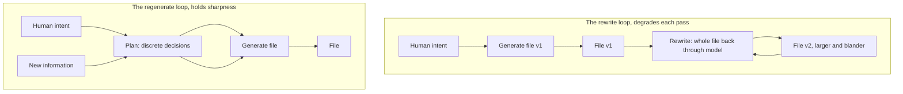

# Semantic Blur: Why Rewriting a Prompt File Degrades It

## Abstract

Three prompt files in this workspace were rewritten by a language model over the past three weeks. All three grew: by 18.7%, 43.6%, and 145.8% in characters, first version to latest, with no new capability that accounts for the growth. The growth is not steady accumulation. It concentrates in single commits labeled "refactor," each of which handed the model the whole file and asked it to improve it. This report measures the growth, isolates its mechanism, and states the fix.

The mechanism is regression toward the mean. A model asked to rewrite a file regenerates every token of it, and each regenerated token is drawn from the model's prior distribution of what a good document looks like. That prior favors completeness, justification, and formal register, which are the properties of average technical writing and the wrong properties for a compressed instruction set. Each rewrite is one pass through that prior, so each rewrite moves the file toward the average and away from the sharp, specific version a single generation can produce. The first version is sharp because it was generated once, conditioned on human intent; every rewrite after it is conditioned increasingly on the model's own prior output.

The fix follows from the mechanism. The design document, or plan, that produced a file is the artifact that must be preserved, because it holds the discrete decisions that survive translation while the continuous qualities of prose do not. Revise the plan and regenerate the file from it. Do not rewrite the file. One tool in the corpus, [architect.md](https://github.com/cppalliance/tools-public/blob/master/tools/architect.md), already prescribes exactly this for the documents it produces, and was itself degraded by the practice it forbids.

## Three prompt files grew 19 to 146 percent with no feature added

The observation that prompted this inquiry is qualitative and comes from an unrelated domain. Passing a photograph repeatedly through an image model's latent space and back, a round trip at a time, smooths it: colors regularize, textures average out, and detail migrates toward the model's idea of a typical image. The visible result at high pass counts is generic and oversaturated. The hypothesis under test here is that language models do the same thing to text, and that a prompt file rewritten several times shows the same drift toward the average.

The question this report answers is narrow and empirical. Across the three files, does model rewriting increase size and reduce specificity, and if so, by what mechanism and with what remedy? The analogy motivated the inquiry. It is not evidence for the conclusion; the git history is.

## Method

The corpus is three files under version control in `tools-public`: [tools/architect.md](https://github.com/cppalliance/tools-public/blob/master/tools/architect.md), [how-to/how-to-vibe-code.md](https://github.com/cppalliance/tools-public/blob/master/how-to/how-to-vibe-code.md), and [how-to/how-to-write-prompts.md](https://github.com/cppalliance/tools-public/blob/master/how-to/how-to-write-prompts.md). The last was created as `lessons/prompt-rulebook.md` and renamed, so its history was followed across the rename.

For every commit that touched each file, the file was extracted at that revision with `git show <sha>:<path>` and measured for line count, word count, and character count. Percentages are computed on characters, because line count understates growth when the model packs more words onto each line, and word count and character count agree to within a point across the corpus. Growth attributed to a single commit is the character delta between that commit and its parent for the file in question, taken from `git diff --stat`.

Qualifier density is the count of six connective patterns (`rather than`, `, because`, `, so`, `, which`, `Reason:`, `however`), case-insensitive, normalized per thousand words. It is a proxy for how much of the file explains itself rather than instructs, and it is reported with its known weakness stated in Limitations. Every number below is reproducible from the SHAs cited in the appendix.

## Results

### Every file grew, and the growth is large

All three files are larger at their latest revision than at their first, and none of the growth corresponds to a capability the file lacked before. Table 1 gives the totals.

**Table 1. Corpus growth, first version to latest (characters).**

| File | First | Latest | Growth | Commits | Span |
|---|---|---|---|---|---|
| `architect.md` | 49,831 | 59,128 | +18.7% | 4 | Jul 25-26 |
| `how-to-vibe-code.md` | 44,345 | 63,665 | +43.6% | 6 | Jul 25-26 |
| `how-to-write-prompts.md` | 10,612 | 26,089 | +145.8% | 8 | Jul 8-26 |

The prompt rulebook more than doubled. It began as 1,737 words of bullet-form rules and reached 4,325 words, a 149% increase in words against the 146% in characters.

### The growth concentrates in "refactor" commits

Growth does not accumulate evenly across commits. It arrives in bursts, and every burst coincides with a commit whose message describes a whole-file rewrite rather than a targeted change. Table 2 isolates the three largest single-commit jumps.

**Table 2. The commits that carried the growth.**

| Commit | Message | File | Single-commit growth | Ins/del lines |
|---|---|---|---|---|
| `1735c1a` | "Add new and update existing how-to" | `how-to-write-prompts.md` | +83.1% | 137 / 21 |
| `25bb2b3` | "Refactor architect and vibe coder" | `how-to-vibe-code.md` | +31.2% | 322 / 161 |
| `f3a7e9d` | "More refactoring" | `architect.md` | +15.8% | 73 / 47 |

One commit, `1735c1a`, added 83.1% to the prompt rulebook by appending two entirely new sections. One commit, `25bb2b3`, added 31.2% to the vibe coder. The insertion-to-deletion ratios distinguish two shapes of bloat: the rulebook grew by near-pure addition (137 inserted against 21 deleted), while the vibe coder churned heavily (322 inserted against 161 deleted), rewriting existing prose and adding to it in the same pass.

### Self-explanation rose in two files and fell in one

Qualifier density rose in `architect.md`, from 5.3 to 9.2 per thousand words, and in `how-to-write-prompts.md`, from 2.9 to 6.0. It did not rise in `how-to-vibe-code.md`, where it fell slightly, from 12.8 to 11.5. That file bloated without adding proportionally more rationale, because its growth came from new machinery, whole new sections of procedure, rather than from explaining existing rules. Rising self-explanation is one bloat path. It is not the only one, and the vibe coder took the other.

### A specific measurement was replaced by a general claim

The clearest single instance of smoothing is a substitution in the vibe coder. Version 1 justified reviewing code in a separate context with a measurement:

> a model asked to review its own work in the context that produced it does worse than not reviewing at all, moving GPT-4 on GSM8K from 95.5% to 91.5% after one round and 89.0% after two

Version 6 states the same rule this way:

> a model reviewing its own work in the context that produced it does worse than not reviewing at all, and models favor their own output when they can see it

The specific numbers left; a general assertion took their place. The sharp, checkable fact was sanded into a claim that reads well and cannot be verified. The file grew across the same revisions that removed the number.

### The terminal case

[tools/staker.md](https://github.com/cppalliance/tools-public/blob/master/tools/staker.md) shows where the process ends. It stands at 138,184 characters and 1,404 lines, against a median tool size of 31,049 characters across the 23 tools in the directory. It is more than four times the median and 40% larger than the next-biggest tool. Its pipeline runs 22 steps once sub-steps are counted, and much of its length is orchestration procedure, rules for dispatching sub-agents and concatenating files, rather than the stakeholder analysis the tool exists to perform. It is the high-pass-count image: still recognizable, every surface encrusted with detail added one pass at a time.

## Discussion: each rewrite resamples the whole file toward the mean

The results are consistent with one mechanism. A language model does not edit a file when asked to revise it. It regenerates the file, emitting a fresh token stream conditioned on the input. Every passage that survives unchanged in meaning still passed through the model and came back out, and on the way through it was redrawn from the model's probability distribution. That distribution is shaped by the model's training toward the center of what technical documents look like: complete, justified, formal, internally cross-referenced. Those are the qualities of good average writing. They are the wrong qualities for a prompt, which earns its keep by being a compressed, specific instruction set rather than a well-rounded document. Each rewrite is one pass through the center-seeking distribution, so each rewrite moves the file toward the center. This is the textual form of the image degradation that motivated the inquiry. The "refactor" commits in Table 2 are where it happened, because "refactor" is the instruction that hands the model the whole file and asks it to improve all of it at once.

The model's default answer to "should this document be more complete" is yes, so scope grows. Its default answer to "should this rule carry its reason" is yes, so `architect.md` and the rulebook accreted qualifiers. Its default answer to "should this pipeline handle one more edge case" is yes, so the vibe coder and the staker grew new machinery. None of these answers is wrong in isolation. Each makes the file a better document. Together they make it a worse prompt, because a prompt is paid for on every use and every added token competes for the model's attention.

### Why the first version is sharp

The obvious objection is that the first version is also generated in one pass through the same model, so it should be no sharper than any later one. The objection fails on what the two passes are conditioned on. The first generation is conditioned on human intent: a plan, a set of instructions, idiosyncratic phrasings, priorities stated in a person's own words. Human intent sits at the tail of the model's distribution, because a specific person's specific wants are not the average of the training data. Generating from that conditioning pulls the output toward the tail, and a single sample can land there. The first version is sharp because a person's intent was the strongest signal in the room.

Every rewrite weakens that signal. A rewrite is conditioned mostly on the previous version of the file, which is already a model-generated artifact sitting nearer the center, plus a small human instruction on top. The ratio of human signal to model signal in the input drops with each pass. By the third rewrite the model is largely reading its own prior output and lightly adjusting it, which is exactly the iterated-latent-space loop that smooths an image: each pass conditions on the last pass, and the original signal decays. Confidence in this account is high for this corpus, because it predicts both the growth and the specific-to-general substitution the results show; confidence that it generalizes to every model and file type is medium, resting on mechanism rather than on a wider sample.

### Why the plan file escapes the blur: decisions are discrete

The escape route is visible in what does and does not survive translation. A plan, or design document, holds decisions: build offline support, cap the options at three, handle the empty case this way. Decisions are discrete. A decision is either present in the plan or absent, and a person reading the plan can confirm each one. Passing a discrete decision through the model does not smooth it, the way passing a black-and-white line drawing through a blur barely changes it, because there is no continuous quality to average. What smooths under rewriting is the continuous dimension of prose: sentence length, qualifier density, word choice, register. The plan carries almost none of that. It is close to pure decision.

So the plan is a compression of intent into the dimension that resists blur. Generating a file from a plan fills in the continuous dimensions fresh, in a single pass that can reach the tail, while the discrete decisions constrain what gets written. Rewriting the generated file instead reopens the continuous dimensions to another averaging pass and, worse, reopens the decision space, letting the model add scope from its own prior. The two workflows are drawn below.

**Figure 1. Two revision loops.** In the rewrite loop, the generated file is the thing edited, so it re-enters the model every pass and drifts. In the regenerate loop, new information enters the plan, and the file is regenerated from the updated plan rather than edited, so each file is a fresh single pass constrained by preserved decisions.

## Limitations

The corpus is three files, all in one workspace, all rewritten by the same model family over three weeks. The mechanism is inferred from the pattern, not isolated by a controlled experiment; no rewrite here was run with generation temperature held fixed or with the plan reused as a control. Qualifier density is a coarse proxy: it counts six string patterns and cannot tell a load-bearing reason from filler, which is why one file's density fell while it bloated by another route. The character-growth figures are exact and reproducible; the causal story they support is a judgment. The image analogy is an analogy. It shaped the hypothesis and illustrates the mechanism, and it proves nothing on its own.

## Conclusion: preserve the plan, regenerate the artifact

The plan file is the original. The generated prompt is a build artifact, and it should be treated the way compiled output is treated: never edited by hand, always regenerated from source. When new information arrives, whether a better technique or an observed failure, it goes into the plan as a decision, and the file is regenerated from the updated plan in a fresh pass. This keeps the human-to-model signal ratio high, confines the model to the discrete dimension that resists blur, and gives every version the tail-reaching sharpness of a first generation. The recommendation is to recover and preserve the plans for the existing tools, and to route all future revision through the plan rather than through the file. Confidence: high, because it follows directly from the measured mechanism and is already the stated practice of one tool in the corpus.

That tool is the architect. It already states, in its own rules, that "a design that changes is regenerated from an updated plan," and that a review finding is resolved "by updating the plan and running it again, never by patching the document in place." The architect prescribes the cure and was denied it: it was revised by rewriting, and it grew 18.7% with a 15.8% jump in a single "More refactoring" commit. The discipline it demands of its outputs is the discipline its own maintenance needs.

---

*Supersedes the working note `analysis-prompt-bloat.md`, which was the rough draft of this inquiry.*

*2026-07-26 11:48 - Claude Opus 4.8 (Cursor agent)*

## Appendix: full version histories

Every revision of each file, extracted with `git show <sha>:<path>` and measured. Character count is the basis for all percentages in the body.

**A1. `architect.md`** (path `tools/architect.md` throughout).

| Ver | Commit | Date | Lines | Words | Chars |
|---|---|---|---|---|---|
| 1 | `0b33423` | Jul 25 17:06 | 717 | 8,557 | 49,831 |
| 2 | `004b1cb` | Jul 26 05:08 | 586 | 8,811 | 52,149 |
| 3 | `25bb2b3` | Jul 26 06:03 | 564 | 8,621 | 51,082 |
| 4 | `f3a7e9d` | Jul 26 09:19 | 590 | 9,982 | 59,128 |

**A2. `how-to-vibe-code.md`** (path `how-to/how-to-vibe-code.md` throughout).

| Ver | Commit | Date | Lines | Words | Chars |
|---|---|---|---|---|---|
| 1 | `1735c1a` | Jul 25 16:07 | 542 | 7,239 | 44,345 |
| 2 | `0b33423` | Jul 25 17:06 | 542 | 7,239 | 44,344 |
| 3 | `82cfccc` | Jul 25 20:41 | 544 | 7,517 | 46,016 |
| 4 | `004b1cb` | Jul 26 05:08 | 546 | 7,634 | 46,762 |
| 5 | `25bb2b3` | Jul 26 06:03 | 707 | 9,959 | 61,330 |
| 6 | `f3a7e9d` | Jul 26 09:19 | 711 | 10,351 | 63,665 |

**A3. `how-to-write-prompts.md`** (path `lessons/prompt-rulebook.md` for versions 1-5, renamed to `how-to/how-to-write-prompts.md` at version 6).

| Ver | Commit | Date | Lines | Words | Chars |
|---|---|---|---|---|---|
| 1 | `9540524` | Jul 8 | 113 | 1,737 | 10,612 |
| 2 | `3d766ee` | Jul 13 | 114 | 1,823 | 11,208 |
| 3 | `aaea8ff` | Jul 14 | 116 | 2,048 | 12,503 |
| 4 | `1befcb4` | Jul 14 | 124 | 2,166 | 13,214 |
| 5 | `557a5f4` | Jul 21 | 125 | 2,272 | 13,835 |
| 6 | `6d7f771` | Jul 22 | 125 | 2,272 | 13,835 |
| 7 | `1735c1a` | Jul 25 | 241 | 4,187 | 25,329 |
| 8 | `004b1cb` | Jul 26 | 244 | 4,325 | 26,089 |
