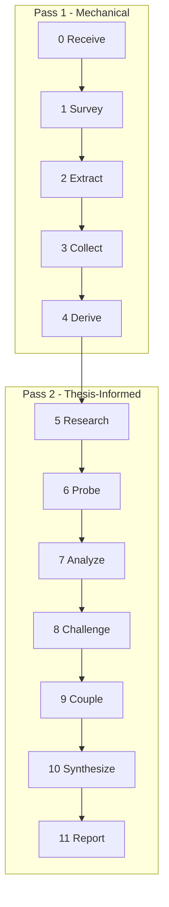
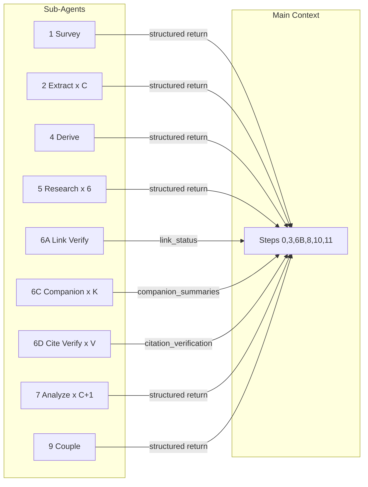

# Assay

Technical analysis tool for WG21 proposals. Two-pass architecture: Pass 1 extracts mechanically without a thesis. Derive compresses claims into the thesis. Pass 2 re-scans chunks with the thesis and cross-chunk breadcrumbs injected, simulating whole-document analysis. Six lenses: Performance, Design, Specification, Usability, Ecosystem, Rationale. The pipeline: survey, extract, collect, derive, research, probe, analyze, challenge, couple, synthesize, report.


---

## Commands

- **Assay [path]** - run the full pipeline on a WG21 paper. Path is required. Output location is determined by the workspace's ambient filing rules.
- **Assay [path] [output-dir]** - run with a custom output directory.

---

## Scope Boundaries

Assay performs structural analysis of a WG21 proposal's internal logic. It evaluates whether claims are supported, evidence is sufficient, gaps exist, contradictions appear, and the argumentative structure is sound.

Assay does NOT evaluate:

- **Political viability** - whether the committee will adopt the proposal
- **Technical correctness** - whether the proposed feature is a good idea
- **Completeness** - whether the paper covers everything it should (only whether it covers what it promises)
- **Style** - whether the writing is clear or well-organized

---

## Hard Constraints

- Paper text NEVER enters the main context. All paper access through sub-agents using ReadFile.
- No intermediate files. Sub-agents return structured results directly.
- Main context is a pure analytical engine operating on structured artifacts.
- Serial execution. One sub-agent at a time.
- No sub-agent reads the entire paper for analytical purposes. Survey scans for structure. Extract and Analyze read bounded chunks.

---

## Definitions

Terms used across multiple steps. Defined once here, referenced everywhere.

- **Lens order.** Performance, Design, Specification, Usability, Ecosystem, Rationale. This order is used for report section ordering and tie-breaking.
- **Load-bearing claim.** A claim is load-bearing if the paper's thesis cannot hold without it. Test: if the claim were retracted, would the central argument break? If yes, load-bearing. If the argument could stand with the claim removed, not load-bearing. In Pass 1 (Step 2), load-bearing status is unknown because the thesis has not been derived. In Pass 2 (Step 7), load-bearing claims are explicitly identified by Step 4 (Derive).
- **Touches the thesis.** A finding or breadcrumb touches the thesis if its quote, explanation, or gap references the same subject, mechanism, entity, or property that `derive.central_claim` or `derive.problem_statement` names. If the item addresses a different subject entirely, it does not touch the thesis regardless of severity. This test is not available until after Step 4.
- **Verdict scale.** Four values, in order of severity:
  - **Sound** - Zero critical and zero significant findings survived challenge. The thesis holds. The paper can proceed as written.
  - **Weakened** - At least one critical or significant finding survived, but no finding directly contradicts the thesis. The paper needs revision but the direction is viable.
  - **Undermined** - A surviving finding or compound dynamic directly contradicts the thesis, or the dominant dynamic attacks the central argument. The paper needs fundamental rework.
  - **Insufficient** - The paper lacks enough evidence or structure to assess. Not wrong, just incomplete. Typical for very early-stage papers or papers with no thesis.
- **Severity calibration by ask type.** The paper's ask type (from `collect.asks` in Step 3) sets the evidence bar:
  - **adopt** - Every load-bearing claim must have evidence at `prototype` tier or above. Gaps at any severity generate findings.
  - **direction** - Only load-bearing claims require evidence. Gaps at critical or significant severity generate findings. Minor gaps noted but do not generate findings.
  - **review / poll / feedback** - Only critical gaps that touch the thesis generate findings.
  - **inform** - No severity calibration. Analyze as-is.
  - If multiple ask types exist, use the most demanding one.
- **Pass 1 severity.** In Step 2, the thesis is unknown. Breadcrumb severity uses only the section heuristic:
  - **significant** - The gap concerns a topic the paper dedicates at least one full section or subsection to.
  - **minor** - The gap concerns a topic the paper mentions only in passing (a sentence or two, not a section).
  - **critical** is NOT assigned in Pass 1. After Step 4 (Derive) returns the thesis, the main context upgrades breadcrumbs whose gaps touch the thesis to critical.

---

## Progress Reporting

Every step that produces output reports one generated sentence to the user specific to its findings. No templates. No fill-in-the-blank. The sentence is calculated from the actual results and states the most important thing found.

---

## Pipeline



---

## Operational Directive

Injected verbatim into every sub-agent prompt:

> OPERATIONAL DIRECTIVE: If you must deviate from these instructions to accommodate the input, emit a deviation field in your return: `{deviation: string, severity: low | medium | high}`. A deviation is any case where you cannot follow an instruction as written. Low: cosmetic (e.g., heading format differs). Medium: structural (e.g., chunk boundary falls mid-sentence). High: analytical (e.g., cannot identify a thesis). If no deviation, omit the field.

---

## Step 0. Receive

The tool's entry point. Minimum-viable input: one file path to a WG21 paper. Optional: output directory (default determined by the workspace's ambient filing rules). Ask once for the missing required input. Accept silence on optionals.

Validate the file exists using ReadFile on the first few lines. If missing, report and stop.

Store the path. Do not read the paper. All paper access goes through sub-agents from this point forward.

**Output: `receive`**

```yaml
receive:
  paper_path: string (validated, absolute)
  output_dir: string (resolved)
```

---

## Step 1. Survey

*Sub-agent. Mechanical. Context: (S).*

**Input:** `receive.paper_path`

Sub-agent receives the paper file path. Uses ReadFile. Performs two tasks:

1. **Front matter extraction.** Read the file header for document metadata.
2. **Structural scan.** Identify every line that starts with `#` or `##` (top-level and second-level markdown headings only). Headings at `###` or deeper are intra-chunk content, not chunk boundaries. Record each qualifying heading's text and line number. Compute chunk boundaries: each qualifying heading starts a chunk, ending at the line before the next qualifying heading (or end of file). Estimate token count per chunk as `(end_line - start_line) * 4`. This is mechanical pattern matching, not analysis.

No thesis extraction. No analysis of body text. The sub-agent reads the full file but only extracts structure and metadata.

**Output: `survey`**

```yaml
survey:
  front_matter:
    document: string
    title: string
    date: string
    audience: string[]
    authors: string[]
  chunk_map:
    - index: int
      heading: string
      start_line: int
      end_line: int
      token_est: int
```

---

## Step 2. Extract - Pass 1

*C sub-agents (one per chunk), serial. Mechanical. Context: (M).*

**Input per sub-agent:** `receive.paper_path`, one entry from `survey.chunk_map` (line range + heading)

One sub-agent per chunk, run serially. No thesis available. Extraction is mechanical.

Sub-agent prompt: "Read lines {start_line} to {end_line} of {paper_path} using ReadFile. Extract items from that range. For each item where evidence is missing, contradicted, or absent, emit a breadcrumb."

Each sub-agent returns exactly:

```yaml
chunk_index: int
items:
  - type: claim | evidence | concession | question | dependency | scope
    subtype: string
    quote: string (verbatim from paper)
    line: int
    quality_tier: field_experience | implementation | prototype | example | assertion | citation_only | null
breadcrumbs:
  - chunk_index: int
    item_quote: string
    line: int
    gap: string (one sentence)
    why_important: string (one sentence)
    primary_lens: Performance | Design | Specification | Usability | Ecosystem | Rationale
    secondary_lens: Performance | Design | Specification | Usability | Ecosystem | Rationale | null
    severity: significant | minor
asks:
  - quote: string (verbatim from paper)
    line: int
    target: string
    type: adopt | direction | review | poll | feedback | inform
references:
  - ref_label: string | null (reference number/label, e.g., "[12]", or null for unlabeled hyperlinks)
    text: string (display text of the link or citation)
    url: string | null (resolved URL, or null for non-electronic sources)
    line: int
    context: string (one sentence: what the paper says about this reference at this location)
    relationship: companion | predecessor | dependency | citation | background | tool
```

### Reference extraction rules

- Emit one entry for every hyperlink, footnote marker, or `[N]` citation found in the chunk.
- `relationship` is a first-pass classification based on surrounding text: "companion paper" -> companion, "see [X] for..." -> dependency, `[N]` in a references section -> citation, GitHub/Godbolt links -> tool.
- A reference with no URL gets `url: null` (book, talk, private communication).
- Same reference appearing in multiple chunks produces one entry per chunk. Dedup happens in Step 3.
- Most chunks emit 0-3 references. The References section chunk typically emits one per listed reference.

### Ask rules

- Emit an ask ONLY when the chunk explicitly requests something from the committee or a working group. "We propose..." counts. "It would be nice if..." does not.
- Type meanings: **adopt** = merge into the working draft or standard. **direction** = explore this approach further. **review** = examine wording or design. **poll** = take a straw poll. **feedback** = general input requested. **inform** = paper explicitly states it asks for nothing.
- Most chunks emit zero asks. Typically 1-3 asks per paper, concentrated in the introduction or a dedicated "Proposal" / "Polls" section.
- An "inform" ask is emitted only if the paper explicitly says it asks for nothing (e.g., "This paper is informational and asks for no action").

### Evidence quality tiers

Required for all evidence items. Null for non-evidence items.

- `field_experience` - deployed usage with feedback from disinterested parties
- `implementation` - working implementation exists (compiler, library) but no external feedback reported
- `prototype` - proof-of-concept, partial implementation, or local fork
- `example` - motivating code examples showing usage but no running implementation
- `assertion` - claim about a property without supporting data or code
- `citation_only` - references another source without reproducing the evidence

The sub-agent reads the evidence sentence and classifies it. This is sentence-level, verifiable.

### Item subtypes

| type | subtypes |
|------|----------|
| claim | factual, normative |
| evidence | benchmark, complexity, implementation, example, citation, formal, comparative, precedent |
| concession | limitation, disclaimer, deferral, tradeoff, open_question |
| question | (no subtype) |
| dependency | (no subtype) |
| scope | declaration, boundary |

### Citation-specific fields

Required when subtype = citation. These fields are added to the standard item fields:

```yaml
ref_label: string (reference number/label, e.g., "[12]")
claimed_content: string (what the paper claims this reference says)
source_hint: string (URL, wg21.link, book title, or "non-electronic")
```

### Breadcrumb rules

- Not every item gets a breadcrumb. Only items where evidence is missing (the paper makes a claim but provides no supporting data or example), contradicted (the paper's own text elsewhere says the opposite), or absent (a necessary piece of the argument is not addressed at all).
- The gap sentence must name the specific absence: "No complexity analysis supports this bound" not "This could be stronger." If you cannot name the specific thing that is missing, do not emit a breadcrumb.
- The why_important sentence must connect the gap to a claim or argument in the chunk.
- Severity uses Pass 1 rules (see Definitions): **significant** if the gap concerns a topic the paper dedicates a full section to; **minor** if mentioned in passing. No critical in Pass 1.
- primary_lens: the lens whose test checklist (tests 1-25) the gap most closely matches. If the gap does not match any test, assign the lens whose domain the gap falls in. Required.
- secondary_lens: if the gap spans two lenses, the second lens. Optional (null if single-lens). Cap at one secondary.
- A chunk with no gaps emits zero breadcrumbs. This is normal.

No cross-chunk context. No narrative. Named fields only.

**Output: per-chunk returns (aggregated in Step 3)**

---

## Step 3. Collect

*Main context. No sub-agent.*

**Input:** all Step 2 returns

### A. Aggregate items

Assign a sequential ID to each item after dedup (e.g., C1, C2 for claims; E1, E2 for evidence). These IDs are referenced by Step 4 (load-bearing claims) and carried through the rest of the pipeline.

- Claims: exact-match dedup on quote text, then semantic dedup. Two claims are semantic duplicates if they assert the same proposition about the same subject (e.g., "the algorithm is O(1)" and "lookup runs in constant time"). If unsure whether two claims are duplicates, keep both.
- Evidence: exact-match dedup on quote text. Keep all non-duplicate evidence even if it supports the same claim.
- Concessions: exact-match dedup on quote text.
- Questions: exact-match dedup on text.
- Dependencies: exact-match dedup on text.
- Scope: collect all scope items. For each `declaration` item, check whether any evidence or claim in the collected items addresses that declared scope topic. Mark as `covered` if at least one item addresses it, `gap` if none do.

### B. Group breadcrumbs by lens

Sort breadcrumbs into 6 buckets (Performance, Design, Specification, Usability, Ecosystem, Rationale). Each breadcrumb goes into its primary_lens bucket. If it has a secondary_lens, it also goes into that bucket (same breadcrumb, two buckets).

### C. Aggregate asks

Collect all asks from all chunks. Dedup on quote.

### D. Decide active lenses

A lens is active if it received at least one breadcrumb. Only active lenses inform Step 7 chunk sub-agent prompts. Inactive lenses are reported to the user.

**Exception: Rationale is always active.** The SD-4 mechanical checklist runs regardless of breadcrumbs.

### E. Build reference registry

Merge all per-chunk `references` into a deduped registry keyed by `ref_label`:

- Dedup on `ref_label`. Merge `contexts` and `chunk_appearances` across chunks.
- Relationship conflict: if the same reference appears as `companion` in one chunk and `citation` in another, the highest tier wins. Tier order: companion > predecessor > dependency > citation > background > tool.
- `same_author`: true if any author in `survey.front_matter.authors` appears in the reference text.
- `mention_count`: total number of per-chunk entries before dedup.

**Output: `collect`**

```yaml
collect:
  items:
    claims: {id, quote, line, kind: factual | normative}[]
    evidence: {id, quote, line, subtype, quality_tier}[]
    concessions: {id, quote, line, subtype}[]
    questions: {id, text, chunk}[]
    dependencies: {id, text, chunk}[]
    scope_coverage: {topic, status: covered | gap}[]
  breadcrumbs_by_lens:
    Performance: breadcrumb[]
    Design: breadcrumb[]
    Specification: breadcrumb[]
    Usability: breadcrumb[]
    Ecosystem: breadcrumb[]
    Rationale: breadcrumb[]
  asks: {quote, line, target, type}[]
  active_lenses: string[]
  inactive_lenses: string[]
  reference_registry:
    - ref_id: string (sequential: R1, R2, ...)
      ref_label: string
      url: string | null
      source_type: paper | repository | tool | talk | book | website | non_electronic
      contexts: string[]
      chunk_appearances: int[]
      relationship: companion | predecessor | dependency | citation | background | tool
      same_author: bool
      mention_count: int
```

---

## Step 4. Derive

*Sub-agent. Analytical. Context: (M).*

**Input:** `collect.items.claims`, `collect.items.evidence` (with quality tiers), `collect.items.scope_coverage`, `collect.asks`, `survey.chunk_map`

One sub-agent. Receives all collected claims and evidence. Performs three tasks:

1. **Thesis compression.** Read all claims. Compress them into one sentence: the central thesis. This is what the paper actually argues, derived bottom-up from its claims, not from what the introduction says.
2. **Load-bearing identification.** For each claim, test: if this claim were retracted, would the central thesis break? Mark load-bearing claims by ID and quote.
3. **Scope derivation.** Compare the chunk_map headings against the scope_coverage list. Derive what the paper does and does not cover.

**Thesis derivation rules:**

- The thesis is derived from claims, not from the introduction. It is what the paper argues, not what it says it argues.
- If the claims cohere around a single proposition, that is the thesis.
- If the claims split into two independent propositions, pick the one supported by more claims. Note the other in `scope_boundary`.
- If fewer than 3 claims were extracted, set `central_claim` to "Insufficient claims to derive thesis" and tag a deviation.

Returns exactly:

```yaml
derive:
  central_claim: string (one sentence)
  problem_statement: string (one sentence)
  scope_boundary: string
  load_bearing_claims: {id, quote}[]
  ask_calibration: adopt | direction | review | poll | feedback | inform
```

**After Derive returns, main context upgrades breadcrumbs:**

For each breadcrumb in `collect.breadcrumbs_by_lens` with severity `significant` or `minor`: check if the breadcrumb's `gap` touches the thesis (see Definitions). If yes, upgrade severity to `critical`. This is a mechanical string-matching check in the main context.

**Output: `derive`** (as above, plus upgraded breadcrumbs in `collect`)

---

## Step 5. Research

*6 sub-agents (one per lens), serial. Mechanical. Context: (S).*

**Input per sub-agent:** `survey.front_matter.document`, `survey.front_matter.title`, `survey.front_matter.authors`, `derive.central_claim`, `derive.scope_boundary`

Always-on. Six sub-agents, one per lens, run serially. Each uses WebSearch to find external technical context relevant to its lens. Uses the real thesis from Derive.

### Search discipline

Applies to every research sub-agent:

- **Budget**: 3 WebSearch calls maximum per sub-agent. First search is broad (paper topic + lens keyword). Second narrows based on first results. Third targets a specific gap. No fourth search.
- **Relevance gate**: After each search, ask: "Does this result contain concrete technical data (benchmarks, design outcomes, wording precedent, implementation status, practitioner feedback) relevant to the paper's thesis?" If no, discard. Do not chase tangents.
- **Stop early**: If the first 2 searches return nothing relevant, stop. Return empty fields. "Nothing found" is a valid and useful result.
- **Convergence**: Stop as soon as you have 3 or more relevant findings. More is not better.
- **Return only direct hits**: Every finding must connect to the paper's thesis or scope. "Interesting but tangential" is discarded before it leaves the sub-agent.

### Per-lens sub-agents

**Performance** searches for: benchmarks, implementation experience reports, known performance pitfalls in similar designs.

Returns: `{lens: Performance, benchmarks: [{source, finding, relevance}], implementation_data: [{source, finding}], pitfalls: [{source, finding}]}`

**Design** searches for: predecessor WG21 proposals and outcomes, design rationale discussions, how other languages solved the same problem.

Returns: `{lens: Design, prior_proposals: [{paper_id, title, relationship, outcome, note}], design_discussions: [{source, summary, stance}], other_languages: [{language, feature, outcome}]}`

**Specification** searches for: related normative wording, defect reports against similar wording, working group discussion of specification patterns.

Returns: `{lens: Specification, related_wording: [{source, finding}], defect_reports: [{source, finding, relevance}], wording_patterns: [{source, finding}]}`

**Usability** searches for: practitioner discussion, usage patterns and ergonomics feedback, teaching/learning complexity barriers.

Returns: `{lens: Usability, practitioner_signal: [{source, demand, finding}], ergonomics_data: [{source, finding}], learning_barriers: [{source, finding}]}`

**Ecosystem** searches for: related proposals in flight, existing implementations/prototypes, tooling readiness.

Returns: `{lens: Ecosystem, related_in_flight: [{paper_id, title, interaction}], implementations: [{name, status, note}], tooling: [{tool, support, note}]}`

**Rationale** searches for: committee direction documents (P0939, direction group opinions), committee reception of predecessor proposals, political dynamics.

Returns: `{lens: Rationale, direction_signals: [{source, finding, relevance}], committee_reception: [{paper_id, finding, source}], political_context: [{source, finding, stance}]}`

All research sub-agents may incidentally surface cross-proposal conflicts or committee political context. These findings are tagged and passed to chunk sub-agents in Step 7 but carry no completeness guarantee. The tool does not perform systematic cross-proposal landscape analysis.

**Output: `research`**

```yaml
research:
  Performance: (sub-agent return)
  Design: (sub-agent return)
  Specification: (sub-agent return)
  Usability: (sub-agent return)
  Ecosystem: (sub-agent return)
  Rationale: (sub-agent return)
```

---

## Step 6. Probe

*Sub-agents (phased), serial. Mechanical + Analytical. Context: varies by phase.*

**Input:** `collect.reference_registry`, `collect.items.evidence` (where subtype = citation), `derive.central_claim`

Four phases. Each phase builds on the prior.

### Phase A: Link Verification

*1 sub-agent. Mechanical. Context: (S).*

For WG21 papers, the sub-agent fetches `wg21.link/index.json` once to resolve all paper URLs in bulk (provides direct `long_link` URLs, bypassing the triple-hop redirect chain). Non-WG21 URLs are checked individually via WebFetch or Shell `curl -I -L`. Non-electronic sources are marked without checking.

```yaml
link_status:
  - ref_id: string
    url: string
    status: live | dead | redirect | auth_required | non_electronic
    resolved_url: string | null
```

### Phase B: Relevance Ranking

*Main context. No sub-agent.*

Rank all references by tier, then by `mention_count` descending within tier. The ranking determines which references get deep reads in Phase C.

Tiers (collapses CiTO's ~40 properties and NISO STS's ~10 types into 6 for standards papers):

- **companion** - explicitly declared companion paper ("companion paper", "design rationale paper")
- **predecessor** - prior revision or predecessor proposal by overlapping authors
- **dependency** - paper this proposal builds on or requires (maps to ISO/IEC normative reference)
- **citation** - cited for a specific technical claim, benchmark, or design decision
- **background** - contextual reference (talks, blog posts, documentation, standards text; maps to ISO/IEC informative reference)
- **tool** - implementation reference (GitHub repos, Compiler Explorer links)

### Phase C: Companion Ingestion

*K sub-agents (max 3), serial. Analytical. Context: (L).*

For the top companion-tier references only (max 3, predecessors excluded), spawn a sub-agent. Depth 1 only - if a companion defers to its own companion, do not follow.

Each sub-agent:

1. Reads the companion via fallback chain: workspace file (ReadFile) > HTML URL (WebFetch) > `wg21.link/index.json` resolved URL > WebSearch for content > mark not_accessible.
2. Extracts structured summary using per-section extraction (not full-document stuffing - mid-context content is lost). Scan headings, extract per-section, merge.
3. For each "see [companion] for X" in the main paper's `contexts` (from `collect.reference_registry`), records X as a deferred topic and checks whether the companion delivers it.
4. Raw companion text never enters the main context.

Each sub-agent returns exactly:

```yaml
companion_summary:
  ref_id: string
  title: string
  thesis: string
  key_claims: string[]
  evidence_items:
    - quote: string
      quality_tier: field_experience | implementation | prototype | example | assertion | citation_only
      relevance: string (one sentence connecting to main paper's thesis)
  deferred_topics:
    - topic: string
      delivered: true | partial | false
      detail: string | null (one sentence: what the companion provides, or what is missing)
  scope: string
```

Deferred topic delivery meanings:

- **true** - the companion dedicates a section or substantial paragraph to the topic with evidence
- **partial** - the companion addresses the topic but without sufficient evidence or in passing only
- **false** - the companion does not address the topic despite the main paper's deferral

### Phase D: Citation Claim Verification

*V sub-agents (batched), serial. Mechanical. Context: (L).*

Migrated from the former Verify step. Citations already covered by Phase C companion ingestion are skipped. Remaining citation items from `collect.items.evidence` where subtype = citation are grouped into batches of up to 4 per sub-agent. Skip citations with source_hint = "non-electronic" (mark as "not_verifiable").

Each sub-agent receives a batch. For each citation:

1. Resolve the source: ReadFile for workspace paths, WebFetch for URLs/wg21.link
2. Find the relevant section of the source
3. Check whether the source supports the paper's claimed_content
4. Return a structured result

Each sub-agent returns exactly:

```yaml
citations:
  - ref_label: string
    claimed_content: string
    resolution: verified | mismatch | not_found | not_accessible | not_verifiable
    actual_content: string | null
    quote_match: bool | null
    notes: string | null
```

Resolution meanings:

- **verified** - source found, claim matches
- **mismatch** - source found, claim does not match (HIGH SIGNAL - feeds Step 7)
- **not_found** - URL/path returned 404 or file not in workspace
- **not_accessible** - source requires authentication or is paywalled
- **not_verifiable** - non-electronic source (book, talk, private communication)

Citation mismatches are passed to Step 7 chunk sub-agents as high-signal input.

### Combined Output: `probe`

```yaml
probe:
  link_status: (Phase A results)
  relevance_ranking: (Phase B tier-sorted reference list)
  companion_summaries: (Phase C returns, merged)
  citation_verification: (Phase D returns, merged)
  deferred_topics:
    - topic: string
      deferred_to: string (ref_label of the companion)
      delivered: true | partial | false
      detail: string | null
  counts:
    total_refs: int
    live: int
    dead: int
    companions_read: int
    verified: int
    mismatch: int
    not_found: int
    not_accessible: int
    not_verifiable: int
    deferred_total: int
    deferred_delivered: int
    deferred_partial: int
    deferred_false: int
```

---

## Step 7. Analyze - Pass 2

*C+1 sub-agents (C per-chunk + 1 Rationale), serial. Analytical. Context: (L) per-chunk, (L+) Rationale.*

### Per-chunk sub-agents

**Input per chunk sub-agent:**

- `receive.paper_path` + line range from `survey.chunk_map` (same chunks as Pass 1)
- `derive.central_claim`, `derive.problem_statement`, `derive.scope_boundary`, `derive.load_bearing_claims`
- `derive.ask_calibration` (severity calibration by ask type - see Definitions)
- Breadcrumbs from ALL OTHER chunks (all entries in `collect.breadcrumbs_by_lens` except those with this chunk's `chunk_index`, with severity upgrades applied after Step 4)
- `research` (all 6 lens returns from Step 5)
- `probe.citation_verification` filtered to citations whose `ref_label` appears in this chunk
- `probe.companion_summaries` (all - companions inform every chunk)
- `probe.deferred_topics` (all - deferred topics inform gap analysis)
- The 25 test patterns (see below)

One sub-agent per chunk, run serially. Each sub-agent reads its chunk text again via ReadFile. Now it has what Pass 1 lacked: the thesis, cross-chunk breadcrumbs, research context, citation verification results, companion summaries, and deferred-topic delivery status.

**The sub-agent's task:** Read the chunk. For each item in the chunk, check against the thesis and cross-chunk breadcrumbs. Apply the 25 test patterns. Produce findings and strengths.

A breadcrumb from another chunk might be RESOLVED by evidence in this chunk (the cross-chunk gap is filled) or REINFORCED (this chunk has the same problem). Either outcome is valuable.

**Deferred-topic severity rules** (consistent with GRADE indirectness framework): When a finding targets a topic the paper explicitly defers to a companion, and that companion was read in Phase C:

- `delivered: true` - downgrade finding severity by one tier (critical -> significant, significant -> minor, minor -> suppressed). The argument chain is intact across the pair.
- `delivered: partial` - no change. The companion addresses the topic but incompletely; the finding stands at its original severity.
- `delivered: false` - upgrade finding severity by one tier. The paper deferred a promise the companion does not keep.

Each sub-agent returns exactly:

```yaml
chunk_index: int
findings:
  - title: string
    lens: Performance | Design | Specification | Usability | Ecosystem | Rationale
    severity: critical | significant | minor
    quote: string (verbatim from paper)
    line: int
    explanation: string (2-4 sentences)
    test: string (test number and name, or "novel")
    from_breadcrumb: bool
    external_evidence: string | null
    examiner: string
    damage: string (1-2 sentences)
    confidence: high | medium | low
strengths:
  - title: string
    lens: Performance | Design | Specification | Usability | Ecosystem | Rationale
    quote: string (verbatim from paper)
    line: int
    explanation: string (1-2 sentences)
```

### Examiner rules

The examiner names a committee role, not a person. Choose from: implementer, specification reviewer, library author, application developer, performance engineer, educator, or a specific domain specialist (e.g., "coroutine ABI specialist", "allocator-aware container author"). Do not name individuals. Do not invent hypothetical roles.

### Damage rules

Damage describes the structural consequence to the paper's internal logic. Name which specific claim, section, or argument chain breaks. Do not speculate about committee reception, voting outcomes, or political consequences.

### Confidence rules

Confidence reflects the finding's evidentiary basis, not its severity.

- **high** - The finding is supported by a direct quote AND a verifiable absence (no evidence exists in the paper for a specific claim, or the paper's own text contradicts itself).
- **medium** - The finding is supported by a quote but the absence requires cross-chunk inference (evidence might exist elsewhere, but cross-chunk breadcrumbs confirm it is absent).
- **low** - The finding is interpretive. The quote exists but the weakness is a matter of degree, not a binary absence.

### Strength rules

A strength is a claim that meets all three conditions: (1) at least one evidence item with `quality_tier` at `example` or above is linked to it, (2) no breadcrumb targets it, (3) it is load-bearing (its quote appears in `derive.load_bearing_claims`). Not every solid claim is a strength - only load-bearing ones.

### Performance routing keywords

For identifying Performance-relevant items in the chunk (case-insensitive): speed, fast, slow, efficient, efficiency, overhead, cost, latency, throughput, bandwidth, O(, complexity, compile-time, runtime, memory, allocation, cache, performance, scalable, scalability.

---

### Test Checklists

The 25 tests are guidance for each sub-agent. Apply whichever tests are relevant to items in the chunk. Novel gaps not covered by any test are also valid findings.

**Performance (tests 1-4):**

1. **Unsupported Performance Claim** - claim about speed/efficiency/overhead has no evidence
2. **Single-Vendor Benchmark** - benchmark data from one compiler/platform/config only
3. **Missing Complexity Analysis** - algorithm or data structure proposed without O() bounds
4. **Benchmark Without Baseline** - measurements without comparison to status quo

**Design (tests 5-8):**

5. **Undelivered Design Goal** - scope promise with no delivery evidence
6. **Internal Contradiction** - claims that contradict each other (cross-chunk breadcrumbs are key here)
7. **Unstated Assumption** - premise relied on but never established
8. **Promise-vs-Delivery Gap** - introduction promises what body does not address

**Specification (tests 9-12):**

9. **Naming Inconsistency** - different names for same entity across chunks (cross-chunk breadcrumbs are key here)
10. **Missing Normative Requirement** - wording lacks Mandates/Preconditions/Effects
11. **Undefined Behavior Gap** - new behavior without error case specification
12. **Feature Test Macro** - behavioral changes without `__cpp_` macro bump

**Usability (tests 13-16):**

13. **Concept Overload** - basic usage requires 4+ named concepts
14. **Missing Convenience API** - common tasks need multi-step boilerplate
15. **Pit of Despair** - easiest API usage is wrong/dangerous/inefficient
16. **Missing Migration Path** - deprecation without transition guidance

**Ecosystem (tests 17-20):**

17. **Essential Facility Omitted** - omitted facility that domain practitioners need
18. **Companion Dependency** - depends on unadopted proposal
19. **Backward Compatibility** - behavior change without impact analysis
20. **Incomplete Interop** - new facility without interaction analysis for related features

**Rationale (tests 21-25):**

21. **Example Deficit** - paper lacks motivating code showing a problem today and improvement with the feature
22. **Principle Deficit** - paper does not articulate design principles or connect to C++ philosophy / D&E
23. **Alternative Deficit** - no alternatives section, or alternatives dismissed without concrete examples or reasons
24. **Cost Blindness** - paper does not address at least 3 of: committee time, implementation burden, documentation cost, teaching cost, backward compatibility impact
25. **Beneficiary Vagueness** - paper claims benefit for "users" or "developers" without naming specific use cases or stakeholder types

---

### Rationale sub-agent

**After all C per-chunk sub-agents complete, spawn 1 Rationale sub-agent.**

**Input:**

- `survey.chunk_map` (section headings and line ranges)
- `collect.items` (all claims, all evidence with quality_tier, all scope_coverage)
- `derive` (central_claim, scope_boundary, load_bearing_claims, ask_calibration)
- `collect.asks`
- `research.Rationale` (from Step 5)

**Task:** Two-layer assessment.

Layer 1: SD-4 mechanical checklist. Five yes/no items, each pointing to a specific section heading in `chunk_map` (or noting absence).

Layer 2: Quality findings with confidence tags. Fires when a checklist item passes structurally but the content is shallow. A checklist item's content is **shallow** if: the section exists but contains fewer than 3 sentences in the collected items from that chunk, OR the content is generic (could apply to any paper without modification). A checklist item with paper-specific content (names concrete alternatives, cites specific principles, shows actual code) is not shallow.

The Rationale sub-agent also assesses evidence sufficiency using quality tiers and the severity calibration by ask type from Definitions.

Returns:

```yaml
checklist:
  - id: SD4-1
    name: Motivating Examples
    pass: bool
    location: string | null (section heading or "absent")
    note: string | null (one sentence)
  - id: SD4-2
    name: Design Principles
    pass: bool
    location: string | null
    note: string | null
  - id: SD4-3
    name: Alternatives Considered
    pass: bool
    location: string | null
    note: string | null
  - id: SD4-4
    name: Cost Acknowledgment
    pass: bool
    location: string | null
    note: string | null
  - id: SD4-5
    name: Beneficiary Identification
    pass: bool
    location: string | null
    note: string | null
findings: (same format as per-chunk findings, lens = Rationale)
strengths: (same format as per-chunk strengths, lens = Rationale)
```

This checklist is extensible. Future versions may add SD-9 (library policies), SD-10 (EWG principles), or domain-specific checklists. The `id` prefix disambiguates the source.

### Aggregation

After all C+1 sub-agents complete, merge results:

**Output: `analyze`**

```yaml
analyze:
  findings: (all per-chunk findings + Rationale findings, merged)
  strengths: (all per-chunk strengths + Rationale strengths, merged)
  checklist: (from Rationale sub-agent)
```

---

## Step 8. Challenge

*Main context. No sub-agent.*

**Input:** `analyze.findings`, `collect.items.concessions`, `derive.scope_boundary`, `collect.items.evidence`

Collect all findings from Step 7. Apply three kill filters, in order. First kill stops evaluation for that finding.

1. **Concession check.** A concession kills a finding if and only if the concession names the same specific weakness that the finding names. Test: does the concession's quote, read on its own, describe the same problem the finding describes? If yes, killed. A concession that discusses the same topic area but does not name the specific weakness does not kill. Example: a concession "We have not measured compile-time overhead" kills a finding "No compile-time benchmark provided." It does NOT kill "The compile-time model assumes constant-time lookup without evidence."

2. **Boundary check.** The finding attacks something outside the paper's declared scope? Killed. Match against `derive.scope_boundary`. If the finding's subject is not mentioned in the scope boundary, it is in-scope by default (the paper implicitly covers what it discusses).

3. **Falsification.** An evidence item from `collect.items.evidence` kills a finding if the evidence, taken at face value, directly contradicts the finding's explanation. The evidence must address the specific claim the finding attacks, not merely the same topic. Partial evidence (addresses only part of the finding) does not kill. Example: if a finding says "No benchmark exists for the hash function" and evidence item E7 contains a benchmark for the hash function, killed. If E7 contains a benchmark for a different function in the same paper, not killed.

Killed findings reported to user with reason. Surviving findings proceed.

**Output: `challenge`**

```yaml
challenge:
  surviving:
    - (finding from Step 7, unchanged)
  killed:
    - finding_title: string
      lens: string
      kill_reason: conceded | out_of_scope | falsified
      detail: string (one sentence)
  counts:
    total: int
    survived: int
    killed_conceded: int
    killed_boundary: int
    killed_falsified: int
```

---

## Step 9. Couple

*Sub-agent. Analytical. Context: (S).*

**Input:** `challenge.surviving` (findings organized by lens)

Sub-agent receives ONLY surviving findings organized by lens. No items, no paper text, no challenge detail, no research.

Returns exactly:

```yaml
compounds:
  - name: string
    constituents: string[] (finding titles)
    mechanism: string (one sentence per causal link in the chain)
    cross_lens: bool
    emergent_risk: string | null (one sentence: what new risk arises from the combination that no individual finding captures? null if purely additive)
```

**Output: `couple`**

---

## Step 10. Synthesize

*Main context. No sub-agent.*

**Input:** `couple.compounds`, `challenge.surviving`, `derive.central_claim`, `derive.problem_statement`, `derive.load_bearing_claims`

1. **Promote to Major.** A surviving finding is Major if either condition is true:
   - **(a) Compound constituent** (mechanical): the finding's title appears in any compound's `constituents` list. Promotion confidence is always High.
   - **(b) Touches the thesis** (see Definitions): the finding's quote or explanation references the same subject as `derive.central_claim` or `derive.problem_statement`. Promotion confidence: **High** if the finding's quote contains a word or phrase also present in `derive.central_claim`. **Medium** if the connection requires inference (the finding weakens a load-bearing claim that the thesis depends on, but the thesis does not name the finding's subject directly). **Low** if the connection is interpretive and could be argued either way.
   - Severity label does not determine promotion. A minor finding that touches the thesis is Major.

2. Each coupling-map compound becomes a candidate subsection in the structural assessment. (mechanical)

3. **Central thesis derivation:**
   - Selection: rank compounds by *reach* (count of constituent findings). Highest reach = dominant dynamic. Tie-break: the compound with the higher maximum finding severity wins. (mechanical)
   - Compression: compress the dominant dynamic into one sentence. If no compounds, compress the highest-severity surviving finding. If no findings: "No structural weaknesses found." Tag the compression: **High** if the sentence names a specific mechanism. **Medium** if it names a category. **Low** if it is generic. **(confidence-tagged)**

4. **Thesis assessment.** Apply the verdict scale from Definitions mechanically:
   - Count surviving critical findings. Count surviving significant findings. Check whether any finding or compound directly contradicts `derive.central_claim`.
   - Zero critical, zero significant = **Sound**.
   - At least one critical or significant, but none directly contradicts `derive.central_claim` = **Weakened**.
   - At least one finding or compound directly contradicts `derive.central_claim` (the finding's explanation states the thesis is false or unsupportable) = **Undermined**.
   - Fewer than 3 evidence items extracted in Step 2, or no thesis could be derived in Step 4 = **Insufficient**.
   - Confidence: **High** if the verdict follows from counting alone (zero critical = Sound; contradiction found = Undermined). **Medium** if the verdict requires judging whether a finding "directly contradicts" the thesis vs. merely weakening it. **Low** if borderline between two adjacent verdicts. **(confidence-tagged)**

5. Internal thesis: one paragraph governing the output, never appears verbatim. (editorial)

6. **Verdict:** The value determined in step 4 above. Tagged with the same confidence. **(confidence-tagged)**

**Output: `synthesis`**

```yaml
synthesis:
  verdict: Sound | Weakened | Undermined | Insufficient
  verdict_confidence: High | Medium | Low
  central_thesis: string (one sentence)
  central_thesis_confidence: High | Medium | Low
  dominant_dynamic: string | null
  thesis_survives: bool
  thesis_confidence: High | Medium | Low
  thesis_statement: string (derive.central_claim)
  major_findings:
    - title: string
      promotion_reason: compound_constituent | thesis_contact
      promotion_confidence: High | Medium | Low
  regular_findings: string[]
  section_map: {compound_name, subsection_title}[]
  internal_thesis: string (one paragraph, never rendered verbatim)
```

---

## Step 11. Report

*Main context. No sub-agent.*

**Input:** all previous outputs (`survey`, `collect`, `derive`, `research`, `probe`, `analyze`, `challenge`, `couple`, `synthesis`)

Render the report from the synthesis. The report is editorial, not analytical - the analysis happened in Steps 7-10.

Rules: no em dashes. No double dashes. Every finding quotes the paper exactly (quotes carried from sub-agent extractions). No hedging. No filler sentences. Every sentence earns its place.

Output location: `{output_dir}/{paper-id}-assay.md`

After writing the report, emit the final rubric:

```yaml
assay_rubric:
  complete: bool
  steps_run: int[]
  findings_total: int
  findings_survived: int
  compounds: int
  checklist_score: string (e.g., "4/5")
  verdict: string
  missed: string[] (anything the tool could not assess and why)
```

---

## Report Format

The format is fixed. Sections appear in this order and are never reordered or renamed. A section is omitted if it would have no content (e.g., no Major Findings, no compounds, no references to probe). Sections that are always present: Verdict, Asks, Rationale Checklist, Inventory, Methodology.

```
# [Paper ID] Assay

[Title]

[One sentence. The central thesis: mechanically derived from
Step 10. The single most important structural weakness, or
"No structural weaknesses found" if the paper is sound.
This sentence governs the entire report.]

---

## Verdict

[Sound | Weakened | Undermined | Insufficient] ([High | Medium | Low])

[Two to four sentences. The thesis as derived from the
paper's claims (Step 4). Whether the thesis survives
([High | Medium | Low]). The finding count by severity.
A reader who reads only this section has the diagnosis.
Confidence tags tell the reader how much weight to place
on the determination.]

---

## Asks

[What the paper requests of the committee. One line per
ask, with target and type.]

- [target]: [quote] ([type])

[If the paper is informational: "This paper asks for
nothing." If no asks were detected: "No explicit asks
found."]

---

## Structural Assessment

[The editorial core. One to three paragraphs integrating
the compound dynamics into a coherent diagnosis. This is
where the dominant dynamic leads. A reader who stops here
has the full picture; everything below is evidence.

Subsection headers generated from the coupling map when
the compound picture is rich enough. Each subsection names
a specific dynamic, not a generic category.]

---

## Compound Dynamics

### [Compound name]

**Constituents:** Findings [N], [M], [P]
**Mechanism:** [One sentence per link.]

[One paragraph. How these findings combine to produce a
dynamic worse than any individual finding. If cross-lens,
name both lenses.]

[Continue for all compounds.]

---

## Major Findings

[N] findings promoted to Major (touch thesis or compound
dynamic). [M] total survived challenge, [K] killed.

### 1. [Finding title]

**Severity:** [critical | significant | minor]
**Lens:** [Performance | Design | Specification | Usability | Ecosystem | Rationale]
**Test:** [test number and name, or "novel"]

> [Exact quote from the paper]

(line [N])

[Why this is a problem. Two to four sentences. Name the
specific weakness. Name what the paper would need to
address it. If the finding touches the thesis, say so
explicitly. If external evidence from Step 5 strengthens
the finding, cite it.]

**Examiner:** [committee role]

**Damage:** [structural consequence, 1-2 sentences]

[Continue for all Major findings, ordered by severity
descending, then by lens order within the same tier.
Separate each finding with a horizontal rule (---).]

---

## Findings

[Remaining surviving findings not promoted to Major.]

### [N]. [Finding title]

**Severity:** [critical | significant | minor]
**Lens:** [Performance | Design | Specification | Usability | Ecosystem | Rationale]
**Test:** [test number and name, or "novel"]

> [Exact quote from the paper]

(line [N])

[Why this is a problem. Two to four sentences.]

[Continue for all regular findings. Same ordering rule.
Separate each finding with a horizontal rule (---).]

---

## Strengths

[Load-bearing claims that survived examination. These are
the paper's structural pillars - claims well-supported by
evidence, carrying weight for the thesis, with no
breadcrumbs against them.]

### [Strength title]

> [Exact quote from the paper]

(line [N])

[Why this is solid. One to two sentences. What evidence
supports it. Why it matters to the thesis.]

[Continue for all strengths, grouped by lens.]

---

## Rationale Checklist

[SD-4 mechanical pass results. Always present.]

| # | Item | Pass | Location | Note |
|---|------|------|----------|------|
| SD4-1 | Motivating Examples | [pass/fail] | [section or "absent"] | [one sentence] |
| SD4-2 | Design Principles | [pass/fail] | [section or "absent"] | [one sentence] |
| SD4-3 | Alternatives Considered | [pass/fail] | [section or "absent"] | [one sentence] |
| SD4-4 | Cost Acknowledgment | [pass/fail] | [section or "absent"] | [one sentence] |
| SD4-5 | Beneficiary Identification | [pass/fail] | [section or "absent"] | [one sentence] |

**Score:** [N]/5

[If any item fails, the corresponding Rationale lens
finding (tests 21-25) provides detail. If an item passes
structurally but with shallow content, a quality finding
with confidence tag explains what is missing.]

---

## Reference Table

[Every reference in the registry gets a row. Rows ordered
by tier (companion first, tool last), then by ref_label
within tier. URLs rendered as clickable markdown links.]

| Ref | Tier | Source | Link | Status | Resolution | Claimed | Notes |
|-----|------|--------|------|--------|------------|---------|-------|
| [1] | companion | [source] | [domain/path](full_url) | live | verified | [claim] | Delivers: X, Y. Missing: Z. |
| [2] | tool | [source] | [domain/path](full_url) | live | verified | [claim] | |
| [N] | citation | [source] | - | non_electronic | not_verifiable | [claim] | |

[Rules:
- Link column: [domain/path](full_url) for clickable
  links. Non-electronic sources get "-".
- Status column: from Probe Phase A link verification.
- Resolution column: from Probe Phase D claim
  verification. References not claim-checked get "-".
- Companion rows: Notes summarizes what the companion
  delivers and what it does not, from
  probe.companion_summaries.]

**Reference tally:**
- Total: [N] references ([M] with URLs, [P] non-electronic)
- Link status: [N] live, [M] dead, [P] redirect, [Q] auth_required
- Verification: [N] verified, [M] mismatch, [P] not_found, [Q] not_accessible, [R] not_verifiable
- Companions read: [N] of [M] companion-tier references
- Deferred topics: [N] total, [M] delivered, [P] partial, [Q] not delivered

**Tier distribution:**
- companion: [N]
- predecessor: [N]
- dependency: [N]
- citation: [N]
- background: [N]
- tool: [N]

---

## Inventory

[Every count traced to a named pipeline artifact.]

**Items** (from `collect.items`):
- Claims: [N] ([M] factual, [P] normative)
- Evidence: [N] (tiers: [N] field_experience, [N] implementation, [N] prototype, [N] example, [N] assertion, [N] citation_only)
- Concessions: [N]
- Questions: [N]
- Dependencies: [N]
- Scope: [N] ([M] covered, [P] gap)

**References** (from `collect.reference_registry`):
- Total: [N] unique references
- By tier: [N] companion, [N] predecessor, [N] dependency, [N] citation, [N] background, [N] tool
- Same-author: [N]
- With URL: [N]
- Non-electronic: [N]

**Breadcrumbs** (from `collect.breadcrumbs_by_lens`, post-upgrade):
- Total: [N] ([M] critical, [P] significant, [Q] minor)
- By lens: Performance [N], Design [N], Specification [N], Usability [N], Ecosystem [N], Rationale [N]

**Findings** (from `challenge`):
- Total generated: [N]
- Survived: [N] ([M] critical, [P] significant, [Q] minor)
- Killed: [N] ([M] conceded, [P] boundary, [Q] falsified)
- Major: [N]
- Regular: [N]

**Compounds** (from `couple`):
- Total: [N]
- Cross-lens: [N]

**Strengths** (from `analyze`):
- Total: [N]

---

## Methodology

[Structured by pipeline phase. Every count maps to a
named step.]

- Paper: [document], "[title]"
- Model: [model ID]
- Date: [ISO date]
- Chunks: [N] sections, [M] tokens estimated

**Pass 1 (Steps 1-4):**
- Survey: 1 sub-agent
- Extract: [N] chunk sub-agents, [M] items, [P] breadcrumbs, [Q] asks, [R] references
- Collect: [N] unique claims, [M] unique evidence, [P] unique references
- Derive: thesis from [N] claims, [M] load-bearing, ask calibration: [type]

**Probe (Step 6):**
- Link verification: [N] URLs checked, [M] live, [P] dead
- Relevance ranking: [N] references ranked
- Companion ingestion: [N] companions read (of [M] companion-tier)
- Deferred topics: [N] identified, [M] delivered, [P] partial, [Q] not delivered
- Claim verification: [N] sub-agents, [M] citations checked, [P] mismatches

**Research (Step 5):**
- [N] lens sub-agents, [M] external sources found

**Pass 2 (Steps 7-10):**
- Analyze: [N] chunk sub-agents + 1 Rationale, [M] findings, [P] strengths
- Challenge: [N] total, [M] survived, [P] killed
- Compounds: [N] identified
- Rationale checklist: [N]/5
- Verdict: [verdict] ([confidence])

---
```

### Per-finding format rules

- Major findings include **Examiner** and **Damage** fields. Regular findings do not.
- Numbering is sequential across both sections: if Major has findings 1-4, regular starts at 5.
- If a finding has no quote (scope gap), replace the blockquote with: "No corresponding text. The paper does not address [scope item]."
- If confidence is below high, append "(medium confidence)" or "(low confidence)" after the explanation.
- Citation mismatch findings from Step 6 use test name "Citation Mismatch" and reference the Reference Table entry.
- Findings with external evidence from Step 5 cite the source in the explanation.

---

## Token Economics

All research and analysis is delegated to sub-agents. No raw paper content, no unprocessed search results, no intermediate files ever enter the main context. Sub-agents return structured data directly. The main context is a pure analytical engine.



**What enters the main context:**

- Paper path (from user)
- Front matter and chunk map (from Survey, structured)
- Extracted items, breadcrumbs, asks, and references (from Extract, structured)
- Reference registry (from Collect, structured)
- Derived thesis, load-bearing claims, scope (from Derive, structured)
- Research results (from Research, structured)
- Link status, companion summaries, deferred topics, citation verification (from Probe, structured)
- Findings, strengths, and checklist (from Analyze, structured)
- Compounds (from Couple, structured)

**What never enters the main context:**

- Raw paper text
- Raw companion paper text
- Raw web search results
- Full cited source documents
- Unstructured sub-agent working notes

Sub-agents: 1 (survey) + C (Pass 1 chunks) + 1 (derive) + 6 (research) + 1 (link verify) + K (companion ingestion, 0-3) + V (citation batches) + C (Pass 2 chunks) + 1 (Rationale) + 1 (couple) = 2C + V + K + 11. For a 20-chunk paper with 1 companion and 12 citations in 3 batches: 55 sub-agents.

---

## License

All content in this file is dedicated to the public domain under [CC0 1.0 Universal](https://creativecommons.org/publicdomain/zero/1.0/).
