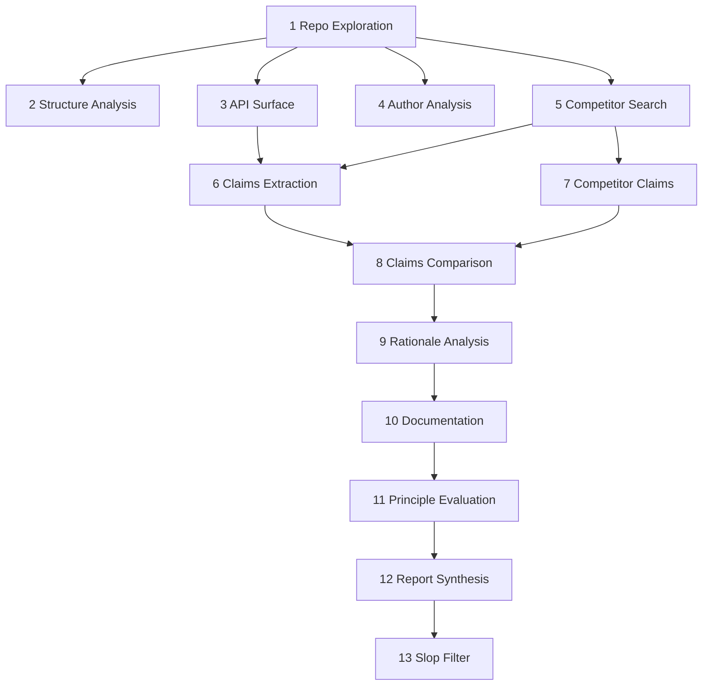

# Boost Library Review

Analyst, diagnostician, student of rejection patterns - the instrument is 34 historical Boost reviews distilled into 11 rejection-driver principles, competitive landscape analysis, and documentation probing. The subject is a C++ library proposed for inclusion in Boost. It explores the repository, profiles the author, searches for competitors, extracts claims, compares positioning, probes rationale, audits documentation against accumulated questions, evaluates each principle with evidence, synthesizes a report, and filters slop. The pipeline produces a single integrated review - a document that tells the reader what matters, what's missing, and what questions only a human can answer.

The pipeline: repository exploration, structure analysis, API surface extraction, author analysis, competitor search, claims extraction, competitor claims, claims comparison, rationale analysis, documentation analysis, principle evaluation, report synthesis, slop filter.

---



---

## Inputs

- **Repository** (mandatory) - GitHub URL or local path to the candidate library
- **Additional evidence** (optional) - mailing list posts, author writeups, review announcements, design documents
- **Interactive session** (optional) - the tool asks the user questions to surface context the repo alone does not provide

---

## Execution Rules

Parallelism follows the dependency graph. Steps 2, 3, 4, and 5 depend only on Step 1 - launch all four in one batch after Step 1 completes. Steps 6 and 7 are independent (6 needs 1+3+5; 7 needs 5 only) - launch both once Steps 3 and 5 complete. From Step 8 onward the chain is serial.

Each step spawns a fresh subagent. No subagent carries context from a previous step except what the main context explicitly passes. The main context holds only summaries, breadcrumbs, accumulated doc questions, and the final report. No raw source code enters the main context. Subagents read the repo; main reads their compressed output.

If the repo is on GitHub, clone it to a temp directory in Step 1. Keep accessible through Step 10. Delete after Step 10. Step 4 is web-search only - no repo access. Steps 7 and 8 are web searches + comparison - small context footprint.

If any step must deviate from this pipeline to accommodate the subject, emit a breadcrumb: `{step, deviation, severity: low|medium|high}`. Report deviations at end of run. Never auto-edit the tool file.

---

## Artifact Caching

Cache: `../.cache/` relative to this tool's directory. Reports: `../.reports/{library-slug}-eval.md`.

Write output to `../{library-slug}-eval.tmp.md`. Rename to final path only after the report is complete. On resumption, check for `.tmp.md` and continue from its tail.

---

## Pipeline

### Step 1: Repository Exploration

*Understand what the library does well enough to search for competitors.*

Model: fast.

Read the repository:
- README, top-level docs, design/rationale documents
- Examples - identify intended usage patterns
- Stated motivation, problem description, target audience
- Public header locations (include/ directory, structure)
- Author: name, GitHub username, email from README/commits
- Simplest example: line count and concepts required. If no examples exist, note that.
- GitHub metrics (if applicable): stars, forks, open/closed issue ratio, last commit date, responsiveness signal

Output:
- **one_line_summary**: brutal, precise (e.g. "A header-only C++ HTTP/WebSocket library built on Boost.Asio")
- **executive_summary**: one paragraph - what it does, how, what problem, who it's for
- **author**: full name + GitHub profile URL
- **search_breadcrumbs**: keywords, domain terms, competing library names, standards referenced - enough to drive competitor search
- **header_locations**: list of public header file paths (paths only, not content)
- **simplest_example**: line count and concepts required
- **repo_health** (GitHub only): stars, forks, issue ratio, last commit, responsiveness

### Step 2: Structure Analysis

*Characterize the physical structure. Measure and describe - no judgment.*

Model: fast.

Input:
- repo path from Step 1

Determine:
- Header-only or linkable? (.cpp/.cc source files or everything in headers?)
- Templates vs compiled code ratio
- Build system: CMake, B2, both, Meson, none
- Configuration macros: `#define` knobs, count, what they control
- Optional components, feature flags, build modes
- Dependencies: Boost libraries, std features, third-party
- Test framework: Boost.Test, Catch2, GoogleTest, doctest
- Directory layout: standard Boost layout or custom

Output:
- **structure_summary**: one paragraph. Example: "Header-only template library with no build step. Uses CMake and B2 for tests. Depends on Boost.Asio and Boost.Beast. 43 public headers in include/boost/http/. Tests use Boost.Test. No configuration macros."

### Step 3: API Surface Extraction

*Produce a compressed map of the public API - small enough to inject into later step prompts.*

Model: fast.

Input:
- header_locations from Step 1
- one_line_summary from Step 1

Read each public header and extract:
- Public classes/structs: name, purpose, key member functions (name + signature), notable template parameters
- Free functions: name + signature, purpose
- Type aliases, enums, constants in the public interface
- Notable patterns: RAII, completion tokens, tag dispatch, CRTP

Categorize the API into logical groups (use what fits):
- Error handling, infrastructure, core types, algorithms/operations, I/O, customization points, utilities

Be selective - extract what matters for API design understanding, not every detail. Typical output: 50-150 lines.

Output:
- **api_surface_map**: compressed representation organized by header (types and signatures)
- **api_groups**: logical categories with types/functions in each. Example:

```
- Core types: `connection`, `request`, `response`
- I/O operations: `async_read`, `async_write`, `async_connect` - all async, completion tokens
- Error handling: `error_code` overloads on every operation, plus `http::error` enum
- Configuration: `connection::options` struct with timeouts, buffer sizes, TLS settings
```

- **api_cohesion**: 2-3 sentences - do the groups form a coherent whole? Outliers? Clear simple path for basic usage?
- **standout_function**: if one function/type defines the library (like `from_chars` defines charconv), name it. Otherwise omit.
- **exception_safety_signal**: rough characterization of noexcept coverage and documented exception guarantees
- **doc_questions**: for each API group and notable pattern, "Does the documentation cover {X}?"
- **reader_questions** (0-2): genuinely ambiguous API design choices that only a domain expert can judge. Emit only if ambiguous from the code.

### Step 4: Author Analysis

*Build a profile of the library's author to contextualize the submission.*

Model: fast.

Input:
- author name and GitHub URL from Step 1

Web search for:
- Other open-source libraries, popularity
- Other Boost libraries, status (accepted, in review)
- C++ conference talks (CppCon, C++Now, ACCU, Meeting C++)
- WG21 participation, authored papers
- Professional background, employer
- C++ community tenure
- Visible reputation (blog, social media, known projects)

Surface up to 10 factual sentences plus a notability tier:
- **nobody** - no visible C++ community track record
- **somebody** - some presence: a few libraries, conference talks, or known in a niche
- **accomplished** - well-known: multiple libraries, regular speaker, WG21 participant, widely recognized contributions

Output:
- **author_name**: full name
- **author_sentences**: up to 10 factual sentences
- **notability_tier**: nobody / somebody / accomplished
- **other_boost_libraries**: names and status (if any)
- **domain_keywords**: areas of expertise derived from body of work. If overlap with the library's domain, note it explicitly.

Feeds: `maintainer-responsiveness` and `field-experience` in Step 11, "About" section in report.

### Step 5: Competitor and Domain Search

*Understand the competitive landscape and problem domain.*

Model: fast.

Input:
- search_breadcrumbs from Step 1

No repo access needed. Web search for:
- 3-5 most popular competing libraries (focus C++, cross-language if relevant)
- Problem domain characteristics, what good solutions look like
- Whether the space is crowded or novel
- Prior art: standards proposals, academic work
- Adoption evidence for the candidate library: blog posts, SO questions, GitHub dependents, conference mentions

Output:
- **competitors**: 3-5 libraries with one-line descriptions and popularity indicators
- **domain_summary**: 3-5 sentences on the problem domain and where it's heading
- **novelty_assessment**: known problem / new approach / genuinely novel / crowded space
- **implicit_rationale**: 3-5 one-sentence domain justifications that are obvious and need not be stated by the author. These avoid penalizing the author for not explaining the obvious.
- **doc_questions**: "Does the documentation explain {domain concept}?"
- **adoption_evidence**: signs of real-world use. If nothing found, say so - that's a data point for `field-experience`.
- If no competitors found, that is itself a finding.

### Step 6: Claims Extraction

*Identify the library's key value proposition - what distinguishes it from competitors.*

Model: fast.

Input:
- executive_summary from Step 1
- api_surface_map from Step 3
- competitors and domain_summary from Step 5

Probe the repository with competitive context:
- Re-read README, docs, design notes for claims
- Scan benchmarks, comparison tables, feature matrices
- Note what examples emphasize - what the author thinks is impressive
- Check commit messages, changelogs, linked blog posts

Distinguish what matters:
- Shared baseline (common with all competitors) = footnotes, not claims
- Unique, faster, safer, simpler, or more correct than alternatives = key claims
- Novel space with no competitors = novelty is the claim

Output:
- **key_claims**: numbered list of 3-7 major claims, one sentence each
- **shared_baseline**: one sentence on what it has in common with competitors
- **author_emphasis**: what the author seems most focused on (reveals intent)
- **unsupported_claims**: claims in docs/README with no visible evidence in code
- **reader_questions** (0-3): claims the AI can observe but cannot evaluate - human judgment needed
- **doc_questions**: for each key claim, "Does the documentation substantiate {claim}?"

### Step 7: Competitor Claims

*Extract the key value propositions of each competitor.*

Model: fast.

Input:
- competitors from Step 5 (names, one-liners, popularity)
- domain_summary from Step 5

For each competitor (3-5), web search for:
- Value proposition and 2-4 key selling points
- Known weaknesses or limitations

Output:
- **competitor_claims**: for each competitor, 2-4 value propositions (one sentence each)
- **competitor_weaknesses**: known limitations (one sentence each, if findable)

### Step 8: Claims Comparison

*Compare the library's claims against competitor claims, item by item.*

Model: fast.

Input:
- key_claims from Step 6
- competitor_claims from Step 7

For each key claim: do competitors also claim this? Who does it better? Is this unique? For each competitor feature the library lacks: significant omission or irrelevant to scope?

Output:
- **unique_strengths**: unmatched claims (1 sentence each + confidence)
- **contested_claims**: where competitors also compete (1-2 sentences + confidence)
- **gaps**: things all competitors offer that the library lacks (1 sentence each)
- **overall_positioning**: 2-3 sentences on landscape position (+ confidence)
- **reader_questions**: where comparison requires domain judgment
- **doc_questions**: for unique strengths and gaps identified

### Step 9: Rationale Analysis

*Determine whether the library justifies the design decisions that need justification, and ignore the ones that don't.*

Model: fast.

Not every design choice needs a rationale. Implicit rationale (obvious domain facts from Step 5) gets a pass. Explicit rationale is required only for choices that distinguish this library from competitors or depart from domain conventions.

Input:
- executive_summary from Step 1
- api_surface_map from Step 3
- domain_summary and implicit_rationale from Step 5
- key_claims from Step 6
- claims comparison from Step 8

Probe the repository:
- Re-read README, design docs, rationale sections, doc comments
- For each key claim and unique/contested design choice: find explicit explanation of *why*
- Look for: "we chose X because...", comparison tables with reasoning, design notes
- Flag implicit rationale being unnecessarily stated (docs padded rather than focused)

Output:
- **explicit_rationale_found**: for each key decision needing justification, what the author says. Quote short excerpts. 1-2 sentences per item.
- **rationale_gaps**: unique/contested decisions with no visible justification. 1 sentence per gap.
- **implicit_rationale_confirmed**: items from Step 5 confirmed as not needing explicit justification
- **rationale_quality**: 2-3 sentences - does the author explain thinking or just assert?
- **reader_questions** (0-2): absent rationale where the choice might be defensible
- **doc_questions**: for each rationale gap

### Step 10: Documentation Analysis

*Probe the documentation against all accumulated questions from earlier steps.*

Model: fast.

Steps 3, 5, 6, 8, and 9 each left doc_questions. Collect all into a single list before spawning this subagent.

Input:
- one_line_summary from Step 1
- api_groups from Step 3
- collected doc_questions from Steps 3, 5, 6, 8, 9 (full list)

Read all doc files (README, docs folder, wiki, design docs, tutorials, reference pages, inline doc comments in headers). For each doc question, check whether the documentation explains the topic adequately - not just keyword presence.

Do not return a yes/no checklist. Synthesize into an executive summary.

Output:
- **documentation_assessment**: 1-5 paragraphs proportional to library size. Reads like a reviewer's opinion, not a checklist.
- **coverage_verdict**: one sentence: well-documented / partially documented / under-documented
- **worst_gaps**: 1-3 most important missing items. Feed directly into `doc-completeness`.

Delete the cloned repo after this step.

### Step 11: Principle Evaluation

*Evaluate the library against each rejection-driver principle.*

Model: strong. Max iterations: 11 (one per principle). If a principle subagent returns no structured output after one attempt, skip it and flag in the report.

For each principle, spawn a fresh subagent (sequential) with:
- one_line_summary and executive_summary from Step 1
- structure_summary from Step 2
- api_surface_map and api_groups from Step 3
- author profile from Step 4 (for `maintainer-responsiveness` and `field-experience`)
- competitor/domain data from Step 5
- key_claims from Step 6
- claims comparison from Step 8
- rationale analysis from Step 9 (for `doc-rationale`)
- documentation assessment from Step 10 (for `doc-completeness`)
- additional evidence (if provided)
- the principle's question, indicators, and source examples

Return per principle:
- **applicable**: yes/no
- **assessment**: pass / concern / red-flag
- **confidence**: high / medium / low
- **evidence**: specific things in the library (cite files, API names, doc sections)
- **explanation**: 2-4 sentences in reviewer language
- **questions_for_reader** (if confidence < high): 1-2 targeted questions for a domain expert

**Tier A principles (6) - rejection drivers:**

1. `scope-coherence` - Does scope match name and purpose? Do claims match what's delivered?
   - question: "Is the library's scope well-defined, coherent, and proportional to its name and stated purpose?"
   - positive: Library name accurately reflects scope; all components serve a unified purpose; feature set complete for stated scope
   - negative: Name implies broader scope than implemented; unrelated components bundled together; too incomplete for stated purpose or so narrow it lacks standalone value
   - severity: blocking (appeared in 8/34 reviews)
   - source examples: Http, Text, Sort, Variant2, QVM

2. `doc-rationale` - Does it explain why it exists and why this design?
   - question: "Does the documentation explain why the library exists, what design alternatives were considered, and why the chosen approach was selected?"
   - positive: Motivation section; comparison with alternatives; design decisions explained with trade-off analysis
   - negative: No explanation of why the library should exist; no discussion of alternative designs; design choices presented as obvious with no justification
   - severity: important (appeared in 5/34 reviews)
   - source examples: Conversion, OpenMethod, Sort, Variant2, Scope

3. `safe-defaults` - Do defaults avoid UB and surprises?
   - question: "Are the library's default behaviors safe? Do defaults avoid undefined behavior, silent data loss, deadlocks, or surprising state changes?"
   - positive: Default behavior is safest option; ambiguous situations produce errors; misuse results in compile errors or clear diagnostics
   - negative: Default behavior can lead to UB; errors silently swallowed; library silently picks arbitrary behavior; default configuration can deadlock or cause unbounded resource growth
   - severity: blocking (appeared in 8/34 reviews)
   - source examples: OpenMethod, Outcome, Variant2, SQLite, Process

4. `api-complexity` - Is the simple case simple?
   - question: "Is the API as simple as possible for common cases, with complexity reserved for advanced use?"
   - positive: Simple tasks require simple code; advanced customization available but not required; template parameters have sensible defaults
   - negative: Common operations require extensive boilerplate or metaprogramming; multiple API mechanisms for same task without guidance; must understand internals for basic operations
   - severity: important (appeared in 6/34 reviews)
   - source examples: Beast, Conversion, Outcome, Process, Describe

5. `real-world-demand` - Is there demonstrated demand?
   - question: "Is there demonstrated real-world demand for the library's functionality, with concrete use cases that justify its existence?"
   - positive: Real-world use cases in docs; adoption outside author's control; widely recognized problem
   - negative: No compelling real-world applications; problem is theoretical or niche too small for Boost; existing solutions already satisfy the need
   - severity: important (appeared in 5/34 reviews)
   - source examples: Conversion, OpenMethod, Timsort, Sort, Metaparse

6. `maintainer-responsiveness` - Is the maintainer present?
   - question: "Does the library have an active, responsive maintainer who engages with bug reports and reviewer questions?"
   - positive: Responds to questions within review period; bug reports receive acknowledgment and fixes; demonstrates willingness to iterate
   - negative: Unresponsive to questions; bug reports receive no response; no evidence of maintenance commitment
   - severity: blocking (appeared in 2/34 reviews)
   - source examples: Timsort, Aedis

**Tier B principles (5) - contributing factors:**

7. `doc-completeness` - Is the documentation comprehensive?
   - question: "Does the library provide comprehensive documentation covering API reference, tutorial/getting-started guide, and conceptual overview?"
   - positive: Complete API reference; tutorial or getting-started guide; conceptual overview
   - negative: Missing or stub docs; no tutorial; docs limited to header comments
   - severity: blocking (appeared in 24/34 reviews)
   - source examples: Multi, Fit, Timsort, OpenMethod, Variant2

8. `exception-safety` - Are exception guarantees clear?
   - question: "Are exception safety guarantees (basic, strong, nothrow) documented for all mutating operations, and are they correct?"
   - positive: Exception guarantees stated per mutating operation; strong guarantee where feasible; destructors noexcept
   - negative: No exception safety documentation; destructors that can throw; state corruption on exceptions
   - severity: important (appeared in 5/34 reviews)
   - source examples: Variant2, Sort, Scope, SQLite, Fiber

9. `std-consistency` - Does it follow std conventions where applicable?
   - question: "Where the library provides functionality analogous to the standard library, does its interface follow standard conventions and interoperate cleanly?"
   - positive: Interface mirrors std equivalents; types interoperate with std containers/algorithms; deliberate deviations documented
   - negative: Interface differs from std without explanation; types incompatible with standard interfaces; naming contradicts std conventions
   - severity: important (appeared in 4/34 reviews)
   - source examples: Charconv, Fiber, Text, Scope

10. `resource-ownership` - Is ownership semantics clear?
    - question: "Are ownership and lifetime semantics of resources clear, such that well-formed-looking code cannot produce use-after-free, dangling references, or unbounded resource growth?"
    - positive: Ownership model documented; borrowed references can't outlive owners; internal buffers have configurable bounds
    - negative: Objects that look independent share hidden state; destroying one object silently invalidates another; internal queues grow without bound
    - severity: blocking (appeared in 2/34 reviews)
    - source examples: SQLite, Async-mqtt5

11. `field-experience` - Has it been used outside the author's control?
    - question: "Has the library been used in real-world projects outside the author's immediate control, providing evidence that the API works in practice?"
    - positive: Deployed in production or integrated into open-source projects; user feedback shaped API before review; bug reports from real users addressed
    - negative: No users outside author; API designed in isolation; first real exposure is the Boost review itself
    - severity: important (appeared in 3/34 reviews)
    - source examples: Aedis, SQLite, Http

### Step 12: Report Synthesis

*Produce the raw report draft. Overproduce - the slop filter in Step 13 trims.*

Model: strong.

Input: all findings from Steps 1-11.

Write the report following the Output Template below. Err on the side of more detail, more exposition, more questions. Do not self-censor.

Question lifecycle: reader questions arrive from Steps 3, 6, 8, 9, and 11. Before including any question, check whether a later step already answered it. If the answer is now known, state it as a finding. Only genuinely unresolved questions survive into "Questions for the Reader." Target: 3-8 surviving questions. If more than 8, keep the most impactful.

### Step 13: Slop Filter

*Remove machine slop. Keep only what a human would say and care about.*

Model: strong. Max iterations: one per report section. If a section subagent returns "REMOVE", accept it and move on.

For each section of the draft report, spawn a fresh subagent with the section text and full report context:

> You are a senior C++ developer reading a review of a Boost library submission. Read this section and ruthlessly cut anything that: (1) sounds like generic AI filler rather than a specific observation about this library, (2) states something obvious that adds no insight, (3) repeats information already conveyed elsewhere in the report, (4) hedges excessively without adding information, (5) a knowledgeable human reviewer would never bother saying. Keep everything that: (a) a human reviewer would nod at and think "good point", (b) surfaces something non-obvious, (c) asks a question worth answering. If a section is entirely slop, say so - the section should be removed. Return the filtered text, or "REMOVE" if nothing survives.

The slop filter is the quality gate. The report reads like something a thoughtful person wrote, not machine output.

---

## Output Template

```markdown
# Boost Review: {Library Name}

{One-line brutal summary}

{One paragraph: what it does, how, what problem, who it's for}

## About {Author Name}

{1-3 paragraphs scaled to notability tier: nobody=1, somebody=2, accomplished=3. Third person. Factual, not flattering. Name other Boost libraries if any. Note domain overlap as confidence signal.}

## Structure

{One paragraph from Step 2. Factual, no judgment.}

## API

{1-2 paragraphs at group level from Step 3. Cohesion, simple path, scope. Mention standout function/type if one exists.}

## Documentation

{1-5 paragraphs from Step 10. Reviewer's opinion, not checklist. Name worst gaps if any.}

## Landscape

### Competitors

{Bulleted list: name, one-line description, popularity indicator.}

### The Space

{3-5 sentences: typical features, what good solutions look like, where heading.}

### Positioning

{2-4 sentences: unique strengths, contested claims, gaps. Confidence on each.}

## Key Claims

{Numbered list of 3-7 claims, each: claim (1 sentence), evidence (1 sentence), confidence. Flag unsupported.}

## Findings

{2-4 sentence narrative synthesizing principle evaluations.}

### {Principle Name}

{Assessment: pass/concern/red-flag} (confidence: {high/medium/low})

{2-4 sentences citing specific evidence. If confidence < high, one targeted question.}

## Questions for the Reader

{Numbered list of 3-8 targeted questions only a human can resolve.}

## Recommendations

{Bulleted list of actionable items, ordered by importance, one sentence each.}
```

---

## Voice and Tone

The report's voice is cool, declarative, structurally dense. C++, Boost, and software development vocabulary is native speech. Every word earns its place. Test: would a human write this? Would a human enjoy reading it?

Good: "The API surface is tight - four types, twelve free functions, no loose ends. Everything serves the stated purpose."
Good: "No rationale for the custom allocator. The standard PMR interface would cover this without inventing vocabulary."
Good: "Falco has shipped three Boost libraries over a decade. The networking domain is his home turf."
Bad: "The library demonstrates a well-structured API design with good separation of concerns." (corporate air, says nothing specific)
Bad: "It is worth noting that the documentation could benefit from additional examples." (hedging, passive, says nothing a reviewer wouldn't already think)
Bad: "The library shows promise and addresses a real need in the C++ ecosystem." (generic praise, slop)

---

## Formatting Rules

- No em dashes
- No generic praise ("the library shows promise" - slop)
- Confidence appears inline after assessments, not in a separate column
- Questions are specific and answerable, never "do you agree?"
- Cite function signatures or API elements with fenced `cpp` blocks in Findings and Questions sections (not in API section). Example:

  ```cpp
  async_connect(endpoint, token, bool verify_tls = false)
  ```

  The default for TLS verification is disabled. A networking library that defaults to insecure.

- Quote author prose with block quotes (`>`). Reserve block quotes for words, code blocks for code.

---

## Epistemics

The AI is never as good as a qualified human reviewer. Every finding carries a confidence level:

- **High** - observable fact the AI verified directly. "No benchmarks exist in the repository."
- **Medium** - reasonable inference requiring interpretation. "The API appears complex because basic usage requires understanding three concepts."
- **Low** - tentative observation requiring human judgment. "Whether the novel approach to X outperforms the traditional one is unclear."

Where confidence is medium or low, generate targeted questions that leverage the human's expertise:

Good: "The library claims zero-allocation in the hot path, but `std::vector::push_back` appears in `parser::feed()`. Intentional (amortized, pre-reserved) or a gap in the claim?"
Good: "Competitor libfoo offers async support. This library does not. Is async a requirement for this domain?"
Bad: "Do you think the API is good?"
Bad: "Is the documentation sufficient?"
