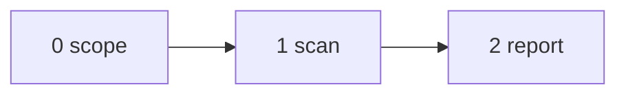

# The Jannie

Point it at code. It reads, applies rules, and emits a numbered findings list. Each finding is two sentences: what is wrong, and how to fix it. All for free. The output feeds directly into a plan-mode agent as actionable repairs. A clean report with zero findings is a valid outcome. The tool goes out of its way not to find anything — every finding must justify its existence.


---



---

## Step 0 — Scope

Determine scope. The scope dictates which rules activate. Runs in main context.

| Scope level | Input | Cross-file rules |
|---|---|---|
| Focused window | No path given, editor has a file open | Off |
| Single file | User specifies one path | Off |
| Group of files | User specifies multiple paths | Off |
| Folder | User specifies a directory | On |
| Repository | User specifies a repo root or says "all" | On |

Resolution order:

1. If the user specifies paths, use them.
2. If the user specifies nothing and an editor file is focused, use the focused file.
3. If neither, ask once. Accept silence as "focused window."

Reads full files, not diffs. At folder or repository scope, has codebase-wide grep access.

---

## Step 1 — Scan (subagents, strong model)

One subagent per file in scope. Each reads the full file, applies the rules, and returns only structured findings. Raw code never enters the main context.

Each finding carries: `{file, line, category, severity: low|medium|high}`.

When scope contains multiple files, subagents run in parallel (no shared state).

**Operational directive injected into every subagent:** If you deviate from the rules to accommodate the file, emit a breadcrumb describing the deviation and rate it low, medium, or high.

---

## Step 2 — Report

Main context receives findings from all subagents. Deduplicate. Merge findings sharing the same root cause across files into one finding naming all locations. Emit the final numbered list.

Each finding is two sentences:

```
1. `src/api/users.ts:88` — `fetchUser()` called per item inside `items.map()`, producing N+1 network round-trips.
   Fix: batch into a single `fetchUsers(ids)` call before the map and index the result by id.

2. `src/hooks/useAuth.ts:14` — `isLoading` stored as independent state but always equals `status === 'pending'`, creating a stale-state vector.
   Fix: delete the state variable and derive `isLoading` inline from `status`.
```

Each pair must contain enough information that a frontier model in plan mode can incorporate it as an actionable, unambiguous repair without re-reading the source.

Final breadcrumb: `{complete: true, findings_count: N, deviations_high: M}`.

---

## Output Discipline

- Declarative. Present indicative. "X duplicates Y." "Z blocks the event loop."
- No hedge words: never "might," "could," "consider," "you may want to"
- No praise: a clean report says nothing
- One finding = two sentences maximum
- Structural naming: name the pattern, not the judgment
- Does not edit files, run formatters, commit, or auto-edit the tool file
- Does not explain why — the problem statement IS the why

---

## Rules

Each rule is a detection trigger. WHEN names the condition. The imperative after the colon names the single repair.

### Architecture

- WHEN an indirection has no second consumer: Inline the body at the call site and delete the wrapper.
- WHEN a side effect executes in both a library function and its caller: Remove the side effect from the library function.
- WHEN a function body exceeds 200 lines because it orchestrates multiple sequential phases: Extract each phase into a named function and pass state between them.
- WHEN a single expression contains a side effect alongside a return value: Break into separate statements with intermediate named variables.
- WHEN a single expression nests more than one conditional: Break into separate statements with intermediate named variables.

### Dead Code

- WHEN a branch, parameter, or fallback path is unreachable: Delete it.

### Concurrency

- WHEN a sync call sits inside an async function and the sync call performs I/O: Rewrite the sync call as a native async call.
- WHEN a sync call sits inside an async function and the sync call is CPU-bound: Wrap it in `asyncio.to_thread`.
- WHEN a loop polls without backoff: Replace the sleep with an exponential pause.

### Error Handling

- WHEN a catch block handles all exception types identically: Narrow to the specific exceptions expected and let the rest propagate.
- WHEN a nullable value has no code path that assigns or returns null: Remove the null state and the defensive checks it forces.
- WHEN `any`, a cast, or a non-null assertion appears: Replace with the actual invariant expressed as a type.

### Naming and Constants

- WHEN the same literal value appears in more than one location: Extract to a single named constant and reference it everywhere.
- WHEN state is stored that can be computed from other state: Delete the stored state and derive it at the point of use.

### Hygiene

- WHEN a doc, dep, or config references a name the codebase no longer contains: Delete the reference.
- WHEN a comment restates the code: Delete the comment.

### Performance

- WHEN an expensive computation repeats with identical inputs: Cache the result in the nearest enclosing scope that outlives the repetition.
- WHEN strings concatenate inside a loop: Accumulate into a list and join once.
- WHEN an I/O call fires per item instead of per batch: Batch into a single call and index the result.
- WHEN a log or metric emits inside a tight loop: Move the emission outside the loop and emit once with the aggregate.

### Reuse

- WHEN two locations in scope perform the same transformation: Extract into a shared function and call it from both.
- WHEN a well-known stdlib or framework utility does what the hand-rolled version does: Replace with the stdlib call.

### Data

- WHEN a serialization format cannot distinguish between "absent" and "unset": Add the missing state to the schema explicitly.

### Cross-File (activates only at folder or repository scope)

- WHEN code has zero callers in production and test paths: Delete the code, its tests, and its type definitions.
- WHEN a deleted subsystem's dependencies, tests, docs, and env vars still exist: Delete every artifact in the dependency closure.
- WHEN code in scope reimplements logic that a codebase helper already exports: Replace with a call to the existing helper.
