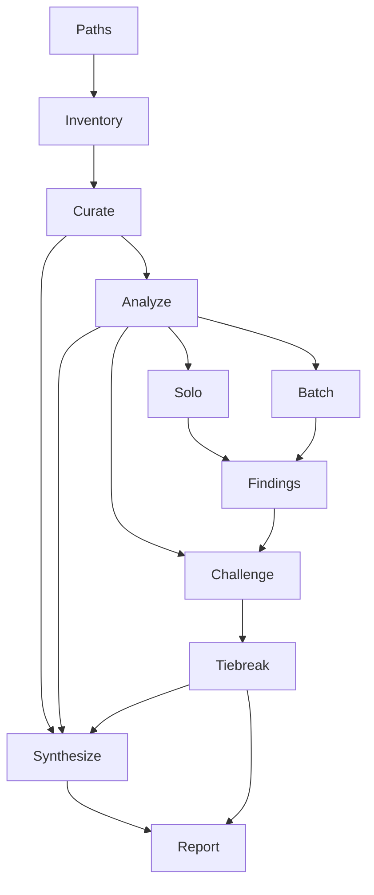

# Code Review

Language-agnostic code review. Takes one or more files, discovers companion artifacts, and runs a structured analysis pipeline. Sub-agents read all code and perform all inspection. The main context orchestrates, filters, and renders the report. Raw code never enters the main context.

**Noise philosophy:** The tool should go out of its way not to find anything. Every finding must justify its existence. The default posture is: this code is fine until proven otherwise with strong evidence. A clean review with zero findings is a valid and desirable outcome, not a failure of the tool.


\newpage



\newpage

---

## Core Rule

Raw source code NEVER enters the main context. All code reading, all inspection, all per-file analysis happens inside sub-agents. The main context receives only structured JSON records. Non-negotiable.

---

## Step 0 - Inventory

Runs in main context. No LLM. Deterministic.

**Input:** User-provided paths.

**Actions:**

1. Expand directories (exclude build artifacts, vendor, generated).
2. Attach `companion_path` per discovery heuristics (header/impl/test pairs).

Discovery heuristics by extension:

- `.hpp` / `.h` --> look for `.cpp` / `.cc` / `.c` with the same stem, same directory or `src/`
- `.cpp` / `.cc` / `.c` --> look for `.hpp` / `.h` with the same stem, same directory or `include/`
- `.py` --> look for `test_{stem}.py` or `{stem}_test.py` in the same directory or `tests/`
- `.ts` / `.tsx` --> look for `{stem}.test.ts`, `{stem}.spec.ts`, `{stem}.test.tsx`
- `.java` --> look for `{Stem}Test.java` in the same package or a parallel test tree
- `.rs` --> look for `mod.rs` in the same directory, or `tests/{stem}.rs`

General fallback: same stem, related extensions or test prefix/suffix patterns. If nothing is found, proceed without a companion.

**Output:** `DiscoveryResult`

- `review_roots`: array of string
- `file_entries[]`: array of `{ path, companion_path }`

Inform the user: "[N] files under review, [M] companions discovered."

---

## Step 1 - Curate

One sub-agent per file. Classify and orient.

**For each** `file_entries[]` path, spawn one sub-agent. Inject fixed Step 1 prompt + `{ path, companion_path }`. Sub-agent reads file (and companion if present) from disk.

**Return:** `Step1Record`

- `file_path`: string
- `primary_kind`: string, one of `implementation`, `header_or_interface`, `test_code`, `test_fixture_or_data`, `documentation`, `configuration`, `generated_or_vendor`, `unknown`
- `review_as`: string, one of `code_review`, `documentation_review`, `fixture_review`, `configuration_review`, `skip`
- `include_in_pipeline`: boolean - `false` means all later steps skip this path
- `language`: string (e.g. `cpp`, `python`, `typescript`, `rust`, `markdown`, `other`)
- `approx_line_count`: integer or null
- `appearance`: string, **1-2 sentences** - structural impression (e.g. "200-line module with a single class and decorator-heavy factory methods")
- `primary_entrypoints`: array of string, **at most 5**
- `external_touchpoints`: array of string, **at most 5**
- `concurrency_present`: boolean

**Validation:** Reject if JSON invalid; arrays > 5 items; unknown enums; `appearance` > 600 chars.

Main appends validated records to `step1_results[]`.

---

## Step 2 - Analyze

One sub-agent per file. Builds the file's story and enumerates its functions in a single read.

**When:** For each path where `include_in_pipeline` is true. Adapted per `review_as` mode.

**Input:** `Step1Record` for this file + `companion_path` from Step 0. Sub-agent reads file + companion from disk.

**Return:** `FileAnalysis`

- `file_path`: string
- `brutal_one_line`: string, **one sentence** - what this file is for / what it must not break
- `invariants`: array of string, **at most 5** - key invariants or contracts the file maintains
- `risk_flags`: array of string, **at most 3**
- `file_level_findings[]`: array of objects (from file-level rules F1-F3), each:
  - `rule_id`: string (`F1`, `F2`, or `F3`)
  - `confidence`: string, one of `high`, `medium`, `low`
  - `priority`: string, one of `must_fix`, `should_fix`, `nice_to_have`
  - `location`: string - file path + line or range or "file-wide"
  - `action`: string, **one sentence**
  - `rationale`: string, **one sentence**
- `functions[]`: array of objects - populated for `code_review` and `test_code` files; empty array for docs/fixtures/config. Each:
  - `qualified_name`: string
  - `kind`: string (function, method, static_method, constructor, destructor, lambda, macro, etc.)
  - `visibility`: string (`public`, `internal`, `private`)
  - `role_in_file`: string, **one line** aligned to `brutal_one_line`
  - `start_line`: integer
  - `solo_review`: boolean - `true` if the function needs its own dedicated sub-agent; `false` if it can be batched. Mark `true` for functions with complex control flow, significant state management, concurrency, or central responsibility. Short accessors, simple constructors, trivial wrappers, and straightforward utilities should be `false`.

Main stores one `FileAnalysis` per file. Function inventory is not printed in the final report.

---

## Step 3 - Review

Fresh sub-agents. 8-rule checklist. Default posture: this function is fine.

**Batching strategy:** Main partitions each file's `functions[]` using `solo_review`:

- **Solo** (`solo_review: true`): one fresh sub-agent per function.
- **Batch** (`solo_review: false`): grouped into batches of at most 8, one fresh sub-agent per batch.

### Solo path

1. Spawn a new sub-agent (no carryover).
2. Inject **function context packet** (assembled by main):
   - `file_path` and `companion_path` (Step 0)
   - `brutal_one_line`, `invariants`, `risk_flags` (Step 2)
   - `concurrency_present` (Step 1)
   - `role_in_file`, `function_qualified_name`, `kind`, `visibility`, `start_line` (Step 2 function row)
3. Sub-agent reads file and companion (if present) from disk. The companion is needed for A2 contract fidelity.
4. Run 8-rule scan, fill verdict slots.
5. **Self-challenge (mandatory):** After filling all 8 verdicts, execute a final pass:

   > "Re-read each non-clean verdict. For each, ask: would a skeptical senior engineer who knows this codebase accept this finding, or would they say 'that is not a real problem'? If you cannot state in one sentence what breaks or degrades because of this issue, change the verdict to clean. Style preferences that do not affect correctness, maintainability, or safety must be clean, not advisory."

   Revise verdicts in place before returning JSON.

6. Return `PerFunctionReview`:
   - `file_path`: string
   - `function_qualified_name`: string
   - `start_line`: integer
   - `verdicts[]`: array of 8 objects (one per rule A1-A8), each:
     - `rule_id`: string
     - `verdict`: string, one of `clean`, `advisory`, `flag`, `na`
     - `confidence`: string, one of `high`, `medium`, `low`
     - `line`: integer or null (required for `advisory` and `flag`)
     - `action`: string or null - for non-clean: **one sentence**; else null
     - `rationale`: string or null - for non-clean: **one sentence** (what breaks or degrades); for `clean`: one sentence confirming; for `na`: one sentence why
     - `priority`: string or null - for `advisory`: one of `should_fix`, `nice_to_have`; for `flag`: null (main assigns `must_fix`); for `clean`/`na`: null

### Batch path

1. Spawn a new sub-agent (no carryover).
2. Inject **batch context packet**:
   - `file_path` and `companion_path` (Step 0)
   - `brutal_one_line`, `invariants`, `risk_flags` (Step 2)
   - `concurrency_present` (Step 1)
   - `functions[]`: array of `{ function_qualified_name, kind, visibility, role_in_file, start_line }` for all functions in this batch
3. Sub-agent reads file and companion from disk.
4. Run 8-rule scan for each function in the batch.
5. Self-challenge (same prompt as solo).
6. Return `BatchReview`:
   - `file_path`: string
   - `reviews[]`: array of objects, one per function in the batch (same order as input), each:
     - `function_qualified_name`: string
     - `start_line`: integer
     - `verdicts[]`: array of 8 objects (same schema as solo)

### Completeness check

After all Step 3 sub-agents return, main verifies:

```
expected = { f.qualified_name for f in FileAnalysis.functions }
reviewed = { r.function_qualified_name for r in all solo + batch outputs }
missing  = expected - reviewed
```

If `missing` is non-empty, re-run for the missing functions (solo). Deterministic set comparison.

Main normalizes all outputs: unpack `BatchReview.reviews[]` into individual `PerFunctionReview` records. Downstream steps see a flat `PerFunctionReview[]` per file.

### What is NOT injected into Step 3

- Full `Step1Record` (only `concurrency_present` forwarded)
- Full `FileAnalysis` (only breadcrumb fields + target function rows)
- Any other file's data

---

## Step 4 - Challenge

One fresh sub-agent per file. Adversarial pass - tries to disqualify every non-clean finding from Steps 2 and 3.

**When:** For each file with at least one non-clean finding. If all-clean, skip.

**Input:**

- `file_path` and `companion_path` (sub-agent reads from disk)
- `brutal_one_line` (Step 2)
- `invariants` (Step 2, at most 5 strings)
- Only the non-clean findings for this file: array of `{ rule_id, function_qualified_name, line, action, rationale, confidence, priority }`
- Not the full Step 1/2 records

**Challenger prompt:**

> "You are a skeptical senior engineer. Your job is to defend this code against the findings below. For each finding, read the code at the cited location and determine:
> 1. Is the finding factually correct? Does the code actually do what the finding claims? If the finding cites the wrong line, misreads the logic, or describes behavior that does not exist, disqualify it.
> 2. Is it actually a problem? Even if factually correct, does it matter? If the pattern is idiomatic, intentional, or has no realistic negative consequence, disqualify it.
> 3. Is the severity right? If the finding survives but the severity is too high, downgrade it.
>
> You may NOT add new findings. You may only disqualify or downgrade existing ones. If every finding is valid, say so - do not invent objections to seem useful."

**Return:** `ChallengeResult`

- `file_path`: string
- `challenges[]`: array of objects, one per input finding (same order), each:
  - `rule_id`: string
  - `function_qualified_name`: string or null
  - `line`: integer
  - `survived`: boolean
  - `revised_priority`: string or null - if survived but downgraded: new priority; null if unchanged or disqualified
  - `challenge_reason`: string, **one sentence**

Main merges results. Disqualified findings dropped. Downgraded findings get `priority` updated.

### Confidence tiebreaker

Applied in main after Step 4. Uniform across all surviving findings from Steps 2 and 3:

- `priority: must_fix` + `confidence: low` --> downgrade to `should_fix`
- `priority: should_fix` + `confidence: low` --> drop
- `priority: nice_to_have` + `confidence: low` --> drop
- `confidence: high` or `medium` --> no change

Findings list only contains items that survived all three filters (self-challenge, challenger, tiebreaker).

---

## Step 5 - Synthesize

One sub-agent. Cross-file analysis from the full pipeline output. Runs after the challenge pass; only sees surviving findings. This is where the pipeline's investment pays off. Small codebase = concise output. Large library = deep output. Do not compress to fit a template.

**Input:**

- All `Step1Record`s (classification, entrypoints, touchpoints, appearance)
- All `FileAnalysis` records (brutal one-liners, invariants, risk flags, function inventories)
- All surviving `PerFunctionReview` findings (post-challenge)
- All surviving `FileAnalysis.file_level_findings[]` (post-challenge)
- File paths + companion paths (Step 0)

Do not pre-summarize. Let the sub-agent do the compression.

**Return:** `SynthesisResult`

- `verdict_one_line`: string - brutal one-line verdict
- `executive_summary`: string - 1-2 paragraphs
- `file_groups[]`: array of objects - files clustered by responsibility or subsystem, each:
  - `group_name`: string (e.g. "Parsing layer", "HTTP handlers", "Test suite")
  - `group_description`: string, **1-3 sentences**
  - `file_paths[]`: array of string
- `file_profiles[]`: array of objects, one per reviewed file, each:
  - `file_path`: string
  - `profile`: string, **1 sentence to 1 paragraph** - scaled to how much there is to say. Short for clean files, longer for files with significant findings or complex responsibilities.
- `cross_cutting_analysis`: string - **unbounded prose** covering module boundaries, cross-file duplication, naming coherence, responsibility leakage. Scales with the codebase.
- `cross_file_findings[]`: array of objects (global rules G1-G4), each:
  - `rule_id`: string
  - `confidence`: string, one of `high`, `medium`, `low`
  - `priority`: string, one of `must_fix`, `should_fix`, `nice_to_have`
  - `locations[]`: array of string - file:line references
  - `action`: string, **one sentence**
  - `rationale`: string, **one sentence**

Cross-file findings intentionally skip the adversarial challenge. The synthesis sub-agent already works from filtered data. The confidence tiebreaker in Step 6 still applies.

---

## Step 6 - Report

Main context renders user-visible markdown. Apply confidence tiebreaker to Step 5 cross-file findings (same rules as Step 4 tiebreaker).

**Output path:** User-specified, or `reports/code-review-{scope-slug}.md` relative to the repository root, where `{scope-slug}` is derived from the review roots (directory name or primary file stem). If a report with this name already exists, increment the version suffix: `-v2`, `-v3`, etc.

### Report structure

```
# Code Review: [name]

- **Date:** [date]
- **Model:** [model]
- **Scope:** [review_roots from Step 0]

[Brutal one-line verdict from Step 5]

## Executive Summary

[1-2 paragraphs from SynthesisResult.executive_summary.
What the code is, what the review found, what deserves attention.
Read this if you read nothing else.]

## Codebase Profile

### [Group Name]

[group_description. List of files in this group.]

(Skip file groups if codebase is 2-3 files and grouping adds nothing.)

### [filename]

[Per-file profile from SynthesisResult.file_profiles[].
One sentence for clean utility files.
Full paragraph for complex modules with findings.]

...

## Cross-cutting Analysis

[Unbounded prose from SynthesisResult.cross_cutting_analysis.
Module boundaries, duplication, naming, responsibility leakage.
Let it grow to match the codebase.]

## Findings

### Must fix

1. `src/parse.cpp:142` - add bounds check before array access
   (unchecked index into user-supplied vector)

2. `lib/auth.py:87` - validate token expiry before granting session
   (expired tokens currently accepted)

### Should fix

3. `src/render.py:55` - extract DB query from pure formatting function
   (mixed IO and presentation)

### Nice to have

4. `src/render.py:112` - reduce nesting depth
   (currently 5 levels deep in conditional chain)

N files / M functions reviewed clean.
```

### Findings format

Each item: numbered, `file:line` - action (rationale). One line per finding, blank line between findings.

- `flag` verdict --> must fix
- `advisory` with `should_fix` priority --> should fix
- `advisory` with `nice_to_have` priority --> nice to have
- `clean` verdicts omitted

Multi-location findings (cross-file, rules G1-G4): comma-separate locations.

```
5. `src/parse.cpp:42`, `lib/util.py:88` - extract shared validation
   into one module (same bounds-check logic duplicated)
```

If zero findings survive: "No findings. The reviewed code is clean."

Triple duty - each finding line serves as:

- **Report finding** - reader sees what's wrong, where, and why
- **Human to-do** - developer works down the list
- **Machine to-do** - LLM gets file, line, instruction, and reasoning

---

## Function-level Rules (Step 3)

Injected into every Step 3 sub-agent. 8 rules, each with Scan, Clean bar, and Flag vs Advisory.

### A1. Bugs

**Scan:**
1. Trace every branch - right thing, right type, boundary handled?
2. Enumerate loop bounds - correct at 0, 1, N-1, N, MAX?
3. List every nullable/optional value - guarded before use?
4. Check operator precedence in compound expressions.
5. Enumerate return paths - same type/shape? Any path that forgets to return?

**Clean bar:** No plausible logic error in control flow, boundaries, or null handling.
**Flag:** Likely wrong behavior at runtime.
**Advisory:** Fragile pattern that works today but breaks on plausible input change.

### A2. Contract fidelity

**Scan:**
1. Read name, doc comment, `role_in_file` - what should this function do?
2. Read body - does it actually do that, and only that?
3. Preconditions validated or asserted at entry?
4. Does it mutate arguments the caller would not expect?
5. Side effects not visible from signature?

**Clean bar:** Behavior matches name, docs, stated role; no hidden mutations or effects.
**Flag:** Function contradicts its name/docs, or silently mutates caller state.
**Advisory:** Preconditions not enforced but documented; minor name drift.

### A3. Single responsibility

**Scan:**
1. Describe what it does in one sentence without "and" - if you cannot, it does too much.
2. Count parameters - more than 4 is a smell.
3. Boolean "mode" parameter creating two functions in one body?
4. Does the name match what the code does?

**Clean bar:** One job; name matches behavior; tight parameter list.
**Flag:** Two unrelated jobs, or name actively misleads.
**Advisory:** High parameter count, or mild name drift.

### A4. Resource management

**Scan:**
1. List every acquired resource.
2. Release on every exit path (early returns, exceptions, error branches)?
3. RAII / `with` / `defer` in use, or manual?
4. Resource escapes without documented ownership transfer?

**Clean bar:** Every resource has guaranteed release on all exit branches.
**Flag:** Leak on a reachable path.
**Advisory:** Manual cleanup works but guard pattern would be safer.

### A5. Error handling

**Scan:**
1. List every fallible call.
2. Error checked? Propagated? Or silently ignored?
3. Empty catch / `except: pass` / ignored return code?
4. Error types appropriate granularity?

**Clean bar:** Every fallible call has an explicit error path; no silent swallowing.
**Flag:** Error silently swallowed on a path affecting correctness or data integrity.
**Advisory:** Error handled but with context loss.

### A6. Readability

**Scan:**
1. Nesting depth > 3?
2. Function length > ~40 lines?
3. Local names convey intent?
4. Unnecessary indirection?

**Clean bar:** Readable top-to-bottom; names convey intent; nesting shallow.
**Flag:** N/A (readability alone is never "likely bug").
**Advisory:** Specific improvement with location.

### A7. Concurrency

Skip when `concurrency_present` is `false`.

**Scan:**
1. Shared mutable state without synchronization?
2. Lock ordering consistent?
3. Atomic operation assumes stronger ordering than documented?
4. Captured mutable reference across await point?

**Clean bar:** No unprotected shared state; consistent lock ordering.
**Flag:** Race condition or deadlock on reachable path.
**Advisory:** Synchronization present but coarser than necessary.

### A8. Testability

**Scan:**
1. Testable with just parameters and return value, or requires mocking globals/DB/network/filesystem/clock?
2. Mixes I/O with pure computation in same body?
3. Hidden dependency (global, singleton, env var, `Date.now()`, `random()`)?
4. Would a unit test require building a mini production environment?

**Clean bar:** Testable by supplying inputs and checking outputs; dependencies explicit.
**Flag:** N/A (testability alone is never "likely bug" - if an untestable path is also wrong, A1 or A5 catches the bug).
**Advisory:** Mixed I/O and logic; hidden dependency; complex mock setup required.

---

## File-level Rules (Step 2)

Run inside Step 2 sub-agent. Emit into `FileAnalysis.file_level_findings[]`.

### F1. Documentation consistency

**Scan:**
1. List public functions/classes/types - does each have a doc comment?
2. If some have doc comments and others don't, that's inconsistent.
3. For existing doc comments - do they describe current behavior or stale behavior?
4. Parameter names in docs match actual parameter names?

**Clean bar:** Public surface is uniformly documented (all or none); existing docs match current code.
**Flag:** Doc comment describes behavior opposite to what the code does (misleads callers).
**Advisory:** Partial coverage (some public APIs documented, others not); minor parameter name drift.

### F2. Formatting

**Scan:**
1. Indentation style consistent within file?
2. If companion exists, same conventions (brace placement, line length, import ordering)?
3. Trailing whitespace, mixed tabs/spaces, inconsistent blank line patterns?

**Clean bar:** Consistent internal style; no jarring divergence from companion.
**Flag:** N/A (formatting alone is never "likely bug").
**Advisory:** Inconsistent indentation, mixed conventions, or divergence from companion style.

### F3. Within-file duplication

**Scan:**
1. Any two functions with near-identical logic (same structure, same operations, different names/parameters)?
2. Repeated boilerplate that could be a shared helper or macro?
3. Copy-paste patterns with minor variations?

**Clean bar:** No repeated logic blocks that could be a single helper.
**Flag:** N/A (duplication alone is never "likely bug").
**Advisory:** Specific duplicated pattern with locations; suggest extraction target.

---

## Global Rules (Step 5)

Run during synthesis. Emit into `SynthesisResult.cross_file_findings[]`.

### G1. Cross-file duplication

**Scan:**
1. Same logic, algorithm, or validation repeated in multiple files?
2. Shared constants defined independently in separate files?
3. Utility functions reimplemented instead of imported from a common module?

**Clean bar:** No logic or constant duplicated across file boundaries.
**Flag:** Duplicated validation or business logic where a bug fix in one copy would need to be applied to all copies.
**Advisory:** Duplicated utility logic or constants that could be consolidated.

### G2. Naming coherence

**Scan:**
1. Same concept called different names in different files (e.g. `user_id` vs `userId` vs `uid`)?
2. Same name used for different concepts across files?
3. Public API naming conventions consistent across modules?

**Clean bar:** Same concept, same name everywhere; no naming collisions.
**Flag:** Same name means different things in different modules (collision that misleads).
**Advisory:** Inconsistent casing or abbreviation conventions across boundaries.

### G3. API design

**Scan:**
1. Are internal types or implementation details exposed across module boundaries?
2. Interface width - do callers need to know more than they should?
3. Coupling to concrete types where an interface/abstraction would be appropriate?
4. Easy to use correctly, hard to use incorrectly?

**Clean bar:** Clean boundaries; callers depend on contracts not implementations.
**Flag:** Internal mutation exposed without documented ownership transfer; API that silently does the wrong thing on plausible inputs.
**Advisory:** Overly wide interface; unnecessary coupling to internals; API that works but requires caller to know implementation details.

### G4. Responsibility leakage

**Scan:**
1. Invariant maintained partly in module A and partly in module B?
2. File doing work that belongs in a different file's stated responsibility?
3. Mixed abstraction levels at module boundaries (high-level orchestration mixed with low-level I/O)?

**Clean bar:** Each module owns its invariants completely; responsibilities don't split across boundaries.
**Flag:** Split invariant where a change in one module silently breaks the other.
**Advisory:** Mild responsibility overlap; work that would be cleaner in a different module.

---

## Execution Protocol

Save output after each complete section. Always save output BEFORE marking plan items done. On resumption: read the plan and the last section of the output file. Continue from where output ends. Never rewrite prior sections.

---

## License

All content in this file is dedicated to the public domain under [CC0 1.0 Universal](https://creativecommons.org/publicdomain/zero/1.0/).
