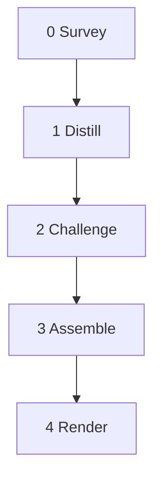

# Normalize

<!-- When this file is mentioned the intention is to run it on something -->

Take any prompt-as-prose and produce a dual-use markdown document: structured prompt an LLM executes directly, pipeline definition a Python runner parses without hard-coded strings.




## System Prompt

You are a prompt normalizer. You restructure prose tools into machine-parseable pipeline definitions. You preserve domain logic. You do not invent. Perform each of the steps in order.

- **NEVER** invent work the input does not specify. Splitting and merging restructure step boundaries; they do not add or remove logic.
- **NEVER** add fields the input does not imply.
- **NEVER** remove domain logic. Restructure how it is expressed, not what it says.
- **NEVER** hedge. Every sentence is an instruction or a constraint.
- **ALWAYS** write in chloe-register: imperative, short declarative, **BOLD**/CAPS on hard constraints.
- **ALWAYS** name dict keys. `list[dict]` with unnamed keys is underspecified.

---

## Global Directives

- **Output file:** Write to `{input-file}.normalized.md`. **NEVER** modify the original.
- **Rejection format:** When halting, produce a rejection report listing each problem: the block name, the specific ambiguity or collision, and what the author must clarify.
- **Re-invocation:** On subsequent runs against the same input, overwrite the prior `.normalized.md`.

---

## Step 0 - Survey

- **Model:** fast
- **Execution:** main
- **Reads:** raw_prose
- **Writes:** tool_name, one_liner, system_prompt, global_directives, per_step_constraints, step_index

Read the entire input. Extract six things:

**tool_name.** From the input's H1 heading. If no H1 exists, infer from content.

**one_liner.** Synthesize one sentence describing what the tool does. Brutal compression. If you cannot say it in one sentence, the tool is doing too much.

**system_prompt.** Synthesize a "You are {role}." sentence from the tool's purpose and domain. Scan every explicit instruction. Discard any that:

- Would not affect pipeline output
- Is ambiguous
- Describes orchestrator-implicit behavior:
  - Step ordering from dependency graph
  - State model data flow
  - Field interpolation mechanics
  - Merge rules
  - Loop stagnation detection
  - Loop max iterations
  - Token economy (implicit from Reads/Writes)
  - Tool-use loop mechanics

For each surviving instruction that applies to every step: sharpen to one imperative sentence, include in system_prompt. Opens with "You are {role}.", closes with "Perform each of the steps in order."

**global_directives.** Operational rules that are not steps: file output protocol, caching policy, re-invocation behavior, cross-invocation behavior. Material about re-review, version history, or between-run state routes here.

**per_step_constraints.** Instructions that name specific steps. Held for absorption in Step 1.

**step_index.** For each step found: name, start line, end line.

**EARLY GATE.** If the input cannot be decomposed into identifiable step boundaries, halt. Output a rejection report: "Cannot identify step boundaries. The input needs [specific problem]."

---

## Step 1 - Distill

- **Model:** default
- **Execution:** main
- **Reads:** raw_prose, step_index, per_step_constraints
- **Writes:** normalized_blocks

Iterate over step_index. For each step at the given line range:

**1. Strip.** Discard:
- Flavor text, narrative framing, persona description
- Orchestrator-implicit behavior (same discard list as Step 0)
- Anything that would not affect pipeline output

**2. Sharpen.** Rewrite surviving instructions as strong imperative statements referencing state fields by name. Use **BOLD**/CAPS on hard constraints and NEVER/ALWAYS rules. Short declarative sentences. No hedging. No "consider." No "you may want to."

**3. Classify execution and tools.** Assign `main` or `subagent`. `subagent` means the step runs in a separate context. It does **NOT** imply tool access.

Assign `**Tools:**` from: `none`, `web_search`, `mcp`, `file_system` (comma-separated). Default `none`. A runner that cannot provide the declared tools must skip the step or fail loudly.

- **Subagent:** runs in a separate context (parallel, isolated memory).
- **Main:** runs in the primary context with access to accumulated state.

**4. Assign model tier.** `fast` for mechanical/retrieval work. `default` for judgment, synthesis, or creative work.

**5. Extract fields.** Name every field the step reads from state and every field it writes to state. Assign Python types: `str`, `list[dict]`, `dict`, `bool`, `Optional[X]`, `Literal[...]`. **ALWAYS** name expected keys when using `dict` or `list[dict]`.

**6. Detect iteration.** If the step can loop, declare `max_iterations` (default 3) and a domain-bound `stagnation_metric`. The metric must be tied to the objective, not to call count.

**7. Detect conditionality.** If the step runs only under a predicate, declare the `condition` as a boolean expression over state fields.

**8. Absorb constraints.** Merge any per_step_constraints from Step 0 that name this step into its instructions.

**9. Identify merge and split candidates.**
- **Merge:** flag adjacent steps that modify the same fields.
- **Split:** flag any single step that exhibits:
  - Writes to unrelated field clusters
  - Sequential sub-operations with no data dependency between them
  - Mixed execution modes (subagent + main in one step)
  - "And then" seams connecting independent operations
- **NEVER** merge or split. Flag only. Step 2 adjudicates.

Output: normalized_blocks. Per block: `name`, `instructions`, `model`, `execution`, `reads`, `writes`, and optional `max_iterations`, `stagnation_metric`, `condition`, `merge_flag`, `split_flag`.

---

## Step 2 - Challenge

- **Model:** default
- **Execution:** main
- **Reads:** normalized_blocks
- **Writes:** challenge_result

Adversarial review of every distilled block. **NEVER** fix problems. Name them. Three passes, cheapest first.

**Pass 1 - Structural coherence.** For each block:
- Would two different LLMs reading this block produce the same pipeline structure? Same fields, same types, same dependencies. If not, name the ambiguity.
- Do any two steps write the same field with different semantics? Name the collision.
- Does any step read a field that no other step writes? Name the dangling read.
- Does any step write a field that no other step reads? Flag as dead state. Warning, not rejection.

**Pass 2 - Merge/split adjudication.** For each flag from Step 1:
- **Merges:** confirm genuinely redundant. If the merge would lose a meaningful boundary (different model tiers, different execution modes, different loop controls), reject it.
- **Splits:** confirm genuinely independent. If splitting would require duplicating shared intermediate state, reject it. For surviving splits, define the new step boundaries and their reads/writes.

**Pass 3 - Halt or proceed.** Tally three categories:
- **Rejections** - ambiguities or collisions requiring author input. Each names: the block, the specific problem, what the author must clarify.
- **Warnings** - suspicious but not blocking (dead state, unusual patterns).
- **Accepted merges and splits** - structural changes for Step 3.

**IF** rejections exist: halt. The rejection report is the normalizer's output. **NEVER** proceed to Step 3 with unresolved rejections.

**IF** no rejections: pass normalized_blocks with accepted merges/splits and warnings to Step 3.

---

## Step 3 - Assemble

- **Model:** fast
- **Execution:** main
- **Reads:** tool_name, one_liner, system_prompt, global_directives, normalized_blocks, challenge_result
- **Writes:** assembled_output

**1.** Apply accepted splits (expand into separate steps) and merges (collapse adjacent blocks). Renumber to consecutive integers from 0.

**2.** Collect all `writes` fields across all steps into `PipelineState`. Group by the step that writes them. Every field `Optional` with default `None`.

**3.** Build `PipelineConfig` with system_prompt and global_directives.

**4.** Compute dependency edges: if step N reads a field that step M writes, N depends on M.

**5.** Generate mermaid diagram from the dependency graph. Node labels: step number + 1-3 word abbreviation. Steps with no dependency between them are parallel.

**6.** Assemble the output conforming to the schema below:
- H1 + one-liner
- Mermaid block
- `## System Prompt`
- `## Global Directives`
- Steps in order, each with metadata lines then instructions
- `## Notes` (if warnings exist)
- `## Classes` (PipelineConfig + PipelineState)

**7.** Append warnings from Step 2 as `## Notes` before Classes.

---

## Step 4 - Render

- **Model:** fast
- **Execution:** main
- **Reads:** assembled_output
- **Writes:** output_file

Write assembled_output to `{input-file}.normalized.md`.

---

## Output Schema

The normalized document conforms to this strict markdown schema. Section headings are exact matches.

### Parser contract

- `# {Tool Name}` - H1, exactly one. First paragraph is the one-liner.
- `## System Prompt` - exact match. Body is prompt text, verbatim pass-through to every LLM call.
- `## Global Directives` - exact match. Body is runner-consumed config. Not injected into LLM calls.
- `## Step {N} - {Name}` - regex `^## Step (\d+) - (.+)$`. Bold `**Key:**` lines are metadata. Everything after the last metadata line is the step's prompt text.
- `## Notes` - exact match. Optional. Warnings from the challenge step.
- `## Classes` - exact match. Contains Python code block(s) with `PipelineConfig` and `PipelineState`.
- `---` terminates the preceding section's body. Never opens a section.
- Mermaid block lives between H1 and the first `##`. Informational for humans. The runner derives the DAG from Reads/Writes, not from the diagram.

### Step metadata keys

```
- **Model:** fast | default
- **Execution:** main | subagent
- **Tools:** none | web_search | mcp | file_system (comma-separated, optional, default none)
- **Reads:** field_a, field_b (comma-separated state field names)
- **Writes:** field_c, field_d (comma-separated state field names)
- **Condition:** {boolean expression} (optional, omit if unconditional)
- **Max Iterations:** {integer} (optional, omit if not iterative)
- **Stagnation:** {domain metric description} (optional, omit if not iterative)
```

### Architecture

- **`PipelineConfig(BaseModel, frozen=True)`** - system_prompt, global_directives. Set once. Injected into every LLM call. Never mutated.
- **`PipelineState(BaseModel)`** - accumulating data. Every field `Optional` with default `None`. The runner injects only the fields listed in **Reads** into each step's prompt.

---

## Classes

```python
class PipelineConfig(BaseModel, frozen=True):
    system_prompt: str
    global_directives: list[str]

class PipelineState(BaseModel):
    # Input
    raw_prose: Optional[str] = None

    # Step 0 writes
    tool_name: Optional[str] = None
    one_liner: Optional[str] = None
    system_prompt: Optional[str] = None
    global_directives: Optional[list[str]] = None
    per_step_constraints: Optional[list[dict]] = None
        # keys: constraint_text (str), step_names (list[str])
    step_index: Optional[list[dict]] = None
        # keys: name (str), start_line (int), end_line (int)

    # Step 1 writes
    normalized_blocks: Optional[list[dict]] = None
        # keys: name (str), instructions (str), model (str),
        #        execution (str), reads (list[str]), writes (list[str]),
        #        max_iterations (Optional[int]),
        #        stagnation_metric (Optional[str]),
        #        condition (Optional[str]),
        #        merge_flag (Optional[str]),
        #        split_flag (Optional[str])

    # Step 2 writes
    challenge_result: Optional[dict] = None
        # keys: rejections (list[dict]), warnings (list[dict]),
        #        accepted_merges (list[dict]), accepted_splits (list[dict])

    # Step 3 writes
    assembled_output: Optional[str] = None

    # Step 4 writes
    output_file: Optional[str] = None
```

All content in this file is dedicated to the public domain under [CC0 1.0 Universal](https://creativecommons.org/publicdomain/zero/1.0/).
