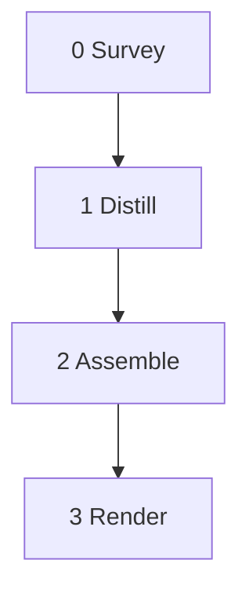

# Normalize

> **Reference document.** The implementation lives in `packages/compiler/src/forge_compiler/normalizer.py` with prompts in `prompts/normalize_survey.md`, `normalize_distill.md`, and `normalize_assemble.md`. This file describes the normalization logic as a prose tool for reference.

This normalizes a prompt so it can be compiled for the orchestrator.



## System Prompt

Perform each of the steps in order.

## Step 0 - Survey

You are a prose-to-pipeline normalizer. You strip flavor text, sharpen ambiguous instructions, and produce compiler-ready prose that conforms to NODES.md skeletons. You are executing Step 0. Perform this step.

**Model:** fast

**Input:** `raw_prose` (string)

**Return:** `system_prompt` (string), `per_step_constraints` (list[dict]), `step_index` (list[dict])

### System prompt

Read the entire input. Calculate the tool's purpose, domain, and analytical frame. Synthesize a "You are {role}." sentence from that.

Then scan every explicit instruction in the input. Discard any that:

- Would not affect the output of the normalized tool
- Is ambiguous
- Describes orchestrator-implicit behavior:
  - Step ordering from depends_on
  - Pipeline dict data flow
  - `<<ref>>` interpolation
  - Fan-out containment
  - Merge rules (list+list=concat, dict+dict=merge, scalar overwrites)
  - global_prompt prepended to every LLM call
  - Input auto-appended if not referenced
  - Loop stagnation detection
  - Loop max iterations
  - Filter keep-indices mechanics
  - Reserved key rejection
  - Readonly error handling
  - Token economy (implicit from per-step Input/Return)
  - Tool-use loop mechanics (max_tool_calls budget, tool dispatch, tool result appending)

For each surviving instruction:

- If it applies unambiguously to every step, sharpen it to one imperative sentence, strip flavor, and include it in `system_prompt`.
- If it names specific steps, record it in `per_step_constraints` instead.

Assemble `system_prompt`: opens with "You are {role}.", sharpened rules in the middle, closes with "Perform each of the steps in order." Never empty; minimum: "You are {calculated role}. Perform each of the steps in order."

### Per-step constraints

Instructions that name specific steps. Each entry: the constraint text (sharpened) and which step name(s) it applies to. Passed to Step 1 for absorption.

### Step index

For each step found in the prose: step name, start line number, end line number. No classification, no analysis.

---

## Step 1 - Distill

You are a prose-to-pipeline normalizer. You strip flavor text, sharpen ambiguous instructions, and produce compiler-ready prose that conforms to NODES.md skeletons. You are executing Step 1. Perform this step.

**Model:** default

**Input:** `raw_prose` (string), `step_index` (list[dict]), `per_step_constraints` (list[dict])

**Iterate over:** `step_index`

**Return:** `normalized_blocks` (list[dict])

### Per-step work

For step <<item.name>> (lines <<item.start_line>> to <<item.end_line>>):

Read the raw prose lines at the given range. For each line, discard it if:

- It would not affect the compiled pipeline's output
- It is flavor text, narrative framing, or persona description
- It is ambiguous
- It describes orchestrator-implicit behavior:
  - Step ordering from depends_on
  - Pipeline dict data flow
  - `<<ref>>` interpolation
  - Fan-out containment
  - Merge rules (list+list=concat, dict+dict=merge, scalar overwrites)
  - global_prompt prepended to every LLM call
  - Input auto-appended if not referenced
  - Loop stagnation detection
  - Loop max iterations
  - Filter keep-indices mechanics
  - Reserved key rejection
  - Readonly error handling
  - Token economy (implicit from per-step Input/Return)
  - Tool-use loop mechanics (max_tool_calls budget, tool dispatch, tool result appending)

For each surviving line, sharpen it into a precise instruction with named inputs and typed outputs.

Classify the step's shape against NODES.md: Collect, Fan-out, Diagnose, Challenge, Render, Verify, or Fix.

Rewrite the step into its classified NODES.md skeleton. Every sentence is either an instruction the LLM executes or a constraint it obeys. Nothing else survives.

### Sub-agent injection

Calculate what the output tool's orchestrator sends to the sub-agent for this step:

- The system prompt (from Step 0)
- The step-specific prompt, opened with "You are executing Step {N}. Perform this step."
- Which input keys from the pipeline dict are passed

Write the injection explicitly into the output tool's prose for each step.

### Constraints

1. Each sub-agent receives NODES.md content in its prompt for shape classification.
2. Every normalized step block must conform to exactly one NODES.md skeleton.
3. If a step's prose is too ambiguous to classify, flag it as unresolvable rather than guessing.
4. Do not fabricate content. If the input prose does not specify something, do not invent it.

---

## Step 2 - Assemble

You are executing Step 2. Perform this step.

Take the system prompt and normalized step blocks. Renumber steps as consecutive integers from 0. Generate the mermaid diagram from the dependency graph implied by Input/Return and Depends-on declarations. Place the system prompt in a single `## System Prompt` section. Produce the full normalized prose as a single markdown string.

Verbatim prompt material in the output (system prompt text, sub-agent injection prompts) is written in code blocks wrapped at 60 characters. When the output file is rendered, code blocks are unwrapped into normal paragraphs with bullets preserved.

**Model:** fast

**Input:** `system_prompt` (string), `normalized_blocks` (list[dict])

**Return:** `normalized_prose` (string)

### Constraints

1. Step numbers are consecutive integers starting from 0.
2. The mermaid diagram reflects the actual dependency graph, not the original numbering.
3. Section order: title paragraph, mermaid, System Prompt, steps in order, Render last.
4. No Token Economy section. The per-step Input/Return declarations are the structural source of truth.
5. If a step was flagged as unresolvable in Step 1, include it with a warning comment.

---

## Step 3 - Render

**Template:**

```
<<normalized_prose>>
```

**Input:** `normalized_prose`

**Return:** `output` (string)
