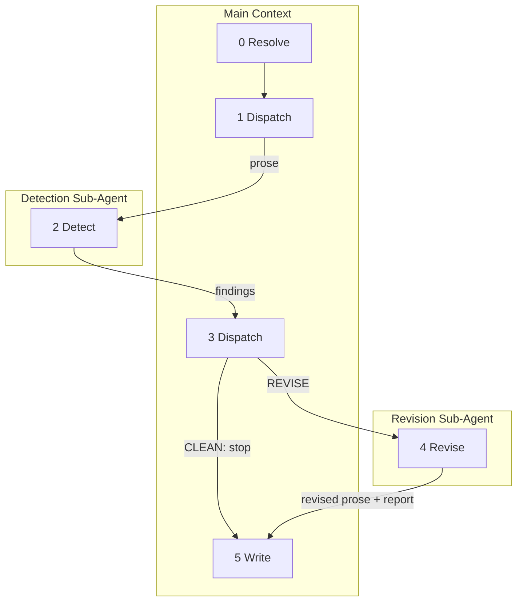

# The Revise

A standalone tightener for AI-generated prose. Point it at a chapter and it detects structural AI tells, fixes what it can, and reports what it cannot. No story bible. No pen file. Input is a file path.

Cutting is the primary operation. Most AI tells are fixed by deletion, not rewriting. The tool's bias is toward shorter, not different.

No cache. The tool runs on a different chapter each time.



Main context never reads chapter prose. Both sub-agents do.

### System Prompt

Both sub-agents receive this directive at the top of their instructions:

> If at any point you must deviate from the standing instructions -- rewriting prose you were not asked to touch, introducing material not drawn from the chapter's existing inventory, skipping a finding without stating why, or exceeding the two-shot limit on adjustments -- emit a deviation note: what you did, why, and rate its significance low, medium, or high.

---

## Step 0: Resolve (fast)

```
"Revise [file path]."
"Revise chapter N."
"Revise chapter N of [book]."
```

Input is one chapter file. No other inputs. If invoked with a chapter number, resolve the file using the book's `chapters/` directory. Main context reads only the file path.

---

## Step 1: Dispatch to Detection (fast)

Main context passes the file path to the detection sub-agent. Main context never reads chapter prose.

---

## Step 2: Detect (strong)

The detection sub-agent reads the chapter and applies the rule checklist below. Each check is binary: violation or not. Checks that pass are not reported.

Before applying rules, the sub-agent scans the chapter for passages that carry irreplaceable load. Two categories:

- **Sole carrier** -- the only instance of a specific physical detail, named object, or sensory element in the chapter.
- **Juxtaposition half** -- one side of a paired contrast where both halves are rendered at comparable resolution (a demo kitchen vs. a real kitchen, filtered air vs. open air). Cutting one half collapses the pair into a statement.

Annotated passages are not exempt from detection. If a rule fires on an annotated passage, the finding carries a bracketed tag -- `[sole-carrier]` or `[juxtaposition-half]` -- after the group label. The tag is informational; the revision agent makes the final call.

The rules are organized into three groups -- Trust, Architecture, Dialogue -- applied in that order. The groups are not separate steps; the sub-agent applies all rules in a single pass over the chapter.

### Trust

Does the prose trust the reader?

- **RULE: SHOW-THEN-TELL** A concrete scene demonstrates a fact, feeling, or dynamic. A subsequent sentence restates that fact in abstract terms. The restating sentence is the tell. CUT the tell. Test: cover the suspect sentence with your hand. Does the scene still land? If yes, the sentence is fat.
- **RULE: DECLARATIVE FRAME** A sentence explains what an action or scene will mean before the action or scene occurs. The explanation precedes the demonstration. CUT the frame. Test: does the sentence contain a claim about significance, meaning, or purpose, and does a scene within the next three paragraphs demonstrate that same claim? If yes, the sentence is a frame.
- **RULE: EXPLICIT BRIDGE** A simile or comparison whose vehicle is a pattern already established three or more times in the chapter through repetition, juxtaposition, or parallel construction. The structure already *is* the bridge; the simile spells it out. CUT the simile. Test: count prior occurrences of the vehicle's referent. Three or more means the connection is already built.
- **RULE: RECURSIVE RESTATEMENT** A sentence states an insight. The next sentence restates it with the key word repeated or a synonym substituted. CUT the second sentence. Test: do adjacent sentences share a content word or its synonym while making the same claim? If yes, the second is restatement.
- **RULE: REDUNDANT INTERIORITY** A character's internal state is narrated after the prose already showed it through action, object, or dialogue within the preceding two paragraphs. CUT the interiority. Test: remove the interiority sentence. Is the character's state still legible from the surrounding action? If yes, the interiority is redundant.
- **RULE: OVER-ATTRIBUTION** The narrator explains why a character performed an action when the action's motive is already visible from context, dialogue, or established character behavior in this chapter. CUT the attribution. Test: does the sentence contain "because," "since," "in order to," "so that," or a purpose clause following a character action? If the preceding scene already supplied the reason, the attribution is redundant.
- **RULE: EDITORIAL INTRUSION** The narrator leaves the POV character's sensory or experiential frame to make a general claim about systems, institutions, human nature, or the world. CUT the intrusion. Test: could the sentence appear in an essay without modification? If yes, it is editorial.

### Architecture

Does the chapter's structure reveal the machine?

- **RULE: TRIPLE RENDERING** The same thesis or argument appears in three or more locations across different modes -- narration, dialogue, interiority, or exposition. Search for any claim that appears in both narration and dialogue. If it also appears in a third location (a different passage of narration, a different speech, interiority), the weakest of the three is the tell. CUT the weakest rendering. Test: state the thesis in one sentence. Search the chapter for every passage that makes this claim. Count the locations. Three or more is triple rendering.
- **RULE: ATMOSPHERIC INVENTORY** A paragraph or block of sensory or environmental detail where the POV character is not acting in, moving through, or perceiving-in-response-to the described space during that paragraph. The block sits inert. CUT or REDISTRIBUTE the details into nearby paragraphs where the character is acting in the space. Test: is the POV character's body doing something in this space during this paragraph -- walking, looking, reaching, reacting? If the character is stationary and the paragraph is pure description, it is inventory.
- **RULE: FRONT-LOADED ESTABLISHMENT** Three or more consecutive paragraphs at the start of a chapter or scene in which the POV character does not perform a volitional action, speak, or move through the space. Static perception -- taking in a scene without responding to a specific stimulus -- does not count as action. (Contrast with ATMOSPHERIC INVENTORY, where reactive perception -- looking at something, reaching, reacting to a change -- does count.) The block stalls momentum before the reader has any. REDISTRIBUTE details into later paragraphs where character action provides a vehicle. Test: from the chapter opening (or the first paragraph after a scene break), count consecutive paragraphs where the character's only role is static presence or passive intake. Three or more is front-loaded.
- **RULE: UNIFORM ALTITUDE** Sentence-length variance falls below 20% of mean sentence length for five or more consecutive paragraphs. FLAG with location and the measured variance. Detection only -- the fix requires authorial judgment about where to break the pattern.

### Dialogue

Does speech sound spoken?

- **RULE: ESSAYISTIC SPEECH** Dialogue that contains a complete argument structure: claim, supporting evidence or reasoning, and conclusion, delivered in sequence without interruption, hedging, or compression. REWRITE by applying at least two of the following: (a) remove one premise and let the conclusion stand unsupported, (b) break the sequence with an interruption, gesture, or action beat, (c) compress the middle so the speaker jumps from setup to conclusion, (d) let the speech trail off or end on a question instead of a conclusion. The content survives; the argument structure does not.
- **RULE: UNIFORM VOICE** Two or more characters whose dialogue is interchangeable. FLAG with the characters involved and one sample line from each that could be swapped without the reader noticing. Test: swap the attribution tags on two lines of dialogue. If neither line sounds wrong in the other character's mouth, the voices are uniform.

### Limitation: Evenness of Quality

This tool cannot detect evenness of quality -- the subtlest AI tell. When every paragraph in a chapter operates at the same competence level with no risk, no reaching, and no passage where the writer leaned into difficulty, the chapter reads as generated. This is not fixable by cut or rewrite and not reliably detectable by a sub-agent. If the chapter passes all rules above and still reads flat, it may need manual rewriting in specific passages. That work is outside this tool's scope.

### Detection Output

Each finding is numbered and carries: rule name, quoted evidence (the passage), location (paragraph number or approximate position), group (Trust / Architecture / Dialogue), and an optional carrier tag (`[sole-carrier]` or `[juxtaposition-half]`) if the passage was annotated during the pre-scan. Checks that pass are not reported. No commentary on things that work.

Verdict:

- **CLEAN** -- all rules clear. The main context tells the user the chapter is clean and stops. Skip to Step 6.
- **REVISE** -- one or more violations found. Numbered findings, grouped by Trust, Architecture, Dialogue, separated by blank lines.

No preference-level notes. No alternative phrasing. No findings that cannot cite a specific rule from the checklist above.

---

## Step 3: Dispatch to Revision (fast)

If the verdict is CLEAN, the main context reports it and stops. No further steps.

If the verdict is REVISE, the main context forwards the numbered findings to the revision sub-agent. The revision sub-agent receives:

1. **The chapter prose** -- the full chapter file.
2. **The numbered findings** from Step 2 (rule, evidence, location, and carrier tags where present). No pre-computed directives; the revision agent determines the fix.

The main context never reads the chapter prose.

---

## Step 4: Revise (strong)

The revision sub-agent applies fixes using the tier system and per-finding evaluation below.

### Standing Instructions

- Make the minimum change that addresses the finding. Do not rewrite surrounding prose that was not flagged.
- Preserve the chapter's existing voice and rhythm. New or replacement prose must be indistinguishable from the surrounding text.
- Do not introduce new AI tells. Every replacement sentence must pass the rules in the detection checklist.
- Do not add new scenes, characters, or plot events.
- Do not rearrange paragraphs.
- Cosmetic connective tissue (conjunctions, transitions, paragraph breaks) is permitted for seam-smoothing. New action, new description, new interiority is not.
- When cutting, verify the cut does not orphan a paragraph transition. If it does, smooth the seam with the minimum cosmetic change to the surrounding prose.

### Tiers

Findings fall into three tiers. The tier determines how aggressively the sub-agent pursues a fix.

**Tier 1: Trust findings.** Show-then-tell, declarative frame, explicit bridge, recursive restatement, redundant interiority, over-attribution, editorial intrusion. Almost always clean cuts -- the showing is the good prose, the explaining is the fat. CUT the explanation. Keep the image. Do not backfill with new material. After cutting, check the seam: if the remaining prose flows, done. If the cut creates an abrupt join, smooth the seam with minimum cosmetic change. No new events, no new action, no new beats. The chapter will get shorter. That is acceptable.

**Tier 2: Architecture findings.** Triple rendering, atmospheric inventory, front-loaded establishment. May require deletion of a full paragraph or redistribution of sensory details into nearby action beats. Higher risk. More likely to need the adjust path. New prose for redistribution must draw from the chapter's existing object inventory and sensory environment.

**Tier 3: Dialogue findings.** Essayistic speech. Requires rewriting, not cutting. The content of the dialogue survives; the argument structure does not. The fix is constrained to the four-operation menu in the rule definition. Hardest tier. Most likely to be skipped if the fix sounds worse than the original.

### Per-Finding Evaluation

For each numbered finding, the sub-agent follows this sequence:

1. **Read the passage in full paragraph context.**
2. **Triage.** Does the passage carry something that would be lost -- a plot-essential detail, the chapter's only instance of a specific image, a transition the surrounding prose depends on? Findings tagged `[sole-carrier]` or `[juxtaposition-half]` are strong skip candidates; the passage's carrier role outweighs the violation unless keeping the passage actively damages the chapter. If removing it orphans something downstream, **skip**. If not, proceed.
3. **Apply the fix.**
4. **Compare the old passage to the new passage.**
5. **Judge: accept, adjust, or reject.**

**Skip** -- the passage carries load that outweighs the violation. The violation is real but any fix would lose more than it gains. The sub-agent notes the finding and what load the passage carries.

**Accept** -- the fix is a clean win. All of the following hold:

- The finding is resolved.
- No new AI tells are introduced.
- The surrounding prose is undamaged.
- The fix is the minimum necessary change.

**Adjust** -- the fix addressed the finding but lost something the original had. The new version went in the right direction but overshot: trimmed too much, flattened a good image, dropped a rhythm, cut a transition the next paragraph needed. The sub-agent takes a second pass:

- Identify what the new version got right (the finding is addressed).
- Identify what it lost (the specific quality from the original).
- Rewrite to keep the improvement while restoring what was lost.
- Compare the adjusted version to the original one more time.
- If the adjusted version is now a clean win, accept it.
- If it is still not clean, reject it.

Two shots maximum. No infinite refinement.

**Reject** -- the fix made things worse, or cannot be applied without collateral damage that a second pass cannot recover. Keep the original passage.

### Revision Output

The sub-agent returns:

1. **The revised chapter** -- the full chapter text with accepted and adjusted-then-accepted fixes applied. Skipped and rejected findings leave the original text in place.
2. **Per-finding report** -- one line per finding:
   - Skip: the finding, plus what load the passage carries.
   - Accept: what was done.
   - Adjust (accepted): what the first pass lost, what the second pass restored, what was done.
   - Reject: the original finding restated, plus why the fix failed.
3. **Deviation notes** -- any deviations from the system prompt, with significance rating.

---

## Step 5: Write and Report (fast)

The main context writes the revised chapter back to the chapter file, replacing the previous contents. The per-finding report is displayed to the user but not written to disk.

The report groups outcomes under headers. Each entry is a bullet. Empty groups are omitted. The report is prose and wraps to the reader's window; do not enclose it in a code fence.

### N fixes applied

- **1.** [what was done] -- accepted
- **3.** [first-pass loss, second-pass restoration] -- adjusted

### K skipped

- **5.** [finding] -- [what load the passage carries]

### J unresolved

- **2.** [finding] -- [why rejected]
- **4.** [finding] -- [why rejected after adjustment]

### Deviations

- [what was done, why, significance]

If no deviations, omit this group.

After the groups, emit a completion breadcrumb:

```
{"findings": N, "applied": K, "skipped": J, "rejected": M, "deviations": D}
```

Closing line: Run "Revise [path]" again to retry unresolved findings.

---

## License

All content in this file is dedicated to the public domain under [CC0 1.0 Universal](https://creativecommons.org/publicdomain/zero/1.0/).
