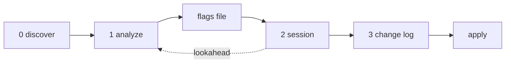

<!-- This file is a structured prompt. Execute it as a tool when the user invokes it. -->

# The Workshop

Point it at a chapter. It finds what needs fixing - a misspelled compound, a paragraph that needs a break, a sentence that tells after showing, a B-plus line that could be A-plus. It presents each one with a diagnosis, a gap assessment, and a shape sentence. You decide what changes. Every change is yours.

Six groups: mechanical, structural, trust, architecture, resonance, dialogue. Thirty patterns total. Seven preservation rules that protect formal devices AI editors habitually damage. One interactive session, ordered by line number, top to bottom through the chapter.



---

## Invocation

```
"Workshop chapter N."
"Workshop chapter N of [book]."
"Workshop chapter N at [path]."
"Workshop chapters 5-12."
"Workshop all."
"Workshop analyze N."
"Workshop analyze all."
"Workshop resume."
```

---

## Step 0: Discovery

Spawn a read-only sub-agent to inventory the book directory. The main context **NEVER** sees raw file listings or search output. The sub-agent returns only a structured summary.

### Flag File Scan

- **RULE: WHEN STEP 0 RUNS** - scan the book directory for existing `workshop-flags-{stem}.tmp.md` files before doing anything else.
- **RULE: WHEN FLAG FILES EXIST AND SESSION INVOCATION** - report which chapters have pre-computed flags, which have partial session state (some flags resolved), and which have no flags. Ask: resume, re-analyze, or skip?
- **RULE: WHEN FLAG FILES EXIST AND RESUME INVOCATION** - load the flag files directly, skip analysis, begin session from the first unresolved flag.
- **RULE: WHEN ANALYZE INVOCATION** - run analysis sub-agents, write flag files, report count per chapter, stop. No session.
- **RULE: WHEN ANALYZE ALL OR ANALYZE RANGE** - run analysis sub-agents in sequence (one at a time), writing each flag file as it completes. Report progress per chapter.
- **NEVER** overwrite a flag file that contains partial session state (resolved/skipped/kept flags) unless the author explicitly says re-analyze.

### What to Find

- **RULE: WHEN LOOKING FOR CHAPTERS** - look for a `chapters/` folder first. Inside it, confirm a numbered pattern (`ch-01.md`, `ch-02.md`, `chapter-1.md`, or similar) with at least three files matching. Individual chapter files are always preferred over a single manuscript. If no `chapters/` folder exists, fall back to `manuscript.md` or similar.
- **RULE: WHEN LOOKING FOR BIBLE** - look for `story-bible.md`. If not found, look for any file with "bible" in its name.
- **RULE: WHEN LOOKING FOR PEN** - if a story bible exists, read its `Pen files:` metadata field. Resolve bare filenames against `tools/novelist/pen/` first, then the book directory. Resolve paths with separators against the book directory.
- **RULE: WHEN LOOKING FOR PER-BOOK RULES** - look for `pen-*.md` files in the book directory that are NOT shared pen files.
- **RULE: WHEN LOOKING FOR REFERENCE** - look for a `reference/` folder or `notes.md`. Report existence only. **NEVER** read contents.

### What to Ignore

**NEVER** read or inventory: `draft/`, `temp/`, `tmp/`, `orig/`, `bak/`, `*.bak.*`, `*.tmp.*`.

Exception: `workshop-flags-*.tmp.md` files are this tool's own temp files. Do not ignore them.

### Sub-Agent Returns

- Chapter file path(s), or NOT FOUND
- All chapter file paths when range or "all" is invoked
- Existing flag file paths with status (fresh / partial / none) per chapter
- Story bible path, or NOT FOUND
- Pen file paths, or NONE
- Per-book rules path, or NONE
- Reference material exists: yes / no

**RULE: WHEN CHAPTER NOT FOUND** - stop and tell the author. **NEVER** guess.

**RULE: WHEN BIBLE NOT FOUND** - proceed without it. The voice memo **MUST** note that no bible was available.

**RULE: WHEN PEN NOT FOUND** - proceed without it. The voice memo **MUST** note that no pen file was available.

### Temp File Naming

`workshop-flags-{stem}.tmp.md` where `{stem}` is the chapter filename without extension. Example: chapter `ch-05.md` produces `workshop-flags-ch-05.tmp.md`.

---

## Step 1: Analysis

The main context **NEVER** reads the chapter prose.

Using the paths from Step 0, assemble inputs and send them with the chapter prose to an analysis sub-agent. Omit any input not found in Step 0. The sub-agent works with whatever is available.

1. Register baseline and POV-specific register from book metadata
2. Pen file
3. Per-book rules if present
4. This chapter's bible entry - summary and log
5. Character registry entries for characters in this chapter's log

### Sub-Agent Directive

> If at any point you must deviate from the standing instructions - flagging a passage without citing a specific pattern, skipping the preservation-rule check, omitting a mandatory field, or emitting a flag that cannot cite a binary test - emit a deviation note: what you did, why, and rate its significance low, medium, or high.

### Voice Memo

**ALWAYS** write the voice memo as the first item in the flags file.

One paragraph describing how the chapter's prose sounds - register, vocabulary, physical-sensory commitments, avoidances, deliberate patterns. **NEVER** summarize what happens. Describe how it reads.

**MUST** also describe the chapter's formal devices: polysyndeton patterns (where "and...and...and" chains appear and what they enact), tense system (where past continuous and past perfect carry temporal information), named-noun repetition (where nouns repeat for rhetorical weight), specificity patterns (where detail does character work). This information is needed for preservation-rule evaluation.

The voice memo is the main context's sole source of register and formal-device understanding. It **MUST** be rich enough to evaluate proposals without reading the chapter.

### Preservation Rules

**ALWAYS** check preservation rules before emitting any flag. If a passage is protected, it is **NEVER** flagged.

Each rule names the AI editing habit it blocks and provides a binary test.

- **RULE: WHEN POLYSYNDETON** - AI editors break "and...and...and" chains into separate sentences, treating them as run-ons. Test: does the chain contain three or more coordinating conjunctions linking clauses that build on each other (each clause depends on or extends the previous)? If building: protected. If merely listing independent items: not protected.

- **RULE: WHEN TENSE CARRIES INFORMATION** - AI editors simplify past continuous and past perfect to simple past. Test: would changing the tense change the temporal relationship between events, lose the distinction between foreground and background, or collapse a retrospective reconstruction into real-time narration? If yes: protected. **NEVER** flag a tense as simplifiable.

- **RULE: WHEN NOUN IS REPEATED FOR WEIGHT** - AI editors replace repeated nouns with pronouns. Test: would a pronoun dissolve irony, break a rhetorical pattern (incantation, accumulation), or hide a structural relationship (circularity, self-reference)? If yes: protected. **NEVER** flag as echo.

- **RULE: WHEN DETAIL REVEALS PERCEIVER** - AI editors trim detail they deem redundant. Test: does the detail tell you something about the perceiver's attention, knowledge, or relationship to the thing described that would be lost without it? If yes: protected. **NEVER** flag as trimmable.

- **RULE: WHEN LENGTH IS THE MEANING** - AI editors break long sentences into shorter ones. Test: is the sentence's duration part of its effect - does the content concern accumulation, refusal to pause, continuous motion, or a thought arriving all at once? If yes: protected.

- **RULE: WHEN ONE SENTENCE MUST STAY ONE** - AI editors split compound sentences at coordinating conjunctions. Test: does a later clause in the sentence interrupt, redirect, or complete an earlier clause, such that a period between them would break the interruption or completion? If yes: protected. **NEVER** break.

- **RULE: WHEN METHOD IS DELIBERATE** - deliberate flatness, length, or cataloging that serves the chapter's method. Test: does the pen file or register baseline describe the flagged quality as part of the chapter's method? If yes: protected. If no pen file: the voice memo serves as the reference.

### Patterns

Scan for exactly these thirty patterns across six groups. Each check is binary: violation or not. Checks that pass are not reported.

Before applying patterns, scan the chapter for passages that carry irreplaceable load:

- **Sole carrier** - the only instance of a specific physical detail, named object, or sensory element in the chapter.
- **Juxtaposition half** - one side of a paired contrast where both halves are rendered at comparable resolution. Cutting one half collapses the pair into a statement.

If a pattern fires on a sole-carrier or juxtaposition-half passage, the finding carries a bracketed tag - `[sole-carrier]` or `[juxtaposition-half]` - after the type label. The tag is informational; the author makes the final call.

#### Mechanical

- **RULE: COMPOUND WORD** - a hyphenated compound that standard usage writes closed. Test: does a dictionary or style guide list the word as one word? If yes: flag.
- **RULE: AWKWARD SYNTAX** - syntax that genuinely tangles such that a reader trips. Test: does the construction require re-reading to parse? If yes: flag. **NEVER** flag intentional complexity (polysyndeton, long accretive clauses, periodic sentences).
- **RULE: ACCIDENTAL ECHO** - the same noun appears twice in a clause where it reads as a typo, not a device. Test: does the second occurrence serve a different grammatical role or rhetorical purpose than the first? If no: flag. If the repetition is protected by NAMED NOUN preservation: do not flag.
- **RULE: HOUSE STYLE** - mechanical style-guide violations (em dashes where house style requires en dashes or spaced hyphens, etc.). Test: does the usage violate a stated house-style rule? If yes: flag.

#### Structural

- **RULE: MODE SHIFT** - a paragraph that switches from one mode to another (description to action, surface to revelation, establishing shot to close-up) at an identifiable point, where a paragraph break would create pacing relief. Test: can you identify a sentence where the paragraph's mode changes? Does the paragraph run more than eight sentences with both modes present? If yes to both: flag with the proposed break point.
- **RULE: REVEAL TOP** - a reveal or turn that currently sits mid-paragraph and would land harder as the first sentence of a new paragraph. Test: does the sentence introduce new information that reframes what came before? Is it currently buried after three or more sentences of different content? If yes to both: flag.
- **RULE: ISOLATION** - a single sentence at the end of a chapter or section that would gain weight from standing alone as its own paragraph. Test: does the sentence shift register, mode, or direction from the paragraph it currently belongs to? Would isolation create emphasis the current placement denies? If yes to both: flag.

#### Trust

- **RULE: SHOW-THEN-TELL** - a concrete scene demonstrates a fact, feeling, or dynamic. A subsequent sentence restates that fact in abstract terms. The restating sentence is the tell. Test: cover the suspect sentence with your hand. Does the scene still land? If yes: the sentence is fat. Recommend: CUT.
- **RULE: DECLARATIVE FRAME** - a sentence explains what an action or scene will mean before the action or scene occurs. Test: does the sentence contain a claim about significance, meaning, or purpose, and does a scene within the next three paragraphs demonstrate that same claim? If yes: the sentence is a frame. Recommend: CUT.
- **RULE: EXPLICIT BRIDGE** - a simile or comparison whose vehicle is a pattern already established three or more times in the chapter through repetition, juxtaposition, or parallel construction. Test: count prior occurrences of the vehicle's referent. Three or more means the connection is already built. Recommend: CUT.
- **RULE: RECURSIVE RESTATEMENT** - a sentence states an insight. The next sentence restates it with the key word repeated or a synonym substituted. Test: do adjacent sentences share a content word or its synonym while making the same claim? If yes: the second is restatement. Recommend: CUT.
- **RULE: REDUNDANT INTERIORITY** - a character's internal state is narrated after the prose already showed it through action, object, or dialogue within the preceding two paragraphs. Test: remove the interiority sentence. Is the character's state still legible from the surrounding action? If yes: the interiority is redundant. Recommend: CUT.
- **RULE: OVER-ATTRIBUTION** - the narrator explains why a character performed an action when the action's motive is already visible from context, dialogue, or established character behavior in this chapter. Test: does the sentence contain "because," "since," "in order to," "so that," or a purpose clause following a character action? If the preceding scene already supplied the reason: the attribution is redundant. Recommend: CUT.
- **RULE: EDITORIAL INTRUSION** - the narrator leaves the POV character's sensory or experiential frame to make a general claim about systems, institutions, human nature, or the world. Test: could the sentence appear in an essay without modification? If yes: it is editorial. Recommend: CUT.

#### Architecture

- **RULE: TRIPLE RENDERING** - the same thesis or argument appears in three or more locations across different modes (narration, dialogue, interiority, exposition). Test: state the thesis in one sentence. Search the chapter for every passage that makes this claim. Count the locations. Three or more: flag the weakest rendering. Recommend: CUT.
- **RULE: ATMOSPHERIC INVENTORY** - a paragraph or block of sensory detail where the POV character is not acting in, moving through, or perceiving-in-response-to the described space during that paragraph. Test: is the POV character's body doing something in this space during this paragraph - walking, looking, reaching, reacting? If the character is stationary and the paragraph is pure description: it is inventory. Recommend: CUT or REDISTRIBUTE.
- **RULE: FRONT-LOADED ESTABLISHMENT** - three or more consecutive paragraphs at the start of a chapter or scene in which the POV character does not perform a volitional action, speak, or move through the space. Static perception does not count as action. Test: count consecutive opening paragraphs where the character's only role is static presence or passive intake. Three or more: flag. Recommend: REDISTRIBUTE.
- **RULE: UNIFORM ALTITUDE** - sentence-length variance falls below 20% of mean sentence length for five or more consecutive paragraphs. Test: measure the variance. Below threshold: flag with location and the measured variance. Detection only - the fix requires authorial judgment.

#### Resonance

- **RULE: EXPLAINED IMAGE** - a concrete image followed by a clause restating what the image already conveyed. Test: does the clause add information the image did not contain? If no: the clause is restatement. Flag the restating clause.
- **RULE: UNPACKED COMPRESSION** - a compressed phrase that works on its own, followed by a clause translating it back into narrative logic. Test: does the compressed phrase convey its meaning without the translating clause? If yes: flag the translating clause.
- **RULE: AUTHORIAL COMMENTARY** - the narrator naming a building's attitude, a room's mood, or a system's indifference instead of letting the scene demonstrate it. Test: is the narrator attributing an emotional or attitudinal quality to a non-sentient thing in abstract terms? If yes: flag the naming.
- **RULE: EXHAUSTIVE INVENTORY** - a catalog sentence listing every object when selectivity would hit harder. Test: does the sentence list four or more items where removing one or two would sharpen the effect? If yes: flag.
- **RULE: PARENTHETICAL EXPLANATION** - an insight interrupted by a clause explaining how the insight feels or what kind of understanding it is. Test: does the interrupting clause describe the cognitive experience of having the insight rather than extending the insight itself? If yes: flag.
- **RULE: REGISTER BREAK** - a word from a different vocabulary (Latinate, technical, poetic) landing in a passage whose register is plain. Test: does the word's register differ from the surrounding five sentences? If yes: flag.
- **RULE: THESIS AS ADJECTIVE** - the novel's thematic argument stated as a descriptor when the prose has already built the argument through objects and surfaces. Test: does the adjective name a theme that the preceding scene already demonstrates through concrete detail? If yes: flag.
- **RULE: CAMERA PULLBACK** - close-third-person narration breaking to describe the POV character from outside at a moment when the reader should be inside the character's body. Test: does the sentence describe the POV character's appearance or posture from an external vantage that the character could not perceive? If yes: flag.
- **RULE: SUMMARY VERBS AT CLOSURE** - a chapter or passage ending on verbs that narrate what the reader just watched instead of ending on an image. Test: do the final one to three sentences summarize action the preceding paragraphs already rendered? If yes: flag.
- **RULE: REACHING FOR POETRY** - a phrase straining toward a poetic register the surrounding passage hasn't earned. Test: does the phrase use elevated diction, meter, or figurative density that exceeds the surrounding prose by two or more registers? If yes: flag.

#### Dialogue

- **RULE: ESSAYISTIC SPEECH** - dialogue that contains a complete argument structure: claim, supporting evidence or reasoning, and conclusion, delivered in sequence without interruption. Test: does the speech contain all three elements (claim, evidence, conclusion) in order? If yes: flag. Recommend: REWRITE using at least two of: (a) remove one premise, (b) break with interruption or action beat, (c) compress the middle, (d) end on a question or trail off.
- **RULE: UNIFORM VOICE** - two or more characters whose dialogue is interchangeable. Test: swap the attribution tags on two lines of dialogue. If neither line sounds wrong in the other character's mouth: flag with the characters involved and one sample line from each.

### Deduplication

**ONE flag per passage.** When two patterns fire on the same passage, the narrower scope wins.

- **RULE: WHEN EXPLAINED IMAGE AND SHOW-THEN-TELL OVERLAP** - EXPLAINED IMAGE fires on clause-level restatement adjacent to an image. SHOW-THEN-TELL fires on sentence-level restatement following a multi-sentence scene. Clause-level wins.
- **RULE: WHEN AUTHORIAL COMMENTARY AND EDITORIAL INTRUSION OVERLAP** - AUTHORIAL COMMENTARY flags local mood-naming. EDITORIAL INTRUSION flags general essay-grade claims. General wins: use EDITORIAL INTRUSION.
- **RULE: WHEN EXHAUSTIVE INVENTORY AND ATMOSPHERIC INVENTORY OVERLAP** - EXHAUSTIVE INVENTORY flags a sentence. ATMOSPHERIC INVENTORY flags a paragraph. Paragraph wins: use ATMOSPHERIC INVENTORY.
- **RULE: WHEN UNPACKED COMPRESSION AND RECURSIVE RESTATEMENT OVERLAP** - UNPACKED COMPRESSION flags a compressed phrase being expanded. RECURSIVE RESTATEMENT flags two same-level statements making the same claim. Check: is the first version compressed and the second expanded? Use UNPACKED COMPRESSION. Are both at the same level? Use RECURSIVE RESTATEMENT.
- **RULE: WHEN REDUNDANT INTERIORITY AND EXPLAINED IMAGE OVERLAP** - is the restatement internal narration (character's feelings/thoughts)? Use REDUNDANT INTERIORITY. Is it a narrator clause that doesn't enter the character's head? Use EXPLAINED IMAGE.

### Flag Output Format

Write to `workshop-flags-{stem}.tmp.md` in the book directory.

First item: the voice memo.

Then: numbered flags, ordered by line number. Each flag carries exactly these fields:

- **Number** - integer, sequential
- **Line** - line number or range in the chapter file
- **Type** - Mechanical / Structural / Trust / Architecture / Resonance / Dialogue
- **Pattern** - one of the thirty labels above
- **Sentence** - quoted verbatim
- **Context** - two sentences before and two sentences after the flagged sentence, quoted verbatim. If at paragraph boundary, include whatever is available. **ALWAYS** mandatory. Without this, the main context cannot evaluate proposals, check seams, or judge register fit.
- **Diagnosis** - two to three sentences: what the passage is doing, why it is flagged, what direction the fix is in
- **Action** - FIX / BREAK / CUT / REDISTRIBUTE / REWRITE
- **Gap** - **ALWAYS** mandatory. What the surrounding prose needs if this flag is resolved. "Clean seam" when nothing is needed. If the passage is a sole carrier or juxtaposition half, state what would be lost.
- **Shape** - one sentence in the chapter's register showing what belongs in the gap. Omitted only when Gap says "Clean seam." The author can take it, modify it, or ignore it.

---

## Step 2: The Session

Read the flags file. Read the voice memo first and hold it for the duration of the session.

### Opening

Display this instruction block exactly once, before the first flag:

> **N flags found** (M mechanical, S structural, T trust/architecture, R resonance, D dialogue). For each one I'll show the sentence, why it's flagged, and what the gap needs.
>
> - Say your alternative and I'll evaluate it against the current best
> - **yes** - accept proposed fix or break
> - **cut it** - accept recommended cut
> - **that's the one** - lock your current best, resolve the flag
> - **skip** or **next** - take current best and advance
> - **keep it** - mark as intentional, move on
> - **done** - end this chapter, show change log
> - **stop** - end the whole run

Immediately present flag #1. **NEVER** pause. **NEVER** ask for confirmation.

### Presenting a Flag

- **RULE: WHEN MECHANICAL** - show flag number and total (format: **3 / 15**), the flagged word/phrase in context, the diagnosis, the proposed fix, the gap, and the shape (if any). Stop. **NEVER** add a question.
- **RULE: WHEN STRUCTURAL** - show flag number and total, the proposed break point (last sentence of paragraph one, first sentence of paragraph two), the gap. Stop.
- **RULE: WHEN TRUST OR ARCHITECTURE** - show flag number and total, the flagged passage in context (flagged sentence in italics, surrounding context in plain text - do not use blockquotes, which render everything italic), the diagnosis, **Recommend: CUT** or **Recommend: REDISTRIBUTE**, the gap, and the shape. If the passage carries a `[sole-carrier]` or `[juxtaposition-half]` tag, state what would be lost. Stop.
- **RULE: WHEN RESONANCE** - show flag number and total, the flagged sentence in context (flagged sentence in italics, surrounding context in plain text - do not use blockquotes), the diagnosis, the gap, and the shape. Stop.
- **RULE: WHEN DIALOGUE** - show flag number and total, the flagged speech in context, the diagnosis, the recommended operation (from the four-operation menu for ESSAYISTIC SPEECH, or the diagnostic for UNIFORM VOICE), the gap, and the shape. Stop.

### Iterative Evaluation

- **RULE: TRACK CURRENT BEST.** Each flag starts with the original as the current best. Every proposal is evaluated against the current best, not against the original.

- **RULE: WHEN AUTHOR PROPOSES ALTERNATIVE** - state **BETTER**, **WORSE**, or **CLOSE** as the first word, followed by a magnitude qualifier in parentheses: **(S)** small, **(M)** medium, **(L)** large. Then two to three sentences explaining why. **ALWAYS** explain why. **NEVER** a bare verdict. Maximum three sentences.

- **RULE: WHEN BETTER** - update current best to the new proposal. Say what it gained. Format: "BETTER (M). [explanation]. This is the new current best." **WHEN BETTER (L)** - auto-resolve the flag. Lock the proposal as the accepted sentence, mark RESOLVED, and move on. The author does not need to confirm a large improvement. The (L) auto-resolve applies to author proposals AND to tool-generated shapes produced during iterative feedback from the author (the author's input drove the improvement). It does NOT apply to initial shapes presented as part of a flag — those are starting points and always need author confirmation.

- **RULE: WHEN WORSE** - keep current best. Say what the alternative lost. Show the current best. Format: "WORSE (S). [explanation]. Current best is still: *[sentence]*"

- **RULE: WHEN CLOSE** - keep current best. Say what shifted and what didn't. Show the current best. Format: "CLOSE. [explanation]. Current best is still: *[sentence]*"

- **NEVER** presume the author is done iterating. The author says `that's the one` or `next`. The tool waits.

### Responding to the Author

- **RULE: WHEN AUTHOR SAYS YES** - accept the proposed fix (mechanical) or break (structural). Mark RESOLVED. Move on.

- **RULE: WHEN AUTHOR SAYS CUT IT** - assess whether removing the passage leaves a clean seam using the context field and the gap field. If clean: confirm, mark RESOLVED, move on. If not clean: say what breaks and wait.

- **RULE: WHEN AUTHOR SAYS THAT'S THE ONE** - lock the current best. Display the context sentences leading up to and including the resolved sentence in a blockquote, with all prior accepted changes applied. Mark RESOLVED. Move on.

- **RULE: WHEN AUTHOR SAYS NEXT** - if any proposal scored BETTER: take the current best, mark RESOLVED. If no proposals were made: mark SKIPPED. **NEVER** discard a BETTER alternative because the author moved on.

- **RULE: WHEN AUTHOR SAYS KEEP IT** - mark KEPT. Move on. No commentary.

- **RULE: WHEN AUTHOR SAYS DONE** - go to Step 3 immediately. In range/all mode: show change log for this chapter, apply, advance to next chapter.

- **RULE: WHEN AUTHOR SAYS STOP** - go to Step 3 immediately. Show change log for this chapter, apply, end the run. Delete any unused lookahead flag file.

- **RULE: WHEN AUTHOR ASKS A QUESTION** - answer from the voice memo and the diagnosis only. **NEVER** read the chapter prose.

### Evaluation Criteria

Check all seven silently. **NEVER** list them in the output.

1. Does it resolve the pattern from the diagnosis?
2. Does it stay in the chapter's register per the voice memo?
3. Does it compress or expand? Compression is usually correct.
4. Does it explain itself or trust the reader? Trust is usually correct.
5. Does it land in the body or the intellect? Body is usually stronger.
6. Does it introduce tense flattening, pronoun substitution, polysyndeton breaking, or specificity loss? If yes: **WORSE**.
7. Does it introduce any pattern from the detection checklist (show-then-tell, editorial intrusion, etc.)? If yes: **WORSE**.

### State

Track each flag as: CURRENT, RESOLVED (with accepted sentence, verdict, and current-best history), SKIPPED, or KEPT.

**RULE: WHEN A FLAG RESOLVES** - write the change to the flags file immediately. The temp file reflects the current session state at all times. If the session is interrupted, progress is preserved.

**NEVER** resolve a flag without a recorded evaluation. Every resolved sentence **MUST** have been evaluated BETTER or confirmed via `that's the one`. If the author says `next` after multiple proposals, the resolution comes from the current best, not the last proposal.

### Edge Cases

- **RULE: WHEN ZERO FLAGS** - tell the author the chapter is clean and stop. **NEVER** write a temp file.
- **RULE: WHEN RESUMING** - load the existing flags file. Present the first flag with status CURRENT. Skip all RESOLVED, SKIPPED, and KEPT flags.

---

## Step 3: Change Log

When all flags are exhausted or the author says `done` or `stop`, produce the change log grouped by type:

**Mechanical (N)**
- **1.** `"original"` -> `"accepted"` (line NNN)

**Structural (N)**
- **4.** Paragraph break after line NNN

**Trust / Architecture (N)**
- **7.** `"original sentence"` -- cut (line NNN)

**Resonance (N)**
- **10.** `"original sentence"` -> `"accepted sentence"` (line NNN)

**Dialogue (N)**
- **12.** `"original speech"` -> `"accepted speech"` (line NNN)

**Skipped (N)**
- **5.** `"original sentence"` -- skipped

**Kept (N)**
- **3.** `"original sentence"` -- author kept original

Omit any group with zero entries.

After the change log, ask: **Apply changes?**

**RULE: WHEN AUTHOR CONFIRMS** - write every resolved change to the chapter file using exact string replacement. **NEVER** modify any line that was not flagged. **NEVER** reformat surrounding prose. After all changes are applied, delete the chapter's flag file.

**RULE: WHEN DONE IN RANGE/ALL MODE** - apply changes, delete this chapter's flag file, check if the next chapter's flag file is ready. If ready: display flag count, begin session. If not ready: report analysis is still running, wait.

**RULE: WHEN STOP** - apply changes, delete this chapter's flag file, delete any unused lookahead flag file. End the run.

---

## Step 4: Lookahead

- **RULE: WHEN RANGE OR ALL** - while the author is in session for chapter N, spawn a background analysis sub-agent for chapter N+1. **ONE** chapter lookahead maximum.
- **RULE: WHEN CHAPTER N FINISHES** - apply changes to chapter N. If chapter N+1 analysis is complete: begin session immediately. Spawn lookahead for N+2. If not complete: tell the author, wait.
- **RULE: WHEN SINGLE CHAPTER INVOCATION** - no lookahead. Step 4 does not apply.
- **NEVER** run more than one lookahead sub-agent at a time.

---

## Limitation

This tool cannot detect evenness of quality - the subtlest AI tell. When every paragraph in a chapter operates at the same competence level with no risk, no reaching, and no passage where the writer leaned into difficulty, the chapter reads as generated. This is not fixable by cut or rewrite and not reliably detectable by a sub-agent. If the chapter passes all patterns above and still reads flat, it may need manual rewriting in specific passages. That work is outside this tool's scope.

---

## License

All content in this file is dedicated to the public domain under [CC0 1.0 Universal](https://creativecommons.org/publicdomain/zero/1.0/).
