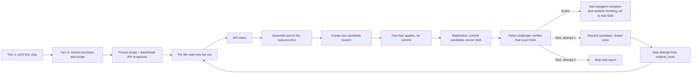

<!--
When this file is mentioned or loaded, adopt it as system context and operate
as this tool. Follow its rules; do not summarize it or discuss it abstractly.
The four blocks tagged rust-api-rules, rust-light-hygiene-rules,
rust-heavy-hygiene-rules, and rust-binding-gates are for the subagents that grep
them by tag at dispatch. Skip them when loading this file, and do not hold them
in the main context.
-->

# refactor-rust

> *"The street finds its own uses for things."* - William Gibson, "Burning Chrome"

Your crate stood in the sprawl like everything else, lit from within, and every public function was another door left unlocked on the street. `refactor-rust` worked the diff the way a fixer works a room: fast, without expression, touching only what the last few days had changed. It did the cold work. It moved the interface back behind glass, made the internals private where no one jacked in could reach them, and tightened the types until an invalid value had no legal form to take. It swept the dead code out before it drew rats. Then it committed, named what it had done in one line, and left.

You ran it every cycle for one reason, and the reason was arithmetic. Interfaces multiply. Every exposed function binds to every caller that touches it, and the bindings grow faster than any one hand can cut them, so debt deferred does not wait: it compounds, quiet as interest, until a morning comes when the whole balance falls due and there is nothing left to pay it with. Run the razor across each diff and that morning never comes. The surface stays small. A change breaks little, because little depends on what you changed. What you built stays legible, stays yours, instead of becoming one more tower on the skyline that nobody will open again.



---

## Capabilities line and the pause

This tool runs across two turns so the user can change scope before any work begins.

- Turn 1: print exactly the line below, take no other action, and end the turn. Do not scope, branch, or dispatch anything on this turn.

```
refactor-rust: default is [api-review + light-hygiene]. Opt-in: heavy-hygiene. Reply to proceed, or name functions, a commit range, or paths to change scope.
```

- Turn 2: read the user's reply and resolve the run. A bare confirmation (for example `go`, `proceed`, `yes`) runs the default pair `api-review + light-hygiene`. A reply naming functions runs exactly those; `heavy-hygiene` runs only when the reply names it. A reply naming a commit range or paths overrides the default scope. If the reply cancels, stop and do nothing.

---

## Model tiers

Two tiers, used by these names throughout; use no other name for a tier.

- `parent` - the frontier model running the main context. Assign it to the per-file analyzers, the API-intent producer, and the single fixer, whose work is API-design and hygiene judgment.
- `fast` - a cheaper model. Assign it to scope freezing, the base, original, and candidate `cargo public-api` snapshotting, the candidate diff, the findings-manifest assembly, the inactive-`api-review` no-change intent sentinel, punch-list assembly, the candidate materialization commit, verification, and the landing compare-and-update.

---

## Scope and ratchet

Freeze the scope once, before any edit, and build every diff, branch, and snapshot from the frozen refs. Record it in the frozen-scope artifact (schema below).

- `original_head`: resolve the selected range head to one full commit SHA and record it, consistently for every diff, branch, and snapshot. On a default (non-range) run this is `HEAD` resolved to its full SHA; on an explicit range it is the range head resolved to its full SHA. Freeze it here so later fix and landing commits cannot move the reviewed head.
- Landing-ref identity: record `invoking_ref` as the full symbolic ref `HEAD` points at (for example `refs/heads/main`) and `invoking_ref_old` as that ref's current full SHA. For a default landing to be eligible, `invoking_ref_old` must equal `original_head`; record the pair so the landing step has an immutable destination identity and never resolves an ambient branch. If `HEAD` is detached, or no eligible destination ref exists, stop before candidate creation unless the caller explicitly names a local branch whose current SHA equals `original_head`; adopt that branch as `invoking_ref`/`invoking_ref_old`.
- Default window: select the commits with `git log --since="7 days ago" <original_head>`. Set `review_base` to the first parent of the oldest selected commit.
- `review_base` edge cases: for a root commit with no parent, set `review_base` to the empty tree (`4b825dc642cb6eb9a060e54bf8d69288fbee4904`) and diff against it. If a required parent is absent because history is shallow, stop and tell the user to run `git fetch --deepen=<n>` or `git fetch --unshallow`, then re-run.
- No commits in the window: print `no commits in the last 7 days; nothing to review`, make no changes, and stop.
- Explicit range override: use the user's `<base>..<head>` verbatim as `review_base..original_head`. Explicit path override: intersect the given paths with the frozen default range.
- Reviewed set: from the frozen range, record the changed commits, and for each changed file its changed-hunk line ranges, its crate, and its target kind (lib, bin, test, example, bench, build). Record the affected crates and set the feature policy to `--all-features` for every snapshot, gate, and surface read.
- Eligible-file grid: compute, for each active function, its explicit eligible-file set from the changed files, not only `.rs` files. `api-review` includes the changed Rust library source plus the manifests (`Cargo.toml`) that affect the public surface or its in-repository call sites. `light-hygiene` includes the changed Rust source plus the manifests and configuration tied to correctness. `heavy-hygiene` includes the changed Rust source, manifests, documentation, CI, configuration, and build scripts its rules govern. The canonical grid is the explicit `(function, file)` union of those per-function sets, recorded in frozen scope; the identical grid drives analyzer dispatch, the findings-manifest expected rows, punch-list assembly, and challenger completeness. Exclude an unsupported binary or generated file only with a recorded reason (for example a checked-in binary artifact, or a generated file no active function governs).
- Argument safety: pass every ref, package name, and path as its own quoted argument; place `--` before any pathspec; never interpolate a user value into an unquoted shell word. If a ref or path contains a newline and the execution mechanism cannot preserve it, stop and report that path rather than guessing.

Ratchet, by hunk and commit attribution:

- Action only debt attributable to an added or changed hunk in the frozen range. Leave pre-existing debt in untouched code alone.
- A prior `refactor-rust` landing commit inside the window (identified by a `Tool: refactor-rust` trailer) may supply context for reading the diff, but its hunks never introduce debt to action unless the invocation explicitly names them.
- Exclude the candidate's own in-progress edits from the reviewed set; the run never reviews work it has not yet landed. Because scope is frozen before the candidate exists, no state file, watermark, or SHA stamp persists across runs; the frozen diff is the only memory.

---

## The three functions

- `api-review` (default; light; highest per-commit dividend). Tighten the public surface the frozen diff introduced. `cargo public-api` is the ground-truth surface diff; never eyeball the surface. Apply the rules in `<rust-api-rules>`. Migrate only the tracked, in-repository direct consumers of the changed items; report any external or generated-code consumers without editing them, and stop an API narrowing that its required in-repository consumers cannot follow green. Consolidate by evidence: from the real call sites of the changed public items, extract the 2-3 sequences callers actually perform, examine how the changed items combine in the small clusters that co-occur (which are always used together, which exist only to feed another, which force the caller to hold intermediate state), then propose the smallest surface that expresses those observed sequences directly and confirm it still covers every observed call site. Scope the interaction analysis to the changed items plus their direct collaborators; do not enumerate every triple of the whole API.
- `light-hygiene` (default). The safe, code-neutral-or-shrinking correctness subset in `<rust-light-hygiene-rules>`: remove `unwrap`/`expect` in library code, propagate errors, delete provably-dead code, fix clippy-obvious idioms, and apply correctness and security fixes (data races, unbounded IO, silent coercion, nonce reuse, secret redaction). Priority rule: a correctness or security fix may add the minimum code required, including a necessary type, error variant, or a test that pins the fix. Every non-correctness reshaping in this pass stays neutral or shrinking; route all other additive volume to `heavy-hygiene`.
- `heavy-hygiene` (opt-in; periodic). The additive, comprehensive pass in `<rust-heavy-hygiene-rules>`: full docs and doctests, `# Errors` and `# Panics` sections, test matrices, `#[must_use]` and `#[non_exhaustive]` sweeps, performance, module splits past 500 lines, naming, and deduplication.

---

## Reducers-first ordering

Order every run to shrink downstream work: delete (provably-dead) -> narrow (privatize) -> dedup -> reshape (API) -> fix (correctness) -> add (docs and tests). Never polish or migrate code that a later step will delete.

---

## Run identity, scratch, and resumability

- Run ID: `rr-<review_base[:8]>-<original_head[:8]>-<sorted-function-initials>` (for example `rr-4b825dc6-9f12a0be-al` for api-review + light-hygiene). Derive it once at scope freeze.
- All findings, snapshots, diffs, and reports for a run are **scratch**, written under a per-run set keyed to the run ID; any report the user asks to keep is **output**. Announce intent by the words scratch and output; never hardcode a filing path.
- Attempt isolation. A run has at most two attempts, and each attempt owns a distinct subdirectory of the run set: `attempt-1` and `attempt-2`. The attempt-independent artifacts derived from the frozen refs - the frozen-scope artifact and the base and original API snapshots - live in the run root and are shared by both attempts. Everything an attempt produces lives only inside that attempt's subdirectory: per-file findings, the findings-manifest, api-intent, punch-list, the candidate, the candidate diff, the candidate API snapshot, api-actual, fix-notes, dispositions, verification status, and checkpoint markers.
- Each artifact is written with a replacing write, so re-running a step inside the same attempt overwrites rather than appends. After each pipeline step completes, write a one-line checkpoint marker inside the current attempt's subdirectory naming the completed step.
- Resume within an attempt: on re-invocation whose frozen refs and function set produce the same run ID, read the current attempt's checkpoint markers and re-enter at the step after the last completed marker, reading its inputs from that attempt's scratch. If attempt-1 has no markers, start attempt-1 fresh.
- Restart across attempts: a RED verdict in attempt-1 opens attempt-2. Attempt-2 begins from the frozen `original_head` and reads only the run-root frozen scope plus attempt-1's verification status and punch-list (for `restart_additions`). It never reads attempt-1's findings, findings-manifest, api-intent, candidate, checkpoints, fix-notes, dispositions, or candidate snapshots. Instead it reruns the full attempt-local producer path into its own subdirectory - steps 4 through 11: the per-file analyzers for every active function, the findings-manifest, the prospective api-intent (including the `no-change`/`crates: []` sentinel when `api-review` is inactive), punch-list assembly (folding in the `restart_additions`), the one fixer, materialization, the candidate snapshots and api-actual, and the challenger. A RED verdict in attempt-2 stops the run.
- No cross-run persistent state: the run ID is derived from the current frozen refs, so a new window yields a new run ID and a new scratch set. The tool keeps no watermark that a later run reads to decide what to skip.

---

## Artifacts and schemas

Every named artifact has one imperative producer and at least one consumer. Each subagent writes its full output to a scratch file and returns only a status line plus the path. Assemble the punch-list from the per-file findings with the shell (concatenate the finding files), never by re-emitting their contents through a write call.

**frozen-scope** - produced by the scope-freeze step (`fast`); consumed by the fan-out, the API-intent producer, the fixer, and the challenger.

```
# frozen-scope <run-id>
original_head: <full-sha>
invoking_ref: <full symbolic ref, e.g. refs/heads/main | DETACHED>
invoking_ref_old: <full-sha | none>
review_base: <full-sha | EMPTY_TREE>
range: <review_base>..<original_head>
features: --all-features
commits:
  - <sha> <subject> [tool=refactor-rust]
changed_files:
  - path: <path> | hunks: <a-b,c-d> | crate: <crate> | target: lib|bin|test|example|bench|build
paths_filter: [<path> ...] | none
affected_crates: [<crate> ...]
eligible_grid:
  - function: api-review|light-hygiene|heavy-hygiene | files: [<path> ...]
excluded_files: [<path> - <reason>] | none
excluded: [<sha> - <reason>] | none
```

```
# frozen-scope rr-4b825dc6-9f12a0be-al
original_head: 9f12a0be7c...
invoking_ref: refs/heads/main
invoking_ref_old: 9f12a0be7c...
review_base: 4b825dc642...
range: 4b825dc6..9f12a0be
features: --all-features
commits:
  - 9f12a0be add HttpClient retry
  - 3ac71d20 expose parse_config [tool=refactor-rust]
changed_files:
  - path: crates/net/src/client.rs | hunks: 40-58,91-96 | crate: net | target: lib
paths_filter: none
affected_crates: [net]
eligible_grid:
  - function: api-review | files: [crates/net/src/client.rs, crates/net/Cargo.toml]
  - function: light-hygiene | files: [crates/net/src/client.rs]
excluded_files: none
excluded: [3ac71d20 - prior refactor-rust landing commit]
```

**per-file finding** - produced by one read-only analyzer per changed file per active function (`parent`, `role=analyzer`, indexed), reading only the frozen refs; consumed by punch-list assembly.

```
# finding <file-index> <path> <function>
- rule: <rule-id from the function block>
  location: <path>:<line-range>   # inside a reviewed hunk only
  class: delete|narrow|dedup|reshape|fix|add
  action: <imperative>
  replacement: <concrete form>
  migrates: [<consumer path> ...] | none
```

```
# finding 00 crates/net/src/client.rs api-review
- rule: borrow-in-own-out
  location: crates/net/src/client.rs:44
  class: reshape
  action: take &str instead of &String in HttpClient::header
  replacement: fn header(&self, name: &str) -> Option<&str>
  migrates: [crates/net/src/pool.rs]
```

**findings-manifest** - produced by the per-file analyzer fan-out step (step 4) once every analyzer has returned; consumed by punch-list assembly, the fixer, and the challenger. It is the ordered canonical `(function, file)` grid from frozen scope - each active function crossed with exactly its eligible-file set - each row carrying its finding path and status, so a missing analysis is caught rather than silently dropped. Its `expected` count is the deterministic size of that recorded grid; `received` and `complete` let the challenger fail an incomplete run.

```
# findings-manifest <run-id>
expected: <count>            # size of the canonical (function, file) grid
entries:
  - index: <nn> | path: <path> | function: api-review|light-hygiene|heavy-hygiene | finding: <finding-path> | status: written|empty|missing
received: <count>
complete: yes|no
```

```
# findings-manifest rr-4b825dc6-9f12a0be-al
expected: 2
entries:
  - index: 00 | path: crates/net/src/client.rs | function: api-review | finding: attempt-1/finding-00-api-review.md | status: written
  - index: 00 | path: crates/net/src/client.rs | function: light-hygiene | finding: attempt-1/finding-00-light-hygiene.md | status: written
received: 2
complete: yes
```

**api-intent** - always produced for the affected library crates: by an `api-review` analyzer (`parent`, `role=analyzer`) when `api-review` is active, purely prospectively from the base and original API snapshots and the real current call sites before any candidate exists; or by a `fast` step writing the `expected: no-change` sentinel when `api-review` is inactive. When no library crate is affected, it carries the `crates: []` sentinel. It is never omitted. Consumed by the fixer (as the surface it must produce) and the challenger (as the intent the candidate actual must match). It records no candidate data; the head-to-candidate actual lives in the separate api-actual artifact.

```
# api-intent <run-id>
- crate: <crate> | features: --all-features
  added: [<item signature> ...]
  removed: [<item> ...]
  changed: [<from-signature> -> <to-signature> ...]
  observed_call_sequences: [<2-3 real caller sequences> ...]
  consolidations: [<merge|hide|collapse> - <rationale> ...]
  forced_signature_changes: [<item> - semver: major|minor ...]
  migration_paths: [<consumer path> - <edit> ...]
```

```
# api-intent rr-4b825dc6-9f12a0be-al
- crate: net | features: --all-features
  added: []
  removed: [pub fn raw_headers() -> HashMap<String,String>]
  changed: [fn header(&self, name: &String) -> fn header(&self, name: &str)]
  observed_call_sequences: [build -> header -> send]
  consolidations: [hide raw_headers - plumbing-only, superseded by header()]
  forced_signature_changes: [header - semver: major]
  migration_paths: [crates/net/src/pool.rs - pass &name]
```

When `api-review` is inactive the same artifact carries the no-change sentinel for each affected library crate; when no library crate is affected it carries `crates: []`:

```
# api-intent rr-4b825dc6-9f12a0be-hl
expected: no-change
crates: [net]
```

**punch-list** - assembled by the shell from all per-file findings and api-intent (`fast`), ordered reducers-first and deduped; consumed by the fixer and the challenger. Each item carries a stable ID (`P<n>`) and the active-function owner (`api-review`, `light-hygiene`, or `heavy-hygiene`) so the fixer, fix-notes, dispositions, and challenger all reference the same item by ID.

```
# punch-list <run-id>   (order: delete, narrow, dedup, reshape, fix, add)
P<n>. [<class>] owner=<function> <path>:<lines> rule=<id> action=<...> replacement=<...> migrates=<...>
```

```
# punch-list rr-4b825dc6-9f12a0be-al
P1. [delete] owner=light-hygiene crates/net/src/client.rs:120-131 rule=dead-code action=remove unreachable retry branch replacement=- migrates=none
P2. [narrow] owner=api-review crates/net/src/client.rs:12 rule=pub-crate-default action=make ConnPool pub(crate) replacement=pub(crate) struct ConnPool migrates=none
P3. [reshape] owner=api-review crates/net/src/client.rs:44 rule=borrow-in-own-out action=take &str replacement=fn header(&self, name: &str) -> Option<&str> migrates=[crates/net/src/pool.rs]
P4. [fix] owner=light-hygiene crates/net/src/client.rs:52 rule=no-unwrap action=propagate error replacement=let url = parse(u)?; migrates=none
```

**api-snapshot** - the normalized `cargo public-api` surface of one library crate at one frozen ref. The base and original snapshots are produced by the scope-freeze step (`fast`) into the run root; the candidate snapshot is produced by the candidate-API step (`fast`) into the attempt. Consumed by the api-intent analyzer (base and original), the api-actual producer (candidate), and the challenger.

Snapshot mechanics (identical at every ref, so comparisons are apples to apples): check the frozen SHA out into a clean temporary worktree, never the ambient checkout; invoke `cargo public-api` against that crate's recorded `Cargo.toml` manifest with `--all-features`; capture stdout as the complete surface and stderr as a separate diagnostics field. Normalize stdout only by decoding UTF-8 and converting CRLF to LF. Preserve every stdout line, including blanket implementations, in the exact emitted order: never filter, summarize, truncate, elide, or re-sort the surface. Hash the normalized complete stdout with SHA-256 and record the digest, byte count, line count, manifest path, exact command, tool version, and ref SHA in the snapshot; then remove the worktree. If the crate is absent at that ref, write `state: absent` with an empty surface and the SHA-256 of the empty normalized output rather than treating absence as a build failure. Any other build failure stops the run (report the crate); never fall back to an ambient checkout.

```
# api-snapshot <run-id> ref=<base|original|candidate> crate=<crate>
ref_sha: <full-sha | EMPTY_TREE>
features: --all-features
manifest: <path to the crate's Cargo.toml, relative to repo root>
command: <exact cargo public-api invocation, argument-safe>
tool_version: <cargo public-api version string>
state: present | absent      # absent = crate not present at this ref (empty-surface sentinel)
surface_sha256: <sha256 of the complete normalized stdout>
surface_bytes: <integer>
surface_lines: <integer>
diagnostics: <separate stderr path>
surface:
  - <every public-api stdout line, UTF-8 LF, exact order, no filtering or elision>   # empty when state: absent
```

```
# api-snapshot rr-4b825dc6-9f12a0be-al ref=original crate=net
ref_sha: 9f12a0be7c...
features: --all-features
manifest: crates/net/Cargo.toml
command: cargo public-api --manifest-path crates/net/Cargo.toml --all-features
tool_version: cargo-public-api 0.38.0
state: present
surface_sha256: <complete-output-sha256>
surface_bytes: <complete-output-byte-count>
surface_lines: 3
diagnostics: api-original-net.stderr
surface:
  - pub struct HttpClient
  - pub fn HttpClient::header(&self, name: &String) -> Option<&String>
  - pub fn HttpClient::raw_headers() -> HashMap<String, String>
```

**candidate-diff** - the exact `original_head`-to-candidate patch and changed-file list, produced by the candidate-API step (`fast`) reading the frozen refs and the candidate head; consumed by the challenger as the only added-line source for the syntax-aware forbidden checks.

```
# candidate-diff <run-id> candidate=<candidate-sha>
range: <original_head>..<candidate-sha>
changed_files:
  - path: <path> | added_hunks: <a-b,c-d> | target: lib|bin|test|example|bench|build
```

```
# candidate-diff rr-4b825dc6-9f12a0be-al candidate=af5590c1
range: 9f12a0be..af5590c1
changed_files:
  - path: crates/net/src/client.rs | added_hunks: 44-45,52-53 | target: lib
```

**materialization-manifest** - produced by the materialize step (`fast`); consumed by the challenger as proof the candidate commit captured the complete candidate tree deterministically. It records the parent SHA (which must equal `original_head`), the resulting tree SHA, the `candidate_head` SHA, and the clean-worktree assertion.

```
# materialization-manifest <run-id> candidate=<candidate-sha>
parent_sha: <original_head full-sha>
tree_sha: <full tree sha of candidate commit>
candidate_head: <full-sha>
worktree_clean_before: yes
index_empty_after: yes
worktree_clean_after: yes
staged: [<path> ...]        # includes intended deletions and untracked files
rejected: [<path> - <reason: ignored dirt|submodule mod|unexplained untracked>] | none
```

```
# materialization-manifest rr-4b825dc6-9f12a0be-al candidate=af5590c1
parent_sha: 9f12a0be7c...
tree_sha: 7d3e1f90ab...
candidate_head: af5590c1d2...
worktree_clean_before: yes
index_empty_after: yes
worktree_clean_after: yes
staged: [crates/net/src/client.rs, crates/net/src/pool.rs]
rejected: none
```

**fix-notes** - per-edit evidence, produced by the single fixer (`parent`, `role=fixer`); consumed by the challenger as a cross-reference (the challenger confirms every claim against candidate source, never against these notes). One row per `fixed` punch-list item only; `not-applicable` items are excluded and any `deferred` item forces RED.

```
# fix-notes <run-id> candidate=<candidate-sha>
- id: P<n>
  function: api-review|light-hygiene|heavy-hygiene
  file: <path>
  introducing_hunk: <path>:<a-b>
  category: delete|narrow|dedup|reshape|fix|correctness|security
  edit: <concrete change made>
  migrates: [<consumer path> ...] | none
```

```
# fix-notes rr-4b825dc6-9f12a0be-al candidate=af5590c1
- id: P4
  function: light-hygiene
  file: crates/net/src/client.rs
  introducing_hunk: crates/net/src/client.rs:52-53
  category: fix
  edit: replaced url.parse().unwrap() with parse(u)? and added UrlError variant
  migrates: none
```

**dispositions** - the definitive disposition ledger, produced by the single fixer (`parent`, `role=fixer`); consumed by the challenger, which validates EVERY row against the candidate source and fails the run on any row it cannot confirm. One row per punch-list item; every punch-list ID appears exactly once. GREEN requires every item to be `fixed`; `not-applicable` is accepted only when the challenger can prove from candidate source that the analyzer's premise was false, and such a row is excluded from fix-notes. `deferred` is never a passing disposition: any `deferred` row is RED and its item is carried into `restart_additions` and the final report.

```
# dispositions <run-id> candidate=<candidate-sha>
- id: P<n>
  owner: api-review|light-hygiene|heavy-hygiene
  location: <path>:<line-range in candidate>
  disposition: fixed | not-applicable   # deferred is not a passing disposition; it forces RED
  evidence: <statement a reader can confirm from candidate source; for not-applicable, source proof the analyzer premise was false>
```

```
# dispositions rr-4b825dc6-9f12a0be-al candidate=af5590c1
- id: P1
  owner: light-hygiene
  location: crates/net/src/client.rs:118
  disposition: fixed
  evidence: retry branch and its two tests removed; symbol has zero callers
- id: P3
  owner: api-review
  location: crates/net/src/client.rs:44
  disposition: fixed
  evidence: header now takes &str and returns Option<&str>; pool.rs migrated
```

**api-actual** - the head-to-candidate public-API delta, always produced by the candidate-API step (`fast`) from the original and candidate snapshots for every affected library crate whether or not `api-review` is active; when no library crate is affected it carries the `crates: []` sentinel. Consumed by the challenger, which requires it to equal the api-intent and to equal no-change when `api-review` was inactive.

```
# api-actual <run-id> candidate=<candidate-sha>
- crate: <crate> | features: --all-features
  added: [<item> ...]
  removed: [<item> ...]
  changed: [<from> -> <to> ...]
```

```
# api-actual rr-4b825dc6-9f12a0be-al candidate=af5590c1
- crate: net | features: --all-features
  added: []
  removed: [pub fn raw_headers() -> HashMap<String, String>]
  changed: [fn header(&self, name: &String) -> fn header(&self, name: &str)]
```

**verification status** - produced by the challenger (`fast`, fresh context); consumed by the main context for the land-or-discard decision.

The `forbidden` block carries one row per enumerated added-line check (the fixed set defined in `<rust-binding-gates>`), so a reader sees each check ran, not merely the hits. The `semantic` block carries one row per `fastrand` added use and one row per secret-bearing `Debug`/`Display` declaration, each with location, classification, evidence, and verdict; an aggregate `absent` row appears only when the candidate has zero such uses or declarations.

```
# verify <run-id> candidate=<candidate-sha>
verdict: GREEN|RED
gates:
  - <command> : base=<pass|fail> candidate=<pass|fail>
forbidden:
  - allow(dead_code) : absent | present @ <path>:<line>
  - rustdoc-ignore-fence : absent | present @ <path>:<line>
  - cfg(all(test, not(test))) : absent | present @ <path>:<line>
  - unwrap/expect in non-test lib : absent | present @ <path>:<line>
semantic:
  fastrand:                        # one row per added fastrand use; single "absent" only when zero uses
    - location: <path>:<line> | classification: security|nonsecurity | evidence: <what the drawn value becomes> | verdict: pass|fail
  Debug/Display secret exposure:   # one row per secret-bearing Debug/Display declaration; single "absent" only when zero
    - location: <path>:<line> | classification: secret|nonsecret | evidence: <redacting impl present or secret field> | verdict: pass|fail
api:
  - <crate> : matches-intent | drift: <detail>
findings:
  - manifest : expected=<n> received=<n> complete=yes|no
dispositions:
  - <id> : confirmed @ <path>:<line> | unconfirmed: <reason>
source_review:
  - <path> : ok | <issue>
restart_additions: [<punch-list item to add on the one restart> ...]
```

```
# verify rr-4b825dc6-9f12a0be-al candidate=af5590c1
verdict: RED
gates:
  - cargo clippy --all-targets --all-features -- -D warnings : base=pass candidate=fail
forbidden:
  - allow(dead_code) : absent
  - rustdoc-ignore-fence : absent
  - cfg(all(test, not(test))) : absent
  - unwrap/expect in non-test lib : present @ crates/net/src/client.rs:52
semantic:
  fastrand:
    - location: crates/net/src/client.rs:88 | classification: nonsecurity | evidence: value feeds retry backoff jitter | verdict: pass
  Debug/Display secret exposure:
    - absent
api:
  - net : drift: raw_headers still present, intended removed
findings:
  - manifest : expected=2 received=2 complete=yes
dispositions:
  - P4 : unconfirmed: unwrap at line 52 not propagated
source_review:
  - crates/net/src/client.rs : unwrap at line 52 not propagated
restart_additions: [P4 propagate error at client.rs:52; remove pub raw_headers]
```

---

## Per-run pipeline

Each step names its producer, its tier, its inputs, and its output. No step is invisible.

1. Print the capabilities line and stop (main context, turn 1).
2. Resolve functions and scope from the user's reply (main context, turn 2).
3. Freeze scope (`fast`). Compute the frozen-scope artifact from the resolved scope, handling every edge case above, and write it and the base and original API snapshots to the run root (shared across attempts). Produce the `api-snapshot` artifact at `review_base` and at `original_head` for each affected library crate under `--all-features`, each via the snapshot mechanics above (clean temporary worktree per SHA, exact recorded per-crate manifest command, deterministic normalization, recorded tool version and command, worktree cleanup); the base-to-original diff is the reviewed API delta. Stop conditions: `cargo public-api` missing (print the install command and stop), a snapshot that cannot build (report the crate and stop, except a crate absent at the ref, which takes the `state: absent` empty-surface sentinel), missing shallow parent (report the deepen command and stop), no commits (report and stop). For an empty-tree base, the base snapshot is the empty surface. Returns the frozen-scope path and the base/original snapshot paths.
4. Per-file analyzer fan-out (`parent`, `role=analyzer`, read-only, deterministic). For each `(function, file)` pair in the canonical eligible-file grid from frozen scope, dispatch one analyzer indexed by file and function. Its dispatch names `role=analyzer` and two tags - the function's block tag and `<rust-binding-gates>` - and instructs it to grep both, read both, and execute the analyzer contract of the function block plus the binding block's shared rules. It reads only the file's reviewed hunks at the frozen refs plus the context they need, and writes a per-file finding artifact into the current attempt. Each analyzer returns under 200 tokens: its finding path and finding count. Analyzers make no edits and never touch the candidate. When every analyzer has returned, this step writes the ordered `findings-manifest` into the attempt: one entry per `(function, file)` pair in the canonical eligible-file grid from frozen scope, each carrying the finding path and a status (`written`, `empty`, or `missing`), with `expected`, `received`, and `complete` totals. Returns the findings-manifest path and its `complete` flag.
5. API-intent (`parent` `role=analyzer` when `api-review` is active; otherwise `fast`). Before writing intent, expand the monitored library-crate set: union the originally affected library crates with the library crates of every declared migration path, and add a no-change intent row for every monitored crate in which no public change is intended, so a forced consumer edit cannot escape monitoring. This step always writes an api-intent artifact into the attempt covering that expanded monitored set. When `api-review` is active, an `api-review` analyzer reads the base and original snapshots and the real current call sites and writes the prospective api-intent; it uses no candidate data, because the candidate does not yet exist. When `api-review` is inactive, a `fast` step writes the schema `expected: no-change` sentinel for each monitored library crate. When no library crate is affected, either path writes the explicit `crates: []` sentinel. The artifact is never omitted. Returns under 200 tokens: the api-intent path.
6. Assemble the punch-list (`fast`, shell). Using the findings-manifest as the authoritative file-and-function list - stop and report if it is not `complete` - concatenate the per-file findings and api-intent into one punch-list ordered reducers-first, assigning each surviving item a `P<n>` ID and its active-function owner, dropping duplicates and any item a later delete would remove. Returns the punch-list path and the item count.
7. Create one candidate branch or worktree from `original_head` (main context), initially clean and parented exactly at `original_head`. This single candidate is the only work surface; the fixer, the materialization step, the candidate-API step, verification, and landing all consume it.
8. Fix (`parent`, one fixer, `role=fixer`). Its dispatch names `role=fixer` and, in deterministic function order, every active function block tag plus `<rust-binding-gates>`, and instructs it to grep and read all of them and execute each function block's fixer contract plus the binding block's shared rules. The one fixer applies the whole punch-list on the one candidate reducers-first, taking exact correction forms from whichever function block owns each item, and migrates only the tracked in-repository direct consumers the changes force. It writes fix-notes and the dispositions ledger into the attempt with locations in the candidate source, makes no commit, and never certifies its own work. When multiple functions are active, this single fixer consumes all of them; never dispatch two fixers to edit one candidate concurrently. Returns under 200 tokens: the fix-notes and dispositions paths.
9. Materialize the candidate (`fast`). Confirm the candidate worktree was initially clean and its parent is exactly `original_head`. After the fixer stage, stage the entire candidate tree with complete staging - including deletions and intended untracked files - so the commit captures every candidate edit. Reject and stop on ignored-file dirt, submodule modifications, or untracked files the fix-notes do not explain, and do not stage unrelated generated artifacts. Commit once, composed as the run's final one-line message plus a `Tool: refactor-rust` trailer naming what the run did, so the exact verified object is the exact object later landed. Require an empty index and clean worktree after the commit. Record the parent SHA (`original_head`), the resulting tree SHA, and the immutable `candidate_head` SHA in a materialization manifest, without certifying it. This single commit is the sole object every downstream artifact and the landing step reference: finalize the `candidate=<candidate-sha>` header of the fix-notes and dispositions to this SHA, and read nothing from the working tree after this point. Returns the `candidate_head` SHA and the materialization-manifest path.
10. Candidate API snapshot and diff (`fast`, from the `candidate_head` commit). Produce the candidate `api-snapshot` via the snapshot mechanics above (clean temporary worktree at `candidate_head`, exact recorded per-crate manifest command, `--all-features`, deterministic normalization, recorded tool version and command, cleanup; `state: absent` empty-surface sentinel for a crate absent at the candidate) for every crate in the monitored library-crate union, the `candidate-diff` artifact (`original_head`-to-`candidate_head` patch and changed-file list), and the `api-actual` delta from the original and candidate snapshots. First expand the monitored library-crate union: take the pre-fix affected/declared set and union it with every library crate the candidate diff touched, snapshotting each newly discovered crate's original surface at `original_head` in its own clean worktree before its candidate snapshot. Always compute `api-actual` with `cargo public-api` for every crate in that union whether or not `api-review` is active; when no library crate is affected, write the `crates: []` sentinel. Returns the three artifact paths.
11. Verify (`fast`, fresh challenger, never a fixer). Its dispatch names, in deterministic function order, every active function block tag plus `<rust-binding-gates>`, and instructs it to grep and read them and execute the binding block's verifier contract. It receives `review_base`, `original_head`, the immutable `candidate_head`, and the paths to frozen-scope, the findings-manifest and every per-file finding it lists, punch-list, api-intent, fix-notes, dispositions, candidate-diff, the base/original/candidate snapshots, and api-actual. It verifies only the `candidate_head` commit. It confirms the findings-manifest is complete, recording expected versus received and failing an incomplete manifest. It refuses to verify unless every crate in the monitored library-crate union (originally affected, declared migration-path crates, and every library crate the candidate diff touched) carries an original snapshot, a candidate snapshot, an api-intent row, and an api-actual row; a newly discovered post-candidate crate missing an original snapshot must have `original_head` snapshotted in an isolated worktree before the challenger runs. It compares api-actual against api-intent for every monitored crate, requiring zero surface delta when `api-review` is inactive or the intent row is no-change, confirming no unintended surface change leaked in. It runs the gates plus `cargo build --workspace --all-features` and `cargo test --locked --workspace --all-features --doc`, comparing gate status at `original_head` versus the candidate so inherited debt need only avoid regression while new-doc and new-test requirements apply only to items the candidate changed. It runs the four added-line syntax-aware forbidden checks against the candidate-diff added lines only, excluding `#[cfg(test)]` regions and non-lib targets, and the two semantic source checks (fastrand destination classification and secret-bearing `Debug`/`Display`) by reading the changed declarations. It reads every changed source file and validates every dispositions row against the candidate source. It writes the verification-status artifact and returns under 300 tokens: the verdict, the failing checks, and the artifact path.
12. Land or discard (main context). If the verdict is GREEN, integrate that exact verified `candidate_head` commit unchanged: pass it plus the recorded `invoking_ref` and `invoking_ref_old` to one `fast` landing subagent, which lands by one atomic compare-and-update of that recorded ref from `original_head` to `candidate_head` (the recorded `invoking_ref_old` must still equal `original_head`); if the ref has moved, stop and report a branch-moved conflict. It never resolves an ambient branch and never selects a destination the frozen scope did not record. After the ref update succeeds, checkout or update the working tree safely to `candidate_head`. Never create a different post-verification commit and never rewrite the verified object. If the verdict is RED and this was attempt-1, discard the candidate branch or worktree, preserve the attempt-1 scratch, and restart once as attempt-2 from `original_head`. Attempt-2 reruns the full attempt-local producer path into its own subdirectory - steps 4 through 11: the per-file analyzers for every active function, the findings-manifest, the prospective api-intent (including the `no-change`/`crates: []` sentinel when `api-review` is inactive), punch-list assembly folding in `restart_additions`, the one fixer, materialization, the candidate snapshots and api-actual, and the challenger - reading only the frozen shared refs and scope plus attempt-1's verification status and punch-list. It never reads attempt-1's findings, findings-manifest, api-intent, candidate, checkpoints, fix-notes, or dispositions. A RED verdict in attempt-2 stops and reports. Never fix forward on any candidate.

---

## Dispatch by tag reference

Dispatch every subagent with a tiny, fixed prompt: this tool's path, a `role=` word, exactly two kinds of tag - one or more active function block tags plus `<rust-binding-gates>` - the run's variable values, and the instruction `grep this file for these tags, read the enclosed blocks, and execute only the named role contract plus the binding block's shared rules`. Carry no tool purpose and no persona into the dispatch; the orchestrator is a literal executor. Every analyzer, the fixer, and the challenger receive the binding tag so the shared rules (feature policy, argument safety, ratchet, and the enumerated forbidden set) reach each. The analyzer executes the analyzer contract of its one function block; the fixer executes the fixer contract of every active function block; the challenger executes the binding block's verifier contract. The blocks live in this file; subagents grep within it, never an external path.

| Stage | Tier | `role` | Tags to grep | Values passed |
|---|---|---|---|---|
| Per-file analysis (api-review) | `parent` | `analyzer` | `<rust-api-rules>` + `<rust-binding-gates>` | file index and path, hunk ranges, frozen-scope path, base/original snapshot paths, crate, finding out-path |
| Per-file analysis (light-hygiene) | `parent` | `analyzer` | `<rust-light-hygiene-rules>` + `<rust-binding-gates>` | file index and path, hunk ranges, frozen-scope path, crate, finding out-path |
| Per-file analysis (heavy-hygiene) | `parent` | `analyzer` | `<rust-heavy-hygiene-rules>` + `<rust-binding-gates>` | file index and path, hunk ranges, frozen-scope path, crate, finding out-path |
| API-intent (api-review active; a `fast` step writes the no-change sentinel when inactive) | `parent` | `analyzer` | `<rust-api-rules>` + `<rust-binding-gates>` | frozen-scope path, base/original snapshot paths, api-intent out-path |
| Fixer (one) | `parent` | `fixer` | every active function tag in order + `<rust-binding-gates>` | candidate branch, punch-list path, findings-manifest path, api-intent path, frozen-scope path, fix-notes and dispositions out-paths |
| Verification | `fast` | `challenger` | every active function tag in order + `<rust-binding-gates>` | all frozen refs, the immutable `candidate_head`, and the frozen-scope, findings-manifest and every per-file finding, punch-list, api-intent, fix-notes, dispositions, candidate-diff, snapshot, and api-actual paths |

---

## Failure, retry, and stop rules

- Restart budget: exactly two attempts per invocation. A first RED discards the attempt-1 candidate and opens attempt-2 from `original_head` in its own subdirectory; a second RED (attempt-2) stops and reports the verification status. Never fix forward.
- Attempt boundary: attempt-2 starts from the frozen `original_head` and reads only the frozen scope and attempt-1's verification status and punch-list; it never reads attempt-1's findings, findings-manifest, api-intent, candidate, checkpoints, fix-notes, dispositions, or candidate snapshots. It reruns the full attempt-local producer path (steps 4 through 11: analyzers, findings-manifest, api-intent including the inactive-`api-review` sentinel, punch-list folding in `restart_additions`, fixer, materialization, candidate snapshots and api-actual, challenger) into its own subdirectory. Overwrite freely inside an attempt; never write across the attempt boundary.
- No-progress stop: if `restart_additions` is empty, or the attempt-2 punch-list is identical to attempt-1's, stop and report rather than restart.
- Missing workspace: if no `Cargo.toml` workspace root is found, stop and report before scope freeze.
- Conflict: if a branch or worktree for this run ID and attempt already exists without a matching checkpoint set in that attempt's subdirectory, stop and report rather than overwrite; with a matching checkpoint set, resume within the attempt per the resumability rule.
- Tool dependency: if `cargo public-api` is unavailable at any point it is needed, stop and print `cargo install cargo-public-api`; never read the surface by hand.

---

## What enters the main context

- Enters: the resolved function list, the capabilities line, the run ID, the scratch paths, the affected-crate list, each subagent's capped return, and the final GREEN-or-RED verdict.
- Never enters: raw source, the reviewed diff body, `cargo public-api` raw output, full per-file findings, the full punch-list, and the full verification status. These live in files; the main context holds their paths.

---

## Emission Discipline

Every run passes these constraints before it lands. This file names no source rulebook or manual for its rules; the rules appear here only by their substance.

- Subagent-only exploration. The main context never reads source or runs the gates itself; its subagents do, and return capped summaries plus scratch paths.
- Bounded returns. Analyzers and the fixer return under 200 tokens; the challenger returns under 300 tokens. Findings and working notes are scratch; any report the user asks to keep is output.
- Mechanical verification. A fresh challenger, never the fixer, greps `<rust-binding-gates>`, checks added-line forbidden strings syntax-aware, compares the API snapshots, reads every changed declaration, and fails the run if any check fails.
- Discard on failure. Work on one candidate branch, land only green, and discard a bad run rather than repair it; restart at most once.
- `cargo public-api` is the sole authority for the public surface. If it cannot run, stop and tell the user to install it; never substitute a hand-read of the surface.
- Large assembly runs through the shell: concatenate scratch files rather than re-emitting their contents through a write call.

---

## Generation checklist

Confirm each item; a no returns to the section that owns it.

- The capabilities line is the only turn-1 action, and the run resolves on turn 2; a bare confirmation runs the `api-review + light-hygiene` pair.
- Scope is frozen before any edit: `original_head`, `review_base`, changed commits, changed files with hunks, paths, affected crates, and `--all-features` are all recorded, with defined behavior for no commits, a root/empty-tree base, a shallow missing parent, an explicit range, and a path-only override.
- Refs and paths pass as quoted arguments with `--` before pathspecs.
- The ratchet actions only debt attributable to reviewed hunks, treats prior `refactor-rust` commits as context-only, and keeps no cross-run state file.
- One candidate branch is created from `original_head`; the per-file fan-out is read-only, indexed, and `role=analyzer`; the single `role=fixer` applies the punch-list reducers-first; migration is limited to tracked in-repository direct consumers.
- Each active function block carries a distinct read-only analyzer contract and a candidate-editing fixer contract; dispatch supplies `role=analyzer` or `role=fixer`, the function tag(s), and `<rust-binding-gates>`, and instructs the subagent to grep and read both and execute only its role contract plus the shared rules.
- Every named artifact has an imperative producer, at least one consumer, and a schema with one filled example, including api-snapshot, candidate-diff, fix-notes, dispositions, and api-actual; the punch-list carries IDs and owners and is assembled with the shell.
- `cargo public-api` is a hard dependency with an install-and-stop hatch; snapshots exist at `review_base`, `original_head`, and the candidate per library crate under `--all-features` everywhere, with defined behavior for empty-tree, shallow, and build-failure cases; no contradictory per-crate or three-set feature policy remains; the surface is never eyeballed.
- The prospective api-intent is produced before the candidate from the base and original snapshots and real call sites and records no candidate data; a separate `fast` step produces the candidate api-actual, and the challenger compares actual to intent.
- Light hygiene may add the minimum code a correctness or security fix requires; all other additive volume routes to heavy hygiene.
- Verification is a fresh `challenger` that receives all refs and artifacts, reads every changed source, validates every dispositions row against source, runs the enumerated added-line syntax-aware forbidden checks, the workspace build and tests, and the api-actual-to-intent comparison; the fixer never certifies its own work; the run lands only on green.
- Attempt-1 and attempt-2 own distinct scratch subdirectories; a first red discards attempt-1 and opens attempt-2 from `original_head` reading only frozen scope and attempt-1 verification/punch-list; a second red stops and reports; no fix-forward.
- Only the tier names `parent` and `fast` appear, each rulebook block is dispatched by grep with the binding tag alongside, and no part of this file names a source rulebook or how-to manual for its rules.

---

## Dependencies

- `cargo public-api` - the public-surface diff and the API ground truth. Install with `cargo install cargo-public-api`; it needs a toolchain that emits rustdoc JSON, which recent versions provision themselves. If it cannot run, stop and print the install command; never read the surface by hand instead.
- The standard workspace gates in `<rust-binding-gates>`: `cargo fmt`, `cargo clippy`, `cargo test`, `cargo doc`, and `cargo build`.

---

## The inlined rule blocks

The four rule blocks the subagents grep follow below, in this order: the API rules that `api-review` applies, the light-hygiene rules, the heavy-hygiene rules, and the binding gates the challenger executes. Each is delimited by its own tag on its own line; the dispatch table above names which stage greps which tag. They are for the subagents, not the main context.

<rust-api-rules>

This block holds the `api-review` doctrine and two role contracts. Your dispatch names `role=analyzer` or `role=fixer` and hands you two tags to grep in this file: `<rust-api-rules>` and `<rust-binding-gates>`. Read both blocks. Execute only the contract your role names, plus the binding block's shared rules (feature policy, argument safety, ratchet, and the enumerated forbidden set). You never certify your own work; a fresh challenger does that.

Terms: `review_base`, `original_head` (the frozen reviewed head), and, for the fixer, the candidate head. Operate only from the refs and artifact paths your dispatch hands you; never infer scope from the working tree.

Eligible files: your `api-review` scope is the changed Rust library source plus the manifests (`Cargo.toml`) that affect the public surface or its in-repository call sites, not only `.rs` files. Frozen scope records this eligible-file set; act on exactly the files your dispatch hands you from it.

## Ground truth

`cargo public-api` is the only authority for what the surface is and what changed. Reasoning about the surface by reading source is not evidence; the tool is. The pipeline runs every snapshot under `--all-features`; use that one feature policy for every crate and every ref, so all comparisons are apples to apples. Never select features per crate and never build a default-only or no-default surface.

- The base and original snapshots (at `review_base` and `original_head`) are produced by the scope-freeze step and handed to you as paths. The base-to-original diff establishes exactly which public items the reviewed commits introduced or changed. That set, and only that set, is in scope.
- Stop immediately, produce nothing, and report if `cargo public-api` is unavailable, if the toolchain cannot produce rustdoc JSON, or if a required snapshot is missing.

## Consolidation method (evidence-grounded, diff-bounded)

Design the smallest surface from how the code is actually called, not from taste.

- Enumerate the real call sites of each in-scope changed public item across the tracked workspace. From those call sites, extract the two or three sequences callers actually perform end to end.
- Examine how the changed items combine, scoped to the changed items plus their direct collaborators - pairwise and in the small clusters that co-occur. Do not enumerate every triple of the whole API; keep the interaction analysis bounded to this neighborhood.
- Classify each item by observed use: always used together with another, exists only to feed another, or forces the caller to hold intermediate state between calls.
- Propose the smallest surface that expresses the observed sequences directly: merge co-used items into one call, hide plumbing-only items, collapse a repeated ceremony into a single call, and absorb forced intermediate state so the caller cannot hold it in an invalid interim shape.
- Prove coverage: confirm the proposed surface still expresses every observed call site before it is applied. A consolidation that drops a real sequence is rejected.

## What "smallest surface" means

Smallest surface is minimal coupling and minimal ways-to-be-wrong, not the lowest raw item count. Adding an item is sanctioned only when it removes an invalid state or removes coupling; never add for symmetry, convenience, or completeness. When two designs express the same sequences, prefer the one a caller cannot misuse.

## API doctrine

Apply these in order. Each carries its reason; when two conflict, the higher-ranked wins.

1. Default to the smallest surface that makes correct use easy and misuse impossible. Prefer deleting an item to adding one; when unsure, keep it private. The objective is minimal surface area and the fewest ways to be wrong, not a low item count, because the cost of a public item is superlinear in the number of consumers bound to it.
2. Default every item to `pub(crate)`; make each `pub` a deliberate decision, and keep `unreachable_pub = "warn"` so a bare `pub` reliably marks the real public API.
3. Add public surface only when it removes a way to be wrong or removes coupling - a newtype, a `From`/`TryFrom`, an accessor for a private field, a sealed trait. Additive volume with no such payoff is debt.
4. Make invalid states unrepresentable at the boundary: newtypes for domain scalars, enums for closed sets, and a fallible `try_new` that validates once so downstream code can trust the value.
5. Never expose a dependency's type in a public signature (for example `serde_json::Value`, `reqwest::Url`, an `mlua` type, `anyhow::Error`). Wrap it, so the dependency stays an internal detail and cannot leak semver hazards to callers.
6. Expose one `#[non_exhaustive]` concrete error per unit of fallibility, with a stable classifier such as `kind()` or `is_retryable` and a preserved `source()`. Never a crate-wide enum and never a stringly-typed error, because a caller must be able to act without matching variants it cannot receive.
7. Apply `#[non_exhaustive]` to public enums, structs, and variants at introduction, and keep fields private behind accessors unless the type is a passive data bag, so later additions stay minor rather than breaking. A field with any documented invariant, validation rule, secrecy requirement, or coupling to another field makes the type non-passive: make that field private and add a validating constructor plus a borrowed or `Copy` accessor, even when doing so adds public items. Never preserve public literal construction merely to avoid adding the constructor.
8. Borrow in, own out: take `&str`, `&[T]`, `&Path`; return `String`, `Vec<T>`, `PathBuf`. Return a named iterator type, not return-position `impl Trait`, so callers keep `Clone`, `Debug`, and the ability to name the type.
9. Make `new` the primary constructor, then `with_*`, `try_new`, and `builder()` as options multiply. Getters carry no `get_` prefix, return borrowed data or a `Copy` value, and never return `&Option<T>` or a fresh clone.
10. Implement `From`/`TryFrom` rather than `Into`/`TryInto`, and `FromStr` rather than a bespoke parse function, so the blanket impls and `str::parse` come for free. Put `#[must_use]` on constructors, builder setters, pure transforms, and guard types.
11. Never let a secret print. Give a secret-bearing type a manual redacting `Debug`/`Display`, or hold the value in a `SecretString`-style newtype.
12. Fix the API at the commit that introduces it, while consumers are still few and the change is cheap. `cargo public-api` is the ground truth for what that commit actually changed.

## Downstream migration

Migrate only the call sites the reviewed change forces, and bound the blast radius.

- Limit edits to tracked in-repository direct consumers of the changed items. When a signature, visibility, or type changes, update those consumers so the workspace builds.
- Report required migrations for external or out-of-tree consumers; do not edit them.
- If an in-repository consumer cannot be migrated to green, stop that narrowing and report it rather than landing a broken workspace.

## role=analyzer (read-only, pre-candidate)

You run at the frozen refs before any candidate exists. You make no edits and never touch the working tree.

- Inputs: file index and path, reviewed hunk ranges, frozen-scope path, base and original snapshot paths, crate, and the finding out-path. When dispatched as the API-intent analyzer, you additionally receive the api-intent out-path.
- Per changed file, apply the consolidation method and the doctrine to the in-scope surface the base-to-original diff introduced, and write a per-file finding artifact in the pipeline's schema.
- Produce the prospective api-intent artifact (schema below) from the base and original snapshots and the real current call sites only. Record the intended additions, removals, changes, observed call sequences, consolidations, forced signature changes with their semver effect, and migration paths. Record no candidate data; the candidate does not exist yet.
- Return under 200 tokens: the finding path and count, or the api-intent path. Return conclusions and paths, not transcripts.

## role=fixer (edits the one candidate)

You run after the candidate branch exists. You are the single fixer; when other functions are active you carry their items too, but you are still one fixer on one candidate.

- Inputs: the candidate branch, the punch-list path, the findings-manifest path, the api-intent path, the frozen-scope path, and the fix-notes and dispositions out-paths.
- Apply every punch-list item owned by `api-review` on the candidate reducers-first, producing exactly the surface the api-intent declares. Migrate only the tracked in-repository direct consumers the changes force.
- Write one fix-notes row and one dispositions row per item you own, in the pipeline's schemas, each carrying source-confirmable evidence with locations in the candidate source. Make no commit; a separate `fast` materialization step commits the candidate and records the immutable `candidate_head` SHA.
- Return under 200 tokens: the fix-notes and dispositions paths.

## API-intent artifact

The analyzer writes this in the schema the pipeline body specifies, purely prospectively, so the challenger can compare the candidate's actual surface against declared intent rather than inferring it. For each touched library crate record the crate and `--all-features`; each intended addition with the invalid state or coupling it removes; each intended removal or rename; each visibility narrowing; and the accepted semver effect (major, minor, none). The head-to-candidate actual delta is produced later as the api-actual artifact and is not part of intent.

## Ratchet

Action only debt introduced by the reviewed commits. Attribute every finding to the base-to-original diff of frozen, non-tool commits; grandfather pre-existing debt in untouched code. Exclude prior tool-authored landing commits from scope. Re-reviewing an already-clean commit yields nothing.

## Reference rules

## 2. Formatting and naming

Formatting is settled by the tool. Naming follows the standard library, so a reader can predict a name from its shape.

- Run `cargo fmt --all`; it owns spacing, wrapping, and brace placement.
- Keep `rustfmt.toml` down to `style_edition = "2024"`; bare `rustfmt` defaults to the 2015 style edition, so state it for tools that invoke rustfmt directly.
- Keep nightly-only rustfmt options (`group_imports`, `imports_granularity`, `wrap_comments`, `comment_width`) out of a repo whose CI formats with stable rustfmt, which ignores them and lets formatting diverge silently.
- Put a formatting-only change in its own commit and add the hash to `.git-blame-ignore-revs`.
- Group `use` declarations in three blocks separated by a blank line: `std`, `core`, and `alloc` first, then external crates, then `crate`, `super`, and `self`.
- Import types by name and reach free functions through their module: `use std::fmt;` then `fmt::Display`, and `cmp::max(a, b)`.
- Reserve glob imports for `use super::*;` inside `#[cfg(test)] mod tests` and for one documented `prelude` module.
- Wrap doc prose by hand near 80 columns; rustfmt does not reflow comments on stable.
- Comment the invariant and the reason; let names carry the what.

Casing, per item kind:

| Item kind | Convention | Example |
|---|---|---|
| Crates, modules | `snake_case`, one word where possible | `regex`, `btree_map` |
| Types, traits, enum variants, derive macros | `UpperCamelCase` | `IpAddr`, `FromStr`, `Ordering::Less` |
| Functions, methods, fields, locals | `snake_case` | `to_lowercase`, `window_width` |
| Function-like and attribute macros | `snake_case!` | `write!`, `#[tokio::main]` |
| Statics, consts, associated consts | `SCREAMING_SNAKE_CASE` | `GLOBAL_COUNT`, `u32::MAX` |
| Type and const generic parameters | concise `UpperCamelCase` | `T`, `K`, `V`, `E`, `N` |
| Lifetimes | short lowercase | `'a`, `'de`, `'src` |
| Cargo features | the thing itself, never `use-` or `with-` | `std`, `serde`, `derive` |

Treat an acronym as one word (`Uuid`, `HttpClient`, `Stdin`), and never split a single letter off in snake case (`btree_map`, not `b_tree_map`).

Conversion prefixes carry a cost and an ownership promise; match the receiver to the prefix:

| Prefix | Cost | Ownership | Receiver | Example |
|---|---|---|---|---|
| `as_` | free | borrowed to borrowed | `&self` | `str::as_bytes` |
| `to_` | expensive | borrowed to owned | `&self` | `Path::to_str` |
| `into_` | varies | owned to owned | `self` | `String::into_bytes` |
| `from_` | varies | none to owned | no receiver | `u64::from_str_radix` |

Put `mut` where it lands in the return type: `as_mut_slice`, not `as_slice_mut`.

Detect in existing code:

- a function, method, field, or local not in `snake_case`, or a type or trait not in `UpperCamelCase` - clippy's naming lints flag most.
- a `get_` prefix on a plain getter, or `as_` on a method that allocates - the prefix promises the wrong cost.
- a glob `use` outside a `#[cfg(test)]` module or one documented `prelude` - it hides where a name comes from.
- an acronym split across words (`b_tree_map`, `HTTP_client`) - treat an acronym as one word.

## 6. API design and semver

A public API is a promise about names, shapes, and what may change. Decide the future-proofing at introduction; retrofitting it is itself a breaking change.

- Make `new` the primary constructor, then add `with_capacity`, `with_<detail>`, `from_<type>`, `try_new`, and finally `builder()` as the options multiply.
- Give getters no `get_` prefix: `name()` and `name_mut()`. Reserve `get` and `get_mut` for one obvious indexed or cell-like lookup.
- Return borrowed data or a copy of a `Copy` type from a getter; never `&Option<T>` and never a clone.
- Give a homogeneous collection `iter`, `iter_mut`, and `into_iter`, and implement `IntoIterator` for the type, for `&Type`, and for `&mut Type`.
- Return a named iterator type from a public API; return-position `impl Trait` costs you `Clone`, `Debug`, and the ability to name the type.
- Implement `From` and `TryFrom`, never `Into` or `TryInto`, since the blanket implementations supply those.
- Implement `FromStr` instead of a bespoke `parse_str`, so `str::parse` and `?` work at no extra cost.
- Derive `Debug` on every public type, and derive `Clone`, `Copy`, `PartialEq`, `Eq`, `Hash`, `PartialOrd`, `Ord`, and `Default` wherever they are semantically valid.
- Gate serde behind a feature named `serde`: `#[cfg_attr(feature = "serde", derive(Serialize, Deserialize))]`.
- Assert `Send` and `Sync` in a compile-time test for every public type holding a raw pointer, interior mutability, or a `dyn`, because losing either one silently breaks downstream `spawn` calls.
- Keep public struct fields private behind accessors unless the struct is a passive data bag; a public field pins the representation and blocks every future invariant.
- Apply `#[non_exhaustive]` to a public enum, struct, or variant when you introduce it, so adding to it later stays a minor change.
- Apply `#[must_use]` to constructors, to builder setters returning `Self`, to pure transforms, and to guard types.
- Seal a trait you do not want implemented downstream with a private empty supertrait, and say in the docs that it is sealed.
- Suffix an extension trait `Ext` and blanket-implement it over the upstream trait.
- Take `impl AsRef<Path>` or `impl Into<String>` at a widely used entry point, and concrete `&Path` or `&str` inside a crate. Behind any generic public function with a large body, forward at once to a private monomorphic function so only the shim is duplicated per instantiation.
- Use generics on a hot path and `dyn Trait` at a crate boundary, for heterogeneous storage, and to cut code size.
- Keep a trait dyn compatible when `dyn Trait` is plausible: no associated consts, no generic methods, no `Self` by value or in return position, and no `async fn`, unless gated behind `where Self: Sized`.
- Replace `bool` and stringly-typed parameters with enums or newtypes, and use `bitflags` for a flag set.
- Make destructors infallible and non-blocking; expose `close()` or `shutdown()` returning `Result` for anything that can fail.
- Run `cargo semver-checks` before publishing, and deprecate with `#[deprecated(since = "...", note = "...")]` before removing in a major release.

Detect in existing code:

- a getter named `get_*`, or one returning `&Option<T>` or a fresh clone - wrong prefix, shape, or cost.
- `impl Into<_>` or `impl TryInto<_>` - implement `From`/`TryFrom` and take the blanket impl.
- `&String`, `&Vec<T>`, or `&PathBuf` in a public parameter - take `&str`, `&[T]`, `&Path`.
- a public `enum` or struct without `#[non_exhaustive]`, or a `pub` field on a type with invariants - later additions turn breaking.
- `-> impl Trait` in a public return, or a generic method on a `dyn`-intended trait - lost names and dyn compatibility.

Corrections:

- `fn get_name(&self) -> String` -> `fn name(&self) -> &str` - no `get_` prefix, and return borrowed data.
- `fn as_string(&self) -> String` -> `fn to_string(&self) -> String` - `as_` promises a free borrow-to-borrow conversion.
- `impl Into<Foo> for Bar` -> `impl From<Bar> for Foo` - the blanket impl supplies `Into`.
- `fn open(p: &PathBuf)` -> `fn open(p: &Path)` - `&Path` is strictly more general.
- `fn iter(&self) -> impl Iterator<Item = &T>` -> `fn iter(&self) -> Iter<'_, T>` - a named type keeps `Clone` and `Debug`.
- `struct Cache<T: Clone + Debug>` -> `struct Cache<T>` with bounds on the impls - bounds on a definition are hard to remove later.
- `trait Sink { fn send<T: Into<Msg>>(&self, t: T); }` -> `fn send(&self, m: Msg)` - a generic method destroys dyn compatibility.
- `fn new() -> Self` alone -> also `impl Default` - enables `derive(Default)` and `mem::take`.
- `fn min_max(&self, lo: &mut T, hi: &mut T)` -> `fn min_max(&self) -> (T, T)` - a tuple return needs no out-parameters.
- `pub enum Error { Io, Other }` -> `#[non_exhaustive] pub enum Error { Io, Other }` - adding a variant stops being breaking.

Sealing a trait keeps it extensible without a major bump:

```
pub trait Encoder: private::Sealed {
    fn encode(&self, out: &mut String);
    #[doc(hidden)]
    fn size_hint(&self) -> usize { 0 }   // defaulted, so addable later
}

mod private {
    pub trait Sealed {}
    impl Sealed for u32 {}
}
```

Know which changes force a major version:

| Change | Verdict |
|---|---|
| rename, move, or remove a public item | major |
| add a public item | minor |
| add a public field when no private field exists | major |
| add an enum variant without `#[non_exhaustive]` | major |
| add `#[non_exhaustive]` to an existing type | major |
| add a trait item with no default | major |
| change any trait item signature, or break dyn compatibility | major |
| tighten a generic bound | major; loosening is minor |
| lose `Send`, `Sync`, or `Unpin` on a public type or returned `impl Trait` | major, and invisible in the signature |
| require `std` where `no_std` used to work | major |
| remove a Cargo feature | major; adding one is minor |
| raise the MSRV | minor by convention |

## 7. Modules, files, and visibility

The module tree is the first thing a reader navigates and the last thing anyone refactors. Name modules for the domain, keep the root a facade, and default to crate-private.

- Declare each module exactly once with `mod name;` and reach it everywhere else through `use`.
- Use `src/foo.rs` beside a `src/foo/` directory for its children; declaring both `foo.rs` and `foo/mod.rs` is an error, and a tree of files all named `mod.rs` is unnavigable in an editor.
- Keep `lib.rs` to crate docs, crate-level attributes, `mod` declarations, and `pub use` re-exports, with no logic in it.
- Default every item to `pub(crate)` and set `unreachable_pub = "warn"`, so bare `pub` reliably marks the public API.
- Give every module a `//!` first line naming its job in one sentence.
- Name a module for its domain concept; `utils`, `helpers`, `common`, `misc`, `types`, and `models` accumulate unrelated code because nothing is out of scope for them.
- Extract a third named module when two modules need the same code, rather than growing a junk drawer.
- Keep the tree shallow: two levels under `src/` is normal, and four means the concepts are wrong.
- Split any file past 500 lines, and any file holding a second unrelated concept.
- Define a type in the module that owns its behavior; promote it only when a second module owns it equally.
- Isolate platform code in one module per platform (`src/sys/unix.rs`, `src/sys/windows.rs`) behind a single `#[cfg]` on the `mod` line, so the conditional cannot drift out of sync.
- Parse at the boundary into a type that cannot hold an invalid state, rather than validating and then trusting a `bool`.
- Newtype every domain scalar: `UserId(u64)`, `NonZeroUsize` for a count that cannot be zero, an enum for a closed set.
- Keep a pure core and confine input and output to a thin outer shell, so tests need no mocks.
- Add no trait until a second implementation or a real abstraction boundary exists; prefer concrete types and free functions.
- Choose test seams by cost: a generic parameter when the set is closed, `&dyn Trait` when monomorphisation would bloat, a plain closure when one operation varies.

Corrections:

- `mod helpers;` -> `mod retry;` - name the concept, not its role.
- `src/auth/mod.rs` -> `src/auth.rs` plus `src/auth/` - avoids a directory of identically named files.
- `pub fn parse()` in a private module -> `pub(crate) fn parse()` - `pub` misstates the item's real reach.
- `use super::config::Config;` -> `use crate::config::Config;` - one path form works at every depth.
- `use crate::ast::*;` -> `use crate::ast;` then `ast::Struct` - keeps the layer visible and prevents clashes.
- `fn is_valid(&self) -> bool` -> `fn parse(raw: &str) -> Result<Valid, Error>` - the proof then travels in the type.
- `pub timeout: u64` with a "must be nonzero" comment -> `timeout: NonZeroU64` - the invariant becomes unbreakable.
- `fn frobnicate(w: Option<Walrus>)` -> `fn frobnicate(w: Walrus)` - the caller has the context to handle absence.

| Form | Reach |
|---|---|
| `pub` | outside the crate, if every ancestor module is also `pub` |
| `pub(crate)` | anywhere in this crate; the correct default |
| `pub(super)` | the parent module only |
| `pub(in crate::path)` | a named ancestor module |
| `pub use` | re-exports, short-circuiting the privacy chain |

A facade root, which is all `lib.rs` should contain:

```
//! Search primitives for the grep engine.
//!
//! Start at [`Searcher`]; ARCHITECTURE.md holds the codemap.
#![cfg_attr(not(feature = "std"), no_std)]
#![warn(missing_docs, unreachable_pub, unsafe_op_in_unsafe_fn)]

mod searcher;
mod sink;
#[cfg(feature = "pcre2")]
pub mod pcre2;

pub use crate::searcher::{Searcher, SearcherBuilder};
pub use crate::sink::{Sink, SinkMatch};
```

## 8. Crates, workspaces, and features

A workspace is a flat set of crates with one lockfile. Keep its internal dependency graph a shallow acyclic layering, and keep every feature additive.

- Make the workspace root a virtual manifest, meaning `[workspace]` with no `[package]`, unless the repository is one application with helper crates.
- Put every member in one flat directory and glob it: `members = ["crates/*", "xtask"]`. Cargo's namespace is flat, so a nested tree only rots.
- Name each directory exactly the crate it contains.
- Set `resolver = "3"` explicitly in a virtual manifest; `edition` in the members does not imply it.
- Declare `edition`, `rust-version`, `license`, and `repository` once in `[workspace.package]`.
- Declare every external dependency once in `[workspace.dependencies]`, and let members write `serde.workspace = true`.
- Give internal path dependencies both `path` and `version` in `[workspace.dependencies]`, so the crate stays publishable.
- Put `optional = true` on the member's own entry; the workspace table rejects it. An inherited dependency accepts only `features` and `optional`, so `default-features = false` belongs in `[workspace.dependencies]`.
- Keep `[profile.*]`, `[patch.*]`, and `[replace]` in the root manifest only; Cargo ignores them in a member.
- Set `version = "0.0.0"` and `publish = false` on any crate you never ship.
- Commit `Cargo.lock` for libraries and binaries alike; Cargo excludes it from published library tarballs, so it never constrains a consumer.
- Declare the MSRV in `package.rust-version`, and never pin `rust-toolchain.toml` to it, since a toolchain file pins contributors rather than consumers.
- Put every command that is not a plain `cargo` subcommand in an `xtask` member, aliased in `.cargo/config.toml`, because an undocumented shell script is how a repo stops being maintainable.
- Keep credentials out of `.cargo/config.toml`, which is committed; tokens live in `$CARGO_HOME/credentials.toml`.
- Split a crate only for build parallelism, an enforced API boundary, independent publishability, or to isolate a heavy optional dependency.
- Keep proc-macro dependencies in leaf crates, never in the vocabulary crate every other member depends on.
- Give a `-sys` crate only `extern` declarations plus `links = "foo"`, and put the safe abstraction in a sibling crate with no suffix.
- Name packages in `kebab-case`, and add no `rust-` prefix or `-rs` suffix, since every crate here is Rust.
- Make every feature purely additive: enabling one may add items, never remove, rename, or retype them.
- Define no mutually exclusive features; where the platform forces it, emit `compile_error!` for the bad combination.
- Name the opt-in `std`, not `no_std`, and keep `alloc` as a separate smaller step. Use the conventional names for the rest: `serde` adds serialization impls and nothing else, `derive` re-exports the companion proc-macro crate, `full` enables everything stable, and `unstable` marks API exempt from semver.
- Keep `--no-default-features` building, and remember that removing an entry from `default` is a breaking change.
- Prefix an optional dependency with `dep:` whenever the dependency is an internal detail, and use `crate?/feature` to forward a feature without enabling that dependency.
- Gate a whole module rather than thirty scattered items, so one `#[cfg]` cannot drift.
- Register every custom cfg, since an unregistered one triggers `unexpected_cfgs`.

Root manifest:

```
[workspace]
members = ["crates/*", "xtask"]
resolver = "3"

[workspace.package]
edition = "2024"
rust-version = "1.85"
license = "MIT OR Apache-2.0"

[workspace.dependencies]
foo-core = { path = "crates/foo-core", version = "0.4.0" }
serde = { version = "1", default-features = false }

[profile.dev]
debug = "line-tables-only"

[profile.dev.package."*"]
debug = false
opt-level = 1                 # 2 and 3 disable cross-crate generic sharing
```

Member manifest and features:

```
[package]
name = "foo-cli"
version.workspace = true
edition.workspace = true
rust-version.workspace = true

[dependencies]
foo-core.workspace = true
serde = { workspace = true, features = ["derive"], optional = true }
ravif = { version = "0.11", optional = true }
rgb = { version = "0.8", optional = true }

[features]
default = ["std"]
std = ["alloc"]
alloc = []
serde = ["dep:serde", "rgb?/serde"]   # weak ?, so rgb is never pulled in
avif = ["dep:ravif", "dep:rgb"]

[lints]
workspace = true
```

Corrections:

- `[profile.release]` in a member manifest -> the same table in the root manifest - Cargo ignores non-root profiles.
- `sibling = { path = "../sibling" }` -> `sibling.workspace = true` - one canonical version, and it stays publishable.
- `serde = "1"` repeated per member -> `serde.workspace = true` - prevents drift and duplicate builds.
- `crates/hir/def/` -> `crates/hir-def/` - Cargo's namespace is flat.
- `[features] use-serde = ["serde"]` -> `serde = ["dep:serde"]` - matches Cargo's implicit optional-dependency feature.
- `[features] no_std = []` -> `default = ["std"]` with `std = []` - features add, never subtract.
- `#[cfg(feature = "webp")]` on thirty items -> one gate on `pub mod webp;` - a single gate cannot drift.
- `foo-rs` -> `foo` - the suffix carries nothing.
- `Makefile` and `prepare.sh` -> `xtask/` plus `cargo xtask` - cross-platform, and it bootstraps from Cargo alone.

Crate suffixes carry meaning; use them as the ecosystem does:

| Suffix | Contents |
|---|---|
| `foo` | the public facade, re-exporting the API |
| `foo-core` | shared internals with no heavy dependencies |
| `foo-derive`, `foo-macros` | `proc-macro = true`, re-exported behind a `derive` feature |
| `foo-sys` | `extern` declarations plus `links` |
| `foo-cli` | a leaf binary |
| `xtask` | repo automation, never published |

</rust-api-rules>

<rust-light-hygiene-rules>

This block holds the `light-hygiene` doctrine and two role contracts. Your dispatch names `role=analyzer` or `role=fixer` and hands you two tags to grep in this file: `<rust-light-hygiene-rules>` and `<rust-binding-gates>`. Read both blocks. Execute only the contract your role names, plus the binding block's shared rules (feature policy, argument safety, ratchet, and the enumerated forbidden set). You are the safe, continuous tier: you run on every default invocation, so your only license is the debt the reviewed diff introduced. Keep every change code-neutral or shrinking, and never widen scope to earn volume. You never certify your own work.

Terms: `review_base`, `original_head` (the frozen reviewed head), and, for the fixer, the candidate head. Operate only from the refs and artifact paths your dispatch hands you.

Eligible files: your `light-hygiene` scope is the changed Rust source plus the manifests and configuration tied to correctness, not only `.rs` files. Frozen scope records this eligible-file set; act on exactly the files your dispatch hands you from it.

## Mandate (both roles)

- Work only the reviewed diff. Action only debt the diff introduced; an edit or finding that cannot name an introducing hunk (file plus line range) is pre-existing debt and is out of scope. Leave pre-existing debt in untouched code alone.
- Order work reducers-first: delete, narrow, dedup, reshape, fix, add. Never polish or migrate a line a later step will delete.
- The pass's shrink-or-neutral work: delete provably-dead internal code (zero callers across production and test paths, together with its tests and type definitions); apply the cheap idiom corrections; tighten ownership to remove a clone that only silences a borrow error; propagate expected failures with `?` in place of a hand-written match; remove `unwrap` and `expect` from non-test library code.
- Migrate only the call sites the change forces. Do not refactor beyond the diff.

## Library `unwrap`/`expect` priority

This tool's continuous light pass and its binding gate both prohibit `unwrap` and `expect` in non-test library code. This prohibition wins over any copied reference example below that permits an invariant-bearing `expect` in library code; the general allowance applies only outside library targets.

- Production library code may use neither `unwrap` nor `expect`. Return or propagate an error with `?`, or restructure so the failure cannot arise.
- Tests and examples may use them only under the test and example lint policy.
- If copied reference text says to use `expect` in library code, this override supersedes it. The candidate forbidden-construct checker enforces exactly this.

## Correctness and security override

Correctness and security outrank the no-volume default. When the diff introduced one of the defects below, fix it even if the fix must add code, and add only the minimum: one newtype, one checked conversion, one redacting impl, or one covering test. Add nothing beyond that.

- Data races: restructure ownership or add synchronization, never `unsafe`.
- Cancellation: make every introduced `select!` branch cancel-safe.
- Bounds: bound unbounded IO and unbounded channels; form no cycle of bounded sends.
- Malformed-input coercion: replace a silent numeric coercion on external or untrusted input with a checked conversion.
- Nonce and IV: never reuse one; draw security randomness from a CSPRNG.
- Redaction and secrets: never print a secret; use a redacting `Debug` or `Display`, or a secret newtype.
- Discarded sources: never swallow an error or drop its `source()`; propagate the failure or attach the cause.
- Unsafe: forbid it in any crate that has none; never reach for it to quiet a borrow error.

## Out of scope, route to heavy

Add none of the following; they belong to the opt-in heavy pass: broad documentation and doctests, test matrices, performance work, module splits, and speculative abstractions introduced before a second caller exists. If a candidate edit is one of these and is not a correctness or security fix, leave it and note it for heavy.

## Objective decision questions

Run these in order on every candidate finding or edit; the marked answer removes it from this pass.

1. Can you name the reviewed-diff hunk that introduced this debt? No -> pre-existing, skip it.
2. Does the edit leave the line count neutral or lower? Yes -> proceed.
3. If it adds lines, is it a defect on the correctness and security override list? No -> route to heavy.
4. If it adds lines as a correctness fix, is this the minimum form (one newtype, one conversion, one redacting impl, one test)? No -> shrink it or route to heavy.
5. Will a later reducers-first step delete this code? Yes -> do not touch it.

## role=analyzer (read-only, pre-candidate)

You run at the frozen refs before any candidate exists. Make no edits and never touch the working tree.

- Inputs: file index and path, reviewed hunk ranges, frozen-scope path, crate, and the finding out-path.
- Read only the file's reviewed hunks plus the context they need, run the decision questions, and write a per-file finding artifact in the pipeline's schema, naming for each finding the introducing hunk and the reducers-first class.
- Return under 200 tokens: the finding path and count.

## role=fixer (edits the one candidate)

You run after the candidate branch exists. You are part of the single fixer applying the shared candidate; do exactly this function's items.

- Inputs: the candidate branch, the punch-list path, the frozen-scope path, and the fix-notes and dispositions out-paths.
- Apply every punch-list item owned by `light-hygiene` on the candidate reducers-first. Migrate only the call sites the change forces.
- Write one fix-notes row and one dispositions row per item you own, in the pipeline's schemas, each carrying source-confirmable evidence. Make no commit.
- Return under 200 tokens: the fix-notes and dispositions paths and each item's disposition status, never a candidate SHA. The separate `fast` materialization step is the sole producer of `candidate_head`.
- Stop and report, making no edit, when the reviewed diff is empty, when every candidate item is pre-existing debt (no-op success), when a forced call-site migration cannot be made to compile, or when a required correctness fix would exceed its minimal form and belongs to heavy.

## Reference rules

## 3. Idioms

Write code that reads as native Rust. Each rule below has a mechanical reason, and the pairs that follow show the correction.

- Use an iterator chain for a pure transform; keep a plain `for` loop when the body mutates outer state, needs `break` or `continue`, or the chain would run past three adapters.
- Use `let Some(x) = opt else { return Err(e) };` for a guard clause, so the happy path stays unindented. The `else` block has to diverge.
- Reach for `if let`, `while let`, `matches!`, and let chains before writing a `match` whose only product is a `bool`.
- Match exhaustively on an enum you own, so a new variant breaks the build; use a catch-all arm only for a foreign or `#[non_exhaustive]` enum.
- Propagate with `?` and implement `From` for the conversion; never hand-write `match r { Ok(v) => v, Err(e) => return Err(e.into()) }`.
- Take `&str`, `&[T]`, and `&Path`; return `String`, `Vec<T>`, and `PathBuf`. Take an owned argument only when you store it.
- Return `Cow<'_, str>` when the common case hands back the input unchanged.
- Derive `Debug`, `Clone`, and `PartialEq` on plain data; add `Eq` and `Hash` for map keys, `PartialOrd` and `Ord` for sorted types, `Copy` only for small plain data, and `Default` when a zero value is meaningful.
- Stop a combinator chain at two links; past that, a `match` or a `let ... else` reads better.
- Clone deliberately. Cloning an `Arc`, a `&str` you must own, or a small plain struct is correct; cloning inside a loop to quiet the borrow checker is a defect to restructure.
- Prefer `std::sync::LazyLock` and `OnceLock` to the `lazy_static` and `once_cell` crates.
- Leave `unwrap` out of library code; use `expect` with a message naming the invariant, or return the error.

Corrections:

- `fn parse(s: String)` -> `fn parse(s: &str)` - forces an allocation on a caller holding a slice.
- `fn total(v: &Vec<i64>)` -> `fn total(v: &[i64])` - accepts arrays and slices, one less indirection.
- `.iter().cloned()` on `&[u32]` -> `.iter().copied()` - `copied` cannot silently clone an expensive type.
- `arc.clone()` on an `Arc` or `Rc` -> `Arc::clone(&arc)` - a reference-count bump should read differently from a deep copy at the call site.
- `.collect::<Vec<_>>().len()` -> `.count()` - the allocation is pure waste.
- `if let Some(x) = o { .. } else { return Err(e) }` -> `let Some(x) = o else { return Err(e) };` - keeps the happy path unindented.
- `fn render(&self, fancy: bool, dark: bool)` -> `fn render(&self, style: Style, theme: Theme)` - booleans carry no meaning at the call site.
- `lazy_static! { static ref X: T = f(); }` -> `static X: LazyLock<T> = LazyLock::new(f);` - in the standard library, one fewer dependency.
- `once_cell::sync::OnceCell` -> `std::sync::OnceLock` - same reason.
- `let _ = mutex.lock();` -> `let _guard = mutex.lock();` - `let _` drops the guard at the semicolon.
- `s += &format!("{k}={v};")` in a loop -> `write!(&mut s, "{k}={v};")?` - `format!` allocates a throwaway `String` each pass.

Choose the signature by what you do with the value:

| Situation | Parameter | Return |
|---|---|---|
| Read text | `&str` | `String` |
| Read a sequence | `&[T]` | `Vec<T>` or `Box<[T]>` |
| Read a path | `&Path` | `PathBuf` |
| Usually borrowed, sometimes owned | `&str` | `Cow<'_, str>` |
| Store the value | `String`, `Vec<T>`, `T` | not applicable |
| Produce a lazy sequence | not applicable | `impl Iterator<Item = T> + '_` |
| Accept any implementation | `impl Trait` | not applicable |
| Heterogeneous or cold path | `&dyn Trait` | `Box<dyn Trait>` |

## 4. Ownership and borrowing

Most borrow errors are design errors with a mechanical fix. Own data at the top of the call tree and lend it downward; a borrow error means the ownership shape is wrong, not that the compiler is wrong.

- Own data at the top of the call tree and pass `&` or `&mut` downward; never restructure so that ownership travels upward.
- Return owned values from constructors and factories; a constructor that borrows constrains every caller's lifetimes.
- Default a method receiver to `&self`; escalate to `&mut self` only to mutate and to `self` only to consume.
- Pass the data a function needs, not the container that holds it: take `&mut [T]` unless you push or remove.
- Keep each `&mut` borrow shorter than the statement that needs it, ending it before the next conflicting access.
- Open a block or bind an intermediate `let` to end a borrow early, rather than redesigning ownership.
- Destructure `self` into field locals at the top of a `&mut self` method to get disjoint field borrows.
- Split a struct whose fields are repeatedly borrowed in conflicting pairs into two structs.
- Turn a conflicting `&mut self` method into a free function taking only the fields it touches.
- Use `HashMap::entry` with `or_insert_with`, `or_default`, or `and_modify` instead of `contains_key` then `get_mut` then `insert`.
- Model graphs, trees, and cyclic data as a `Vec<T>` plus a typed index, not as an `Rc<RefCell<Node>>` object graph.
- Newtype every index (`struct NodeId(u32)`) so mixing two index spaces is a type error.
- Use `mem::take`, `mem::replace`, `mem::swap`, or `Option::take` to move a value out from behind `&mut`.
- Store references in a struct only when the struct is a short-lived view, meaning an iterator, a guard, or a builder consumed in the same scope.
- Restructure a self-referential type into owned data plus `Range<usize>` offsets; that family of crates has a long history of soundness fixes.
- Read `T: 'static` as "contains no borrowed data", not as "lives forever".
- Reach for `thread::scope` when threads must borrow locals, and `move` plus owned data or `Arc` for `thread::spawn` and `tokio::spawn`.
- Break an `Rc` or `Arc` cycle with `Weak`; a cycle of strong handles leaks unconditionally.
- Hold a `MutexGuard` or a `RefCell` borrow for the shortest possible scope, and never across an `.await`.
- Clone to unblock yourself, commit that, then remove the clone in a separate pass. A `.clone()` whose only effect is to make a borrow error disappear is debt, not a fix: restructure the ownership, because the two copies drift apart. When auditing, hunt the clone whose removal reintroduces the borrow error, and replace it with a borrow or a field split.
- Delete the type annotation on a closure parameter when you hit E0521; the annotation invents a fresh lifetime.
- Write a lifetime annotation only when the compiler demands one; never restate what elision already infers.
- When one branch returns a reference into a value and later code mutates that value, move the mutation off the returning path or repeat the lookup, rather than cloning or reaching for `unsafe`; the borrow checker rejects this shape even when the paths never overlap at runtime. When auditing, the tell is a clone or `unsafe` added around an `if let`, `match`, or early-`return` arm that hands back a borrow.

Diagnose from the error code:

| Code | Cause | Fix |
|---|---|---|
| E0382 | use of a moved value | borrow instead of moving, clone, or reorder so the move is the last use |
| E0499 | two live `&mut` to one place | shorten the first borrow, destructure the fields, or `split_at_mut` |
| E0502 | `&` and `&mut` overlap | sequence the accesses, hoist the read into a local, or use `entry` |
| E0505 | move out of a borrowed value | end the borrow first, or pass `&` |
| E0506 | assign to a borrowed place | drop the borrow before assigning |
| E0507 | move out of borrowed content | `mem::take`, `mem::replace`, `Option::take`, `into_inner`, or clone |
| E0515 | return a reference to a local | return the owned value, or an owning iterator |
| E0597 | borrowed value does not live long enough | declare the owner before the borrower, since locals drop in reverse |
| E0716 | temporary dropped while borrowed | bind the temporary with `let` to extend its scope |
| E0521 | borrowed data escapes a closure or `spawn` | drop the closure parameter annotation, or use `thread::scope` |
| E0373 | closure may outlive the function | add `move`, or move a reference in instead |
| E0623 | lifetime mismatch between elided lifetimes | name one lifetime and use it in both positions |
| E0106 | missing lifetime specifier | link the output lifetime to an input, or return owned data |

A `&mut self` method loans all of `self`, which is what most E0499s reduce to. Inside a body the compiler tracks fields separately, so destructuring is the fix:

```
// E0499: cannot borrow `*self` as mutable more than once
impl App { fn tick(&mut self) { for e in &self.events { self.sink.push(e.id()); } } }

// fix: destructure so the two fields are borrowed disjointly
impl App {
    fn tick(&mut self) {
        let Self { events, sink, .. } = self;
        for e in events.iter() { sink.push(e.id()); }
    }
}
```

One lookup instead of two removes the conflict outright:

```
// E0502: `*m` borrowed immutably, then mutably
if let Some(v) = m.get_mut(&k) { return v; }
m.insert(k, String::new());

// fix
m.entry(k).or_default()
```

Leaving a cheap default behind makes the move legal:

```
// E0507: cannot move out of `self.buf`, which is behind a mutable reference
impl<T> Buffer<T> { fn drain(&mut self) -> Vec<T> { self.buf } }

// fix: Vec::new does not allocate
impl<T> Buffer<T> { fn drain(&mut self) -> Vec<T> { std::mem::take(&mut self.buf) } }
```

Choose shared state deliberately; each row past the first buys a runtime failure mode:

| Type | Threads | Runtime risk | Use when |
|---|---|---|---|
| `&mut T` | not applicable | none | always the first choice |
| `Cell<T>` | no | none | `T: Copy`, no references handed out |
| `RefCell<T>` | no | panics on overlapping borrow | single-threaded interior mutability |
| `OnceLock<T>` | yes | reentrant `get_or_init` deadlocks | a static initialized with arguments |
| `LazyLock<T>` | yes | an init panic poisons later access | a static with a nullary initializer |
| `Mutex<T>` | yes | deadlock; poisoning returns `Err` | general shared mutable state |
| `RwLock<T>` | yes | deadlock; not reentrant | read-heavy shared state |
| `parking_lot::Mutex` | yes | deadlock, and no poisoning | measured contention, mapped guards, timed locks |
| `Atomic*` | yes | ordering bugs | counters, flags, single scalars |
| `Rc<T>` | no | leaks on cycles | single-threaded shared ownership |
| `Arc<T>` | yes | leaks on cycles | shared ownership across threads |
| `Weak<T>` | follows parent | `upgrade` returns `None` | back edges that would otherwise leak |

Pick the arena by whether entries are removed:

| Approach | Handle | Removal | Use for |
|---|---|---|---|
| `Vec<T>` plus a newtype index | `u32` | none | append-only arenas: syntax trees, IR, interned data |
| `slotmap` | generational key | yes, slots reused | deletions plus stale-handle detection |
| `generational-arena` | `Index` | yes, free list | the same, with no `unsafe` in the crate |
| `indexmap` | position | shift or swap remove | map semantics plus stable insertion order |

## 5. Errors and panics

A panic means a bug in the program. A `Result` means a condition the caller has to decide about. Keep that line sharp and most error design follows.

- Return `Result<T, E>` from anything that can fail for an expected reason, and propagate with `?`.
- Return a concrete error type from a library, derived with `thiserror`.
- Use `anyhow::Result` in a binary, a test, a build script, an example, or a benchmark.
- Keep `anyhow::Error`, `eyre::Report`, and `Box<dyn Error>` out of every public library signature; they erase the variants a caller would match on.
- Never expose a dependency's error type through a public API; wrap it, or hide the representation behind `#[error(transparent)]`.
- Put `#[non_exhaustive]` on every public error enum, and separately on every variant that carries data.
- Prefer one error type per unit of fallibility to one crate-wide enum, so a caller never sees variants a function cannot produce.
- Make every error type `Send + Sync + 'static`, which `io::Error::new`, `thread::spawn`, and `downcast_ref` all require.
- Write `Display` messages as lowercase noun phrases, with no trailing period and no `failed to` prefix, because the caller supplies the context.
- Render the source in `Display` or return it from `source()`, never both, or the printed chain repeats itself.
- Attach the cause of every wrapped error with `#[source]` or a field named `source`.
- Use `#[from]` only when the variant means exactly what the source type means; otherwise take `#[source]` and convert explicitly, since two variants cannot share one `#[from]` type.
- Name variants for the operation, as in `ReadFile`, `Parse`, `Connect`; never repeat `Error` inside a variant name.
- Write every `expect` message as the invariant that must hold, not as the operation that failed.
- Add context at each layer with `.with_context(|| ...)`, reserving `.context("literal")` for messages that need no formatting.
- Print an `anyhow::Error` with `{:?}` to get the whole chain; `{}` prints only the outermost message.
- Put `#[track_caller]` on any function that panics on behalf of its caller.
- Give a public error type a classification method such as `is_retryable`, instead of making callers match variants.
- Log an error or return it, never both; the layer that handles it is the layer that logs it.

Reach for the narrowest construct that says what you mean:

| Construct | Compiled out in release | Use for |
|---|---|---|
| `panic!` | no | an unrecoverable bug reached at runtime |
| `assert!`, `assert_eq!` | no | a public contract or a security-relevant check |
| `debug_assert!` | yes | an expensive internal invariant |
| `unreachable!` | no | a state the type system cannot exclude |
| `todo!`, `unimplemented!` | no | unfinished code |
| `unwrap` | no | prototypes and tests only |
| `expect` | no | an invariant you can name in one sentence |

An opaque public error hides its dependencies and still lets callers act:

```
#[derive(Debug, thiserror::Error)]
#[error(transparent)]
pub struct Error(#[from] Repr);          // public, stable, opaque

#[derive(Debug, thiserror::Error)]
enum Repr {                              // private, free to change
    #[error("connect to {addr}")] Connect { addr: String, #[source] source: std::io::Error },
    #[error("decode response")] Decode(#[source] serde_json::Error),
}

impl Error {
    pub fn is_retryable(&self) -> bool { matches!(self.0, Repr::Connect { .. }) }
}
```

A binary prints the whole chain and controls its exit status:

```
fn main() -> std::process::ExitCode {
    match run() {
        Ok(()) => std::process::ExitCode::SUCCESS,
        Err(e) => { eprintln!("{e:?}"); std::process::ExitCode::from(2) }
    }
}

fn run() -> anyhow::Result<()> {
    let raw = std::fs::read_to_string("app.toml").context("read app.toml")?;
    let cfg: Config = toml::from_str(&raw).context("parse app.toml")?;
    serve(&cfg).with_context(|| format!("serve on port {}", cfg.port))
}
```

Detect in existing code:

- `-> Result<_, String>` or `Err("...".into())` - stringly errors that cannot be matched or downcast.
- `.unwrap()` or `.expect(` outside `#[cfg(test)]` - clippy `unwrap_used` and `expect_used` flag these.
- `anyhow`, `eyre`, or `Box<dyn Error>` in a `pub fn` return in a library - erased variants a caller cannot match.
- `#[error("Failed to ...")]`, a capitalized message, or a trailing period - message style to repair.
- a variant that renders its source in `Display` and also returns it from `source()` - a doubled error chain.

Corrections:

- `pub fn parse(s: &str) -> anyhow::Result<Ast>` -> `Result<Ast, ParseError>` - a library caller has to match variants.
- `Result<T, String>` -> `Result<T, ParseError>` - strings cannot be matched or downcast.
- `.unwrap()` -> `.expect("path was validated at startup")` - the message names the broken invariant.
- `#[error("Failed to parse header!")]` -> `#[error("invalid header")]` - lowercase, no prefix, no punctuation.
- `Io(#[from] io::Error)` -> `ReadFile { path: PathBuf, #[source] source: io::Error }` - names the operation and keeps the path.
- `.map_err(|_| MyError::Bad)` -> `.map_err(MyError::Bad)` with `#[source]` - discarding the cause destroys the chain.
- `.context(format!("reading {path}"))` -> `.with_context(|| format!("reading {path}"))` - avoids formatting on the success path.
- `eprintln!("{err}")` -> `eprintln!("{err:?}")` - `Display` on `anyhow::Error` hides the chain.
- `panic!("bad input")` in a parser -> `return Err(ParseError::Bad)` - malformed input is expected, not a bug.

## 14. Async

Async buys concurrency over waiting, not speed over computing. Reach for it when a program waits on many things at once, and not otherwise.

- Keep CPU-bound work off the runtime: `rayon` or a plain thread pool, not async tasks.
- Skip the runtime entirely for a short command-line program.
- Use `#[tokio::main]` for a server and the current-thread flavor for a command-line tool, a test, or a sync-over-async bridge.
- Never block the executor. Send blocking input and output to `spawn_blocking`, CPU work to `rayon` with a `oneshot` reply, and a forever-loop to its own thread.
- Prefer `spawn_blocking` to `block_in_place`, which requires the multi-threaded runtime and suspends everything joined in the same task.
- Hold a `std::sync::MutexGuard` inside a non-async method so it cannot cross an `.await`; ending the guard's scope is what keeps the future `Send`, not calling `drop`.
- Where a guard genuinely must span an `.await`, and only there, use `tokio::sync::Mutex`, which costs more. When the two rules collide, correctness wins: if the guard crosses an await point, take the async mutex.
- Give a contended resource an owner task reached through `mpsc` with `oneshot` replies, instead of an `Arc<Mutex<T>>` shared by many tasks.
- Keep channels bounded, and never form a cycle of bounded sends.
- Audit every `select!` branch for cancellation safety, because dropping a partially completed read loses the bytes it consumed and dropping a lock acquisition loses queue position.
- Write `async fn` in traits directly; add an `async_trait`-style macro only for `dyn` dispatch.
- Keep a library runtime-agnostic: accept the async input and output traits, and never call `spawn` or `block_on` inside library code without an injected handle.
- Shut down with a cancellation token to signal and a task tracker to await, then close the tracker and wait.
- Instrument tasks with `tracing`, since a stack trace tells you almost nothing about a task that is parked.

| Need | Tool |
|---|---|
| data parallelism, CPU-bound | `rayon` parallel iterators |
| blocking input and output from async | `spawn_blocking` |
| many concurrent sockets | `tokio::spawn` |
| one long-lived worker | `std::thread::spawn` plus a channel |
| borrow stack data across threads | `std::thread::scope` |
| run a batch and collect results | `JoinSet` |
| exclusive ownership of one resource | an owner task plus `mpsc` and `oneshot` |
| short critical section, no `.await` inside | `std::sync::Mutex` |
| guard held across `.await` | `tokio::sync::Mutex` |
| counters and flags | `AtomicU64`, `AtomicBool` |
| publish the latest value | a watch channel |
| fan out where slow receivers may lag | a broadcast channel |

Shared state that cannot deadlock across an await point:

```
struct Counter { inner: std::sync::Mutex<u64> }

impl Counter {
    fn bump(&self) -> u64 {                  // deliberately not async
        let mut g = self.inner.lock().expect("counter mutex poisoned");
        *g += 1;
        *g
    }
}
// caller: let n = counter.bump(); do_io(n).await;
```

Detect in existing code:

- a `std::sync::MutexGuard`, `Rc`, or `RefCell` held across an `.await` - the future stops being `Send` and can deadlock.
- `std::fs`, `std::thread::sleep`, `reqwest::blocking`, or `block_on` inside an `async fn` - blocking the executor; use `spawn_blocking` or the async equivalent.
- `tokio::spawn` without `move`, or a spawn in a loop with no bound - a borrow escapes, or tasks grow without limit.
- a `std::sync::Mutex` or channel shared by many tasks where an owner task would serialize access - contention the design can remove.

Corrections:

- `std::thread::sleep(d)` in an `async fn` -> the runtime's own sleep, awaited - thread sleep freezes every task on that worker.
- `tokio::sync::Mutex<HashMap<K, V>>` -> `std::sync::Mutex<HashMap<K, V>>` - the async mutex costs more and nothing awaits inside.
- `spawn_blocking(|| heavy_cpu())` -> `rayon` plus a `oneshot` - the blocking pool is sized for waiting, not computing.
- a cancel-unsafe read inside `select!` -> move the read into its own task - dropping it discards partial reads.
- `let g = m.lock()?; do_async().await;` -> close the guard's scope before awaiting - the future is otherwise not `Send`.

## 15. Unsafe

`unsafe` does not relax the borrow checker; it lets you do five specific things whose preconditions the compiler can no longer check. Treat every use as a proof obligation you write down.

- Set `unsafe_code = "forbid"` for an application and for most libraries, and name the reason wherever you lift it.
- Write `unsafe` only for foreign interfaces, a structure the borrow checker cannot express, a measured elision of a bounds or UTF-8 check, memory-mapped input and output, or hand-written SIMD.
- Put a `// SAFETY:` comment on the line immediately before every `unsafe` block, naming the precondition that holds and why.
- Give every `unsafe fn` a `# Safety` section naming what the caller must guarantee.
- Wrap each operation inside an `unsafe fn` in its own `unsafe` block; edition 2024 stops treating the body as implicitly unsafe.
- Know the five superpowers: dereference a raw pointer, call an `unsafe fn`, access a mutable static, implement an `unsafe trait`, and read a union field.
- Know the undefined behavior you are promising to avoid: breaking `&mut` uniqueness or any aliasing rule, producing an invalid value such as an out-of-range discriminant, reading uninitialized memory, accessing through a dangling or misaligned pointer, and racing on data.
- Use `MaybeUninit<T>` for uninitialized memory, `NonNull<T>` for a non-null owning pointer, and the raw-borrow operators to take a pointer without ever forming a reference.
- Prefer a checked-cast crate to a hand-written `transmute`, which validates neither layout nor value.
- Wrap all `unsafe` in the smallest safe abstraction you can, and run it under Miri in CI, remembering that Miri only checks the paths your tests reach.

```
/// # Safety
/// `ptr` must be valid for reads of `len` bytes and stay live for `'a`.
pub unsafe fn as_slice<'a>(ptr: *const u8, len: usize) -> &'a [u8] {
    // SAFETY: the caller guarantees validity and lifetime per the contract above.
    unsafe { std::slice::from_raw_parts(ptr, len) }
}
```

Detect in existing code:

- an `unsafe` block with no `// SAFETY:` on the line above - clippy `undocumented_unsafe_blocks`.
- a `pub unsafe fn` with no `# Safety` section - clippy `missing_safety_doc`.
- `transmute`, or a `&mut` formed from a `&` - layout, value, or aliasing left unchecked.
- `static mut` or `&STATIC_MUT` - a hard error in edition 2024; use `OnceLock` or an atomic.
- `unsafe` wrapped around code that only silences a borrow error - restructure the ownership instead.

Corrections:

- `unsafe fn f() { g(); }` -> `unsafe fn f() { /* SAFETY: ... */ unsafe { g() } }` - edition 2024 wants the inner block.
- `extern "C" { fn c(); }` -> `unsafe extern "C" { fn c(); }` - edition 2024 requires it.
- `&STATIC_MUT` -> a `OnceLock` or an atomic - a reference to a mutable static is now a hard error.
- `mem::transmute::<[u8; 4], u32>(b)` -> `u32::from_le_bytes(b)` - the standard library already does this safely.
- `unsafe` to quiet a borrow error -> restructure the ownership - `unsafe` cannot make aliasing sound.

</rust-light-hygiene-rules>

<rust-heavy-hygiene-rules>

This block holds the `heavy-hygiene` doctrine and two role contracts. Your dispatch names `role=analyzer` or `role=fixer` and hands you two tags to grep in this file: `<rust-heavy-hygiene-rules>` and `<rust-binding-gates>`. Read both blocks. Execute only the contract your role names, plus the binding block's shared rules (feature policy, argument safety, ratchet, and the enumerated forbidden set). You run only when the invocation named `heavy-hygiene`; a bare invocation never dispatches you. You never certify your own work; a fresh challenger does that.

Terms: `review_base`, `original_head` (the frozen reviewed head), and, for the fixer, the candidate head. Operate only from the refs and artifact paths your dispatch hands you.

## What this pass is

The opt-in, periodic, additive pass that `api-review` and `light-hygiene` deliberately skip. Treat this as the comprehensive coverage sweep over the reviewed surface, not a quick patch. There is exactly one fixer per run; when heavy runs beside other functions, that single fixer carries this function's items too and no second fixer ever edits the candidate concurrently. Do exactly this pass and no other function's work.

## Scope (both roles)

- Default scope is the reviewed diff handed to you. Action only the debt that diff introduced; leave pre-existing debt in untouched code alone. This is the ratchet, and it binds the additive pass exactly as it binds the reducing passes.
- When the invocation named an explicit range or path list, that is your scope. Review exactly it and nothing else. A periodic full pass is legitimate only when the caller widened scope on purpose.
- Never widen scope on your own initiative. If a correct fix appears to require code outside your scope, record the boundary and stop there rather than reaching past it.

## Ordering: reducers before additions

Order every change reducers-first and finish all reducers before you add anything: delete provably-dead code, narrow visibility, deduplicate, then reshape only what a later add would otherwise duplicate. Only after the surface stops shrinking do you document, test, and grow structure. Never write a doc, doctest, or test for an item a delete or narrow step will remove; never polish or migrate code a later step deletes. Add coverage only to the surface that survives narrowing and is stable.

## What you add once the surface is stable

Apply the reference rules below to the survived, stabilized surface, and add nothing they do not warrant:

- Documentation: document every public item; add `# Errors`, `# Panics`, `# Safety`, and `# Examples` sections where each applies, in that order; write every example as a compiling doctest; use intra-doc links; set the doc lints.
- Testing: add the test in the same change as the code; build the matrix across edges, boundaries, failure paths, and adversarial inputs, not the happy path alone; place unit, integration, and shared helpers by the standard layout; pick the test tool by the property under test.
- Performance: change nothing without a measurement. Profile first, apply one release knob at a time, and re-measure. Make no performance edit on speculation.
- Async: apply the async rules only where the diff introduced async work.
- Modules and layout: split any file past 500 lines or holding a second unrelated concept; keep the tree shallow; name each module for its domain.
- Naming and formatting: apply the casing, import-grouping, and naming conventions to what the diff touched.
- Dependencies: audit every added dependency against the add criteria, confirm each is the intended existing package against its docs.rs page and repository, replace superseded crates, and run the dependency gates.
- Foreign interfaces, macros, build scripts, `no_std`: apply the FFI, macro-escalation, build-script, and `no_std` rules where the diff reaches them.
- File routing: place each concept in its canonical file, manifest, or test location; do not scatter code the layout assigns a home.

## Evidence discipline

Add no abstraction, trait, newtype, dependency, or performance change without evidence the diff needs it: a second implementation already exists, a profile shows the path hot, or a real call site demands it. When evidence is absent, add nothing. No speculative changes.

## role=analyzer (read-only, pre-candidate)

You run at the frozen refs before any candidate exists. Make no edits and never touch the working tree.

- Inputs: file index and path, reviewed hunk ranges, frozen-scope path, crate, and the finding out-path.
- Read only the file's reviewed hunks plus the context they need, apply the ordering and evidence discipline, and write a per-file finding artifact in the pipeline's schema, naming for each finding the introducing hunk and the reducers-first class.
- Return under 200 tokens: the finding path and count.

## role=fixer (edits the one candidate)

You run after the candidate branch exists, as the single fixer applying the shared candidate.

- Inputs: the candidate branch, the punch-list path, the frozen-scope path, and the fix-notes and dispositions out-paths.
- Apply every punch-list item owned by `heavy-hygiene` on the candidate reducers-first. Migrate only the call sites the change forces.
- Write one fix-notes row and one dispositions row per item you own, in the pipeline's schemas, each carrying source-confirmable evidence. Make no commit.
- Return under 200 tokens: the fix-notes and dispositions paths and each item's disposition status, never a candidate SHA. The separate `fast` materialization step is the sole producer of `candidate_head`.
- Stop and report without editing when the reviewed diff is empty for this pass, a required fix falls outside your scope, or the workspace does not build before you begin.

## Reference rules

## 1. Orientation

A crate is one unit of compilation and publication. A workspace is a set of crates sharing one `Cargo.lock` and one `target/`. Start with a single crate; convert to a workspace when a second publishable or independently testable artifact exists.

Canonical single crate:

```
mycrate/
  Cargo.toml            # metadata, [features], [lints], rust-version
  Cargo.lock            # committed, for libraries and binaries alike
  src/lib.rs            # facade: crate docs, crate lints, mod, pub use
  src/searcher.rs       # one domain concept per file
  src/searcher/glue.rs  # children sit beside searcher.rs, no mod.rs
  src/sys/unix.rs       # platform code, one module per platform
  tests/it/main.rs      # the single integration-test binary
  benches/parse.rs      # harness = false
  examples/demo.rs      # compiled by cargo test, never doctested
  build.rs              # only for native code or real codegen
```

Canonical workspace:

```
foo/
  Cargo.toml            # [workspace] virtual manifest, no [package]
  .cargo/config.toml    # aliases, linker, rustc-wrapper; no secrets
  rust-toolchain.toml   # only when pinning a toolchain
  crates/
    foo/                # facade, re-exports the public API
    foo-core/           # vocabulary types, no proc-macro dependencies
    foo-macros/         # proc-macro = true
    foo-sys/            # links = "...", extern declarations only
    foo-cli/            # src/main.rs, leaf crate
  xtask/src/main.rs     # repo automation, publish = false
```

Directory map (only what you edit often):

| Path | Holds |
|---|---|
| `src/lib.rs` | crate docs, crate-level attributes, `mod` declarations, `pub use` facade |
| `src/main.rs`, `src/bin/*.rs` | binary targets; keep the logic in the library and the argument handling here |
| `src/<concept>.rs`, `src/<concept>/` | one domain concept and its children |
| `tests/` | integration tests against the public API, one binary at `tests/it/main.rs` |
| `benches/`, `examples/` | benchmark and example targets, each one an extra link of the library |
| `Cargo.toml` | `[package]`, `[dependencies]`, `[features]`, `[lints]`, `[profile]` at the workspace root only |
| `.cargo/config.toml` | aliases, linker choice, `rustc-wrapper`; committed, so no credentials |
| `xtask/` | every repo command that is not a plain `cargo` subcommand |

## 2. Formatting and naming

Formatting is settled by the tool. Naming follows the standard library, so a reader can predict a name from its shape.

- Run `cargo fmt --all`; it owns spacing, wrapping, and brace placement.
- Keep `rustfmt.toml` down to `style_edition = "2024"`; bare `rustfmt` defaults to the 2015 style edition, so state it for tools that invoke rustfmt directly.
- Keep nightly-only rustfmt options (`group_imports`, `imports_granularity`, `wrap_comments`, `comment_width`) out of a repo whose CI formats with stable rustfmt, which ignores them and lets formatting diverge silently.
- Put a formatting-only change in its own commit and add the hash to `.git-blame-ignore-revs`.
- Group `use` declarations in three blocks separated by a blank line: `std`, `core`, and `alloc` first, then external crates, then `crate`, `super`, and `self`.
- Import types by name and reach free functions through their module: `use std::fmt;` then `fmt::Display`, and `cmp::max(a, b)`.
- Reserve glob imports for `use super::*;` inside `#[cfg(test)] mod tests` and for one documented `prelude` module.
- Wrap doc prose by hand near 80 columns; rustfmt does not reflow comments on stable.
- Comment the invariant and the reason; let names carry the what.

Casing, per item kind:

| Item kind | Convention | Example |
|---|---|---|
| Crates, modules | `snake_case`, one word where possible | `regex`, `btree_map` |
| Types, traits, enum variants, derive macros | `UpperCamelCase` | `IpAddr`, `FromStr`, `Ordering::Less` |
| Functions, methods, fields, locals | `snake_case` | `to_lowercase`, `window_width` |
| Function-like and attribute macros | `snake_case!` | `write!`, `#[tokio::main]` |
| Statics, consts, associated consts | `SCREAMING_SNAKE_CASE` | `GLOBAL_COUNT`, `u32::MAX` |
| Type and const generic parameters | concise `UpperCamelCase` | `T`, `K`, `V`, `E`, `N` |
| Lifetimes | short lowercase | `'a`, `'de`, `'src` |
| Cargo features | the thing itself, never `use-` or `with-` | `std`, `serde`, `derive` |

Treat an acronym as one word (`Uuid`, `HttpClient`, `Stdin`), and never split a single letter off in snake case (`btree_map`, not `b_tree_map`).

Conversion prefixes carry a cost and an ownership promise; match the receiver to the prefix:

| Prefix | Cost | Ownership | Receiver | Example |
|---|---|---|---|---|
| `as_` | free | borrowed to borrowed | `&self` | `str::as_bytes` |
| `to_` | expensive | borrowed to owned | `&self` | `Path::to_str` |
| `into_` | varies | owned to owned | `self` | `String::into_bytes` |
| `from_` | varies | none to owned | no receiver | `u64::from_str_radix` |

Put `mut` where it lands in the return type: `as_mut_slice`, not `as_slice_mut`.

Detect in existing code:

- a function, method, field, or local not in `snake_case`, or a type or trait not in `UpperCamelCase` - clippy's naming lints flag most.
- a `get_` prefix on a plain getter, or `as_` on a method that allocates - the prefix promises the wrong cost.
- a glob `use` outside a `#[cfg(test)]` module or one documented `prelude` - it hides where a name comes from.
- an acronym split across words (`b_tree_map`, `HTTP_client`) - treat an acronym as one word.

## 9. The dependency stack

The standard library deliberately omits an async runtime, HTTP, TLS, serialization, random numbers, regular expressions, dates, an error derive, and a logging backend. Take the ecosystem default for each, and add nothing else without a reason.

- Add a dependency only when all four hold: it takes more than 100 lines to write correctly, you will keep using it, its own tree stays under about a dozen crates, and it has shipped a release within a year.
- Check the last release date, open-issue triage, MSRV, license, `unsafe` count, and `cargo tree -d` depth before adding anything.
- Confirm a crate is the specific, existing package you intend before adding it, and audit an existing `Cargo.toml` the same way, by matching each name against its docs.rs page and source repository; a near-miss or hallucinated name can resolve to an unrelated or squatted crate yet build like any other. When you cannot confirm identity, add nothing and reach for `std` or a crate already in the tree.
- Run `cargo deny check` and `cargo audit` in CI, and add `cargo vet` when every dependency needs a human review.
- Turn off default features you do not use, and gate anything heavy behind a feature of your own.
- Reach for the standard library first: `LazyLock`, `OnceLock`, `core::error::Error`, and `const { assert!(...) }` all removed a common dependency.
- Write a `no_std` library against `core` plus `alloc`, and layer `std` on top as an additive feature.
- Pin nothing by exact version in a library; let Cargo's resolver and the caller's lockfile decide.

| Need | Default | Alternative, and when to take it |
|---|---|---|
| serialization | `serde` with `serde_json` | `rkyv` or `postcard` for zero-copy archives or an embedded wire format |
| TOML | `toml` | `toml_edit` when comments and formatting must round-trip |
| async runtime | `tokio` | `smol` for a tiny dependency budget, or one `block_on` in sync code |
| data parallelism | `rayon` | `std::thread::scope` for a handful of long tasks |
| CLI parsing | `clap` with derive | `lexopt` when compile time matters more than features |
| library errors | `thiserror` | `snafu` for per-callsite context selectors |
| application errors | `anyhow` | `color-eyre` or `miette` when an end user reads the output |
| logging and tracing | `tracing` with `tracing-subscriber` | `log` for a sync-only library with no spans |
| regular expressions | `regex` | `fancy-regex` for backreferences, `regex-lite` for binary size |
| iterator helpers | `itertools` | the standard library, when one adaptor suffices |
| insertion-ordered map | `indexmap` | `BTreeMap` when you want sorted rather than insertion order |
| fast hasher | `foldhash` | `rustc-hash` for integer keys; never for attacker-controlled keys |
| small vectors | `smallvec` | `arrayvec` for a hard capacity, `bumpalo` when a whole graph dies at once |
| byte buffers | `bytes` | `Vec<u8>` when you share nothing across tasks |
| locks | `std::sync` | `parking_lot` for fairness, mapped guards, or timed locks |
| random numbers | `rand` | `fastrand` for no tree, `getrandom` for raw OS entropy |
| dates and times | `jiff` in a binary | `time` or `chrono` when the types cross a public API, since `jiff` is still pre-1.0 |
| identifiers, URLs | `uuid`, `url` | `ulid` when identifiers must sort lexicographically |
| HTTP client | `reqwest` | `ureq` for blocking with a small tree, `hyper` to build a proxy |
| HTTP server | `axum` with `tower` | `actix-web` for maximum throughput |
| SQL | `sqlx` | `diesel` for a compile-time-checked DSL, `rusqlite` for sync SQLite |
| flag sets | `bitflags` | `enumflags2` to derive flags from an enum |
| directory walking | `walkdir` | `ignore` to respect `.gitignore` or to walk in parallel |
| concurrent map | `dashmap` | `RwLock<HashMap>` under low contention |
| channels | `std::sync::mpsc` | `crossbeam-channel` or `flume` for `select!` or multiple consumers |
| pin projection | `pin-project-lite` | `pin-project` for complex generic bounds |

Replace these on sight:

| Superseded | Use instead |
|---|---|
| `lazy_static` | `std::sync::LazyLock` |
| `once_cell` for statics | `std::sync::OnceLock` |
| `static_assertions` | `const { assert!(...) }` |
| `error-chain`, `failure`, `err-derive` | `thiserror` with `anyhow` |
| `structopt` | `clap` with derive |
| `serde_yaml` | a maintained fork, since upstream published a deprecation |
| `memmap` | `memmap2` |
| `#[bench]` | `criterion` or another `harness = false` benchmark |
| `tarpaulin` | `cargo-llvm-cov` |
| `actions-rs/*` in CI | `dtolnay/rust-toolchain` with `Swatinem/rust-cache` |

## 10. Documentation

Rustdoc compiles your examples, so documentation is the one form of prose the build can keep honest. Write every example as a doctest and the docs cannot rot silently.

- Document every `pub` item: modules, structs, enums, variants, fields, traits, functions, methods, macros, and type aliases.
- Use `///` before an item and `//!` at the top of `lib.rs` and each module file.
- Write the first line as one short sentence, third person indicative: `Returns the length.`, never `Return` and never `This function returns`.
- Keep the summary to one line of roughly 15 words, because everything before the first blank line becomes the search result and the module index blurb.
- Order the sections `# Errors`, `# Panics`, `# Safety`, then `# Examples` last, matching the standard library.
- Write `# Examples` in the plural, even for a single example.
- Give `# Errors` to every public function returning `Result`, naming the variants and the conditions that produce them.
- Give `# Panics` to anything a caller can drive into a panic through arguments or state.
- Give `# Safety` to every `unsafe fn`, `unsafe trait`, and `unsafe impl`, enumerating each invariant the caller upholds. If you cannot write it, the function should not be `unsafe`.
- Never restate the signature in prose; rustdoc already links every type in it.
- Use `?` in examples rather than `unwrap`, and close the example with a hidden `# Ok::<(), ErrType>(())` line, written with no space inside the parentheses.
- Hide setup lines with a leading `# ` inside the fence.
- Use `no_run`, `compile_fail`, or `text` rather than `ignore`, which silently skips compilation and hides rot.
- Omit the `rust` tag on a Rust fence and tag every non-Rust fence, so rustdoc does not try to compile prose.
- Link with intra-doc links, never a hand-written HTML path, since layout changes break the path and not the link.
- Wrap a bare URL in angle brackets.
- Deny `rustdoc::broken_intra_doc_links` and `rustdoc::private_intra_doc_links`; warn `missing_docs` and `missing_debug_implementations`.
- Mark public-but-not-API items `#[doc(hidden)]`, which also removes them from the semver-relevant surface.
- Add `#[doc(alias = "...")]` for an FFI symbol name or an alternative spelling, so search finds the Rust equivalent.
- Fill `description`, `repository`, `license`, `keywords`, `categories`, `readme`, and `rust-version`; leave `authors` out, since Cargo marks it deprecated.
- Cap `keywords` and `categories` at five entries each, with categories matching the registry slugs exactly.
- Add `#![cfg_attr(docsrs, feature(doc_cfg))]` at the crate root and set `rustdoc-args = ["--cfg", "docsrs"]` under `[package.metadata.docs.rs]`, which labels every feature-gated item in the rendered docs. `doc_auto_cfg` was folded into `doc_cfg` and now fails as a removed feature.
- Precede every `unsafe` block with a `// SAFETY:` comment on the immediately preceding line.
- Write ordinary comments for the invariant and the reason, never to narrate the next line.
- Add no doc comment that merely repeats the item name; `/// The name.` on `pub name: String` is noise.
- Run `cargo test --doc` in CI, and build docs with `RUSTDOCFLAGS="-D warnings" cargo doc --no-deps --all-features`.

| Heading | Required when |
|---|---|
| `# Errors` | the function returns `Result`; name the variants and their conditions |
| `# Panics` | a caller can trigger a panic through arguments or state |
| `# Safety` | the item is `unsafe`; enumerate every caller obligation |
| `# Examples` | always, for a public item |
| `# Aborts` | the process can abort rather than unwind |

| Fence attribute | Meaning |
|---|---|
| none | compile and run; passes unless it panics |
| `no_run` | compile only; for network access, real input and output, or infinite loops |
| `should_panic` | compile and run; fails unless it panics |
| `compile_fail` | compilation must fail; fragile across releases |
| `ignore` | neither compiled nor run; avoid it |
| `text` | plain text, never compiled |
| `edition2024` | compile this block under a named edition |

A model doc comment for a fallible function:

````
/// Parses a TOML manifest from `path`.
///
/// # Errors
/// Returns [`Error::Io`] if `path` is unreadable, or [`Error::Syntax`]
/// if the contents are not valid TOML.
///
/// # Examples
/// ```
/// let m = mycrate::load("Cargo.toml")?;
/// # Ok::<(), mycrate::Error>(())
/// ```
pub fn load(path: &Path) -> Result<Manifest, Error> { todo!() }
````

Documentation lints belong in the manifest, next to every other lint:

```
[lints.rust]
missing_docs = "warn"
missing_debug_implementations = "warn"

[lints.rustdoc]
broken_intra_doc_links = "deny"
private_intra_doc_links = "deny"
unescaped_backticks = "warn"

[lints.clippy]
missing_safety_doc = "deny"
undocumented_unsafe_blocks = "deny"
```

Repository documentation carries what rustdoc cannot:

| File | Contents |
|---|---|
| `README.md` | badges, a one-paragraph pitch, one compiling example, a feature-flag table, the MSRV and its bump policy, the license |
| `CHANGELOG.md` | reverse-chronological releases under Added, Changed, Deprecated, Removed, Fixed, Security |
| `CONTRIBUTING.md` | setup, the exact test and lint commands, the checks a pull request must pass |
| `ARCHITECTURE.md` | the bird's eye view, a codemap naming files and types, the invariants, the cross-cutting concerns |
| `LICENSE-APACHE`, `LICENSE-MIT` | the dual license the ecosystem expects |

Detect in existing code:

- a `pub` item with no `///`, or a module or `lib.rs` with no `//!` - `missing_docs` flags these.
- a `Result`-returning `pub fn` with no `# Errors`, or an `unsafe fn` with no `# Safety` - a required heading is missing.
- ` ```ignore ` on a doc fence, or `.unwrap()` in a doc example - hidden rot and habits readers copy.
- a hand-written `https://doc.rust-lang.org/...` link where an intra-doc link would resolve - it rots on the next layout change.

Corrections:

- `/// Return the length.` -> `/// Returns the length.` - third person indicative.
- `/// # Example` -> `/// # Examples` - always plural.
- `/// Gets a value. Panics if empty.` -> a summary line plus a `# Panics` section - a panic needs its own heading.
- ` ```ignore ` -> ` ```no_run ` - `ignore` hides rot by skipping compilation.
- `/// let x = load().unwrap();` -> `/// let x = load()?;` plus an `Ok` tail - readers copy examples verbatim.
- `[`Vec`](https://doc.rust-lang.org/std/vec/struct.Vec.html)` -> `[`Vec`]` - intra-doc links resolve locally and never rot.
- `RUSTFLAGS="-D missing_docs"` -> `[lints.rust] missing_docs = "deny"` - Cargo tracks it for rebuilds and skips dependencies.
- `authors = ["Me <me@example.com>"]` -> omit the key - Cargo marks it deprecated.

## 11. Testing

Unit tests live in the file they test, so they can reach private items. Integration tests live in one binary, because each extra file directly under `tests/` relinks the whole library.

- Put unit tests in `#[cfg(test)] mod tests` in the same file as the code, with `use super::*;`.
- Keep exactly one integration-test binary at `tests/it/main.rs`, with `mod foo;` for each area.
- Put shared integration helpers in `tests/common/mod.rs`, never `tests/common.rs`, which Cargo would build as its own binary.
- Give every `#[should_panic]` an `expected = "..."` substring, since the bare form passes on any unrelated panic.
- Give every `#[ignore]` a reason string, and run the ignored set on a schedule.
- Set `harness = false` on every benchmark target.
- Seed randomized tests explicitly, print the seed on failure, and commit the regression corpus.
- Use `tempfile::TempDir` for filesystem tests, and never write inside the tree.
- Use paused time in async tests rather than sleeping, so the suite stays deterministic and instant.
- Run `cargo test --doc` as its own step, because `cargo nextest` does not execute doctests.
- Gate a cross-crate test helper behind a Cargo feature, since `#[cfg(test)]` applies only within the crate being tested.
- Pin an exact toolchain for any job asserting compiler diagnostic text, because those messages drift between releases.
- Put test-only dependencies in `[dev-dependencies]`, which are stripped from the published package.

```
#[cfg(test)]
mod tests {
    use super::*;                     // reaches private items in this module

    #[test]
    fn parses_empty_input() {
        assert_eq!(parse(""), Ok(Config::default()));
    }

    #[test]
    #[should_panic(expected = "index out of bounds")]
    fn panics_past_end() {
        parse("x").index(9);
    }
}
```

| Test kind | Tool |
|---|---|
| unit, including private items | `#[cfg(test)] mod tests` in the same file |
| public API integration | one binary at `tests/it/main.rs` |
| documentation examples | `cargo test --doc`, library targets only |
| large suite, isolation, flakes | `cargo nextest run`, one process per test, with retries |
| golden output | `insta`, reviewed with `cargo insta review` |
| readable assertion diffs | `pretty_assertions` |
| invariants over random input | `proptest` |
| structured fuzzing | `arbitrary` with `cargo fuzz` |
| compile-fail macro output | `trybuild`, with the toolchain pinned |
| undefined behavior | `cargo +nightly miri test`, on the paths your tests reach |
| concurrency interleavings | `loom` for exhaustive, `shuttle` for randomized |
| coverage | `cargo llvm-cov` |
| wall-clock benchmarks | `criterion`, with `harness = false` |

Detect in existing code:

- `#[should_panic]` with no `expected = "..."` - it passes on any unrelated panic.
- `#[ignore]` with no reason string, or a randomized test with no printed seed - silent gaps and unreproducible failures.
- `tests/common.rs`, or several files directly under `tests/` - an accidental test binary, and a relink per file.
- a test that writes inside the source tree instead of a `tempfile::TempDir` - cross-test interference.

Corrections:

- `tests/common.rs` -> `tests/common/mod.rs` - otherwise Cargo builds it as a test binary.
- `tests/a.rs`, `tests/b.rs`, `tests/c.rs` -> `tests/it/main.rs` with `mod a;` - one link step instead of three.
- `#[should_panic]` -> `#[should_panic(expected = "out of bounds")]` - the bare form accepts any panic.
- `cargo nextest run` alone -> plus `cargo test --doc` - nextest never runs doctests.
- `#[bench] fn bench_parse` -> a `criterion` benchmark with `harness = false` - `#[bench]` is nightly-only.
- `sleep(Duration::from_secs(1))` in an async test -> paused time and an explicit advance - deterministic and instant.
- `#[test]` on an `async fn` -> `#[tokio::test]` - the bare attribute does not run the future, and current toolchains reject it outright.

## 13. Performance

Measure before optimizing, then take the standard wins. Rust's defaults are fast enough that most gains come from removing allocations, not from clever code.

- Profile before changing anything: `samply` or `perf` with `cargo flamegraph` for wall clock, `hyperfine` for whole-binary timing, `criterion` for a function, `dhat` for allocation sites.
- Set `debug = "line-tables-only"` in the release profile before profiling, so stacks resolve without slowing the build.
- Call `Vec::with_capacity` or `reserve` wherever the final length is known or bounded, which skips the reallocation ladder.
- Use `extend(iter)` instead of a `push` loop, and `collect::<Result<Vec<_>, _>>()` instead of pushing inside a fallible loop.
- Use `.iter().copied()` for `Copy` items, `sort_unstable_by_key` unless stability matters, `sort_by_cached_key` when the key is expensive, and `binary_search` on sorted data.
- Hoist `format!` out of a hot loop: write into a reused `String` with `write!` and `clear()` it each pass.
- Freeze a finished buffer with `into_boxed_slice` or `into_boxed_str` to drop the capacity word.
- Keep the default hasher for any map keyed by input an attacker controls; the standard library resists hash flooding and the fast hashers do not.
- Switch to `foldhash` or `rustc-hash` only after a profile shows hashing hot and the keys are trusted.
- Reach for `smallvec` when a vector is usually short, `arrayvec` when capacity is bounded, and an arena when a whole object graph dies at once.
- Put `#[inline]` on a small function callers reach across a crate boundary; `#[inline(always)]` needs a benchmark, since forced inlining thrashes the instruction cache.
- Cut monomorphisation bloat by splitting a generic function into a thin generic shell plus a non-generic inner function, or by taking `&dyn Trait` on a cold path.
- Apply one release-profile knob at a time and measure it; the linker is the only change with no tradeoff.

| Question | Tool |
|---|---|
| which function burns wall clock | `samply`, `perf record`, `cargo flamegraph` |
| is this faster than the baseline | `criterion` for a function, `hyperfine` for the binary |
| did instruction count regress in noisy CI | `iai-callgrind` |
| where do allocations come from | `dhat`, `heaptrack` |
| which crate dominates build time | `cargo build --timings` |
| what is bloating the binary | `cargo bloat`, `cargo-llvm-lines` |

| Release knob | Effect |
|---|---|
| `lto = "thin"` or `"fat"` | cross-crate optimization, slower link |
| `codegen-units = 1` | more cross-function optimization, no parallel codegen |
| `panic = "abort"` | smaller and slightly faster, but it disables `catch_unwind` and skips every `Drop` |
| `strip = "symbols"` | smaller binary, worse backtraces |
| `opt-level = "s"` or `"z"` | size over speed |
| `-C target-cpu=native` | vectorization, and a binary that may not run elsewhere |

## 14. Async

Async buys concurrency over waiting, not speed over computing. Reach for it when a program waits on many things at once, and not otherwise.

- Keep CPU-bound work off the runtime: `rayon` or a plain thread pool, not async tasks.
- Skip the runtime entirely for a short command-line program.
- Use `#[tokio::main]` for a server and the current-thread flavor for a command-line tool, a test, or a sync-over-async bridge.
- Never block the executor. Send blocking input and output to `spawn_blocking`, CPU work to `rayon` with a `oneshot` reply, and a forever-loop to its own thread.
- Prefer `spawn_blocking` to `block_in_place`, which requires the multi-threaded runtime and suspends everything joined in the same task.
- Hold a `std::sync::MutexGuard` inside a non-async method so it cannot cross an `.await`; ending the guard's scope is what keeps the future `Send`, not calling `drop`.
- Where a guard genuinely must span an `.await`, and only there, use `tokio::sync::Mutex`, which costs more. When the two rules collide, correctness wins: if the guard crosses an await point, take the async mutex.
- Give a contended resource an owner task reached through `mpsc` with `oneshot` replies, instead of an `Arc<Mutex<T>>` shared by many tasks.
- Keep channels bounded, and never form a cycle of bounded sends.
- Audit every `select!` branch for cancellation safety, because dropping a partially completed read loses the bytes it consumed and dropping a lock acquisition loses queue position.
- Write `async fn` in traits directly; add an `async_trait`-style macro only for `dyn` dispatch.
- Keep a library runtime-agnostic: accept the async input and output traits, and never call `spawn` or `block_on` inside library code without an injected handle.
- Shut down with a cancellation token to signal and a task tracker to await, then close the tracker and wait.
- Instrument tasks with `tracing`, since a stack trace tells you almost nothing about a task that is parked.

| Need | Tool |
|---|---|
| data parallelism, CPU-bound | `rayon` parallel iterators |
| blocking input and output from async | `spawn_blocking` |
| many concurrent sockets | `tokio::spawn` |
| one long-lived worker | `std::thread::spawn` plus a channel |
| borrow stack data across threads | `std::thread::scope` |
| run a batch and collect results | `JoinSet` |
| exclusive ownership of one resource | an owner task plus `mpsc` and `oneshot` |
| short critical section, no `.await` inside | `std::sync::Mutex` |
| guard held across `.await` | `tokio::sync::Mutex` |
| counters and flags | `AtomicU64`, `AtomicBool` |
| publish the latest value | a watch channel |
| fan out where slow receivers may lag | a broadcast channel |

Shared state that cannot deadlock across an await point:

```
struct Counter { inner: std::sync::Mutex<u64> }

impl Counter {
    fn bump(&self) -> u64 {                  // deliberately not async
        let mut g = self.inner.lock().expect("counter mutex poisoned");
        *g += 1;
        *g
    }
}
// caller: let n = counter.bump(); do_io(n).await;
```

Detect in existing code:

- a `std::sync::MutexGuard`, `Rc`, or `RefCell` held across an `.await` - the future stops being `Send` and can deadlock.
- `std::fs`, `std::thread::sleep`, `reqwest::blocking`, or `block_on` inside an `async fn` - blocking the executor; use `spawn_blocking` or the async equivalent.
- `tokio::spawn` without `move`, or a spawn in a loop with no bound - a borrow escapes, or tasks grow without limit.
- a `std::sync::Mutex` or channel shared by many tasks where an owner task would serialize access - contention the design can remove.

Corrections:

- `std::thread::sleep(d)` in an `async fn` -> the runtime's own sleep, awaited - thread sleep freezes every task on that worker.
- `tokio::sync::Mutex<HashMap<K, V>>` -> `std::sync::Mutex<HashMap<K, V>>` - the async mutex costs more and nothing awaits inside.
- `spawn_blocking(|| heavy_cpu())` -> `rayon` plus a `oneshot` - the blocking pool is sized for waiting, not computing.
- a cancel-unsafe read inside `select!` -> move the read into its own task - dropping it discards partial reads.
- `let g = m.lock()?; do_async().await;` -> close the guard's scope before awaiting - the future is otherwise not `Send`.

## 16. no_std, foreign interfaces, macros, and build scripts

Each of these adds a boundary the compiler checks less well. Keep the boundary thin and the code behind it ordinary.

- Write `#![no_std]` against `core`, adding `extern crate alloc;` only where you need `Vec`, `String`, or `Box`.
- Layer with an additive, default-on `std` feature, and propagate `default-features = false` to every dependency.
- Provide a panic handler in a bare-metal crate, and prefer a fixed-capacity collection to any allocation.
- Make every foreign type `#[repr(C)]`, or `#[repr(transparent)]` for a newtype, and expose no Rust enum, `str`, reference, `Vec`, or generic type across the boundary.
- Treat every incoming pointer as unvalidated, and convert strings explicitly through the C string types.
- Split a foreign interface into a `-sys` crate holding the declarations and the linking, plus a safe wrapper crate above it.
- Never let a panic escape an `extern "C"` function; catch it and return an error code, because unwinding out of one aborts the process.
- Reach for a function, then a generic, then `macro_rules!`, then a proc macro, in that order.
- Declare `macro_rules!` before its first use, since macro name resolution is order-dependent.
- Refer to your own items from an exported macro as `$crate::path::item`; a bare path resolves in the caller's scope and breaks.
- Split a proc macro into `foo` plus `foo-derive`, re-export it behind a `derive` feature, and test its diagnostics with `trybuild`.
- Add `build.rs` only for native code, real code generation, or system probing; a build script costs build time and complicates cross-compilation.
- Emit at least one re-run trigger from every build script, write only into `OUT_DIR`, and include the result with `include!`.
- Read the target through the environment variables Cargo sets in a build script, never through `cfg!`, which reports the host and breaks cross-compilation silently.
- Prefer checked-in generated code to a build script when the input rarely changes; it costs nothing at build time and reviews cleanly.

```
fn main() {
    println!("cargo::rerun-if-changed=src/grammar.txt");
    println!("cargo::rustc-check-cfg=cfg(has_avx512)");
    if std::env::var("CARGO_CFG_TARGET_ARCH").as_deref() == Ok("x86_64") {
        println!("cargo::rustc-cfg=has_avx512");
    }
    let out = std::path::PathBuf::from(std::env::var_os("OUT_DIR").unwrap());
    std::fs::write(out.join("generated.rs"), generate()).unwrap();
}
// in lib.rs: include!(concat!(env!("OUT_DIR"), "/generated.rs"));
```

Detect in existing code:

- an `extern "C"` function whose body can panic with no `catch_unwind` - unwinding across it aborts the process.
- a Rust `enum`, `str`, `&T`, `Vec`, or generic exposed across an FFI boundary - only `#[repr(C)]` or `#[repr(transparent)]` types cross safely.
- a bare path, not `$crate::...`, to a crate item inside an exported `macro_rules!` - it resolves in the caller's scope and breaks.
- a `build.rs` that writes outside `OUT_DIR`, or reads `cfg!` for the target - non-hermetic, and wrong under cross-compilation.

## 18. File index

| Concept | Files |
|---|---|
| crate facade | `src/lib.rs` |
| binaries | `src/main.rs`, `src/bin/*.rs` |
| platform code | `src/sys/<platform>.rs` |
| unit tests | `#[cfg(test)] mod tests` in the file under test |
| integration tests | `tests/it/main.rs`, with `tests/common/mod.rs` for helpers |
| compile-fail tests | `tests/ui/*.rs` with checked-in `.stderr` |
| benchmarks, examples | `benches/`, `examples/` |
| manifest, features, lints | `Cargo.toml`, and `[workspace.lints]` in the root manifest |
| lockfile | `Cargo.lock`, committed |
| profiles, patches | the workspace root manifest only |
| aliases, linker, wrapper | `.cargo/config.toml` |
| toolchain pin | `rust-toolchain.toml` |
| formatting, lint, dependency policy | `rustfmt.toml`, `clippy.toml`, `deny.toml` |
| repo automation | `xtask/src/main.rs` |
| code generation | `build.rs`, writing into `OUT_DIR` |
| reader documentation | `README.md`, `CHANGELOG.md`, `CONTRIBUTING.md`, `ARCHITECTURE.md` |
| CI | `.github/workflows/` |

</rust-heavy-hygiene-rules>

<rust-binding-gates>

This block holds the shared rules every role honors and the verifier contract the challenger executes. Every analyzer, the single fixer, and the challenger grep this block alongside their function tag. Analyzers and fixers read the shared rules and honor them; they do not run the verifier contract. The challenger executes the verifier contract as a fresh, read-only reviewer. The verifier role is distinct: it verifies, it never fixes, and it carries none of the fixer's reasoning.

## Shared rules (every role)

- Feature policy: one policy everywhere. Every `cargo public-api` snapshot at `review_base`, `original_head`, and the candidate, and every cargo gate, runs under `--all-features`. Never select features per crate, and never build a default-only or no-default surface. There is no other feature set.
- Argument safety: pass every ref, package name, and path as its own quoted argument; place `--` before any pathspec; never interpolate a value into an unquoted shell word. Implement every check and command argument-safe. If a value cannot be passed safely, stop and report it rather than guessing.
- Ratchet: action only debt attributable to an added or changed hunk in the frozen `review_base`-to-`original_head` diff; grandfather pre-existing debt in untouched code; treat prior tool-authored landing commits as context only.
- Library `unwrap`/`expect` priority: production library code may use neither `unwrap` nor `expect`. Return or propagate an error, or restructure so the failure cannot arise. Tests and examples may use them under the test and example lint policy only. This tool's prohibition wins over any copied reference example that permits an invariant-bearing `expect` in library code; that general allowance applies only outside library targets. The forbidden-construct set enforces this exactly.

## Forbidden-construct set

Run exactly these checks, no more and no fewer; "configured checks" names nothing. Scan the added-line checks over only the lines the candidate-diff adds, in current candidate source; never match a removed line or a context line. Classify targets by parsing, not by path guessing: exclude `#[cfg(test)]` regions and test, example, bench, and build targets where the rule permits, and keep doctest text out of code scans.

Added-line, syntax-aware checks (exactly four; each fails on any hit in non-test library source, decided by parsing the added line alone):

- `#[allow(dead_code)]` on any added item. Dead code is deleted, not silenced.
- A rustdoc `ignore` fence: an added doctest whose info string is or contains `ignore`. A doctest must compile, not be skipped.
- `cfg(all(test, not(test)))`: an unsatisfiable gate that hides code from every build. Forbidden on any added line.
- `.unwrap()` or `.expect(` on an added line in non-test library source. Enforces the library `unwrap`/`expect` priority above.

Semantic source checks (exactly two; read the changed declaration or use, do not string-match, because the verdict depends on meaning rather than spelling). Emit one verification row per candidate, each carrying location, classification, evidence, and verdict; an aggregate `absent` row is written only when the candidate has zero candidates for that check:

- `fastrand` destination classification. Write one row per added `fastrand` use: read what the drawn value becomes and classify it `security` or `nonsecurity`. Fail (`security`) only when it feeds a nonce, IV, token, key, or other security material, because `fastrand` is not a CSPRNG. Non-security sampling (jitter, test data, shuffling, backoff) passes.
- `Debug/Display secret exposure`. Write one row per secret-bearing `Debug` or `Display` declaration (derived or manual): classify it `secret` or `nonsecret` and confirm it cannot print the secret. A secret-bearing type that derives `Debug`/`Display` rather than carrying a manual redacting impl or a secret newtype fails.

Fail the run on any hit the rule forbids.

## Verifier contract (challenger only)

Execute this as a fresh challenger in a clean context. Trust nothing you were not handed and nothing you cannot reproduce from a command or a direct reading of the candidate source. If any required input is missing, stop and report the gap; never infer it.

### Inputs you must receive

Refuse to verify unless the dispatch carries all of these. Name any that are absent and stop.

- Frozen scope: the immutable `review_base`, `original_head`, and candidate-head commit IDs, so every check compares exactly base-to-candidate and no later branch movement can change the verdict, plus the package-to-crate mapping.
- API intent: the prospective surface-intent artifact, always present, naming per crate under `--all-features` every intended addition, removal, and visibility narrowing plus the accepted semver effect; when `api-review` was inactive it instead carries the `expected: no-change` sentinel, and when no library crate is affected the `crates: []` sentinel. It carries no candidate data.
- API actual: the head-to-candidate public-API delta artifact, always produced from the original and candidate snapshots for every affected library crate (the `crates: []` sentinel when none is affected).
- Base, original, and candidate API snapshots: the three `cargo public-api` surfaces under `--all-features`.
- Findings manifest and per-file findings: the ordered canonical `(function, file)` eligible-file grid from frozen scope - each active function crossed with exactly its eligible-file set - each row carrying its finding path and status, plus every finding it names. Refuse to verify unless the manifest is present and `complete` and its grid matches frozen scope's recorded eligible grid; record its `expected` versus `received` counts in the verification status and fail an incomplete manifest, so no eligible `(function, file)` pair escapes analysis.
- Fix-notes and the dispositions ledger: the fixer's per-edit notes (one row per `fixed` item only) and one disposition row per punch-list item, so no item escapes review. A passing disposition is `fixed`; `not-applicable` is accepted only with source proof the analyzer premise was false; `deferred` is never passing.
- Combined punch-list: the integrated set of claims the run asserts it satisfied, keyed by item ID and owner.
- Candidate diff: the exact `original_head`-to-candidate patch and changed-file list, read from the frozen refs; it is the only added-line source for the forbidden checks.
- Materialization manifest: the parent SHA (which must equal `original_head`), the candidate commit's tree SHA, `candidate_head`, and the clean-worktree assertions, so the verified object is provably the complete candidate tree and staged nothing unrelated.

### Inspect deterministically

Read; do not sample and hope. Open every changed source file in the candidate. Validate every dispositions row against the current candidate source, not against the fixer's notes: walk the ledger item by item and confirm each ID's claimed disposition is true in the source. A disposition you cannot confirm from the source is a fail. For GREEN, every punch-list item must be `fixed`; accept `not-applicable` only when the candidate source proves the analyzer's premise was false; treat any `deferred` item as RED and carry it into `restart_additions`. Cross-reference fix-notes only as a pointer; the source is the authority.

### Run baselines, then candidates

Run each gate twice: once at frozen `original_head` for the inherited baseline, once at candidate head. A gate that passed at baseline and fails at candidate is a regression and fails the run. A gate already red at baseline is inherited debt: require only that the candidate not worsen it, and attribute new-test and full-documentation obligations solely to the behavior and public items the candidate changed, never to untouched pre-existing items.

Run these gates under `--all-features`, scoped to the touched packages except where the command names the workspace. This runtime feature policy supersedes any copied reference command form: every feature-aware gate below carries `--all-features` explicitly, and `cargo fmt` is the only exemption because it selects no features.

- `cargo fmt --all --check` (feature-exempt: no feature selection)
- `cargo clippy --all-targets --all-features -- -D warnings`, across the workspace
- `cargo test --locked --workspace --all-features`
- `cargo test --locked --workspace --all-features --doc`
- `RUSTDOCFLAGS="-D warnings" cargo doc --no-deps --all-features`
- `cargo build --workspace --all-features`

### Surface comparison

The monitored library-crate union is the originally affected crates, the library crates of every declared migration path, and every library crate the candidate diff touched. Refuse to verify unless every crate in that union carries an original snapshot, a candidate snapshot, an api-intent row, and an api-actual row; if a newly discovered post-candidate crate lacks an original snapshot, its `original_head` surface must be snapshotted in an isolated worktree before you compare.

Independently regenerate every original and candidate `cargo public-api` snapshot in fresh isolated worktrees using the pipeline's snapshot mechanics. Compare each regenerated complete normalized stdout byte-for-byte and by SHA-256, byte count, and line count against the supplied snapshot. Fail on any missing, filtered, summarized, truncated, elided, reordered, or otherwise different surface line, including blanket implementations. Never trust a producer's snapshot without this regeneration.

Compare the api-actual artifact against the api-intent artifact for each crate in the union under `--all-features`: every intended change present, no unintended surface change leaked in, and every `pub` marked for narrowing gone from the candidate snapshot. When `api-review` was inactive or a crate's intent row is no-change, require its api-actual to equal no-change. If `cargo public-api` cannot run, stop and tell the user to install it; never read the surface by hand.

Then independently judge both the prospective API intent and the actual candidate surface against every doctrine rule in the active `<rust-api-rules>` block. Matching intent is not enough when the intent itself violates the doctrine. Inspect each changed public declaration and its real call sites. Fail an invariant-bearing public field even when the intent approved it: any documented invariant, validation rule, secrecy requirement, or coupling makes the type non-passive and requires a private field, validating constructor, and borrowed or `Copy` accessor. Record one doctrine-verdict row per changed public item with its source location, applicable doctrine rules, evidence, and verdict.

### Added-line and semantic checks

Run the forbidden-construct set defined in the shared rules above: the four added-line, syntax-aware checks against the candidate-diff added library lines, and the two semantic checks by reading the changed declarations or uses. Emit one semantic row per added `fastrand` use (location, `security`/`nonsecurity` classification, evidence, verdict) and one row per secret-bearing `Debug`/`Display` declaration (location, `secret`/`nonsecret` classification, evidence, verdict), writing a single aggregate `absent` only when that check has zero candidates. Fail on any forbidden hit: a `security`-classified `fastrand` use or a `secret`-classified `Debug`/`Display` that can print the secret.

### Downstream and regression boundary

Confirm the candidate migrated exactly the in-repository call sites its API changes forced, edited no external consumer, and left every gate that passed at baseline still passing.

### Verdict, schema, and return

Emit a verification schema, one row per gate, one row per enumerated forbidden check, one findings-manifest completeness row (expected versus received), one snapshot-integrity row per crate/ref (expected and regenerated SHA-256, byte count, line count, byte-for-byte verdict), one API-doctrine row per changed public item, and one row per disposition, each carrying its package or file, the command or source location, base status, candidate status, and pass or fail. Write it as scratch.

Return GREEN only when the findings-manifest is complete, every snapshot-integrity row, every API-doctrine row, every gate, every enumerated forbidden check, every semantic check, and the surface comparison pass, and every punch-list item is `fixed` (or `not-applicable` with proven-false premise). Any `deferred` item, or any failure, is RED. Carry every `deferred` item into `restart_additions` and the final report. On the first RED (attempt-1), discard the candidate branch, retain the reports, and restart once as attempt-2 from the frozen `original_head`, reading only the frozen scope and this verification status and punch-list. On a second RED (attempt-2), stop and report; never repair in place and never land red.

Return under 300 tokens: overall GREEN or RED, the failing checks, and the schema path. Cite no source manual; the rules stand on their own substance.

## Reference rules

## Non-negotiable rules

Follow these on every change; they are restated at the end.

- Fix a borrow error by restructuring ownership, never by reaching for `unsafe` (section 4); `unsafe` cannot satisfy the borrow checker and it converts a compile error into undefined behavior.
- Return `Result` for every expected failure and reserve panics for bugs (section 5); a library that panics on bad input takes the decision away from its caller.
- Set lint levels in the `[lints]` tables of `Cargo.toml`, not in `#![deny(...)]` at the crate root (section 12); a source-level deny breaks a downstream build the moment a new compiler adds a lint.
- Document every public item, giving `# Errors`, `# Panics`, and `# Safety` where they apply, and write each example as a doctest (section 10); an example that is not compiled rots silently.
- Add a test in the same change as the code (section 11); a change without a test is incomplete, because nothing guards against regression.
- Run `cargo fmt --all --check` and `cargo clippy --all-targets --all-features -- -D warnings` before every commit (section 12); both questions are settled by the tool, not by taste.
- Verify a crate is the intended, existing package before adding it to `Cargo.toml` (section 9); a hallucinated or near-miss name compiles like any other and turns a typo into a supply-chain compromise.

## Binding rules (restated)

- Restructure ownership to fix a borrow error; `unsafe` is not a borrow-checker escape hatch.
- Return `Result` for expected failures; panic only on bugs, and say which invariant broke.
- Declare lints in `[lints]` and `[workspace.lints]`, not at the crate root.
- Document every public item, with `# Errors`, `# Panics`, and `# Safety` where they apply, and make examples doctests.
- Test in the same change as the code, unit tests in the file under test and integration tests in one binary.
- Format with rustfmt and pass Clippy with warnings denied before committing.
- Verify every crate is the intended, existing package, in new code and when auditing `Cargo.toml`; a wrong name compiles like any other.

## 12. Lints, tooling, CI, and maintenance

Every guarantee that can be moved out of review and into a tool should be. Declare lints in the manifest, run the same commands locally and in CI, and keep the whole run under ten minutes.

- Declare lint levels in `[lints.rust]`, `[lints.clippy]`, and `[lints.rustdoc]` in `Cargo.toml`, not in `#![deny(...)]` at the crate root.
- In a workspace, put the levels in `[workspace.lints.*]` and add `[lints]` with `workspace = true` to every member; inheritance is never implicit.
- Give a lint-group entry `priority = -1` so individual lints can override it.
- Run `cargo clippy --all-targets --all-features -- -D warnings`; the bare form skips tests, benches, and examples.
- Enable `clippy::all` and `clippy::pedantic` at warn, and cherry-pick from `restriction` and `nursery` rather than enabling either as a group.
- Prefer `#[expect(lint, reason = "...")]` to `#[allow(...)]`, because the expectation warns once it goes stale.
- Give every suppression a `reason`.
- Set `unsafe_code = "forbid"` in any crate that contains no `unsafe`.
- Deny `clippy::unwrap_used` and `clippy::expect_used` in a library, and allow both in tests through `clippy.toml`.
- Keep `msrv` out of `clippy.toml`; Clippy reads `rust-version` from `Cargo.toml` already.
- Declare the MSRV in `package.rust-version` and verify it in CI rather than trusting it.
- Treat an MSRV bump as a minor release, batching it with other changes.
- Migrate editions with `cargo fix --edition`, then read the diff before committing it.
- Keep CI under ten minutes, and split the build step from the run step so a regression is attributable.
- Set one aggregate job that depends on the others, and make that single job the required status check.
- Run `cargo semver-checks` before publishing a library, and read `cargo package --list` before a first publish.
- Deprecate with `#[deprecated(since = "...", note = "...")]` and remove only in a major release.
- Find unused dependencies with `cargo machete` rather than the `unused_crate_dependencies` lint, which reports one false positive per target.

The local loop before pushing:

| Command | What it checks |
|---|---|
| `cargo fmt --all --check` | formatting matches the style edition |
| `cargo clippy --all-targets --all-features -- -D warnings` | lints across every target |
| `cargo test --locked --workspace --all-features` | unit, integration, and doc tests, with the lockfile current |
| `cargo test --doc` | doctests, when the suite otherwise runs under nextest |
| `RUSTDOCFLAGS="-D warnings" cargo doc --no-deps --all-features` | broken intra-doc links and malformed markup |
| `cargo hack check --feature-powerset --no-dev-deps --depth 2` | every feature combination compiles alone |
| `cargo hack check --rust-version --workspace --ignore-private` | the declared MSRV is achievable |
| `cargo deny check` | advisories, licenses, duplicates, sources |
| `cargo semver-checks` | the version bump matches the API change |
| `cargo +nightly miri test` | undefined behavior on executed paths |

Clippy groups, and what to do with each:

| Group | Default | Enable it? |
|---|---|---|
| `correctness` | deny | yes, and never downgrade it |
| `suspicious`, `style`, `complexity`, `perf` | warn | yes; together these are `clippy::all` |
| `pedantic` | allow | yes at warn, then `expect` the few you reject |
| `cargo` | allow | yes at warn for a published crate |
| `nursery` | allow | no as a group; cherry-pick |
| `restriction` | allow | no as a group; cherry-pick `unwrap_used`, `expect_used`, `dbg_macro`, `todo` |

Compiler lints worth raising, with their honest cost:

| Lint | Level | Noise |
|---|---|---|
| `unsafe_code` | forbid | none, in a crate with no `unsafe` |
| `missing_docs` | warn | high on an existing crate, worth the one-time cost |
| `missing_debug_implementations` | warn | low; each hit is a real API defect |
| `unreachable_pub` | warn | low |
| `unsafe_op_in_unsafe_fn` | deny | none; edition 2024 already warns |
| `future_incompatible` | warn, `priority = -1` | low; this is the edition early-warning system |
| `rust_2018_idioms` | warn, `priority = -1` | moderate; it pulls in `elided_lifetimes_in_paths` |
| `unused_crate_dependencies` | leave at allow | high; false-positives per target |
| `unused_results` | leave at allow | unusable in practice |

Workspace lint policy, set once:

```
[workspace.lints.rust]
unsafe_code = "forbid"
missing_docs = "warn"
unreachable_pub = "warn"
unsafe_op_in_unsafe_fn = "deny"
future_incompatible = { level = "warn", priority = -1 }

[workspace.lints.clippy]
all = { level = "deny", priority = -1 }
pedantic = { level = "warn", priority = -1 }
unwrap_used = "deny"
dbg_macro = "warn"
```

A CI matrix that pins the MSRV as its last entry:

```
jobs:
  test:
    strategy:
      fail-fast: false
      matrix:
        rust: [stable, beta, "1.85"]        # last entry is the MSRV
        os: [ubuntu-latest, macos-latest, windows-latest]
    runs-on: ${{ matrix.os }}
    steps:
      - uses: actions/checkout@v4
      - uses: dtolnay/rust-toolchain@master
        with: { toolchain: "${{ matrix.rust }}" }
      - uses: Swatinem/rust-cache@v2
      - run: cargo test --locked --workspace --all-features --all-targets
      - run: cargo test --locked --workspace --all-features --doc
```

Detect in existing code:

- `#![deny(...)]`, `#![warn(...)]`, or `#![forbid(...)]` at a crate root - move lint levels into the `[lints]` tables.
- `#[allow(...)]` with no `reason`, where `#[expect(...)]` would warn once it goes stale - unexplained, silent suppression.
- `cargo clippy` invoked without `--all-targets --all-features -- -D warnings` - it skips tests, benches, and examples.
- `msrv` in `clippy.toml`, or an MSRV asserted nowhere in CI - two sources of truth, or none.

Corrections:

- `#![deny(clippy::all)]` in `lib.rs` -> `[lints.clippy] all = { level = "deny", priority = -1 }` - inheritable, and covers all targets.
- `[workspace.lints.rust]` alone -> plus `[lints] workspace = true` per member - workspace lints are opt-in.
- `#[allow(dead_code)]` -> `#[expect(dead_code, reason = "cli only")]` - warns once the suppression goes stale.
- `cargo clippy` -> `cargo clippy --all-targets --all-features -- -D warnings` - the bare form skips most code.
- `msrv = "1.85"` in `clippy.toml` -> `rust-version = "1.85"` in `Cargo.toml` - one source of truth.
- `cargo install cargo-nextest` in CI -> a prebuilt-binary install action - seconds instead of minutes.
- `actions-rs/toolchain@v1` -> `dtolnay/rust-toolchain@stable` - archived, and running deprecated runtimes.

## 17. Version-sensitive facts

These change with the toolchain. Check them against the current release before relying on one.

Edition 2024 changes behavior, not only syntax:

- An `unsafe fn` body is no longer implicitly unsafe, and `unsafe_op_in_unsafe_fn` warns.
- `extern` blocks must be written `unsafe extern`, and `no_mangle`, `export_name`, and `link_section` must be wrapped as `#[unsafe(...)]`.
- A reference to a mutable static is a hard error.
- Return-position `impl Trait` captures every in-scope lifetime; narrow it with `+ use<...>`, and note that narrowing is a semver commitment.
- Temporaries in an `if let` scrutinee drop before the `else` block, and block tail-expression temporaries drop earlier, both of which shift lock release timing.
- Never-type fallback changed, `gen` became a reserved keyword, and the environment-mutating functions became `unsafe`.
- Resolver 3 is the default, and it prefers dependency versions compatible with your declared `rust-version`.

Version gates worth knowing, since a lower MSRV forces the older spelling:

| Feature | Needs |
|---|---|
| let chains, and only under edition 2024 | 1.88 |
| edition 2024 | 1.85 |
| resolver 3 | 1.84 |
| `#[expect(...)]` | 1.81 |
| `LazyLock`, `LazyCell` | 1.80 |
| `cargo::rustc-check-cfg` honored; silently ignored from 1.77 to 1.79 | 1.80 |
| `cargo::` build directives, double colon | 1.77 |
| `async fn` in traits | 1.75 |
| `[lints]` and `[workspace.lints]` tables | 1.74 |
| `OnceLock`, `OnceCell` | 1.70 |
| generic associated types, `let ... else` | 1.65 |
| `thread::scope` | 1.63 |
| `dep:` and weak `?` features | 1.60 |

Calls this file makes where the ecosystem is genuinely split, and the reason for the choice:

- Test layout. The Rust Book puts each integration test in its own file under `tests/`; large workspaces consolidate into one binary because each file relinks the library. This file consolidates.
- Module files. `foo.rs` plus `foo/` is the Book's guidance; some large crates keep `mod.rs` so a directory holds everything for its module. Either is defensible, mixing them within one crate is not.
- Error granularity. One error enum per crate is common and easy; one per unit of fallibility is better for a stable public API, because a caller never sees a variant the function cannot produce.
- Locks. `std::sync` is the default now that it is futex-based; `parking_lot` wins under sustained contention and when you need mapped guards or timed locks.
- Toolchain pinning. Pin `rust-toolchain.toml` for an application and for any job asserting diagnostic text; let a library float on stable so contributors need no extra toolchain.
- Benchmarking. `criterion` is the default here because its maintenance is unambiguous; check the current state of the alternatives before adopting one.
- Generic argument types. The API guidelines favor `impl AsRef<Path>` for caller convenience; compile-time-conscious crates take `&Path`. Section 6 states the split and the shim that satisfies both.

</rust-binding-gates>

*CC0 1.0 Universal - Public Domain Dedication*
