```mermaid
flowchart LR
    Caps[Turn 1: print line, stop] --> Resolve[Turn 2: resolve functions and scope]
    Resolve --> Freeze[Freeze scope + base/head API snapshots]
    Freeze --> Fan[Per-file read-only fan-out]
    Fan --> Intent[API-intent]
    Intent --> Punch[Assemble punch-list, reducers-first]
    Punch --> Cand[Create one candidate branch]
    Cand --> Fix[One fixer applies, no commit]
    Fix --> Mat[Materialize: commit candidate, record SHA]
    Mat --> Verify[Fresh challenger verifies that exact SHA]
    Verify -->|Green| Land[fast subagent compare-and-updates invoking_ref to that SHA]
    Verify -->|Red| FixFwd[Feed NOT-FIXED punch-list to fixer on same candidate]
    FixFwd --> ReVerify[Re-materialize, re-verify]
    ReVerify -->|Green| Land
    ReVerify -->|Stall or 3 rounds| Discard[Discard candidate, restart once from original_head]
    Discard --> Fan
    Verify -->|Red, after restart| Stop[Stop and report]
```

<!--
When this file is mentioned or loaded, adopt it as system context and operate
as this tool. Follow its rules; do not summarize it or discuss it abstractly.
The four blocks tagged rust-api-rules, rust-light-hygiene-rules,
rust-heavy-hygiene-rules, and rust-binding-gates are for the subagents that grep
them by tag at dispatch. Skip them when loading this file, and do not hold them
in the main context.
-->

# refactor-rust

> *"The street finds its own uses for things."* - William Gibson, "Burning Chrome"

Your crate stood in the sprawl like everything else, and every public function was another door left unlocked on the street. `refactor-rust` works the diff the way a fixer works a room: fast, without expression, touching only what the last few days changed. It moves the interface back behind glass, tightens the types until an invalid value has no legal form to take, sweeps dead code before it draws rats, commits, and leaves. Run the razor across each diff and debt never compounds; the surface stays small, a change breaks little, and what you built stays legible.

Write every instruction so that only one reading is possible. Spend the smallest set of high-signal tokens that makes the desired outcome likely.



---

## Capabilities line and the pause

- Turn 1: print exactly the line below, take no other action, and end the turn.

```
refactor-rust: default is [api-review + light-hygiene]. Opt-in: heavy-hygiene. Reply to proceed, or name functions, a commit range, or paths to change scope.
```

- Turn 2: read user's reply. Bare confirmation runs `api-review + light-hygiene`. Naming functions runs those; `heavy-hygiene` only when named. Commit range or paths override scope. Cancel stops.

---

## Model tiers

- `parent` - frontier model. Assign to analyzers, API-intent producer, fixer.
- `fast` - cheaper model. Assign to scope freezing, snapshotting, diffs, assembly, materialization, verification, landing.

---

## Scope and ratchet

Freeze scope once, before any edit.

- `original_head`: resolve selected range head to one full SHA. Freeze it so later commits cannot move the reviewed head.
- Landing-ref identity: record `invoking_ref` (full symbolic ref) and `invoking_ref_old` (its SHA). For default landing, `invoking_ref_old` must equal `original_head`. If `HEAD` detached, stop unless caller names a matching branch.
- Default window: `git log --since="7 days ago" <original_head>`. Set `review_base` to first parent of oldest commit.
- Edge cases: root commit uses empty tree (`4b825dc642cb6eb9a060e54bf8d69288fbee4904`). Shallow missing parent: stop and report deepen command. No commits: print `no commits in the last 7 days; nothing to review` and stop.
- Explicit range: use `<base>..<head>` verbatim. Path override: intersect with frozen range.
- Reviewed set: record changed commits, per-file hunk ranges, crate, target kind, affected crates; feature policy `--all-features` everywhere.
- Eligible-file grid: `api-review` = changed Rust lib source + manifests affecting surface. `light-hygiene` = changed Rust source + correctness manifests. `heavy-hygiene` = changed Rust source + manifests + docs + CI + config + build scripts. Record canonical `(function, file)` grid.
- Argument safety: quote every ref/path; `--` before pathspecs; never interpolate into unquoted shell words.

Ratchet: action only debt from reviewed hunks. Prior tool commits are context-only. Candidate edits excluded from reviewed set.

---

## The three functions

- `api-review` (default). Tighten the public surface the frozen diff introduced. `cargo public-api` is ground truth. Apply `<rust-api-rules>`. Migrate only tracked in-repository direct consumers; stop an API narrowing whose consumers cannot follow green. Consolidate by evidence from real call sites.
- `light-hygiene` (default). Safe, code-neutral-or-shrinking correctness subset in `<rust-light-hygiene-rules>`. A correctness/security fix may add minimum code; all other reshaping stays neutral or shrinking.
- `heavy-hygiene` (opt-in). Additive comprehensive pass in `<rust-heavy-hygiene-rules>`: docs, doctests, test matrices, `#[must_use]`/`#[non_exhaustive]` sweeps, performance, module splits, naming, deduplication.

## Reducers-first ordering

Delete -> narrow -> dedup -> reshape -> fix -> add. Never polish code a later step deletes.

## Run identity, scratch, and resumability

- Run ID: `rr-<review_base[:8]>-<original_head[:8]>-<sorted-function-initials>`. Derive once at scope freeze.
- All findings, snapshots, diffs, and reports are **scratch**; any report the user keeps is **output**.
- Round isolation. Up to 3 verify-fix rounds per attempt, at most one discard-and-restart. Each round owns a numbered subdirectory (`round-1`, `round-2`, `round-3`). Attempt-independent artifacts (frozen-scope, base/original snapshots) live in the run root.
- Replacing writes; checkpoint markers after each step.
- Resume: same run ID re-enters at step after last checkpoint.
- Fix-forward: on RED, extract NOT-FIXED items as file:line punch-list, feed to fixer on same candidate, re-materialize, re-verify. Progress test: `not_fixed_count` must strictly decrease. Stall or round 3 triggers one discard-and-restart from `original_head`. RED after restart stops.
- No cross-run persistent state.

---

## Artifacts and schemas

Every named artifact has one imperative producer and at least one consumer. Each subagent writes full output to scratch and returns a status line plus path. Assemble punch-list from findings with the shell (concatenate).

**frozen-scope** - produced by scope-freeze (`fast`); consumed by fan-out, API-intent, fixer, challenger.

```
# frozen-scope <run-id>
original_head: <full-sha>
invoking_ref: <full symbolic ref | DETACHED>
invoking_ref_old: <full-sha | none>
review_base: <full-sha | EMPTY_TREE>
range: <review_base>..<original_head>
features: --all-features
commits:
  - <sha> <subject> [tool=refactor-rust]
changed_files:
  - path: <path> | hunks: <a-b,c-d> | crate: <crate> | target: lib|bin|test|example|bench|build
affected_crates: [<crate> ...]
eligible_grid:
  - function: api-review|light-hygiene|heavy-hygiene | files: [<path> ...]
excluded: [<sha|path> - <reason>] | none
```

```
# frozen-scope rr-4b825dc6-9f12a0be-al
original_head: 9f12a0be7c...
invoking_ref: refs/heads/main
invoking_ref_old: 9f12a0be7c...
review_base: 4b825dc642...
range: 4b825dc6..9f12a0be
features: --all-features
commits:
  - 9f12a0be add HttpClient retry
changed_files:
  - path: crates/net/src/client.rs | hunks: 40-58,91-96 | crate: net | target: lib
affected_crates: [net]
eligible_grid:
  - function: api-review | files: [crates/net/src/client.rs, crates/net/Cargo.toml]
excluded: [3ac71d20 - prior refactor-rust landing commit]
```

**per-file finding** - produced by one analyzer per `(function, file)` pair (`parent`, `role=analyzer`); consumed by punch-list assembly.

```
# finding <file-index> <path> <function>
- rule: <rule-id from the function block>
  location: <path>:<line-range>
  class: delete|narrow|dedup|reshape|fix|add
  action: <imperative>
  replacement: <concrete form>
  migrates: [<consumer path> ...] | none
```

```
# finding 00 crates/net/src/client.rs api-review
- rule: borrow-in-own-out
  location: crates/net/src/client.rs:44
  class: reshape
  action: take &str instead of &String in HttpClient::header
  replacement: fn header(&self, name: &str) -> Option<&str>
  migrates: [crates/net/src/pool.rs]
```

**findings-manifest** - produced once all analyzers return; consumed by punch-list assembly, fixer, challenger.

```
# findings-manifest <run-id>
expected: <count>
entries:
  - index: <nn> | path: <path> | function: api-review|light-hygiene|heavy-hygiene | finding: <finding-path> | status: written|empty|missing
received: <count>
complete: yes|no
```

```
# findings-manifest rr-4b825dc6-9f12a0be-al
expected: 2
entries:
  - index: 00 | path: crates/net/src/client.rs | function: api-review | finding: round-1/finding-00-api-review.md | status: written
  - index: 00 | path: crates/net/src/client.rs | function: light-hygiene | finding: round-1/finding-00-light-hygiene.md | status: written
received: 2
complete: yes
```

**api-intent** - always produced for affected library crates: by an `api-review` analyzer (`parent`) when active, prospectively from base/original snapshots and real call sites; or by `fast` writing `expected: no-change` when inactive. When no library crate is affected, carries `crates: []`. Never omitted.

```
# api-intent rr-4b825dc6-9f12a0be-al
- crate: net | features: --all-features
  added: []
  removed: [pub fn raw_headers() -> HashMap<String,String>]
  changed: [fn header(&self, name: &String) -> fn header(&self, name: &str)]
  observed_call_sequences: [build -> header -> send]
  consolidations: [hide raw_headers - plumbing-only]
  forced_signature_changes: [header - semver: major]
  migration_paths: [crates/net/src/pool.rs - pass &name]
```

**punch-list** - assembled by the shell from findings and api-intent (`fast`), ordered reducers-first, deduped; consumed by fixer and challenger. Format: `P<n>. [<class>] owner=<function> <path>:<lines> rule=<id> action=<...> [replacement=<...>] [migrates=<...>]`

```
# punch-list rr-4b825dc6-9f12a0be-al   (order: delete, narrow, dedup, reshape, fix, add)
P1. [delete] owner=light-hygiene crates/net/src/client.rs:120-131 rule=dead-code action=remove unreachable retry branch
P2. [narrow] owner=api-review crates/net/src/client.rs:12 rule=pub-crate-default action=make ConnPool pub(crate)
P3. [reshape] owner=api-review crates/net/src/client.rs:44 rule=borrow-in-own-out action=take &str migrates=[crates/net/src/pool.rs]
P4. [fix] owner=light-hygiene crates/net/src/client.rs:52 rule=no-unwrap action=propagate error
```

**api-snapshot** - normalized `cargo public-api` surface at one frozen ref. Base and original produced by scope-freeze into run root; candidate produced per round.

Snapshot mechanics: clean temporary worktree at the frozen SHA; `cargo public-api --all-features` against that crate's manifest; capture stdout as UTF-8 LF-normalized; preserve every line in exact emitted order (never filter, truncate, elide, or re-sort); SHA-256 hash; record digest, byte count, line count, manifest, command, tool version, ref SHA; remove worktree. Absent crate: `state: absent` with empty surface. Build failure: stop.

```
# api-snapshot <run-id> ref=<base|original|candidate> crate=<crate>
ref_sha: <full-sha | EMPTY_TREE>
features: --all-features
manifest: <path to Cargo.toml>
command: <exact cargo public-api invocation>
tool_version: <version string>
state: present | absent
surface_sha256: <sha256>
surface_bytes: <integer>
surface_lines: <integer>
diagnostics: <stderr path>
surface:
  - <every public-api stdout line, exact order, no filtering>
```

**candidate-diff** - exact `original_head`-to-candidate patch and changed-file list; consumed by challenger.

```
# candidate-diff <run-id> candidate=<candidate-sha>
range: <original_head>..<candidate-sha>
changed_files:
  - path: <path> | added_hunks: <a-b,c-d> | target: lib|bin|test|example|bench|build
```

```
# candidate-diff rr-4b825dc6-9f12a0be-al candidate=af5590c1
range: 9f12a0be..af5590c1
changed_files:
  - path: crates/net/src/client.rs | added_hunks: 44-45,52-53 | target: lib
```

**materialization-manifest** - produced by materialize step (`fast`); consumed by challenger.

```
# materialization-manifest <run-id> candidate=<candidate-sha>
parent_sha: <original_head full-sha>
tree_sha: <full tree sha>
candidate_head: <full-sha>
worktree_clean_before: yes
index_empty_after: yes
worktree_clean_after: yes
staged: [<path> ...]
rejected: [<path> - <reason>] | none
```

**fix-notes** - per-edit evidence from the fixer (`parent`, `role=fixer`); consumed by challenger as cross-reference only.

```
# fix-notes <run-id> round=<n> candidate=<candidate-sha>
- id: P<n>
  function: api-review|light-hygiene|heavy-hygiene
  file: <path>
  introducing_hunk: <path>:<a-b>
  category: delete|narrow|dedup|reshape|fix|correctness|security
  edit: <concrete change made>
  migrates: [<consumer path> ...] | none
```

```
# fix-notes rr-4b825dc6-9f12a0be-al round=1 candidate=af5590c1
- id: P4
  function: light-hygiene
  file: crates/net/src/client.rs
  introducing_hunk: crates/net/src/client.rs:52-53
  category: fix
  edit: replaced url.parse().unwrap() with parse(u)? and added UrlError variant
  migrates: none
```

**dispositions** - definitive ledger from the fixer (`parent`, `role=fixer`); consumed by challenger which validates EVERY row against candidate source.

```
# dispositions rr-4b825dc6-9f12a0be-al round=1 candidate=af5590c1
- id: P1
  owner: light-hygiene
  location: crates/net/src/client.rs:118
  disposition: fixed
  evidence: retry branch removed; symbol has zero callers
- id: P3
  owner: api-review
  location: crates/net/src/client.rs:44
  disposition: fixed
  evidence: header now takes &str; pool.rs migrated
```

**api-actual** - head-to-candidate public-API delta; consumed by challenger.

```
# api-actual rr-4b825dc6-9f12a0be-al candidate=af5590c1
- crate: net | features: --all-features
  added: []
  removed: [pub fn raw_headers()]
  changed: [fn header(&self, name: &String) -> fn header(&self, name: &str)]
```

**verification status** - produced by the challenger (`fast`, fresh context); consumed by main context for land-or-retry decision.

```
# verify <run-id> round=<n> candidate=<candidate-sha>
verdict: GREEN|RED
round: <n>
not_fixed_count: <integer>
progress: decreasing|stalled|first
gates:
  - <command> : base=<pass|fail> candidate=<pass|fail>
forbidden:
  - <check-name> : absent | present @ <path>:<line>
semantic:
  fastrand:
    - location: <path>:<line> | classification: security|nonsecurity | evidence: <use> | verdict: pass|fail
  Debug/Display secret exposure:
    - location: <path>:<line> | classification: secret|nonsecret | evidence: <impl> | verdict: pass|fail
api:
  - <crate> : matches-intent | drift: <detail>
findings:
  - manifest : expected=<n> received=<n> complete=yes|no
dispositions:
  - <id> : confirmed @ <path>:<line> | unconfirmed: <reason>
not_fixed_items: [P<n> <file>:<line> <action> ...]
restart_additions: [<punch-list item> ...]
```

```
# verify rr-4b825dc6-9f12a0be-al round=1 candidate=af5590c1
verdict: RED
round: 1
not_fixed_count: 2
progress: first
gates:
  - cargo clippy --all-targets --all-features -- -D warnings : base=pass candidate=fail
forbidden:
  - allow(dead_code) : absent
  - rustdoc-ignore-fence : absent
  - cfg(all(test, not(test))) : absent
  - unwrap/expect in non-test lib : present @ crates/net/src/client.rs:52
semantic:
  fastrand:
    - location: crates/net/src/client.rs:88 | classification: nonsecurity | evidence: feeds backoff jitter | verdict: pass
  Debug/Display secret exposure:
    - absent
api:
  - net : drift: raw_headers still present
dispositions:
  - P4 : unconfirmed: unwrap at line 52 not propagated
not_fixed_items: [P4 client.rs:52 propagate error]
restart_additions: [P4 propagate error at client.rs:52]
```

---

## Per-run pipeline

1. Print capabilities line and stop (main context, turn 1).
2. Resolve functions and scope (main context, turn 2).
3. Freeze scope (`fast`). Produce frozen-scope, base/original API snapshots. Stop if: `cargo public-api` missing (print install), snapshot build fails (report crate), shallow parent (report deepen), no commits (report).
4. Per-file analyzer fan-out (`parent`, `role=analyzer`, read-only). One analyzer per `(function, file)` pair. Dispatch: "grep this file for `<function-tag>` and `<rust-binding-gates>`, read both, then read the named sections of `tools-public/rulebooks/rust-rulebook.md`; execute analyzer contract plus shared rules." Returns under 200 tokens. After all return, write findings-manifest.
5. API-intent (`parent` when active; `fast` otherwise). Write api-intent for monitored library-crate union.
6. Assemble punch-list (`fast`, shell). Concatenate findings + api-intent, order reducers-first, assign `P<n>` IDs.
7. Create one candidate branch from `original_head`.
8. Fix (`parent`, one fixer, `role=fixer`). Dispatch: "grep this file for [active function tags] and `<rust-binding-gates>`, read all, then read named rulebook sections; execute fixer contract plus shared rules." Applies whole punch-list reducers-first; writes fix-notes and dispositions; makes no commit. Returns under 200 tokens.
9. Materialize (`fast`). Confirm clean worktree parented at `original_head`. Stage, commit with `Tool: refactor-rust` trailer. Record `candidate_head` in materialization-manifest.
10. Candidate API snapshot and diff (`fast`). Produce candidate snapshot, candidate-diff, api-actual for the monitored union.
11. Verify (`fast`, fresh challenger). Dispatch: "grep this file for [active function tags] and `<rust-binding-gates>`, read all, then read named rulebook sections; execute verifier contract." Receives all refs and artifact paths. Returns under 300 tokens: verdict, failures, path.
12. Land or retry (main context). GREEN: atomic compare-and-update of `invoking_ref`. RED: extract NOT-FIXED items. If round < 3 and count decreased, feed to fixer on same candidate (step 8). If stalled or round 3, discard and restart once from `original_head` (step 4 with `restart_additions`). RED after restart: stop.

---

## Dispatch by tag reference

Dispatch every subagent with: this tool's path, `role=` word, active function block tags plus `<rust-binding-gates>`, run's variable values, and: "grep this file for these tags, read the enclosed blocks, then read the named sections of `tools-public/rulebooks/rust-rulebook.md`; execute only the named role contract plus shared rules."

| Stage | Tier | `role` | Tags | Key values |
|---|---|---|---|---|
| Per-file analysis | `parent` | `analyzer` | function tag + `<rust-binding-gates>` | file, hunks, frozen-scope, snapshots, finding out-path |
| API-intent (active) | `parent` | `analyzer` | `<rust-api-rules>` + `<rust-binding-gates>` | frozen-scope, snapshots, api-intent out-path |
| Fixer | `parent` | `fixer` | all active tags + `<rust-binding-gates>` | candidate, punch-list, api-intent, frozen-scope, out-paths |
| Verification | `fast` | `challenger` | all active tags + `<rust-binding-gates>` | all refs, candidate_head, all artifact paths |

---

## Failure, retry, and stop rules

- Fix-forward: 3 rounds max. On RED, extract NOT-FIXED items and feed to fixer on same candidate. `not_fixed_count` must strictly decrease each round.
- Restart: one discard-and-restart per invocation when fix-forward stalls or hits round 3. Restart reruns steps 4-11 fresh with `restart_additions`. RED after restart stops.
- No-progress stop: if `restart_additions` is empty or restart punch-list is identical, stop.
- Missing workspace: stop before scope freeze.
- Conflict: existing branch without matching checkpoints stops; with checkpoints, resume.
- `cargo public-api` unavailable: stop and print `cargo install cargo-public-api`.

---

## What enters the main context

- Enters: function list, capabilities line, run ID, scratch paths, affected crates, subagent capped returns, verdict.
- Never enters: raw source, diff body, `cargo public-api` output, full findings, full punch-list, full verification status. These live in files; main context holds paths.

---

## Emission Discipline

Every run passes these constraints before landing.

- Subagent-only exploration. Main context never reads source or runs gates.
- Bounded returns. Analyzers/fixer: under 200 tokens. Challenger: under 300 tokens.
- Mechanical verification. Fresh challenger verifies; fixer never self-certifies.
- Fix-forward then discard. One candidate; fix forward up to 3 rounds; discard and restart once on stall; land only green.
- `cargo public-api` sole surface authority.
- Large assembly via shell.

---

## Generation checklist

- Capabilities line is turn 1 only; run resolves on turn 2.
- Scope frozen before any edit with defined edge-case behavior.
- Refs and paths quoted with `--` before pathspecs.
- Ratchet: reviewed hunks only; prior tool commits context-only; no cross-run state.
- One candidate branch; read-only analyzers; one fixer reducers-first; tracked in-repository migration only.
- Dispatch supplies role, tags, and instructs grep-read-execute plus named rulebook sections.
- Every artifact has imperative producer, consumer, schema with one filled example.
- `cargo public-api` hard dependency with install-and-stop; snapshots at base, original, candidate under `--all-features`.
- Api-intent before candidate; api-actual from it; challenger compares.
- Fix-forward: 3 rounds max with strict decrease; stall triggers one restart; RED after restart stops.
- Fresh challenger verifies; fixer never self-certifies; land only green.
- Only tier names `parent` and `fast`; no source rulebook cited.

## Dependencies

- `cargo public-api` - public-surface diff and API ground truth. Install with `cargo install cargo-public-api`. If unavailable, stop and print the command.
- Standard workspace gates in `<rust-binding-gates>`: `cargo fmt`, `cargo clippy`, `cargo test`, `cargo doc`, `cargo build`.

## The inlined rule blocks

The four blocks below are for subagents that grep them by tag. They are not for the main context.

<rust-api-rules>

This block holds `api-review` doctrine and two role contracts. Your dispatch names `role=analyzer` or `role=fixer` and hands you two tags: `<rust-api-rules>` and `<rust-binding-gates>`. Read both. Execute only your role's contract plus shared rules. You never certify your own work.

Terms: `review_base`, `original_head`, and for the fixer, candidate head. Operate only from dispatched refs and artifacts.

Eligible files: changed Rust library source plus manifests affecting the public surface or its in-repository call sites. Act on exactly the files dispatch hands you.

## Ground truth

`cargo public-api` is the only authority for the surface. The pipeline runs every snapshot under `--all-features` for every crate and ref. The base and original snapshots are handed to you as paths; the base-to-original diff is the in-scope set. Stop if `cargo public-api` is unavailable or a snapshot is missing.

## Consolidation method (evidence-grounded, diff-bounded)

- Enumerate real call sites of each in-scope changed public item. Extract 2-3 sequences callers perform.
- Examine how changed items combine (scoped to changed items plus direct collaborators).
- Classify: always-together, exists-to-feed-another, or forces-intermediate-state.
- Propose smallest surface expressing observed sequences: merge co-used, hide plumbing, collapse ceremony, absorb forced state.
- Prove coverage: proposed surface must express every observed call site.

## What "smallest surface" means

Minimal coupling and minimal ways-to-be-wrong, not lowest item count. Add an item only when it removes an invalid state or coupling.

## API doctrine

Apply in order. Each carries its reason; when two conflict, higher-ranked wins.

1. Default to the smallest surface that makes correct use easy and misuse impossible. Prefer deleting to adding; when unsure, keep it private.
2. Default every item to `pub(crate)`; keep `unreachable_pub = "warn"` so bare `pub` reliably marks the real API.
3. Add public surface only when it removes a way to be wrong or removes coupling.
4. Make invalid states unrepresentable at the boundary: newtypes, enums, fallible `try_new`.
5. Never expose a dependency's type in a public signature. Wrap it.
6. Expose one `#[non_exhaustive]` concrete error per unit of fallibility with a stable classifier and preserved `source()`.
7. Apply `#[non_exhaustive]` to public enums, structs, and variants at introduction; keep fields private behind accessors unless the type is a passive data bag. A field with any invariant, validation rule, secrecy requirement, or coupling makes the type non-passive.
8. Borrow in, own out: take `&str`, `&[T]`, `&Path`; return `String`, `Vec<T>`, `PathBuf`. Return a named iterator type.
9. Make `new` the primary constructor. Getters carry no `get_` prefix, return borrowed data or `Copy`, never `&Option<T>` or a clone.
10. Implement `From`/`TryFrom` rather than `Into`/`TryInto`, `FromStr` rather than a bespoke parse. Put `#[must_use]` on constructors, builder setters, pure transforms, guard types.
11. Never let a secret print. Give a secret-bearing type a manual redacting `Debug`/`Display`.
12. Fix the API at the commit that introduces it, while consumers are few.

## Downstream migration

- Limit edits to tracked in-repository direct consumers.
- Report external consumers; do not edit.
- If a consumer cannot migrate to green, stop that narrowing.

## role=analyzer (read-only, pre-candidate)

Make no edits. Inputs: file index/path, hunk ranges, frozen-scope, base/original snapshots, crate, finding out-path; when API-intent analyzer, additionally api-intent out-path.

- Apply consolidation method and doctrine to in-scope surface from base-to-original diff; write per-file finding.
- Produce prospective api-intent from snapshots and real call sites only; record no candidate data.
- Return under 200 tokens.

## role=fixer (edits the one candidate)

Inputs: candidate branch, punch-list, findings-manifest, api-intent, frozen-scope, fix-notes/dispositions out-paths.

- Apply every `api-review` punch-list item reducers-first, producing exactly the declared surface. Migrate only tracked in-repository direct consumers.
- Write fix-notes and dispositions with source-confirmable evidence. Make no commit.
- Return under 200 tokens.

## API-intent artifact

Purely prospective: intended additions (with the invalid state each removes), removals, visibility narrowings, accepted semver effects. The head-to-candidate actual is a separate artifact.

## Ratchet

Action only debt from reviewed commits. Attribute to base-to-original diff of non-tool commits; grandfather pre-existing debt.

## Reference rules

Read `tools-public/rulebooks/rust-rulebook.md` sections 2, 6, 7, 8.

</rust-api-rules>

<rust-light-hygiene-rules>

This block holds `light-hygiene` doctrine and two role contracts. Your dispatch names `role=analyzer` or `role=fixer` and hands you two tags: `<rust-light-hygiene-rules>` and `<rust-binding-gates>`. Read both. Execute only your role's contract plus the binding block's shared rules. You are the safe, continuous tier: keep every change code-neutral or shrinking. You never certify your own work.

Terms: `review_base`, `original_head`, and for the fixer, candidate head. Operate only from dispatched refs and artifact paths.

Eligible files: changed Rust source plus manifests/configuration tied to correctness. Act on exactly the files dispatch hands you.

## Mandate (both roles)

- Work only the reviewed diff. An edit that cannot name an introducing hunk is out of scope.
- Order reducers-first: delete, narrow, dedup, reshape, fix, add.
- Shrink-or-neutral work: delete provably-dead code; cheap idiom corrections; tighten ownership to remove borrow-silencing clones; propagate with `?`; remove `unwrap`/`expect` from non-test library code.
- Migrate only forced call sites.

## Library `unwrap`/`expect` priority

Production library code may use neither `unwrap` nor `expect`. This tool's prohibition wins over any copied reference example. Tests and examples may use them under their lint policy.

## Correctness and security override

When the diff introduced one of these defects, fix it even if the fix adds code (minimum only):

- Data races, cancellation unsafety, unbounded IO/channels, silent numeric coercion on untrusted input, nonce/IV reuse, secret exposure via Debug/Display, swallowed errors/sources, unsafe in a crate that has none.

## Out of scope, route to heavy

Do not add: broad documentation, doctests, test matrices, performance work, module splits, speculative abstractions.

## Objective decision questions

1. Can you name the introducing hunk? No -> skip.
2. Line count neutral or lower? Yes -> proceed.
3. Adds lines but not on correctness/security list? -> route to heavy.
4. Correctness fix but not minimum form? -> shrink or route to heavy.
5. Will a later reducers-first step delete this? -> do not touch.

## role=analyzer (read-only, pre-candidate)

Inputs: file index/path, hunk ranges, frozen-scope, crate, finding out-path. Run decision questions; write per-file finding naming introducing hunk and class. Return under 200 tokens.

## role=fixer (edits the one candidate)

Inputs: candidate branch, punch-list, frozen-scope, fix-notes/dispositions out-paths. Apply `light-hygiene` items reducers-first. Migrate only forced call sites. Write fix-notes and dispositions. Make no commit. Return under 200 tokens. Stop without editing when: diff empty, every item is pre-existing, a forced migration cannot compile, or a fix exceeds minimal form.

## Reference rules

Read `tools-public/rulebooks/rust-rulebook.md` sections 3, 4, 5, 14, 15.

</rust-light-hygiene-rules>

<rust-heavy-hygiene-rules>

This block holds `heavy-hygiene` doctrine and two role contracts. Your dispatch names `role=analyzer` or `role=fixer` and hands you two tags: `<rust-heavy-hygiene-rules>` and `<rust-binding-gates>`. Read both. Execute only your role's contract plus shared rules. You run only when the invocation named `heavy-hygiene`. You never certify your own work.

Terms: `review_base`, `original_head`, and for the fixer, candidate head. Operate only from dispatched refs and artifact paths.

## What this pass is

The opt-in, additive pass that the other functions skip. One fixer per run carries all items.

## Scope (both roles)

- Default scope: the reviewed diff. Action only introduced debt.
- Explicit range/path overrides scope. Never widen on your own; record boundary and stop.

## Ordering: reducers before additions

Delete, narrow, dedup, reshape - then add. Never document or test an item a prior step will remove.

## Evidence discipline

Add no abstraction, trait, newtype, dependency, or performance change without evidence: a second implementation exists, a profile shows it hot, or a real call site demands it.

## role=analyzer (read-only, pre-candidate)

Inputs: file index/path, hunk ranges, frozen-scope, crate, finding out-path. Apply ordering and evidence discipline; write per-file finding. Return under 200 tokens.

## role=fixer (edits the one candidate)

Inputs: candidate branch, punch-list, frozen-scope, fix-notes/dispositions out-paths. Apply `heavy-hygiene` items reducers-first. Write fix-notes and dispositions. Make no commit. Return under 200 tokens. Stop without editing when: diff empty, fix outside scope, or workspace does not build.

## Reference rules

Read `tools-public/rulebooks/rust-rulebook.md` sections 1, 2, 9, 10, 11, 13, 14, 16, 18.

</rust-heavy-hygiene-rules>

<rust-binding-gates>

This block holds shared rules every role honors and the verifier contract the challenger executes. Analyzers and fixers read the shared rules; the challenger executes the verifier contract as a fresh, read-only reviewer.

## Shared rules (every role)

- Feature policy: every snapshot and gate runs under `--all-features`. No per-crate selection.
- Argument safety: quote every ref/path; `--` before pathspecs. Stop and report if unsafe.
- Ratchet: action only debt from reviewed hunks; grandfather pre-existing debt; prior tool commits are context only.
- Library `unwrap`/`expect`: production library code may use neither. This wins over any copied reference example.

## Forbidden-construct set

Scan added-line checks over only lines the candidate-diff adds. Exclude `#[cfg(test)]` regions and non-lib targets.

Added-line checks (exactly 4; fail on any hit in non-test library source):

- `#[allow(dead_code)]` on any added item.
- A rustdoc `ignore` fence on an added doctest.
- `cfg(all(test, not(test)))` on any added line.
- `.unwrap()` or `.expect(` on an added line in non-test library source.

Semantic checks (exactly 2; read declarations, do not string-match). One row per candidate with location, classification, evidence, verdict; `absent` only when zero:

- `fastrand` destination classification. Fail only when drawn value feeds security material (nonce, IV, token, key).
- `Debug/Display secret exposure`. Fail when a secret-bearing type derives `Debug`/`Display` without redacting impl or secret newtype.

Fail the run on any forbidden hit.

## Verifier contract (challenger only)

Execute as a fresh challenger. Trust nothing you cannot reproduce from a command or direct source reading. If any input missing, stop and report.

### Inputs

Refuse unless dispatch carries: frozen scope (review_base, original_head, candidate_head), api-intent, api-actual, base/original/candidate snapshots, findings-manifest and findings, fix-notes, dispositions, punch-list, candidate-diff, materialization-manifest.

### Inspect

Open every changed source file. Validate every dispositions row against candidate source. GREEN requires every item `fixed`; `not-applicable` accepted only with source proof; `deferred` is RED.

### Gates

Run each at `original_head` then candidate, under `--all-features`. Baseline-pass to candidate-fail is RED:

- `cargo fmt --all --check`
- `cargo clippy --all-targets --all-features -- -D warnings`
- `cargo test --locked --workspace --all-features`
- `cargo test --locked --workspace --all-features --doc`
- `RUSTDOCFLAGS="-D warnings" cargo doc --no-deps --all-features`
- `cargo build --workspace --all-features`

### Surface comparison

Monitored union = affected crates + migration-path crates + candidate-diff-touched library crates. Regenerate snapshots in fresh worktrees; compare byte-for-byte and by SHA-256. Compare api-actual against api-intent; require no-change when inactive. Judge intent and actual against doctrine rules.

### Added-line and semantic checks

Run forbidden-construct set against candidate-diff added lines. Emit semantic rows per `fastrand` use and per `Debug`/`Display` declaration. Fail on forbidden hits.

### Downstream boundary

Confirm candidate migrated exactly forced in-repository call sites, edited no external consumer, left every passing gate still passing.

### Verdict and return

GREEN requires: complete manifest, every snapshot-integrity row, every gate, every forbidden check, every semantic check, surface comparison, every item `fixed`. Any failure or `deferred` is RED.

On RED: record `not_fixed_count` and items. If fix-forward rounds remain and count decreased, return NOT-FIXED punch-list. If stalled or budget hit, carry into `restart_additions`.

Return under 300 tokens: verdict, failures, path.

## Reference rules

Read `tools-public/rulebooks/rust-rulebook.md`: Non-negotiable rules, Binding rules (restated), sections 12, 17.

</rust-binding-gates>

---

Write every instruction so that only one reading is possible. Spend the smallest set of high-signal tokens that makes the desired outcome likely.
