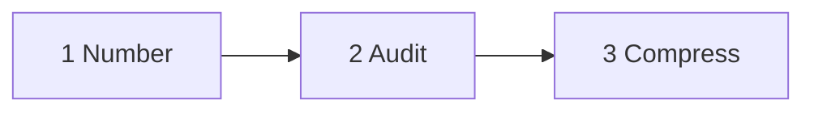

# Refine Plan

Point this tool at any plan. It applies three passes in sequence - number, audit, compress - and rewrites the plan in place. One invocation, one output.

---

---

## The Prompt

> Read the plan, then rewrite it in three sequential passes. Do not output intermediate drafts - produce one final rewritten plan.
>
> **Pass 1: Number.** Convert every step to flat integer numbering. No 5a, no 5.1, no nested bullets. Step 0 is preparation, Step 1 is the first real action, increments of one. If new work was hiding as a sub-bullet, it gets its own integer and everything downstream renumbers.
>
> **Pass 2: Audit.** Walk the numbered plan step by step. For each step, check: does it receive the information it needs from prior steps, or is there a gap? Is the instruction clear and unambiguous? Then check the whole: can adjacent steps that touch the same file or apply the same transform merge into one? Are any steps doing too much and should split? Which steps have no dependency on each other and can run in parallel? Add, remove, reorder, and renumber as needed. Be honest - if a step is broken, say so. If the plan is fine, say so.
>
> **Pass 3: Compress.** Every surviving step must earn its place. If a step can be said in fewer words without losing precision, say it in fewer words. Do not gut substance to hit a target - if a step is already tight, leave it alone. Strip throat-clearing, hedging, and any sentence that restates what another sentence already says.

---

## How To Invoke

Give Refine Plan a plan. It rewrites in place. The output is one plan, not three drafts.

---

## Constraints

- Never add new steps that were not implied by the original plan. The tool refines structure, it does not expand scope.
- Never change the plan's intent. If the plan aims at X, the refined plan still aims at X.
- The three passes are instructions to the model about ordering its own work. The user sees one rewritten plan.
- If the plan has no steps to number (pure prose, a goal statement, a sketch), say so and do not force structure onto something that is not ready for it.
