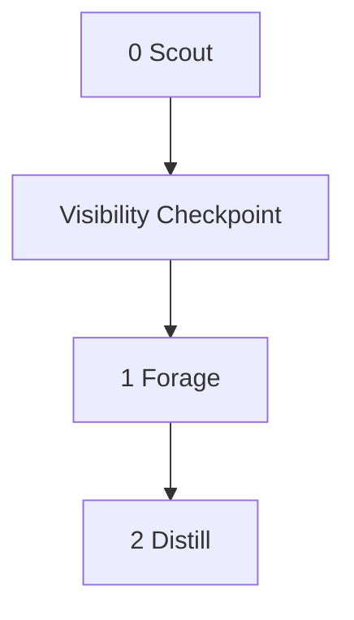

# The Research Desk
<!-- If the tool is loaded without parameters it means run the tool -->

A question unanswered is a plan built on air. Point this tool at any plan, any open file, any topic that needs ground truth. The Research Desk dispatches a scout to read the territory, frame the questions worth asking, and report back before a single search is launched. The operator sees what the scout understood and can kill the mission before it wastes a token. If the questions are right, foragers fan out across the web in parallel - each one chasing a single thread, compressing what it finds into cards that carry only the load-bearing content. When the foragers return, the Desk assembles a brief. The brief is not a plan. It is raw material. The operator decides what enters the plan and what stays on the desk.


---



---

## Token Economy

**What enters main context:**
- Scout's goal statement (one sentence)
- Scout's question/query array (3-5 items)
- Finding cards from each forager (title, URL, 2-4 sentence summary, relevance tag)

**What never enters main context:**
- File contents (the scout reads files; main passes paths)
- Raw web pages, HTML, or full search result lists
- Forager reasoning or intermediate search results

Sub-agent count: 1 scout + up to 5 foragers = 6 max. All foragers launch in a single tool-call batch.

---

## Step 0 - Scout

One sub-agent. Reads the territory, frames the questions.

**Input.** Main passes the scout one of three things, in priority order:

1. The operator's explicit research topic (a string - used directly, no file to read)
2. The path to the current plan file (the scout reads it)
3. The path to the focused file in the editor (the scout reads it)

Main passes paths, not contents. When given a path, the scout reads the file itself inside its own context. When given a topic string, the scout uses it directly.

**The scout's work.** From whichever input it receives, the scout:

1. Distills a one-sentence goal statement - what the research serves
2. Identifies 3-5 knowledge gaps as questions it wants answered
3. For each question, derives a search query phrased as a natural-language term optimized for `WebSearch`

**Return.** The scout returns only:

- `goal`: one sentence
- `questions`: array of 3-5 `{ question, search_query }` objects

Nothing else. No file contents, no analysis, no recommendations.

**Visibility checkpoint.** After the scout returns, main displays the goal statement, the questions, and the search queries to the operator before launching foragers. This is not a confirmation gate. The tool continues. But the operator sees what the scout understood and can abort or correct if the context was misread.

---

## Step 1 - Forage

Up to 5 parallel sub-agents. Each one chases a single question across the web.

**Launch.** Main spawns one `generalPurpose` sub-agent per scout question, all in a single tool-call batch. Each forager receives the full `{ question, search_query }` pair - the question for relevance context, the search query as a starting point.

**The forager's work.** The assigned search query is a starting point, not a script. The forager has latitude to refine, follow leads, and run additional searches as threads develop:

1. Start with the assigned `WebSearch` query
2. Follow promising leads with additional searches or `WebFetch` calls as needed
3. Select the 3-5 most relevant results across all searches
4. Compress each into a **finding card**:
   - **Title**: the page or document title
   - **URL**: the source
   - **Summary**: 2-4 sentences of load-bearing content
   - **Relevance**: HIGH or MED
5. Return an array of finding cards - nothing else

**Containment.** No cross-talk between foragers. No raw HTML enters main. Each forager is a sealed context that receives a question and returns cards.

---

## Step 2 - Distill

Main context. Assembles the brief from the foragers' cards.

**Actions.** Main receives all finding card arrays, deduplicates by URL, and renders a **Research Brief** directly to the operator. The Context line reuses the scout's goal statement verbatim.

**Output template:**

```
# Research Brief

<scout's goal statement>

<For each question: the question as a bullet, then finding cards
as sub-bullets - [Title](url) - summary (HIGH/MED)>

<3-5 sentences connecting findings, identifying patterns,
 noting contradictions, flagging gaps that remain open>
```

**The tool stops here.** It does not modify any plan. It does not recommend next steps. It does not write to any file. The Research Brief is rendered to the operator, and the operator decides what, if anything, to incorporate.
