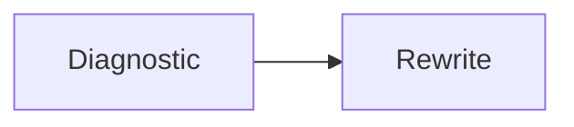

# Tighten

Point this tool at any document that has grown past its payload. It performs a provenance-aware quality audit, identifies what is load-bearing versus decorative, and rewrites the document at roughly half its original line count without changing its voice, register, or structural intent. The tool does not add material. It subtracts everything that is not doing work.

---

---

## The Prompt

> Read the document, then rewrite it in place. First identify what's load-bearing - the core insight, the actionable technique, the evidence that earns its keep - and what's decoration: formulaic transitions, restated ideas wearing different clothes, self-congratulatory asides, and padding that exists because the original draft never got pruned. Cut the decoration. Where multiple sections say the same thing, merge them. Where a theory or explanatory passage exists, keep the essential claim and its best supporting evidence but strip the throat-clearing around it. Compress every section down to its payload paragraph plus whatever concrete artifacts (prompts, code, citations, examples) justify its existence. Preserve the document's existing voice and register - do not flatten it into a different style, do not inject new opinions, do not add new material. The goal is the same document at roughly half the line count, where every surviving sentence does work that no other sentence already does.

---

## How To Invoke

Give Tighten a document. Before rewriting, it produces a short diagnostic:

- **Provenance.** Is this human-drafted, AI-drafted, or co-authored? What are the tells?
- **What works.** The load-bearing sections, the real insights, the citations that earn their place.
- **What doesn't.** The bloat - restated themes, formulaic patterns, decorative prose, self-congratulation.
- **Line count.** Current lines and target lines (roughly half).

Then it rewrites. The diagnostic is not optional - it prevents the rewrite from cutting the wrong things.

---

## Constraints

- Never change the document's register. If it's warm, keep it warm. If it's technical, keep it technical.
- Never add new content, opinions, or citations that weren't in the original.
- Theory and explanatory sections survive but compressed to their essential claim plus evidence. Don't gut the substance to hit the line target.
- If a section is already tight, leave it alone. The target is approximate, not a mandate.
- Concrete artifacts - prompts, code blocks, examples, citation lists - are payload. Compress the prose around them, not the artifacts themselves.

All content in this file is dedicated to the public domain under [CC0 1.0 Universal](https://creativecommons.org/publicdomain/zero/1.0/).
